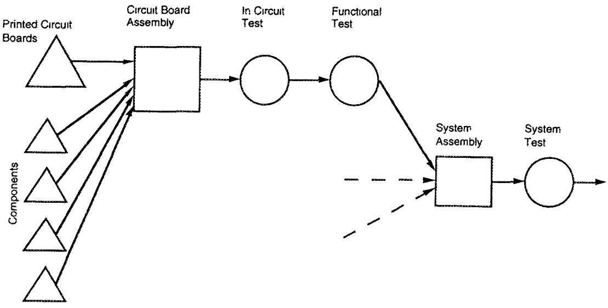
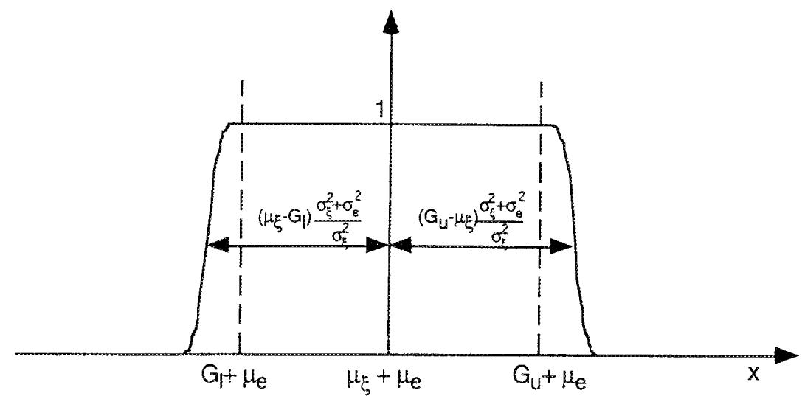
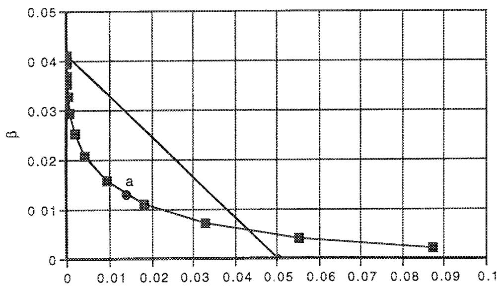
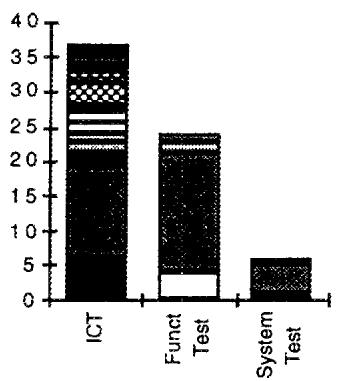
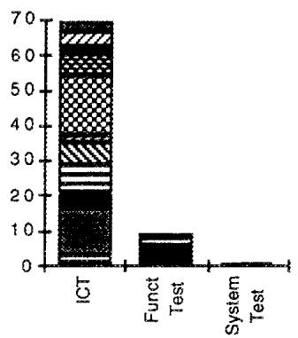
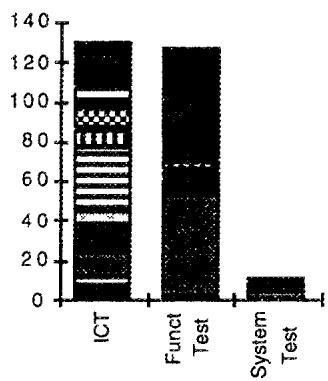

This article was downloaded by: [141.161.91.14] On: 19 December 2016, At: 16:14 Publisher: Institute for Operations Research and the Management Sciences (INFORMS) INFORMS is located in Maryland, USA

## Management Science

## MANAGEMENT SCIENCE

Publication details, including instructions for authors and subscription information: http://pubsonline.informs.org

## Inspection for Circuit Board Assembly

Phillipe B. Chevalier, Lawrence M. Wein,

To cite this article:

Phillipe B. Chevalier, Lawrence M. Wein, (1997) Inspection for Circuit Board Assembly. Management Science 43(9):1198-1213. http://dx.doi.org/10.1287/mnsc.43.9.1198

## Full terms and conditions of use: http://pubsonline.informs.org/page/terms-and-conditions

This article may be used only for the purposes of research, teaching, and/or private study. Commercial use or systematic downloading (by robots or other automatic processes) is prohibited without explicit Publisher approval, unless otherwise noted. For more information, contact permissions@informs.org.

The Publisher does not warrant or guarantee the article's accuracy, completeness, merchantability, fitness for a particular purpose, or non-infringement. Descriptions of, or references to, products or publications, or inclusion of an advertisement in this article, neither constitutes nor implies a guarantee, endorsement, or support of claims made of that product, publication, or service.

© 1997 INFORMS

Please scroll down for article—it is on subsequent pages

## informs

INFORMS is the largest professional society in the world for professionals in the fields of operations research, management science, and analytics.

For more information on INFORMS, its publications, membership, or meetings visit http://www.informs.org

# Inspection for Circuit Board Assembly

Phillipe B. Chevalier • Lawrence M. Wein

Institut d'Administration et de Gestion, Université Catholique de Louvain, Louvain-la-Neuve, Belgium
Sloan School of Management. Massachusetts Institute of Technology, Cambridge, Massachusetts 02142

Several stages of tests are typically performed in circuit board assembly, and each test consists of one or more noisy measurements. We consider the problem of jointly optimizing the allocation of inspection and the testing policy in a system with a predefined inspection configuration; that is, at which stages should a board be inspected, and at these stages, whether to accept or reject a board based on noisy test measurements. The objective is to minimize the expected costs for testing, repair, and defective items shipped to customers. We analyze the problem and document an application of the model to an industrial facility. Since we were unable to gather all the necessary data, the model was applied in a limited and piecemeal fashion. Nevertheless, the proposed policy significantly improves upon the facility's historical policy. (Quality Control; Inspection Decisions; Electronics Manufacturing)

## 1. Introduction

This paper considers the problem of inspection in a circuit board assembly plant, which came to our attention while working with a Hewlett-Packard facility. Recent technological advances have given rise to circuit boards of increasing complexity, and consequently testing has become one of the most challenging aspects of circuit board manufacturing. Inspection costs can account for over half of the total manufacturing cost, and hence optimizing the utilization of inspection resources is a crucial task.

At the Hewlett-Packard facility, the assembly of circuit boards is performed in a single manufacturing stage, which is followed by several successive inspection stages; these stages will be described in detail in §2. A circuit board can fail in many different ways, and each inspection stage at the facility is designed to detect certain types of defects; typically, later inspection stages can detect more subtle problems. The inspection process at each stage consists of testing and repair. In testing, one or more measurements are taken from a board, and a decision is made whether to accept or reject the board; because the measurements are subject to error, Type I (false reject) and Type II (false accept) errors can occur during this classification. The defect on a rejected board is identified and corrected during repair. Testing costs vary by stage, and repair costs depend upon the nature of the defect and perhaps the stage of detection.

The facility managers had two key concerns. First, they had the vague sense that too much testing was being performed. Second, they had no systematic procedure for accepting or rejecting boards at each stage as a function of the noisy test measurements. Consequently, this paper formulates and analyzes a mathematical optimization problem consisting of two interrelated decisions. Given an existing inspection configuration, which is typically dictated by the existing technology and board design, the first decision is to decide at which stage(s) to inspect a board; this problem is known in the literature as the inspection allocation problem. At the stages where inspection is performed, the testing policy decides whether to accept or reject each board based on the noisy measurements obtained from the test. The joint specification of inspection allocation and testing will be referred to as an inspection policy. The optimization problem is to find an inspection policy to minimize the total expected cost, which includes costs for testing, repair, and defective items leaving the facility. Since we assume that every defective board is repaired, no scrapping cost is included.

We analyze this problem in §3 and document an application of the model at the Hewlett-Packard facility in §4. Despite gathering large amounts of data at this facility, we were unable to estimate the model inputs well enough to derive the optimal inspection policy. Consequently, a suboptimal policy, which is described in §4, was derived and applied in a fragmentary manner. Our limited numerical results, however, suggest that the suboptimal inspection policy easily outperforms the facility's historical inspection policy. Concluding remarks, including a description of the facility's use of the model, are contained in §5.

Figure 1 Flow Chart of Hewlett-Packard's Circuit Board Assembly Process  

Many papers have been published on the optimal allocation of inspection in multistage serial systems. Early studies on this problem (see, for example, White 1966 and Lindsay and Bishop 1967) assumed perfect inspection (i.e., no Type I or Type II errors). Later papers allowed for imperfect inspection (Eppen and Hurst 1974, Yum and McDowell 1981, Garcia-Diaz et al. 1984), where one determines the number of times a test should be repeated. A survey of work published on inspection allocation can be found in Raz (1986). Recently, Villa-lobos et al. (1992) studied a dynamic version of the same problem, where inspection of an item at a particular stage can depend on the result of the inspection of that item at previous stages. Our paper appears to be the first in this research area to address the presence of distinct defect types, the joint optimization of inspection allocation and testing, and the application of a model to an industrial facility.

## 2. Problem Description and Formulation

We begin by describing the circuit board assembly and testing process at the Hewlett-Packard facility, which is depicted in Figure 1. The primary manufacturing stage is circuit board assembly, where all components are soldered onto the printed circuit boards. Assembled boards then undergo in circuit testing, where every component on the circuit board is individually measured. The in circuit test is designed to ensure that the correct component is in the correct location, and that the soldering of components does not lead to any short (electrical contact where there should be none) or open (no contact where there should be) circuits. Although this test allows for easy problem identification, it is not very accurate because of the difficulty in isolating the influence of the various components. A functional test is performed next, where output measurements are taken from a board that is submitted to inputs that simulate its working conditions. This test can detect more subtle problems, such as out-of-specification components or a soldering that gives a poor contact, but requires much components. Hence, we calculated 79 acceptance intervals. The data partially displayed in Table 1 were used to derive the estimates in (A5) for each component. These quantities, along with $\mu_{\xi}$ and the interval $[G_{l}, G_{u}]$ , allowed us to determine via (19)-(20) the proposed testing policy $(x_{l}, x_{u})$ for each component. For example, the interval $[G_{l}, G_{u}]$ for component R168 in Table 1 is [99, 101], and hence $x_{i} = 98.8847$ and $x_{u} = 100.9187$ for this component. Under normality assumptions, the expected number of Type I and Type II errors per board was calculated using (2)-(3). The resulting pair of values, $\alpha_{im}(T_{in})$ and $\beta_{im}(T_{m})$ , correspond to the point $a$ in Figure 3. The remainder of the Pareto optimal tradeoff curve in Figure 3 was derived by performing a similar aggregation using (18).

Hewlett-Packard engineers have observed that about 55% of the rejected components at the in circuit test are good components. Further analysis found that this percentage did not vary significantly by board type. To illustrate how this performance compares to that of our proposed testing policy, Figure 3 also shows a straight line that represents the set of policies such that 55% of the rejected components are good components. If we had obtained somewhat different estimates for $\sigma_{e}^{2}$ and $\sigma_{e}^{2}$ , then the proposed policy would have been on the tradeoff curve in the neighborhood of a, and a significant improvement over the current policy would still be achieved; the improvement from the straight line to the point a in Figure 3 represents a cost reduction for this test of roughly 5%.

## 4.4. Inspection Allocation Policy

In this subsection, we find an inspection allocation policy given the facility's historical testing policy. For this purpose, three types of circuit boards were chosen that were representative of the variety of boards manufactured; these board types are different from the types analyzed in Table 1 or Chevalier's (1992) Appendix B. Since the analog or digital nature of a board is one of its distinguishing features, we chose one board type with mostly digital components, one with mostly analog components, and one with a mixture of components. These board types were produced in volumes that were typical for the facility, and their yield ranged from relatively low to relatively high. Also, these three board types did not share any test and thus can be considered independently.

Figure 4 displays the frequency of the different defect types detected at each stage for the three board types under consideration. Each defect type is represented by

Figure 3 The Current Testing Policy and the Pareto Optimal Tradeoff Curve  

$$
v _ {i n k} ^ {m} = v _ {i n k} ^ {\prime} + \epsilon_ {i n k} \quad \text { for   all } i = 1, \dots , I,
$$

$$
n = 1, \dots , N \text {   and   } k = 1, \dots , K _ {m},
$$

where $v_{ink}^{m}$ is the measured value, $v_{ink}^{t}$ is the true value, and $\epsilon_{ink}$ is the measurement error. We assume that the random variable $\epsilon_{ink}$ is independent of $v_{mk}^{t}$ and is independent of the other measurement errors. Our most difficult modeling task is the specification of $v_{mk}^{t}$ ; the true value $v_{ink}^{t}$ presumably depends upon the inspection policy at previous stages, including the acceptance intervals that are employed for each test measurement related to type i defects. The exact nature of this dependency can be very complex since the same quantity is not measured at different stages. Even if a model of this dependency was developed, data collection would be extremely difficult. Typically, the only available data are the noisy measurements under the existing inspection policy; experiments would probably need to be performed under each possible testing policy to gather the necessary data. We return to these empirical issues in §4.

We make the key assumption that the distribution of the random variable $v_{ink}^{t}$ depends on the single quantity $\rho_{in}$ , which is the expected number of detectable defects of type i present on a board when it enters inspection stage n. Although we do not have a strong justification for this assumption, for the purposes of tractability in both the analysis and the estimation, we need to assume that the distribution of $v_{ink}^{t}$ depends on only a single quantity. Such a quantity needs to reflect the true quality of the board at stage n with respect to type i defects, and the quantity $\rho_{in}$ is a natural surrogate. Notice that $\rho_{in}$ equals $\delta_{in}$ , which was defined as the expected number of type i defects that become detectable at stage n, plus defects that were not repaired from earlier stages (as a result of bypassed inspections or Type II testing errors). The quantity $\rho_{in}$ will be calculated later in this section in terms of the upstream inspection policy, and will represent the system state in the dynamic program in §3. For future use, we let $\rho_{i0}=0$ and $\rho_{i,N+1}$ equal the expected number of type i defects per board received by a customer.

Let $\xi_{mk}(x; \rho_{ir})$ be the probability density function of the true value $v_{ink}^{t}$ given $\rho_{im}$ , and $e_{ink}(x)$ denote the density function of the measurement error $\epsilon_{mk}$ . Let $f_{mk}(x; \rho_{im})$ be the density function of the measured values $v_{ink}^{m}$ given $\rho_{in}$ , so that $f_{ink}(x;\rho_{in})=\int_{-\infty}^{\infty}\xi_{mk}(x-y;\rho_{in})e_{ink}(y)dy$ . Let $G_{mk}$ denote the interval in which the true value $v_{ink}^{t}$ should reside to ensure that the board is functioning properly. A key role in our analysis will be played by $p_{ink}(v_{ink}^{m},\rho_{in})$ , which is the conditional probability that the true value $v_{ink}^{t}$ is inside this interval, given the measurement value $v_{ink}^{m}$ and the quantity $\rho_{in}$ ; that is,

$$
p _ {i n k} (v _ {i n k} ^ {m}, \rho_ {i n}) = \frac {\int_ {G _ {i n k}} \xi_ {i n k} (y ; \rho_ {i n}) e _ {i n k} (v _ {i n k} ^ {m} - y) d y}{f _ {i n k} (v _ {i n k} ^ {m} ; \rho_ {i n})}.\tag{1}
$$

Our subsequent analysis requires the functions $f_{mk}(x; \rho_{in})$ and $p_{mk}(x, \rho_{in})$ to be continuous and unimodal in x. If we assume that the true value density function $\xi_{ink}(x, \rho_{in})$ and the measurement error density $e_{mk}(x)$ are unimodal in x, then it follows that $f_{mk}(x; \rho_{in})$ is unimodal in x. Although we have been unable to prove that these unimodality assumptions also imply the unimodality of $p_{ink}(x, \rho_{in})$ , it seems natural that $p_{ink}(x, \rho_{in})$ would increase as x gets closer to the interval $G_{ink}$ ; moreover, our numerical results confirmed the unimodality of $p_{mk}(x, \rho_{in})$ .

The testing policy $T_{n}$ at stage $n$ is defined by the intervals $[L_{mk}, U_{mk}], i = 1, \ldots, I$ and $k = 1, \ldots, K_{m}$ , where a board is accepted at stage $n$ if $v_{mk}'' \in [L_{mk}, U_{mk}]$ for all $i = 1, \ldots, I$ and $k = 1, \ldots, K_{m}$ , and is rejected otherwise. Let $\alpha_{im}(T_n, \rho_m)$ be the expected number of false defects of type $i$ per board at stage $n$ under testing policy $T_{n}$ , and let $\beta_{im}(T_n, \rho_m)$ be the expected number of detectable defects of type $i$ present on a board at stage $n$ that are not detected at that stage. It follows that

$$
\begin{array}{r l} \alpha_ {i n} (T _ {n}, \rho_ {i n}) = & \sum_ {k = 1} ^ {K _ {m}} \left[ \int_ {- \infty} ^ {L _ {i n k}} p _ {i n k} (x, \rho_ {i n}) f _ {i n k} (x; \rho_ {i n}) d x \right. \\ & \left. + \int_ {U _ {i n k}} ^ {\infty} p _ {i n k} (x, \rho_ {i n}) f _ {i n k} (x; \rho_ {i n}) d x \right], \end{array}\tag{2}
$$

and

$$
\beta_ {i n} \left(T _ {n}, \rho_ {i n}\right) = \sum_ {k = 1} ^ {K _ {i n}} \int_ {I _ {m k}} ^ {U _ {i n k}} \left(1 - p _ {i n k} \left(x, \rho_ {i n}\right)\right) f _ {i n k} (x; \rho_ {i n}) d x.\tag{3}
$$

In addition to deciding upon a testing policy, we also need to choose the inspection allocation policy at each stage, which specifies whether or not to test the boards at that stage. Let the binary decision variable $z_{n}$ equal 1 if boards are inspected at stage n and 0 otherwise, where we define $z_{0}=0$ for notational convenience. The objective is to minimize the total expected cost of testing, repair, and defects leaving the facility; this quantity will often be referred to as the total inspection cost. Although the inspection policy affects the work-in-process inventory levels at the various stages, inventory holding costs are not incorporated here because the congestion effects at the Hewlett-Packard facility were negligible; readers are referred to Tang (1991) for an inspection allocation problem with queueing costs. To express the total inspection cost, we define $y_{m}$ to be the expected number of type i defects to be repaired at stage n. For $i=1,\ldots,I$ , it follows that

$$
\begin{array}{c} y _ {i n} = z _ {n} [ \rho_ {i n} - \beta_ {i n} (T _ {n}, \rho_ {i n}) + \alpha_ {i n} (T _ {n}, \rho_ {i n}) ] \\ \text {for} n = 1, \ldots , N, \end{array}\tag{4}
$$

and

$$
\begin{array}{c} \rho_ {i n} = z _ {n - 1} \beta_ {i, n - 1} (T _ {n - 1}, \rho_ {i, n - 1}) + (1 - z _ {n - 1}) \rho_ {i, n - 1} + \delta_ {i n} \\ \text { for } n = 1, \dots , N + 1. \end{array}\tag{5}
$$

We consider a per unit testing cost $t_{n}$ at stage n, which typically includes operator time, test engineering, equipment depreciation and maintenance, and various overhead costs. A possible benefit, or negative cost, of testing is that it will lead to quicker learning and hence process improvements; however, in our case study, we did not attempt to incorporate this benefit into the per unit testing cost. Also, no fixed testing cost is included in the model. The repair cost $r_{n}$ is the total cost incurred to diagnose and repair a type i defect on a board at stage n. We assume that all defective boards are repaired, and that the same repair cost is incurred whether the defect is a real defect or a false defect. This assumption is reasonable because the diagnostic cost overwhelms the actual repair cost in this setting; in particular, before declaring that an out-of-specification measurement is due to a false defect, all possible problem sources must be investigated. The cost f of a defect on a board that leaves the plant includes the cost of a field repair, the cost of the analysis and repair of the defective board that comes back to the plant, and a cost measuring the customer's loss of goodwill. We assume that the cost is per defect and not per defective system, which simplifies the analysis. In any case, if there are two or more defects in a system, then it is unlikely that these defects would be detected by the customer at the same time. Moreover, since the number of defects leaving the plant is very low, multiple defects on the same system are very unlikely; consequently, the results obtained would be very similar if a cost was incurred per defective system. We also assume that the cost f does not depend on the type of defect on a board. Although the more general case can be easily accommodated, this assumption seems practical, since the costs of lost goodwill and visiting the repair site dominate the other costs (by at least an order of magnitude), and are independent of the defect type.

Our optimization problem is to choose the inspection allocation policy $z_{n}$ and the testing policy $T_{n}$ for n = 1, $\ldots$ , N to minimize

$$
\sum_ {n = 1} ^ {N} \left(t _ {n} z _ {n} + \sum_ {i = 1} ^ {I} r _ {i n} y _ {i n}\right) + f \sum_ {i = 1} ^ {I} \rho_ {i, N + 1},\tag{6}
$$

subject to Equations (4)-(5). Notice that the probability distributions of the random variables $\rho_{i,t}$ and $\delta_{in}$ do not matter because of the linear cost structure.

## 3. Analysis

In this section, we analyze problem (4)-(6). The testing problem is addressed in §3.1 and the inspection allocation policy is numerically derived in §3.2.

## 3.1. The Testing Policy

Problem (4)-(6) can be formulated as a dynamic program. If we let $J_{n}(\rho_{1n},\ldots ,\rho_{1r})$ denote the minimum expected total inspection cost from stage $n$ onwards, where $\rho_{m}$ is the expected number of detectable type $i$ defects on a board arriving at stage $n$ , then the dynamic programming optimality equations are

$$
\begin{array}{l} {I _ {n} (\rho_ {1 n}, \dots , \rho_ {I n})} \\ {\qquad = \operatorname * {M i n} \Bigg [ J _ {n + 1} (\rho_ {1 n} + \delta_ {1, n + 1}, \dots , \rho_ {I n} + \delta_ {1, n + 1}),} \\ {\qquad t _ {n} + \min _ {T _ {r}} \Bigg [ \sum_ {i = 1} ^ {J} (\rho_ {i n} - \beta_ {i n} (T _ {n}, \rho_ {i n}) + \alpha_ {i n} (T _ {n}, \rho_ {i n})) r _ {i n}} \\ {\qquad + I _ {n + 1} (\beta_ {n} (T _ {n}, \rho_ {1 n}) + \delta_ {1, n + 1}, \dots , \beta_ {I n} (T _ {n}, \rho_ {I n})} \\ {\qquad + \delta_ {(n + 1)} \Bigg ] \Bigg ] \quad \text {for} n = 1, \dots , N,} \end{array}\tag{7}
$$

and

$$
J _ {N + 1} \left(\rho_ {1, N + 1}, \dots , \rho_ {l, N + 1}\right) = f \sum_ {i = 1} ^ {I} \rho_ {i, N + 1}.\tag{8}
$$

The first minimization on the right-hand side of Equation (7) represents the inspection allocation option; the first option corresponds to no inspection at stage n ( $z_{n} = 0$ ) and the second option corresponds to inspection at stage n ( $z_{n} = 1$ ); in the latter case, a second minimization is performed to determine the optimal testing policy. The second minimization can be rewritten more concisely as

$$
\begin{array}{r l} \min _ {T _ {n}} & \{h _ {n} (\alpha_ {1 n} (T _ {n}, \rho_ {1 n}), \ldots , \alpha_ {l n} (T _ {n}, \rho_ {l n})) \\ & + g _ {n} (\beta_ {1 n} (T _ {n}, \rho_ {1 n}), \ldots , \beta_ {l n} (T _ {n}, \rho_ {l n})) \}, \end{array}\tag{9}
$$

where

$$
h _ {n} (x _ {1}, \dots , x _ {l}) = \sum_ {i = 1} ^ {I} x _ {i} r _ {i n} \quad \text { and }\tag{10}
$$

$$
g _ {n} (x _ {1}, \dots , x _ {i}) = J _ {n + 1} (x _ {1} + \delta_ {1 n + 1}, \dots , x _ {I} + \delta_ {I, n + 1})
$$

$$
+ \sum_ {i = 1} ^ {I} (\rho_ {i n} - x _ {i}) r _ {i n}.\tag{11}
$$

If $\alpha_{in}(T_n, \rho_{in})$ and $\beta_{in}(T_n, \rho_{in})$ in (9) are replaced with the expressions in Equations (2)-(3), then the derivative of this function with respect to the upper acceptance limit $U_{mk}$ is

$$
\begin{array}{l} - \frac {\partial h _ {n}}{\partial x _ {i}} (\alpha_ {1 n}, \dots , \alpha_ {I n}) p _ {i n k} (U _ {i n k}, \rho_ {i n}) f _ {i n k} (U _ {i n k}; \rho_ {i n}) \\ + \frac {\partial g _ {n}}{\partial x _ {i}} (\beta_ {1 n}, \dots , \beta_ {I n}) (1 - p _ {i n k} (U _ {i n k}, \rho_ {i n})) f _ {i n k} (U _ {i n k}; \rho_ {i n}), \end{array}
$$

where $\partial/\partial x_{i}$ is the partial derivative of the $i$ th component and, to simplify notation, $\alpha_{in}$ stands for $\alpha_{in}(T_{n},\rho_{in})$ and $\beta_{in}$ stands for $\beta_{in}(T_{n},\rho_{in})$ . Setting this expression equal to zero and using (10)-(11), we obtain

$$
\begin{array}{l} p _ {i n k} (U _ {i n k}, \rho_ {i n}) \\ = 1 - \frac {r _ {i n}}{\frac {\partial J _ {n + 1}}{\partial x _ {i}} (\beta_ {3 n} + \delta_ {1 , n + 1} , \dots , \beta_ {I n} + \delta_ {I , n + 1})}. \end{array}\tag{12}
$$

The second derivative of the objective function (9) will be positive if $(\partial f_{ink}(x; \rho_m)) / \partial x | x = U_{mk} < 0$ and $(\partial p_{ink}(x, \rho_m)) / \partial x | x = U_{mk} < 0$ . One would expect the secondorder conditions to follow from our assumptions that $f_{ink}(x; \rho_{in})$ and $p_{ink}(x, \rho_{in})$ are continuous and unimodal in x, since the upper limit is at a point where both the frequency of measurement and the probability that a measurement corresponds to a valid board are decreasing. We will return to this convexity issue during the case study in §4.

The same argument can be used to show that the optimal lower acceptance limit satisfies

$$
\begin{array}{l} p _ {i n k} (L _ {i n k}, \rho_ {i n}) \\ = p _ {i n k} (U _ {i n k}, \rho_ {i n}) \\ = 1 - \frac {r _ {i n}}{\frac {\partial J _ {n + 1}}{\partial x _ {i}} (\beta_ {1 n} + \delta_ {1 , n + 1} , \dots , \beta_ {l n} + \delta_ {l , n + 1})}. \end{array}\tag{13}
$$

The second derivative of the objective function (9) will be positive if $(\partial f_{mk}(x; \rho_{im})) / \partial x | x = L_{mk} > 0$ and $(\partial p_{mk}(x, \rho_{im})) / \partial x | x = L_{mk} > 0$ . Again, the second-order conditions are consistent with our intuition. Expression (13) has an intuitive meaning: the probability that a component is bad at the acceptance and rejection cutoff points should be equal to the marginal cost of an additional repair at the current stage divided by the marginal cost of an additional defect entering the next stage. At this cost ratio increases, it becomes less costly to accept defective boards, and the acceptance region is increased.

In our case analysis in §4.3, relation (13) will be refined further by making several simplifying assumptions that can be partially justified by data gathered from the Hewlett-Packard facility.

## 3.2. The Inspection Allocation Policy

Equation (13) expresses the optimal testing policy ( $L_{mk}$ , $U_{mk}$ ) in terms of the first derivative of the value function. Ideally, we would like to substitute this solution back into the inner minimization in (7) to express the optimality equations solely in terms of the value function, so that these equations could be solved using standard methods. Unfortunately, this approach cannot be used because $p_{mk}(v_{mk}^{m}, \rho_{in})$ in (1) is not readily invertible and $\beta_{in}$ in the denominator of (13) is actually a function of the testing policy, as can be seen in (3), where $L_{mk}$ and $U_{mk}$ appear in the limits of integration.

Instead, we start by discretizing the $I$ -dimensional space of $\rho_{m}$ for each stage. Notice that the right side of (13) is constant for each measurement $k = 1, \ldots, K_m$ . For each fixed value of $\rho_{m}$ , we let $p_m$ stand for $p_{mk}(L_{mk}, \rho_m)$ or $p_{mk}(U_{mk}, \rho_m)$ , and rewrite (13) as

$$
p _ {i n} = 1 - \frac {\tau_ {i n}}{\frac {\partial f _ {n + 1}}{\partial x _ {i}} \left(\beta_ {1 n} (p _ {i n}) + \delta_ {1 , n + 1} , . . . , \beta_ {l r} (p _ {l n}) + \delta_ {i , n + 1}\right)}
$$

$$
\text { for } i = 1, \dots , I,\tag{14}
$$

where the dependence of $\beta_{in}$ on the testing policy is reintroduced into the notation. Starting from stage $n = N$ , we numerically solve this set of $I$ nonlinear equations for $p_{in}$ ; since $f_{ink}(x; \rho_{in})$ and $p_{m,n}(x, \rho_{m})$ are continuous and unmodal in $x$ , $\beta_{in}(p_m)$ is a decreasing function and $J_{n+1}$ is concave, and hence the solution should not be too difficult to derive. With the solution $p_{in}$ of (14) in hand, we derive the optimal testing policy ( $L_{ink}, U_{ink}$ ) from (1), calculate $\alpha_{in}(T_n, \rho_{in})$ and $\beta_{in}(T_n, \rho_n)$ from :2)-(3), and solve (7) for both the optimal inspection allocation decision at stage $n$ and the value function $J_n$ . The last quantity allows us to solve (14) for stage $n - 1$ and carry on in an iterative fashion to $n = 1$ .

## 4. Case Study

We now describe the application of this model to the Hewlett-Packard facility. The assembly and inspection process at this facility was detailed in §2. The nature of the final product, which cannot be revealed, requires very strict tolerances on the circuit boards and on their components, which partially explains why this facility tested all boards at all stages. Although boards of a particular type all undergo exactly the same tests, testing procedures across board types were not consistent and were highly dependent upon the particular engineers in charge. The managers at this facility estimate that the total cost of inspection represents about half of the total manufacturing cost.

As mentioned in the Introduction, our model's data requirements proved to be too demanding to successfully apply our results at the Hewlett-Packard facility; consequently, we were forced to derive suboptimal testing and inspection allocation policies and apply them in a fragmentary manner. Section 4.1 describes these barriers to implementation (which should also be viewed as limitations of the model), and gives a brief description of our strategy to overcome these problems. Section 4.2 outlines the parameter estimation procedures. The suboptimal policies and numerical results for the testing policy and inspection allocation policy are given in §§4.3 and 4.4, respectively.

## 4.1. Barriers to Implementation

We encountered two key obstacles in implementing the results of §3. The first difficulty is due to a key characteristic of multistage inspection systems: The quality of an item at a particular stage depends upon the inspection policy employed at previous stages. In §2, we made the rather crude assumption that the probability distribution for the true measurement value $v_{mk}^{i}$ was solely a function of $\rho_{m}$ , which is the expected number of detectable type $i$ defects on the board at stage $n$ . Estimation of this probability distribution is challenging, because $\rho_{m}$ is a function of the upstream testing and allocation policy, whereas all the historical data are from the existing system that employed a single inspection policy Consequently, rather than estimating $\xi_{mk}(x; \rho_{m})$ for all $\rho_{m}$ , we were only able to estimate $\xi_{mk}(x, \rho_{m})$ under the facility's historical $\rho_{m}$ values. This obstacle prevented us from deriving the optimal testing and inspection allocation policies for this facility, and our efforts turned instead to deriving a suboptimal testing policy using (13) with the fixed historical values of $\rho_{m}$ ; as a result, we will hereafter suppress the dependence on $\rho_{m}$ in much of our notation.

The second barrier to implementation, which was not foreseen, did not allow us to achieve this lesser goal, however: After gathering data and estimating parameters, we found that our estimate for $p_{mk}(x)$ was not accurate enough to derive a reliable testing policy via (13). Unlike our first barrier, this problem is not inherent to the model and may not occur in settings with more data and/or less process noise. Hence, we propose a simpler testing policy in §4.3 that has several desirable properties; this testing policy is based on $\xi_{ink}(x:\rho_{in})$ under the historical $\rho_{in}$ values.

The optimal inspection allocation policy satisfying (7) depends upon the Type I and Type II testing errors, which themselves are functions of the testing policy and the $\rho_{in}$ values. Because of our first barrier to implementation described above, we could only estimate the testing errors $\alpha_{in}$ and $\beta_{in}$ under the historical testing policy and historical $\rho_{in}$ values. By assuming a simple relationship between error rates at each stage and the expected number of defects at the stage, we used the historical error rate estimates to heuristically extrapolate $\alpha_{in}$ and $\beta_{in}$ as functions of $\rho_{in}$ under the fixed historical testing policy. These extrapolated functions allowed us to derive an inspection allocation policy given the facility's traditional testing policy; details can be found in §4.4.

Finally, it would be an enormous task to collect data and derive an inspection policy for all 50 board types. Instead, we applied our model in a very limited manner to exhibit its effectiveness, and left the appropriate software with the Hewlett-Packard engineers, who carried out the implementation.

## 4.2. Parameter Estimation

Because the parameter estimation procedures are rather involved and their description would disrupt the continuity of the paper, we relegate this material to the appendix; in this subsection, we merely state the parameters that were estimated. The cost parameters $t_n$ , $r_m$ , and $f$ ; $\delta_{in}$ , which is the expected number of new type $i$ defects per board appearing at stage $n$ ; $\alpha_{in}$ and $\beta_{in}$ , which are the Type I and Type II testing errors under the historical testing policy and historical $\rho_{in}$ values; and the means $\mu_\varepsilon$ and $\mu_e$ and standard deviations $\sigma_\varepsilon$ and $\sigma_e$ of the true value $v_{ink}^t$ and the measurement error $\epsilon_{ink}$ , respectively.

## 4.3. Testing Policy

The optimal testing policy (13) cannot be calculated because we have been unable to estimate $\xi_{ink}(x; \rho_{in})$ in terms of $\rho_{in}$ . Consequently, we begin by calculating $p(v^{m})$ (to improve readability, the subscript $m$ will be omitted throughout the remainder of the paper), which is defined in (1) and appears on the left side of (13), given the $\rho_{in}$ values in (A3) that result from the facility's historical testing policy. During the course of this calculation, we will see that our inability to compute the right side of (13) becomes a moot point. As a first step toward this calculation, we assume that the true value $v^{\prime}$ and the measurement error $\epsilon$ are independent and normally distributed with respective means $\mu_{\epsilon}$ and $\mu_{e}$ , and respective standard deviations $\sigma_{\epsilon}$ and $\sigma_{e}$ ; the estimated values for these four parameters for a sample of component measurements appear in Table 1. These nor mality assumptions are difficult to validate because the two distributions are not at our disposal. We can assess the normality of the measurement distribution, however, which is the convolution of the two distributions in question. Notice that the results from the controlled experiment in the appendix are not appropriate for testing this assumption, since the experiment contains many repeated measurements. Hence, the production data set (see the last paragraph of the appendix for a description of this data) was used, and for each of the 350 components, we applied the goodness-of-fit test associated with the kurtosis measurement in Equation (27.6a) of Duncan (1986) to the 80 measurement values. For more than 250 of the components, the normality assumption was not rejected at the 95% significance level. Under these normality assumptions, Equation (1) can be simplified to

Table 1 Sample of Component Measurements

<table><tr><td>Component</td><td>Nominal Value  $\mu_{c}$ </td><td>Mean Measurement Error  $\hat{\mu}_{e}$ (%)</td><td>Measurement Error Std Dev  $\hat{\sigma}_{e}$ (%)</td><td>Component Value Std Dev  $\hat{\sigma}_{c}$ (%)</td></tr><tr><td>R110</td><td>31600Ω</td><td>0 0407</td><td>0 0162</td><td>0 1472</td></tr><tr><td>R111</td><td>1000Ω</td><td>0 0530</td><td>0 0421</td><td>0 2449</td></tr><tr><td>R132</td><td>1780Ω</td><td>1 9721</td><td>0 0700</td><td>0 2187</td></tr><tr><td>R158</td><td>10Ω</td><td>1 6580</td><td>0 7778</td><td>0 3208</td></tr><tr><td>R162</td><td>1000Ω</td><td>0 1059</td><td>0.0120</td><td>0 1192</td></tr><tr><td>R168</td><td>100Ω</td><td>-0 0983</td><td>0 0370</td><td>0 2835</td></tr><tr><td>R170</td><td>17800Ω</td><td>-2 2224</td><td>0 2614</td><td>0 4085</td></tr><tr><td>R210</td><td>1000Ω</td><td>0 0582</td><td>0 0116</td><td>0 1718</td></tr><tr><td>R213</td><td>1000Ω</td><td>0 0896</td><td>0 0125</td><td>0 2082</td></tr><tr><td>R316</td><td>14700Ω</td><td>-0 1642</td><td>0 0313</td><td>0 3167</td></tr><tr><td>R317</td><td>464000Ω</td><td>0 0122</td><td>0 1526</td><td>0 2318</td></tr><tr><td>R322</td><td>5110Ω</td><td>-0 4706</td><td>0 0792</td><td>0 2541</td></tr><tr><td>C118</td><td>6.9μF</td><td>-2 1074</td><td>0 1436</td><td>1 1643</td></tr><tr><td>C114</td><td>0 47μF</td><td>-12 5308</td><td>1 4739</td><td>6 3439</td></tr><tr><td>C128</td><td>0 01μF</td><td>-2 2309</td><td>0 9593</td><td>1.3864</td></tr><tr><td>C129</td><td>0 47μF</td><td>-0 2691</td><td>0 2845</td><td>1 7317</td></tr><tr><td>C202</td><td>0 1μF</td><td>1 0444</td><td>0 3189</td><td>4 6113</td></tr><tr><td>C205</td><td>0 1μF</td><td>2 5666</td><td>0 3238</td><td>3 0688</td></tr><tr><td>C301</td><td>0 4μF</td><td>-2 8866</td><td>1 2112</td><td>2 3799</td></tr><tr><td>C310</td><td>1μF</td><td>-7 6399</td><td>0 1894</td><td>0 5920</td></tr><tr><td>C131</td><td>33μF</td><td>-0 0072</td><td>0 2814</td><td>2 6723</td></tr><tr><td>L101</td><td>1μH</td><td>37 5506</td><td>6 3128</td><td>1 1392</td></tr><tr><td>L103</td><td>1μH</td><td>45 8132</td><td>3 6897</td><td>1 7435</td></tr><tr><td>Q105</td><td>59 753μF</td><td>N/A</td><td>9.6449</td><td>4 3180</td></tr><tr><td>Q108</td><td>92 116μF</td><td>N/A</td><td>0 4122</td><td>2 2315</td></tr><tr><td>Q110</td><td>28 299μF</td><td>N/A</td><td>0.5867</td><td>5 4653</td></tr><tr><td>Q118</td><td>36 404μF</td><td>N/A</td><td>0 3368</td><td>5 5723</td></tr><tr><td>Q122</td><td>48 807μF</td><td>N/A</td><td>0 3554</td><td>1 9639</td></tr><tr><td>CR103</td><td>1 623μF</td><td>N/A</td><td>0 0890</td><td>0 1148</td></tr><tr><td>CR106</td><td>0 726μF</td><td>N/A</td><td>0 1210</td><td>0 1145</td></tr><tr><td>CR109</td><td>0 723μF</td><td>N/A</td><td>0 1136</td><td>0 0695</td></tr><tr><td>CR111</td><td>2 169μF</td><td>N/A</td><td>0 1133</td><td>0 2104</td></tr><tr><td>CR302</td><td>0 591μF</td><td>N/A</td><td>0.1536</td><td>0 2206</td></tr><tr><td>CR305</td><td>0.597μF</td><td>N/A</td><td>0 1566</td><td>0 1970</td></tr></table>

$$
\begin{array}{r l} p (x) = \frac {1}{2} \left(\operatorname{erf} \left(\frac {(G _ {u} - \mu_ {\xi}) \sigma_ {\epsilon} ^ {2} + (G _ {u} + \mu_ {e} - x) \sigma_ {\xi} ^ {2}}{\sigma_ {e} \sigma_ {\xi} \sqrt {2 (\sigma_ {e} ^ {2} + \sigma_ {\xi} ^ {2})}}\right) - \operatorname{erf} \left(\frac {(G _ {l} - \mu_ {\xi}) \sigma_ {e} ^ {2} + (G _ {l} + \mu_ {e} - x) \sigma_ {\xi} ^ {2}}{\sigma_ {e} \sigma_ {\xi} \sqrt {2 (\sigma_ {e} ^ {2} + \sigma_ {\xi} ^ {2})}}\right)\right), \end{array}\tag{15}
$$

where $G_{l}$ and $G_{u}$ are the lower and upper limit of the interval G such that the measured component is good if its true value lies inside it, and the error function $\operatorname{erf}(z)=2/\sqrt{\pi}\int_{0}^{z}e^{-t}dt$ .

We also assume that

$$
\frac {\left| G _ {k} - G _ {i} \right|}{6 \sigma_ {\xi}} > 1,\tag{16}
$$

and

$$
\sigma_ {\xi} > 3 \sigma_ {e}.\tag{17}
$$

In quality management terminology, Inequality (16) states that the machine capability index is greater than 1; that is, the natural process range, $6\sigma_{\varepsilon}$ , is smaller than the product specification range, $G_{u} - G_{r}|$ . Since many companies are currently striving for "6σ" capability (i.e., $|G_u - G_r| > 12\sigma_{\varepsilon}$ ), (16) often holds in practice. Inequality (17) requires that the test measurements be reasonably reliable.

The experimental results that are partially contained in Table 1 were used to test assumptions (16)-(17). By substituting $\hat{\sigma}_{\xi}^{2}$ for $\sigma_{\xi}^{2}$ in (16), we found that the machine capability index was greater than 1 for all 79 components. To assess the validity of (17), readers are referred to Table 1; for all four inductors in our study, the estimated variance of the measurement noise, $\hat{\sigma}_{\epsilon}^{2}$ , is higher than the estimated variance of the true values of these components, $\hat{\sigma}_{\xi}^{2}$ . Hence, these measurements cannot distinguish between good and defective components. The estimated variance of the measurement noise is the same order of magnitude as the estimated variance of the true values for the 13 diodes, and none of the inductors or diodes satisfies (17). In contrast, for the other three component types, 50 of the 62 components, and hence 50 of 79 in total, satisfy (17). For these other three component types, most of the components have an estimated noise variance much smaller than the estimated variance of their true values. These components can be tested with good accuracy. This analysis has important practical implications: Some components should not be tested (or, alternatively, a new test should be devised for them)

By conditions (16)-(17), one term of the right side of Equation (15) will always be equal to 1 or $-1$ , implying that $p(L) = p(U)$ for any $L$ and $U$ such that

$$
\begin{array}{r l} L _ {i} & = \mu_ {\xi} + \mu_ {e} + (G _ {i} - \mu_ {\xi}) z \quad \text { and } \\ U & = \mu_ {\xi} + \mu_ {e} + (G _ {u} - \mu_ {\xi}) z, \end{array}\tag{18}
$$

for any z > 0. Thus, by varying z, an entire class of policies can be easily generated; policies in this class are Pareto optimal with respect to Type I and Type II errors, in that it is impossible to reduce one type of error without increasing the other. In particular, the optimal solution of Equation (13) will be in this class of policies.

Figure 2 shows the form of the function $p(x)$ under assumptions (16)-(17). This function is equal to 1 between $G_{t} + \mu_{e}$ and $G_{u} + \mu_{e}$ , and drops off very steeply to 0 somewhere outside this interval. The function is only symmetric if the tolerance interval is centered around the nominal value. Notice that Figure 2 and the normality of $f(x)$ imply that the second-order conditions leading to (13) are satisfied. Since the right side of (13) will take on values strictly between 0 and 1, the optimal cutoff points will most probably be located in the steep portions of the curve in Figure 2. Hence, the estimates for $\mu_{\ell}, \mu_{e}, \sigma_{\ell}$ , and $\sigma_{e}$ , which are used to obtain the estimate $\hat{p}(x)$ for $p(x)$ , need to be very accurate. For example, suppose we seek to find the two cutoff points such that $p(x) = 0.9$ and decide to use the cutoff points $\bar{x}$ such that $\hat{p}(\bar{x}) = 0.9$ . Furthermore, suppose that $\sigma_{e} = 0.9\hat{\sigma}_{e}$ (i.e., the estimate is 11.1% too high) and all other estimates are perfectly accurate. Under these assumptions, we used data from various components in our study and found that $p(\bar{x})$ takes on values between 0.2 and 0.4. Unfortunately, despite gathering a large amount of data, the 95% confidence intervals for the variance estimates $\hat{\sigma}_{\ell}^{2}$ and $\hat{\sigma}_{e}^{2}$ are such that the estimates could be off by about $50\%$ in either direction. To get out of this quandary, we attempted to group components in subsets that had very similar properties. The key characteristic used for the aggregation was that the standard deviation of the measurement noise and the standard deviation of the component values represented nearly the same percentage of the nominal value of the component. Although our aggregation led to tighter confidence intervals for $\sigma_{\ell}^{2}$ and $\sigma_{\xi_{t}}^{2}$ , the intervals were still too large to meaningfully optimize the testing policy.

In summary, even if we had a means of calculating the right side of (13), our variance estimates are too imprecise to derive a reliable testing policy. Consequently, we propose to simply set the lower and upper cutoff limits to the middle points of the ascent and descent of $p(x)$ in Figure 2; that is, we find the two points such that $p(x) = 0.5$ . These points, denoted by $x_{l}$ and $x_{u}$ , are derived by setting the argument of either error function in (15) equal to 0, which yields

$$
x _ {l} = \mu_ {\xi} + \mu_ {e} + (G _ {l} - \mu_ {\xi}) \left(\frac {\sigma_ {\xi} ^ {2} + \sigma_ {e} ^ {2}}{\sigma_ {\xi} ^ {2}}\right),\tag{19}
$$

and

$$
x _ {u} = \mu_ {\xi} + \mu_ {\epsilon} + (G _ {u} - \mu_ {\xi}) \left(\frac {\sigma_ {\xi} ^ {2} + \sigma_ {\epsilon} ^ {2}}{\sigma_ {\xi} ^ {2}}\right).\tag{20}
$$

Although the value in the right side of (13) will often be closer to 0.9 than 0.5 in practice, the corresponding difference in the cutoff points will typically be dwarfed by the inaccuracies in the measurement errors. Moreover, the cutoff points $x_{i}$ and $x_{u}$ have several desirable features. Even if the parameter estimates are inaccurate, the testing policy $(x_{i}, x_{u})$ is still Pareto optimal with respect to Type I and Type II errors. Also, this policy is easy to derive and Hewlett-Packard's engineers found the closed form expressions (19)-(20) to be intuitively appealing and easy to understand. More specifically, the proposed testing policy has the following intuitive meaning (consult Figure 2): The acceptance interval should be shifted from the tolerance interval by the expected value of the measurement noise; the tolerance on both sides should be multiplied by a factor that is the ratio of the sum of variance of the true values of the component and the measurement noise over the variance of the true values of the component. This ratio shows very clearly how the acceptance interval is affected by the measurement noise.

To apply the proposed testing policy (19)-(20), we focused on the in circuit test for the board type considered in Table 1. Although this test is used to identify all six defect types listed earlier, we only considered the test measurements for defective components, where a measurement is taken from each of $K_{m} = 79$ components. Hence, we calculated 79 acceptance intervals. The data partially displayed in Table 1 were used to derive the estimates in (A5) for each component. These quantities, along with $\mu_{\xi}$ and the interval $[G_{l}, G_{u}]$ , allowed us to determine via (19)-(20) the proposed testing policy $(x_{l}, x_{u})$ for each component. For example, the interval $[G_{l}, G_{u}]$ for component R168 in Table 1 is [99, 101], and hence $x_{i} = 98.8847$ and $x_{u} = 100.9187$ for this component. Under normality assumptions, the expected number of Type I and Type II errors per board was calculated using (2)-(3). The resulting pair of values, $\alpha_{im}(T_{in})$ and $\beta_{im}(T_{m})$ , correspond to the point $a$ in Figure 3. The remainder of the Pareto optimal tradeoff curve in Figure 3 was derived by performing a similar aggregation using (18).

Figure 2 The Function $p(x)$  

Hewlett-Packard engineers have observed that about 55% of the rejected components at the in circuit test are good components. Further analysis found that this percentage did not vary significantly by board type. To illustrate how this performance compares to that of our proposed testing policy, Figure 3 also shows a straight line that represents the set of policies such that 55% of the rejected components are good components. If we had obtained somewhat different estimates for $\sigma_{e}^{2}$ and $\sigma_{e}^{2}$ , then the proposed policy would have been on the tradeoff curve in the neighborhood of a, and a significant improvement over the current policy would still be achieved; the improvement from the straight line to the point a in Figure 3 represents a cost reduction for this test of roughly 5%.

## 4.4. Inspection Allocation Policy

In this subsection, we find an inspection allocation policy given the facility's historical testing policy. For this purpose, three types of circuit boards were chosen that were representative of the variety of boards manufactured; these board types are different from the types analyzed in Table 1 or Chevalier's (1992) Appendix B. Since the analog or digital nature of a board is one of its distinguishing features, we chose one board type with mostly digital components, one with mostly analog components, and one with a mixture of components. These board types were produced in volumes that were typical for the facility, and their yield ranged from relatively low to relatively high. Also, these three board types did not share any test and thus can be considered independently.

Figure 4 displays the frequency of the different defect types detected at each stage for the three board types under consideration. Each defect type is represented by the same pattern on all three charts. The values on each chart are arbitrary in order to disguise the data, but the relative values across the three charts are approximately correct; these values are proportional to the quantities $\phi_{in}$ defined in the appendix. The figure shows that the number of defects and the predominant types of defects vary significantly across the different board types. For example, type 3 boards have roughly three times as many defects as type 1 boards, and the medium gray defect type is predominant on type 1 boards but hardly present on type 2 boards.

Figure 3 The Current Testing Policy and the Pareto Optimal Tradeoff Curve  

Figure 4 Frequency of Defects Detected at Each Stage for Each Board Type  

  
Board Type 1  
Board Type 2

  
Board Type 3

From this data and some additional data about the reliability of the different tests, we derived the estimates $\alpha_{in}$ and $\beta_{in}$ in (A2), which represent the expected number of errors per board under the facility's historical inspection allocation and testing policy. In the dynamic programming optimality equation (7), however, these quantities are a function of the testing policy $T_{n}$ at stage n and $\rho_{in}$ , which reflects the inspection allocation and testing policy at previous stages. Since we are trying to under the historical testing policy by solving (7)-(8) for all $2^{3}$ possible allocation policies. An iterative numerical solution to (7)-(8) with these substitutions is straightforward; details can be found in Chevalier (1992)

Table 2 Proposed Inspection Allocation Policies

<table><tr><td>Board Type</td><td>Current Inspection Allocation</td><td>Proposed Inspection Allocation</td><td>Cost Reduction</td></tr><tr><td>1</td><td>1-2-3</td><td>1-3</td><td>20%</td></tr><tr><td>2</td><td>1-2-3</td><td>2</td><td>23%</td></tr><tr><td>3</td><td>1-2-3</td><td>2-3</td><td>6 5%</td></tr></table>

derive an inspection allocation policy given the facility's historical testing policy, the historical error rates $\alpha_{in}$ and $\beta_{in}$ in (A2) need to be somehow extrapolated to incorporate the dependence on the upstream inspection allocation policy. To account for this dependence, we used the following heuristic procedure that was guided by the empirical experience of the engineers at Hewlett-Packard. We assume that the Type I error $\alpha_{in}(T_n,\rho_m)$ is unaffected by the upstream allocation policy, and hence substitute $\alpha_{in}(T_n,\rho_m)$ in (7) by $\alpha_{in}$ in (A2). We assume that the Type II error $\beta_{in}(T_n,\rho_m)$ is proportional to $\rho_{in}$ , which is the expected number of detectable type $i$ defects per board at stage $n$ ; that is, we replace $\beta_{in}(T_n,\rho_m)$ in (7) by $\kappa_{in}\rho_{in}$ , where the constant $\kappa_{in}$ is computed as follows. Let $\hat{\rho}_{in}$ denote the left side of Equation (5) when, on the right side of (5), we set $z_{n-1} = 1$ , use the value $\beta_{i,n-1}$ from (A2) for $\beta_{i,n-1}(T_n,\rho_{i,n-1})$ and use the value $\delta_{in}$ from (A1); thus, $\hat{\rho}_{in}$ is the expected number of detectable defects per board under the facility's historical inspection allocation and testing policy. Then the proportionality constant $\kappa_{in}$ is simply given by $\beta_{in}/\hat{\rho}_{in}$ . It is worth noting an interesting observation from our unreported numerical studies that supports our heuristic substitutions: If the true measurement value is normally distributed and its standard deviation is changed, then the Type I error rate remains nearly constant and the Type II error rate is nearly proportional to the number of detectable defects on the board. With these estimates, we calculate the proposed inspection allocation policy

The proposed inspection allocation for each board type is displayed in Table 2. As expected, the proposed allocation varies for the different board types. Referring to Figure 4 and Table 2, we see that the system test is only bypassed by board type 2, which has the lowest frequency of defects detected at system test. Since the total inspection cost represents about half of the total manufacturing cost, the savings realized by the proposed policy in the different cases are significant.

## 5. Concluding Remarks

Motivated by an inspection problem at a specific industrial facility, we developed and analyzed a mathematical model to address this problem. This paper contains a formulation and analysis of the problem and a description of an attempt to apply the model at a Hewlett-Packard facility. The representation of the true measurement values is undoubtedly the most difficult modeling issue we faced. Our model assumes that the probability distribution of the true measurement value is a function solely of the expected number of detectable defects on the board; the latter quantity is a surrogate for the testing policies employed at the stages that are upstream from where the measurement was taken. This assumption is the key limitation in the model. On the one hand, it represents a simplification of a very complex issue; on the other hand, this conditional probability density function was extremely difficult to estimate from the available data at Hewlett-Packard. Our inability to estimate this function was the first of two major obstacles we encountered during the model application phase. Consequently, we decided to forego the application of the jointly optimal policy, and to apply our results in a fragmentary fashion. Our second obstacle was not foreseen: Even after performing controlled experiments and aggregating similar component types, we discovered that our parameter estimates were not precise enough to reliably derive an optimal testing policy. We used this observation to our advantage, however, by deriving a suboptimal testing policy that was intuitively appealing to Hewlett-Packard's test engineers. By assuming a simple relationship between the error rates and the number of detectable defects on a board, we used the historical data to construct an inspection allocation policy given their historical testing policy.

Although we were unable to apply the jointly optimal policy, the crude application appears to have been quite successful. For three representative board types in the case study, the optimal inspection allocation policy achieves a 10% to 20% reduction in expected inspection costs relative to the facility's historical inspection policy, under the facility's historical testing policy. For the in circuit test that detects defective components, the proposed testing policy outperforms the facility's historical testing policy on one board type, representing roughly a 5% cost reduction for this test. Since the cost of inspection represents about half of the total direct manufacturing cost, these cost savings are significant. Moreover, both policies are relatively easy to implement in practice.

Our model was used in a limited way for several years at the Hewlett-Packard facility. In particular, the proposed testing policy (19)-(20) was employed for some of their key tests. Ironically, if we had been able to derive the optimal testing policy, then they probably would not have used it (because of the complexity of its computation) and we would not have been motivated to pursue the suboptimal policy that was eventually implemented. For new board types that were being introduced, they also used the dynamic programming equations (7)-(8) to evaluate the total expected cost for various inspection allocation policies, using estimates of the Type I and Type II error rates. As a result, they omitted in circuit tests for a number of their boards; it is worth noting that, before our analysis, facility managers were leaning toward heavier use of in circuit tests and omitting functional tests. Although Hewlett-Packard engineers felt that new testing policies and the reduced amount of in circuit testing led to significant cost savings, they were unable to isolate and quantify the effects of our model on their cost savings or field defect rates. This facility used our model for about two years; by that time, technological changes in the products and boards made our model obsolete, and they did not have anyone to perform the necessary in-house tinkering of the model. Since a thorough investigation of measurement errors had never been undertaken at this facility, perhaps the biggest contribution of our study was the statistical analysis of the data. We encountered many cases, previously unbeknownst to the facility's engineers, where the mean measurement error was an order of magnitude larger than the variance of the measurement error; see Table 1 for some examples. These tables are extremely useful for developing some quick insights into the optimal testing policy. For example, resistors such as R158, R170, and R317 should perhaps not be tested (or at least have extremely slack cutoff limits), since the measurement noise is so large relative to the true component noise. In contrast, fairly tight cutoff limits can be set for most of the resistors, where $\sigma_{e}/\sigma_{\xi}$ is very small.

Two other uses of our model are described in Chevalier (1992). First, the marginal cost savings from reducing various types of defects are calculated; these quantities can be used to focus quality improvement efforts in an economic fashion. Hewlett-Packard manufactures their own test equipment, and the second use of the model is to evaluate the cost savings achieved by their new generation of testing equipment, which exhibits less measurement noise.

Several research issues remain unresolved. First, although our original model and analysis needed to be simplified in several essential ways before being applied at Hewlett-Packard, we believe that our results could be used in a more comprehensive way if a facility was in the fortunate state of having sufficiently rich data. To this end, an attempt could be made to gather the data necessary for implementing the jointly optimal policy. An outline for such an undertaking, which focuses on characterizing the true measurement $v_{ink}^{t}$ by a family of probability density functions indexed by the expected number of defects present $\rho_{m}$ , can be found on page 12 of Chevalier and Wein (1994). Alternatively, perhaps a different model could be developed that has less stringent data requirements, but still captures the impact of the upstream inspection policy on the downstream board quality. Our model considers one board type in isolation, and a second research issue is to analyze the case where a test measures the output of several boards as they are functioning together. In this case, the inspection allocation must coincide for the different board types that are jointly tested. Some preliminary thoughts on how to address the multitype problem can be found in §3.3 of Chevalier (1992). Finally, we have taken the inspection configuration as given; additional improvements can no doubt be achieved by designing the board for improved testability. $^{1}$

$^{1}$ We are grateful to the people at the Hewlett-Packard plant in Andover, Massachusetts, for their advice and their tremendous effort in helping us obtain the necessary data for our model. We also thank Arnie Barnett and Steve Pollock for helpful discussions, and the area editor Hau Lee, the associate editor, and the referee for many helpful comments that greatly improved the paper. This research is supported by a grant from the Leaders for Manufacturing program at MIT and National Science Foundation Grant Award No DDM-9057297

## Appendix: Parameter Estimation at the Hewlett-Packard Facility

Appendix: Parameter Estimation at the Hewlett-Packard Facility

Our model requires three different types of data. The first type is the cost parameters, these parameters were estimated from historical data and interviews with Hewlett-Packard engineers, and readers are referred to an earlier draft of our paper (Chevalier and Wein 1994) for the relevant details. The second type of data concerns the occurrence of defects and the last and perhaps most difficult type of data to gather pertains to the testing process

## Defect Data

The goal here is to estimate $\delta_{m}$ , which is the expected number of new type $i$ defects per board appearing at stage $n$ , and the Type I and Type II errors per board, which are $\alpha_{m}$ and $\beta_{m}$ , respectively. A brute force approach to estimating these quantities would require probability density estimates for many different tests, and would be extremely cumbersome. Instead, we develop a simpler approach that employs historical data and engineers' estimates. More specifically, we used historical data to estimate two quantities that are required to estimate $\delta_{m}$ , the mean number of defects of type $i$ per board detected at inspection stage $n$ , which we denote by $\phi_{m}$ , and $\eta_{i}$ , which is the mean number of type $i$ failures per board that occurred during the warranty period of the equipment. A failure during the warranty period was considered to be caused by an undetected defect. In addition, the engineers in charge of each test provided estimates of the proportion $a_{m}$ of incoming defects (i.e., defects that have not been detected thus far) of each type that they felt their test should detect, and the proportion $b_{m}$ of defects of each type detected by the test that were actually good boards (false defects)

From these data, we calculated the number of defects per board for defect types $i=1$ , $I$ that become detectable at each stage $n=1$ , $N$ ( $I=6$ and $N=3$ at the Hewlett-Packard facility), which is (recall that inspection was undertaken at every stage)

$$
\delta_ {m} = a _ {m} \left(\sum_ {m - 1} ^ {3} \phi_ {m} (1 - b _ {m}) + \eta_ {r} - \sum_ {m - 1} ^ {n - 1} \delta_ {i m}\right) \quad \text { for } n = 1, \quad , 3,
$$

$$
\delta_ {t 4} = \sum_ {m = 1} ^ {3} \phi_ {i m} (1 - b _ {i m}) + \eta_ {i} - \sum_ {m = 1} ^ {3} \delta_ {i m}\tag{A1}
$$

Notice that $\delta_{i,4}$ , which is the expected number of type $i$ defects per board that are undetectable, will be zero when $a_{i,3}$ is one. For defect type $i = 1$ and stage $n = 1$ , $3$ , the historical expected number of Type I and Type II errors per board are, respectively,

$$
\alpha_ {m} = \phi_ {m} b _ {m} \quad \text { and } \quad \beta_ {m} = \sum_ {m = 1} ^ {n} (\delta_ {m} - \phi_ {m} (1 - b _ {m}))\tag{A2}
$$

These historical estimates will be used later. Notice that the procedure culminating in (A2) is much simpler and probably more reliable than attempting to estimate these historical quantities via (2)-(3). Finally, by (5), note that the historical $\rho_{in}$ values are given by

$$
\rho_ {m} = \beta_ {1 n - 1} + \delta_ {m}\tag{A3}
$$

## Testing Data

To derive the testing policy, we need the intervals $G_{mk}$ and the density functions $e_{mk}(x)$ and $\xi_{mk}(x)$ for each quantity measured at each stage. For a system to function properly, the true value of each quantity measured should be in the corresponding interval $G_{mk}$ . We used the specifications to which the component was bought to determine this interval.

To estimate the distribution of the measurement noise $e_{mt}(x)$ and the distribution of the true value of the quantity measured $\xi_{mt}(x)$ , we only have the empirical distribution of the measured values at our disposal. This measured value is the sum of the true value of the component and the measurement noise, unfortunately, neither of these two quantities can be estimated independently. The true values are almost impossible to measure, since most components used at this facility are surface mount components, which are extremely small and fragile. Estimating the measurement noise is also a delicate task since the distribution of this noise will depend on many things, such as the type of component that is being measured, how the measurement is guarded (guarding is the technique used to try to isolate a component from the rest of the circuit board) and the topology of the board. As a result, the measurement noise can only be determined via experiments for each different board type

At our request, a controlled experiment was performed at the Hewlett-Packard facility to study the measurement noise at the in circuit test level. At this facility, several in circuit testers, also called testheads, are used in parallel, and boards are typically tested on the first available testhead. Consequently, we wanted to find out what portion of the measurement noise is attributable to variations across different testheads. The experiment repeated each of 79 measurements $K = 10$ times consecutively on $H = 3$ different testheads for $B = 10$ different boards of the same type, and generated nearly 24,000 data points. Once measurement was taken from each of the 79 components on each board, which consisted of 28 resistors, 22 capacitors, 13 diodes, 12 transistors, and 4 inductors. For each of the 79 measurements the noise was modeled by expressing the measurements $y_{\mathrm{H}_{\mathrm{D}}},$ as

$$
\begin{array}{c} y _ {b h k} = \mu + \tau_ {r} + \theta_ {j} + \psi_ {b h} + \epsilon_ {b h k} \\ \text { for } b = 1, \quad , B, \quad h = 1, \quad , H, \quad k = 1, \quad K, \end{array}\tag{A4}
$$

where

$\mu$ is the reference value for the component being measured,

$\tau_{v}$ is the average deviation of the measurements taken on the $b$ th board, and has zero mean and standard deviation $\sigma_{-}$ ,

$\theta_{h}$ is the average deviation of measurements taken on the hth head, and has zero mean and standard deviation $\sigma_{\theta}$ ,

$\psi_{bh}$ is the average deviation of measurements taken on the hth head and the bth board, and has zero mean and standard deviation $\sigma_{\psi}$ ,

$\epsilon_{bhk}$ is the residual variation of a measurement that cannot be explained by the testhead, the board, or the interaction between the testhead and the board, and has zero mean and standard deviation $\sigma$

Standard statistical techniques give us estimators for all these quantities, we refer the interested reader to Duncan (1986) for their derivation

This model incorporates the implicit assumption that the residual noise $\epsilon$ has the same variance on all testheads. The data indicated that this assumption did not hold for all components, which suggests that the three testheads were not equally calibrated when the data were gathered. Without this assumption, the estimation of the model parameters would have been greatly complicated. Moreover, by gathering data from only three testheads, a good estimation of the distribution of the variance of the residual noise across different testheads was not possible. Also, one might think that a fixed effects model would be more appropriate for the testheads, since the facility uses only a fixed number of different testheads, however, the variation between testheads evolves over time as a result of usage maintenance calibration, etc., and thus the random effects model seems more appropriate.

The estimated parameters from the statistical model in Equation (A4) are used to estimate the parameters of the distributions of the measurement noise and the component values. We assume that $\mu_{c}$ , which will also be referred to as the nominal value of the component, is known (e.g., a 100-ohm resistor has a nominal value of 100 ohms) and let

$$
\hat {\mu} _ {e} = \bar {y} - \mu_ {\xi}, \quad \hat {\sigma} _ {e} ^ {2} = \hat {\sigma} ^ {2} + \hat {\sigma} _ {\psi} ^ {2} + \hat {\sigma} _ {b} ^ {2}, \quad \text { and } \quad \hat {\sigma} _ {\xi} ^ {2} = \hat {\sigma} _ {z} ^ {2}\tag{A5}
$$

For a representative sample of each of the five component types, Table 1 contains estimates that were derived from this experiment. Readers are referred to the Appendix of Chevalier and Wein (1994) for tables containing estimates for all 79 components considered in our study

An important question for the design of future experiments is whether the variance of the noise associated with the different testheads can be predicted. To address this question, a regression was run to predict $\sigma_{e}$ from $\sigma$ and the absolute value of $\mu_{e}$ . The coefficients of correlation were consistently high, for example, $r^{2}=0.92$ for the resistors and $r^{2}=0.98$ for the capacitors

Finally, the facility's emphasis on product output makes it impractical to run a similar controlled experiment for each of the 50 board types. Consequently, we also gathered data, which consisted of a measured value from each of 350 components on 80 different boards, from another board type during an actual production run and used these data to assess the qualitative similarity between the two board types. We were encouraged to find that these results, which can be found in Appendix B of Chevalier (1992), and the corresponding results in Table 1 are strikingly similar

## References

Chevalier, P B, "Two Topics in Multistage Manufacturing Systems," Doctoral Dissertation, Operations Research Center, MIT, Cambridge, MA, 1992

Chevalier, P B and L M. Wein, "Inspection for Circuit Board Assembly," Working Paper, Operations Research Center, MIT, Cambridge, MA, 1994

Duncan, A J, Quality Control and Industrial Statistics, Irwin, Homewood, IL, 1986

Eppen, G. D and E G Hurst, "Optimal Allocation of Inspection Stations in a Multistage Production Process," Management Sci., 20 (1974), 1194–1200

Garcia-Diaz, A., J. W. Foster, and M. Bonyuet, "Dynamic Programming Analysis of Special Multistage Inspection Systems," IIE Trans, 16 (1984), 115–125

Lindsay, G F and A. B Bishop. "Allocation of Screening Inspection Effort—A Dynamic-Programming Approach," Management Sci, 10 (1967), 342–352

Raz, T, "A Survey of Models for Allocating Inspection Effort in Multistage Production Systems," J Quality Technology 18 (1986), 239–247

Tang C S, "Designing an Optimal Production System with Inspection," European J Oper Res, 52 (1991), 45–54

Villalobos, J R, J W Foster, and R L Disney, "Flexible Inspection Systems for Serial Multi-Stage Production Systems," Working Paper, Department of Industrial Engineering, Texas A&M University, College Station, TX, 1992

White, L S, "The Analysis of a Simple Class of Multistage Inspection Plans," Management Sci, 9 (1966), 685–693

Yum, B J and E D McDowell, "The Optimal Allocation of Inspection Effort in a Class of Nonserial Production Systems," IIE Trans, 13 (1981), 285–293

Accepted by Hau L. Lee, received September 2, 1992 This paper has been with the authors 12 months for 2 revisions