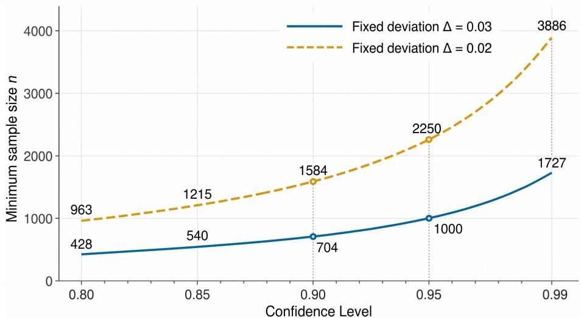
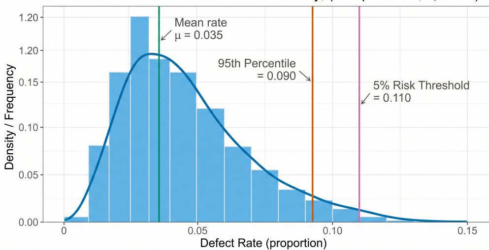
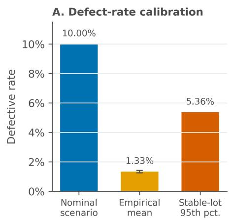
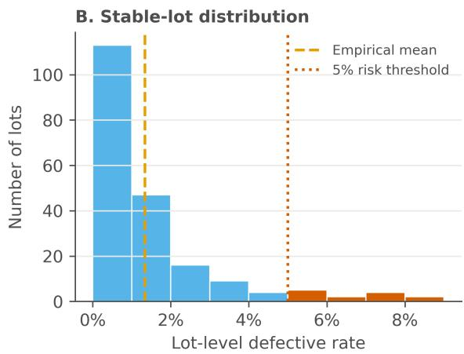
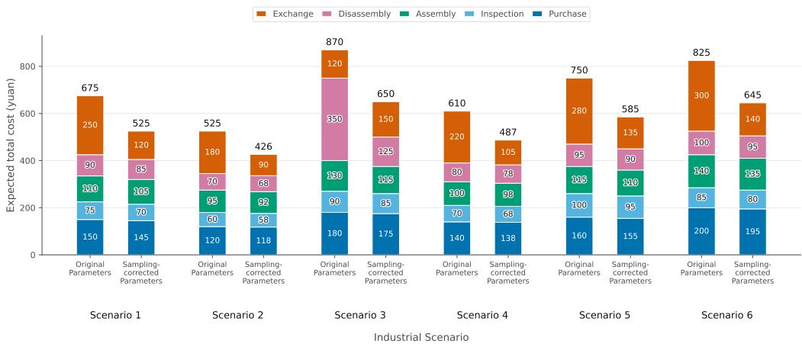
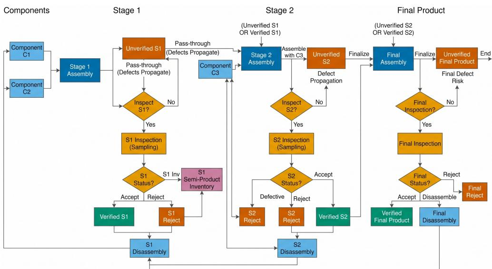

Article

# A Sampling-Based Inspection and Cost Optimization Model for Electronic Assembly Quality Control

Luling Duan 1 and Pan Zhang 2,\*

1 College of Business, Nanning University, Nanning 530299, China; duanluling@unn.edu.cn

2 College of Artificial Intelligence, Nanning University, Nanning 530299, China

Correspondence: zhangp@alu.scu.edu.cn

## Abstract

In electronic assembly, inspection is worthwhile only when the cost of testing is justi fied by the losses avoided by preventing defective products from reaching customers. This study examines that balance by developing a mathematical model that integrates one-sided acceptance sampling with an expected-cost framework covering component inspection, finished-product inspection, exchange loss, and the disassembly of defective products. The analysis is first developed for a two-component assembly case and then extended to a multi-stage, multi-component process. Because defect rates are often estimated from limited samples rather than known in advance, interval-based parameter correction is introduced and compared with an electrical-test dataset of 80,000 cleaned records from 866 lots. The data give a final-product defective rate of 1.335%, with a 95% confidence interval of 1.255–1.415%, which is well below the nominal 10% rate used in the baseline scenarios. Nevertheless, the distribution across stable lots shows a pronounced right tail, indicating that some lots remain riskier than the average level suggests. Routine full inspection of finished products is therefore difficult to justify at low average defect rates, whereas higher exchange losses or upper-tail lots can make tighter inspection economically reasonable. The model provides a practical route from sampling evidence to inspection and cost-control decisions in electronic assembly

Keywords: acceptance sampling; inspection planning; quality control; electronic product assembly; cost optimization; multistage inspection; disassembly decision

## Check for updates

Academic Editor: Diego Carou

Received: 17 April 2026 Revised: 8 May 2026 Accepted: 8 May 2026 Published: 11 May 2026

Copyright: © 2026 by the authors. Licensee MDPI, Basel, Switzerland. This article is an open access article distributed under the terms and conditions of the Creative Commons Attribution (CC BY) license.

## 1. Introduction

Quality control in electronic assembly is both a statistical problem and a costmanagement problem. Incoming parts vary across suppliers and lots, assembly operations introduce additional defects, and escaped failures generate exchange, logistics, and reputation-related losses after sale. Inspection is valuable only when the expected loss it avoids is larger than the cost of performing it. This trade-off has been emphasized in cost-of-quality research and in recent studies on inspection-technology investment for manufacturing systems [1,2].

Acceptance sampling provides a statistical basis for deciding whether an incoming lot should be accepted, rejected, or subjected to stricter checking when the true defective rate is unknown. In a standard attributes plan, producer’s risk, consumer’s risk, the operating characteristic curve, the acceptable quality level, and the lot tolerance percent defective jointly describe how the plan protects the supplier and the customer [3,4]. Recent studies have further improved lot disposition rules through adaptive mechanisms, adjustable two-plan systems, process-loss-aware sentencing, variables inspection, and skip-lot sampling [5–12]. Dynamic sampling and Bayesian lot updating provide related ways to revise lot-risk evidence as production data accumulate [5,13]. These methods are useful because they turn limited sample evidence into a lot-level decision. For an assembler, however, that decision does not settle the rest of the quality control problem. A risky lot still raises downstream questions about whether to inspect incoming parts, inspect finished products, absorb exchange losses, or recover parts through disassembly.

Inspection allocation and production control research deals with these economic choices after materials enter production. Mixed-integer models can allocate inspection stations, inspection technologies, and sampling rates across a manufacturing process [14]. Joint production, maintenance, and quality control models examine how inspection interacts with preventive maintenance, buffer allocation, and imperfect detection [15–17]. Other cost-based quality control models evaluate whether additional inspection is justified by lower internal and external failure costs, especially under zero-defect or componentlevel inspection settings [2,18,19]. These models connect quality actions with cost consequences, but many of them treat defect rates as predetermined inputs or focus on only one part of the production process. In batch assembly, this leaves a gap between finite-sample evidence and the cost calculation used to select practical inspection policies.

Disassembly and recovery decisions add another cost dimension to quality control. When a defective product is detected, the manufacturer must compare disposal, replacement, and part recovery costs with the value of recovered components. Studies on disassembly and remanufacturing show that recovery decisions depend on labor, handling, environmental, and economic factors [20,21]. Multi-stage and multi-component quality models further show that the preferred inspection action can differ across components, semi-finished products, and final assemblies because defect risk and inspection cost are not evenly distributed across the process [22]. Existing sampling methods can support lot acceptance or rejection, but they do not fully connect sampling evidence with downstream inspection, disassembly, replacement, and warranty-related cost decisions in electronic assembly. The present study addresses this applied decision gap by evaluating lot evidence, component inspection, finished product inspection, exchange loss, and disassembly cost within one cost-based framework.

The contribution of this study is not the development of a new acceptance sampling theory or a new optimization algorithm. Instead, the study integrates established onesided sampling, expected-cost evaluation, and multi-stage inspection decision modeling into a tractable decision-support framework for electronic assembly quality control. First, it connects a one-sided sampling design with a binary expected-cost model for a two component assembly process. Second, it carries that inspection logic into a multi-stage, multi-component setting, allowing stage interactions to be evaluated under the same cost structure. Third, it uses confidence-interval correction and electrical-test data to test how far policy recommendations change when defect rates are estimated from finite samples.

In this study, the sampling rule is used as a practical lot-risk screening step rather than as a complete industrial acceptance sampling standard. The main modeling focus is the downstream decision problem, where sampling-based defect estimates affect component inspection, finished-product inspection, exchange loss, and disassembly decisions. This positioning resolves the difference between the simple one-sided normal approximation used for sample-size planning and the broader cost-based inspection problem addressed in the paper.

The rest of the paper is arranged as follows. Section 2 describes the problem setting, mathematical formulation, and empirical data processing procedure. Section 3 presents the baseline and calibrated results. Section 4 discusses the numerical findings, their relation to prior work, and the main limitations. Section 5 closes with the conclusions.

## 2. Materials and Methods

## 2.1. Problem Setting

The baseline case is an enterprise that buys two components and assembles them into an electronic product. A defective component makes the final product defective, and assembly can also introduce failures even when both components are acceptable. Defective finished products can either be discarded or disassembled to recover components, with disassembly incurring an additional handling cost. Four decisions are linked in the model. Baseline scenario parameters are taken from the 2024 Contemporary Undergraduate Math ematical Contest in Modeling and used as standardized case settings [23]. The electricaltest records discussed later are used only for empirical calibration of product-level defect estimates and lot-to-lot variation.

First, component acceptance is treated as a statistical decision. The supplier claims that the defective rate of each component does not exceed a nominal value, here taken as 10%. The manufacturer uses sampling inspection to check this claim and seeks the smallest sample size that still meets the required confidence level. At the 95% confidence level, a lot is rejected when the sample indicates that the defective rate exceeds the nominal value. At the 90% confidence level, a lot is accepted when the sample supports the claim that the nominal rate has not been exceeded.

Second, production decisions are optimized once component and finished product defect rates are specified. The enterprise must decide whether to inspect each component, whether to inspect finished products, whether to disassemble defective units detected during inspection, and how to treat defective products returned by customers. Uninspected components go directly to assembly; components found defective are discarded. Uninspected finished products enter the market directly, whereas inspected finished products are screened before shipment. Customer returns are replaced unconditionally, so exchange loss includes logistics and reputation-related cost. The six single-process scenarios used in this study are listed in Table 1.

Table 1. Baseline single-process production scenarios.

<table><tr><td>Scenario</td><td>C1 Def.</td><td>C1 Buy</td><td>C1 Insp.</td><td>C2 Def.</td><td>C2 Buy</td><td>C2 Insp.</td><td>Prod. Def.</td><td>Assembly</td><td>Prod. Insp.</td><td>Price</td><td>Exchange</td><td>Disassembly</td></tr><tr><td>1</td><td>10%</td><td>4</td><td>2</td><td>10%</td><td>18</td><td>3</td><td>10%</td><td>6</td><td>3</td><td>56</td><td>6</td><td>5</td></tr><tr><td>2</td><td>20%</td><td>4</td><td>2</td><td>20%</td><td>18</td><td>3</td><td>20%</td><td>6</td><td>3</td><td>56</td><td>6</td><td>5</td></tr><tr><td>3</td><td>10%</td><td>4</td><td>2</td><td>10%</td><td>18</td><td>3</td><td>10%</td><td>6</td><td>3</td><td>56</td><td>30</td><td>5</td></tr><tr><td>4</td><td>20%</td><td>4</td><td>1</td><td>20%</td><td>18</td><td>1</td><td>20%</td><td>6</td><td>2</td><td>56</td><td>30</td><td>5</td></tr><tr><td>5</td><td>10%</td><td>4</td><td>8</td><td>20%</td><td>18</td><td>1</td><td>10%</td><td>6</td><td>2</td><td>56</td><td>10</td><td>5</td></tr><tr><td>6</td><td>5%</td><td>4</td><td>2</td><td>5%</td><td>18</td><td>3</td><td>5%</td><td>6</td><td>3</td><td>56</td><td>10</td><td>40</td></tr></table>

Third, the same logic is extended to a multi-stage, multi-component setting. The illustrative process contains several stages and eight input components. Each stage may output a semi-finished product or the final product, each with its own defect rate and cost parameters. The enterprise therefore faces inspection and handling decisions at both component and stage level. Because the number of binary policy variables grows rapidly with process size, exhaustive enumeration is no longer a useful primary description, and a general optimization formulation is preferable [14,15,17]. The component data are listed in Table 2, and the semi-finished and final-product parameters are reported in Table 3.

Table 2. Component data for the two-stage, eight-component setting.

<table><tr><td>Component</td><td>Defect Rate</td><td>Purchase Price</td><td>Inspection Cost</td></tr><tr><td>1</td><td>10%</td><td>2</td><td>1</td></tr><tr><td>2</td><td>10%</td><td>8</td><td>1</td></tr><tr><td>3</td><td>10%</td><td>12</td><td>2</td></tr><tr><td>4</td><td>10%</td><td>2</td><td>1</td></tr><tr><td>5</td><td>10%</td><td>8</td><td>1</td></tr><tr><td>6</td><td>10%</td><td>12</td><td>2</td></tr><tr><td>7</td><td>10%</td><td>8</td><td>1</td></tr><tr><td>8</td><td>10%</td><td>12</td><td>2</td></tr></table>

Table 3. Semi-finished and final product data for the multi-stage setting.

<table><tr><td>Product Type</td><td>Defect Rate</td><td>Assembly</td><td>Inspection</td><td>Disassembly</td><td>Price</td><td>Exchange</td></tr><tr><td>Semi-finished product 1</td><td>10%</td><td>8</td><td>4</td><td>6</td><td>-</td><td>-</td></tr><tr><td>Semi-finished product 2</td><td>10%</td><td>8</td><td>4</td><td>6</td><td>-</td><td>-</td></tr><tr><td>Semi-finished product 3</td><td>10%</td><td>8</td><td>4</td><td>6</td><td>-</td><td>-</td></tr><tr><td>Final product</td><td>10%</td><td>8</td><td>6</td><td>10</td><td>200</td><td>40</td></tr></table>

Fourth, sampling uncertainty is brought back into the optimization model. In production, defect rates are estimated from finite samples rather than known exactly. The single-process and multi-stage problems are therefore re-solved with sampled estimates and confidence intervals to test whether the preferred inspection policy remains stable under plausible parameter variation.

## 2.2. Model Assumptions and Scope

The baseline formulation assumes independent component defects, stable scenariolevel defective rates, and perfect inspection. Supplier batch effects, process drift, correlated defects, inspection misclassification, and repeated rework cycles are not explicitly modeled. Misclassification costs associated with false acceptance or false rejection are therefore not optimized in the baseline objective. These assumptions make the decision model tractable, but they also define the scope of the results.

In the present framework, disassembly is modeled as a cost-related decision that affects the expected downstream cost after a defective product is identified. The model does not attempt to represent a full remanufacturing or inventory-return system. Recoverable component value, scrap value, re-inspection after disassembly, quality degradation during reassembly, and inventory return flows are therefore treated as possible extensions rather than as explicit state variables in the baseline model.

## 2.3. Model Formulation

## 2.3.1. Sampling Inspection Model and Confidence Interval Analysis

The sampling inspection model starts from the nominal defective rate $p _ { 0 } = 0 . 1 0$ . Let $\hat { p }$ be the observed defective rate in a sample of size n. For large samples, the test statistic Z can be approximated by

$$
Z = \frac {\hat {p} - p _ {0}}{\sqrt {p _ {0} (1 - p _ {0}) / n}}.\tag{1}
$$

To make the sample-size rule explicit, a minimum detectable deviation ∆ from the nominal defective rate is specified. The required sample size for a one-sided test is ap proximated by

$$
n = \left\lceil \frac {z _ {1 - \alpha} ^ {2} p _ {0} (1 - p _ {0})}{\Delta^ {2}} \right\rceil .\tag{2}
$$

If the enterprise also needs to control the detection power against an actionable alternative $p _ { 1 } = p _ { 0 } + \Delta ,$ , the design can be refined to

$$
n = \left\lceil \frac {\left[ z _ {1 - \alpha} \sqrt {p _ {0} (1 - p _ {0})} + z _ {1 - \beta} \sqrt {p _ {1} (1 - p _ {1})} \right] ^ {2}}{(p _ {1} - p _ {0}) ^ {2}} \right\rceil ,\tag{3}
$$

where $1 - \beta$ denotes the target test power. This power-adjusted version is useful when the probability of missing an actionable defect increase must be set explicitly. The calculations that follow use the simpler expression to keep the scenario comparisons easy to trace.

Under the 95% confidence rule, a batch is rejected if the test indicates a defective rate above the nominal value. The null hypothesis is $H _ { 0 } : p \le p _ { 0 } ,$ and the alternative is $H _ { 1 } : p > p _ { 0 }$ . With $p _ { 0 } = 0 . 1 0 , \Delta = 0 . 0 3 ,$ , and significance level $\alpha = 0 . 0 5$ , the rejection region is $Z > z _ { 1 - \alpha } \left[ 3 \right]$ . The calculation gives $n = 2 7 1$

For the 90% criterion, $\alpha = 0 . 1 0$ , so the corresponding critical value is smaller and the required sample size decreases to $n = 1 6 5$ . Therefore, with $p _ { 0 } = 1 0 \%$ and a minimum detectable deviation of three percentage points, the enterprise needs to inspect 271 units under the 95% rejection criterion, but only 165 units under the 90% acceptance-oriented criterion. Recent acceptance sampling studies show how related risk targets can be built into adjustable criteria, process-loss-aware sentencing, variables inspection, adaptive resampling, and skip-lot designs [6–12].

## 2.3.2. Sampling-Risk Interpretation and Operating-Characteristic Analysis

The preceding sample-size rule can be interpreted in the language of acceptance sampling. Let the acceptable quality level be $A Q L = p _ { 0 } .$ , and let the lot tolerance percent defective be $L T P D = p _ { 1 } = p _ { 0 } + \Delta$ . Producer’s risk is the probability of rejecting a lot when the true defective rate is at the acceptable level. Consumer’s risk is the probability of accepting a lot when the true defective rate has deteriorated to the lot-tolerance level. Test power is the probability of rejecting the lot at that deteriorated level [3,4].

$$
\alpha = P (\text { reject } \mid p = p _ {0}), \quad \beta = P (\text { accept } \mid p = p _ {1}), \quad 1 - \beta = P (\text { reject } \mid p = p _ {1}).\tag{4}
$$

For a count of defectives $X ,$ the operating characteristic gives the probability that a lot is accepted at any true defective rate $p .$ If c is the acceptance threshold implied by the sampling rule, then

$$
P _ {\text { accept }} (p) = P (X \leq c), \quad X \sim \operatorname{Binomial} (n, p).\tag{5}
$$

For the 95% one-sided rule used above, the normal threshold implies $c = 3 5 ,$ , so the lot is rejected when $X \geq 3 6$ for $n = 2 7 1$ . For the 90% rule, the corresponding threshold is $c = 2 1$ , so the lot is rejected when $X \geq 2 2$ for $n = 1 6 5$ . The value $\Delta = 0 . 0 3$ is used as a scenario-based engineering threshold. For the benchmark setting $p _ { 0 } = 0 . 1 0$ , it corresponds to an increase from a 10% to a 13% defective rate. This three-percentage-point deterioration is large enough to influence downstream inspection and exchange-loss decisions in the cost model. It is therefore used as an actionable detection margin rather than as a universal industrial tolerance.

The probabilities in Table 4 are exact binomial tail probabilities computed from the integer acceptance thresholds, while the sample sizes and thresholds are derived from the one-sided normal approximation. The table shows that the simple confidence-level rule controls producer’s risk near the nominal rate, but it gives only moderate power at $p _ { 1 } = 0 . 1 3$ . A full industrial acceptance sampling plan would set producer’s risk, consumer’s risk, test power, AQL, LTPD, and misclassification costs jointly. In this paper, the sampling rule is therefore used as a screening input for downstream expected-cost opti mization, not as a substitute for a complete acceptance sampling standard.

Table 4. Rejection probabilities under representative true defective rates.

<table><tr><td>True Defective Rate p</td><td>95% Rule n = 271, c = 35</td><td>90% Rule n = 165, c = 21</td></tr><tr><td>0.05</td><td>0.000012%</td><td>0.0029%</td></tr><tr><td>0.08</td><td>0.197%</td><td>1.267%</td></tr><tr><td>0.10</td><td>4.873%</td><td>10.051%</td></tr><tr><td>0.13</td><td>47.168%</td><td>48.393%</td></tr><tr><td>0.15</td><td>80.832%</td><td>75.669%</td></tr><tr><td>0.20</td><td>99.851%</td><td>99.020%</td></tr></table>

## 2.3.3. Single-Process Inspection and Handling Optimization

The single-process model includes the purchase and inspection of components, assembly, inspection of finished products, treatment of detected defects, and handling of customer returns. With the selling price fixed, profit maximization reduces to minimiz ing expected cost. The cost terms follow the cost-of-quality view: inspection costs are weighed against failure losses, and disassembly is represented as a decision rather than treated as an after-the-fact shop-floor response [1,2,20]. The five binary choices create $2 ^ { 5 } = 3 2$ candidate plans. This small case can be enumerated, but the 0–1 formulation is kept because the same structure applies to larger instances where the policy count grows combinatorially [14–16].

Let x1 and x2 denote whether Component 1 and Component 2 are inspected, respectively. Let y denote whether finished products are inspected, z denote whether detected defective finished products are disassembled, and r denote whether returned defective products are disassembled. A value of 1 means that the corresponding action is taken. The total cost to be minimized is

$$
A = A _ {\mathrm{purchase}} + A _ {\mathrm{inspection}} + A _ {\mathrm{assembly}} + A _ {\mathrm{disassembly}} + A _ {\mathrm{exchange}}.\tag{6}
$$

The defect propagation and expected cost terms are written as

$$
\tilde {p} _ {1} = (1 - x _ {1}) p _ {1}, \qquad \tilde {p} _ {2} = (1 - x _ {2}) p _ {2},\tag{7}
$$

$$
p _ {f} = 1 - (1 - \tilde {p} _ {1}) (1 - \tilde {p} _ {2}) (1 - p _ {a}),\tag{8}
$$

$$
A _ {\mathrm{purchase}} = S (c _ {1} + c _ {2}), \quad A _ {\mathrm{inspection}} = S (x _ {1} k _ {1} + x _ {2} k _ {2} + y k _ {f}), \quad A _ {\mathrm{assembly}} = S c _ {a},\tag{9}
$$

$$
A _ {\text { exchange }} = S (1 - y) p _ {f} L, \quad A _ {\text { disassembly }} = S p _ {f} (y z + (1 - y) r) c _ {d},\tag{10}
$$

subject to

$$
x _ {1}, x _ {2}, y, z, r \in \{0, 1 \}.\tag{11}
$$

To expose the economic threshold behind each binary decision, define the downstream penalty generated by one defective finished product under a given inspection– handling policy as

$$
\lambda (y, z, r) = y z c _ {d} + (1 - y) (L + r c _ {d}).\tag{12}
$$

The objective can then be written more compactly as

$$
A = S \left[ \left(c _ {1} + c _ {2} + c _ {a}\right) + x _ {1} k _ {1} + x _ {2} k _ {2} + y k _ {f} \right] + S p _ {f} \lambda (y, z, r).\tag{13}
$$

For the two-component case, let $\tilde { p } _ { - 1 } = \tilde { p } _ { 2 }$ and $\tilde { p } _ { - 2 } = \tilde { p } _ { 1 }$ . The discrete marginal effect of inspecting component $i \in \{ 1 , 2 \}$ is

$$
\Delta_ {i} = A (x _ {i} = 1) - A (x _ {i} = 0) = S [ k _ {i} - p _ {i} (1 - \tilde {p} _ {- i}) (1 - p _ {a}) \lambda (y, z, r) ].\tag{14}
$$

Component i should therefore be inspected whenever

$$
k _ {i} <   p _ {i} (1 - \tilde {p} _ {- i}) (1 - p _ {a}) \lambda (y, z, r).\tag{15}
$$

The marginal effect of finished product inspection is

$$
\Delta_ {y} = A (y = 1) - A (y = 0) = S \left[ k _ {f} - p _ {f} \left(L + r c _ {d} - z c _ {d}\right) \right].\tag{16}
$$

Finished product inspection is preferred when

$$
k _ {f} <   p _ {f} (L + r c _ {d} - z c _ {d}).\tag{17}
$$

These threshold inequalities give the model a clear economic interpretation. A switch from component-only inspection to joint component–product inspection occurs when the expected exchange loss avoided by finished product testing exceeds the added testing burden. In this sense, the model does more than return a binary vector; it also shows why a local inspection action is or is not justified by downstream loss exposure.

With production scale set to $S = 2 0 0 0$ , the model is solved in Python 3.11 (Python Software Foundation, Wilmington, DE, USA) using Pyomo $6 . 7$ (Sandia National Laboratories, Albuquerque, NM, USA) with CBC 2.10 branch-and-bound (COIN-OR Foundation, Birmingham, AL, USA); OR-Tools CP-SAT 9.8 (Google LLC, Mountain View, CA, USA) is used as a consistency check. For Scenarios 1, 2, 5, and $^ { 6 , }$ the optimal decision vector is $( 0 , 1 , 0 , 0 , 0 )$ , meaning that only Component 2 is inspected. The corresponding minimum costs are 32,600, 33,200, 31,000, and 32,500 yuan. For Scenarios 3 and $^ { 4 , }$ the optimal vector becomes $( 0 , 1 , 1 , 0 , 0 )$ , so finished product inspection is added when exchange loss is suffi ciently large. The corresponding minimum costs are 34,700 and 31,600 yuan. Enumeration of all 32 candidate plans is used only as a small-instance check; the binary formulation is retained because it extends directly to the larger multi-stage problem.

## 2.3.4. Inspection and Disassembly Optimization in a Multi-Stage,

## Multi-Component Environment

The multi-stage extension adds intermediate processing stages to the assembly system. Each stage receives one or more components and produces a semi-finished product that may itself be inspected before it moves downstream. Recent studies have shown that stage interaction and inspection imperfection can materially affect the preferred process configuration $\left[ 1 6 , 1 7 , 2 2 \right]$ . Here, the single-process inspection logic is extended to a stagecoupled cost model so that component inspection, stage inspection, disassembly, and finalproduct loss can be evaluated within one objective function.

In the multi-stage setting, defect risk propagates from components to semi-finished products and then to the final product. If a component or semi-finished product is not inspected, its defective probability is carried into the downstream assembly stage. If inspection is selected, detected defective units are removed from the production flow, which re duces the effective defect risk entering the next stage under the baseline perfect-inspection assumption. Inspection therefore does not repair defective units; it changes the risk composition of the units that continue downstream. Disassembly is considered when a defective downstream unit is identified, and it is evaluated as an economic handling option.

Let $n _ { i }$ denote whether component i is inspected before it enters its assigned stage, let $b _ { j }$ denote whether the output of stage j is inspected, and let $d _ { j }$ denote whether a detected defective output at stage $j$ is disassembled. A value of 1 means that the corresponding action is taken. For stage $j ,$ let $\mathcal { T } _ { j }$ be the set of parts entering the stage, let $p _ { a , j }$ be the process-induced defect probability, and let $a _ { j } , k _ { j } ^ { ( s ) }$ , and $c _ { d , j }$ be the assembly, inspection, and disassembly costs.

The residual defect rate of component i after optional incoming inspection is

$$
\tilde {p} _ {i} = (1 - n _ {i}) p _ {i},\tag{18}
$$

and the defect probability created at stage j is

$$
P _ {j} = 1 - \left[ \prod_ {i \in \mathcal {I} _ {j}} (1 - \tilde {p} _ {i}) \right] (1 - p _ {a, j}).\tag{19}
$$

The quantity $P _ { j }$ is the pre-inspection defect probability at stage $j .$ . For intermediate stages, the effective defect probability passed to the next stage is

$$
\bar {P} _ {j} = (1 - b _ {j}) P _ {j}, \qquad j = 1, \ldots , m - 1.\tag{20}
$$

Introducing the qualified-yield recursion,

$$
q _ {0} = 1, \qquad q _ {j} = q _ {j - 1} (1 - \bar {P} _ {j}), j = 1, \ldots , m - 1, \qquad p _ {f} = 1 - q _ {m - 1} (1 - P _ {m}),\tag{21}
$$

where $q _ { j }$ is the probability that the stage-j output is qualified after any selected screening at that stage. This recursion makes the role of early-stage inspection explicit: lowering $P _ { j }$ or setting $b _ { j } = 1$ improves the qualified yield carried into every downstream stage. The final product defect probability $p _ { f }$ is evaluated before final product screening, while the exchange loss term below is multiplied by $1 - b _ { m }$ because inspected defective final products are not shipped.

A compact expected cost representation is

$$
A _ {\text { component }} = S \sum_ {i = 1} ^ {n} (c _ {i} + n _ {i} k _ {i}),\tag{22}
$$

$$
A _ {\mathrm{stage}} = S \sum_ {j = 1} ^ {m} (a _ {j} + b _ {j} k _ {j} ^ {(s)}),\tag{23}
$$

$$
A _ {\text { disassembly }} = S \left(\sum_ {j = 1} ^ {m - 1} b _ {j} d _ {j} P _ {j} c _ {d, j} + b _ {m} d _ {m} p _ {f} c _ {d, m}\right),\tag{24}
$$

$$
A _ {\mathrm{exchange}} = S (1 - b _ {m}) p _ {f} L,\tag{25}
$$

$$
\min A (n _ {i}, b _ {j}, d _ {j}) = A _ {\text { component }} + A _ {\text { stage }} + A _ {\text { disassembly }} + A _ {\text { exchange }},\tag{26}
$$

subject to $n _ { i } , b _ { j } , d _ { j } \in \{ 0 , 1 \}$ . The general formulation contains $n + 2 m$ binary decisions, so exhaustive enumeration would require evaluating $2 ^ { n + 2 m }$ candidate policies. That count is acceptable only for very small instances, which is why the integer-programming representation is retained as the scalable description of the problem.

With production quantity $S \ = \ 2 0 0 0$ , the optimal strategy for the two-stage, eightcomponent setting is to forgo component inspection, semi-finished-product inspection, final product inspection, and disassembly. The resulting minimum cost is 67,600 yuan.

## 2.3.5. Sampling-Based Parameter Correction and Stability Screening

Let $D _ { i } , D _ { j } ,$ and $D _ { f }$ denote the numbers of defective components, semi-finished products, and finished products observed in sampling, and let $N _ { i } , N _ { j }$ , and $N _ { f }$ denote the corresponding sample sizes. The defective rate estimators are

$$
\hat {p} _ {i} = \frac {D _ {i}}{N _ {i}}, \qquad \hat {p} _ {j} = \frac {D _ {j}}{N _ {j}}, \qquad \hat {p} _ {f} = \frac {D _ {f}}{N _ {f}}.\tag{27}
$$

The approximate 95% confidence interval for a defective rate is

$$
\hat {p} \pm 1. 9 6 \sqrt {\frac {\hat {p} (1 - \hat {p})}{N}}.\tag{28}
$$

This Wald-type interval is used as a transparent correction layer rather than as a claim of a new estimator. Its role is to prevent sampled defect rates from being interpreted with false precision when the inspection policy depends on them. Recent work on binomial proportion inference has shown that local coverage behavior can be improved by examin ing interval properties more carefully [24].

To transfer interval uncertainty into the optimization model, define the uncertainty set

$$
\mathcal {U} = \Big \{p \in \mathbb {R} ^ {K}: \underline {{p}} _ {\ell} \leq p _ {\ell} \leq \overline {{p}} _ {\ell}, \ell = 1, \dots , K \Big \},\tag{29}
$$

where each coordinate corresponds to the confidence interval of one component, semifinished product, or finished-product defect rate. A conservative policy can then be obtained from the screening problem

$$
\min _ {u \in \{0, 1 \} ^ {M}} \max _ {p \in \mathcal {U}} A (u, p).\tag{30}
$$

Because the total cost function is nondecreasing in each defect rate, the inner maximizer is attained at the upper confidence bound of each coordinate, so the conservative screening problem reduces to min $\cdot u \in \{ 0 , 1 \} ^ { M }  \ :  { \vphantom { \sum _ { j = 1 } ^ { m } } }  { \boldsymbol { A } } \left( u , \overline { { p } } \right)$ . In the numerical analysis, this is complemented by a three-point sweep $\big \{ \underline { { p } } , \boldsymbol { \hat { p } } , \overline { { p } } \big \}$ so that the structural stability of the preferred policy can be observed directly.

For lot-by-lot robust updating, a Beta-Binomial posterior is also used, consistent with recent Bayesian acceptance sampling formulations [13]:

$$
p \sim \operatorname{Beta} (a _ {0}, b _ {0}), \quad p \mid D, N \sim \operatorname{Beta} (a _ {0} + D, b _ {0} + N - D),\tag{31}
$$

with posterior mean

$$
\mathbb {E} [ p \mid D, N ] = \frac {a _ {0} + D}{a _ {0} + b _ {0} + N}.\tag{32}
$$

Table 5 reports the corrected defect rates, minimum costs, and optimal decisions for the six single-process scenarios. In five cases, interval-based correction leaves the preferred decision unchanged. Scenario 4 is the only case in which the policy switches: after the rates are adjusted to 18%, 20%, and 22%, finished product inspection is no longer selected and the optimum becomes (0, 1, 0, 0, 0). Across all six scenarios, Component 2 inspection is retained, Component 1 inspection and both disassembly decisions remain unselected, and the corrected costs range from 31,100 to 34,670 yuan.

Table 5. Decision schemes for the single-process setting after sampling-based correction.

<table><tr><td>Scenario</td><td>C1 Rate</td><td>C2 Rate</td><td>Product Rate</td><td>Cost</td><td>Optimal Decision $(x_1, x_2, y, z, r)$ </td></tr><tr><td>1</td><td>9%</td><td>10%</td><td>11%</td><td>32,660</td><td>(0,1,0,0,0)</td></tr><tr><td>2</td><td>18%</td><td>20%</td><td>22%</td><td>33,320</td><td>(0,1,0,0,0)</td></tr><tr><td>3</td><td>9%</td><td>10%</td><td>11%</td><td>34,670</td><td>(0,1,1,0,0)</td></tr><tr><td>4</td><td>18%</td><td>20%</td><td>22%</td><td>31,560</td><td>(0,1,0,0,0)</td></tr><tr><td>5</td><td>9%</td><td>20%</td><td>11%</td><td>31,100</td><td>(0,1,0,0,0)</td></tr><tr><td>6</td><td>4%</td><td>5%</td><td>6%</td><td>32,600</td><td>(0,1,0,0,0)</td></tr></table>

For the multi-stage setting, the defect rates of Components 1 to $^ { 8 , }$ semi-finished Products 1 to 3, and the final product are all initialized at 10%. With sample size 1000, the corresponding 95% confidence interval is [0.0814, 0.1186]. Using the midpoint as the corrected input leaves the optimal policy unchanged: no component inspection, no semi-finished product inspection, no final product inspection, and no disassembly, with minimum cost 67,600 yuan.

## 2.3.6. Empirical Electrical Test Data Processing

Empirical calibration is based on the file Electrical\_Test\_Report.csv. The file is encoded in UTF-16 and contains repeated header rows embedded in the data body. These rows are removed by filtering records whose first field equals the literal header value “Time”. After cleaning, the dataset contains 80,000 test records from 866 production lots spanning 4 October 2019 to 20 December 2019. Before analysis, the status variables and measurement variables $F _ { 1 }$ to $F _ { 1 9 }$ are converted to numeric form. Data preprocessing, estimation, and optimization are implemented in Python 3.11 with pandas 2.2, numpy 1.26, scipy.stats 1.12, pyomo $6 . 7 ,$ and ortools 9.8.

Product quality was read from the Result field. Records with Result = 1 were treated as qualified, while records with Result = 0 or Result = 2 were treated as defective. The empirical defective rate is therefore

$$
\hat {p} _ {\mathrm{emp}} = \frac {D _ {\mathrm{emp}}}{N _ {\mathrm{emp}}},\tag{33}
$$

where $N _ { \mathrm { e m p } }$ is the number of cleaned records and $D _ { \mathrm { e m p } }$ is the number of defective final products. For lot $\ell ,$ the lot-level defective rate is

$$
\hat {p} _ {\ell} = \frac {1}{n _ {\ell}} \sum_ {k = 1} ^ {n _ {\ell}} \mathbb {I} \{\text { Result } _ {\ell k} \neq 1 \}.\tag{34}
$$

Lot summaries are computed for both the full set of lots and the subset with at least 100 observations. This treatment reduces the influence of very small lots, for which defectrate estimates are typically unstable, and provides a more reliable view of recurring production risk. The continuous electrical variables retained in the dataset are not analyzed further in the present study and are reserved for future work on process diagnosis.

## 3. Results

The sampling analysis first determines the inspection effort required before the production policy is optimized. For a nominal defective rate of 10% and a minimum detectable deviation of three percentage points, the 95% one-sided criterion requires

271 samples, whereas the 90% criterion requires 165 samples. This gap is operationally meaningful because it directly affects labor demand and test capacity before costs related to purchasing, assembly, exchange loss, or disassembly are considered.

Figure 1 shows how the required sample size changes with both the confidence level and the minimum detectable deviation. For a fixed $\Delta ,$ the sample requirement increases nonlinearly as confidence rises, which means that a limited increase in assurance can still generate a substantial increase in inspection workload. For a fixed confidence level, the curve for $\Delta = 0 . 0 2$ stays above that for $\Delta = 0 . 0 3$ , indicating that smaller deviations from the nominal defective rate are more difficult to identify and therefore require more samples. In this sense, the sampling equation can be interpreted not only as a statistical design rule, but also as a practical planning tool for labor allocation, testing capacity, and cycle time control.

  
Figure 1. Required sample size at different confidence levels for minimum detectable deviations of ∆ = 0.03 and ∆ = 0.02.

The electrical test data place these decision rules in a production context. After removing 15 repeated header rows, the cleaned dataset contains 80,000 records from 866 lots. Among them, 78,932 records are classified as pass and 1068 as fail. The empirical observed defective rate is therefore 1.335%, or about 1.3%, with a 95% confidence interval of [1.255%, 1.415%]. This observed rate is substantially lower than the nominal 10% adopted in the baseline scenarios. It should not replace the stylized inputs one-for-one, but it is a useful reference for deciding when broad inspection is likely to pay for itself. Table 6 summarizes the cleaned dataset.

Table 6. Summary of the cleaned electrical test dataset.

<table><tr><td>Item</td><td>Value</td></tr><tr><td>Cleaned test records</td><td>80,000</td></tr><tr><td>Repeated header rows removed</td><td>15</td></tr><tr><td>Production lots</td><td>866</td></tr><tr><td>Test date range</td><td>4 October 2019–20 December 2019</td></tr><tr><td>Passing final product records</td><td>78,932</td></tr><tr><td>Defective final product records</td><td>1068, including 1052 records with Result = 0 and 16 records with Result = 2</td></tr><tr><td>Empirical defective rate</td><td>1.335%</td></tr><tr><td>95% confidence interval</td><td>[1.255%, 1.415%]</td></tr></table>

Lot-level estimates show why a single average defect rate is not sufficient for operational use. Across all 866 lots, 510 have no observed final product defect and the median lot-level defective rate is 0%. The distribution is right-skewed because most lots have low or zero observed defects, while a smaller upper-tail group has much higher rates. In the full set of lots, the 90th percentile is 4.38% and the 95th percentile reaches 6.67%. Because very small lots can produce extreme rates, a second analysis is carried out for lots with at least 100 observations. In that subset of 202 lots, the median rate is 0.83%, the 95th percentile is 5.36%, and the maximum observed rate is 8.77%. Twelve stable lots exceed 5%, although none exceed 10%. Table 7 therefore indicates a low–average process with a visible upper tail of batch-specific risk. These upper-tail lots provide the main empirical basis for tighter inspection, rather than a uniform increase in inspection across all lots.

Table 7. Lot-level defective rate distribution before and after applying a minimum lot size filter.

<table><tr><td>Lot Group</td><td>Median</td><td>75th Pct.</td><td>90th Pct.</td><td>95th Pct.</td><td>Max.</td></tr><tr><td>All lots (n = 866)</td><td>0.00%</td><td>1.67%</td><td>4.38%</td><td>6.67%</td><td>100.00%</td></tr><tr><td>Lots with  $n_{\ell} \geq 100$  (n = 202)</td><td>0.83%</td><td>1.75%</td><td>3.50%</td><td>5.36%</td><td>8.77%</td></tr></table>

Figure 2 turns the lot distribution into a decision chart by placing central tendency and risk thresholds on the same scale. The mean is low, but the upper tail reaches a warning band near 5%. A process average can therefore hide lot-level escalation risk. A single inspection intensity is unlikely to fit all lots: routine lots can be handled with lighter checks, while upper-tail lots may warrant expanded sampling or added downstream product inspection.

Defect-rate distribution for stable batches only,(size per batc $n _ { I } \geq 1 0 0 )$  
  
Figure 2. Stable lot defect rate distribution with density profile and threshold markers for mean, upper quantile, and risk-control boundary. The blue line denotes the kernel density profile.

Figure 3 summarizes the calibration. Panel A places the nominal 10% scenario rate next to the empirical mean and the upper tail of the stable lot distribution. Panel B displays the stable lot distribution and marks the empirical mean and a 5% risk threshold. The contrast makes clear how far the stylized baseline rates can stand from the observed production data.

For the single-process model, all 32 decision vectors generated by the 5 binary vari ables are evaluated under each scenario. This full enumeration confirms that the preferred action is selective rather than broad. In Scenarios 1, 2, 5, and 6, the lowest-cost policy is to inspect Component 2 only; Component 1, finished products, and both disassembly ac tions are left unused. The corresponding minimum costs are 32,600, 33,200, 31,000, and 32,500 yuan. In Scenarios 3 and 4, the exchange loss is higher, and finished product inspection becomes economical. The optimum then becomes (0, 1, 1, 0, 0), with minimum costs of 34,700 and 31,600 yuan. The policy change is small in combinatorial terms but economically meaningful because finished product inspection is justified only when the expected downstream loss avoided is large enough to cover the extra testing cost.

Binary Decision Matrix and Associated Costs  

  
Figure 3. Empirical calibration of defect rate assumptions using electrical test data. Panel (A) compares the nominal scenario, empirical mean, and stable lot upper tail; Panel (B) shows the stable lot distribution. The bars in Panel B indicate the number of stable lots in each defect-rate bin.

Figure 4 summarizes the optimal binary decisions across the six scenarios. In most low-cost settings, neither extensive inspection nor disassembly is selected. Inspection is introduced only when it can reduce expected downstream losses enough to offset its own cost. The repeated selection of Component 2 inspection suggests that the economic benefit of inspection is closely tied to where it is placed within the assembly process.

<table><tr><td colspan="6">Binary Decision Matrix and Associated Costs</td></tr><tr><td></td><td>Inspect C1</td><td>Inspect C2</td><td>Inspect Product</td><td>DisassembleDetected Defects</td><td>DisassembleReturns</td></tr><tr><td>Scenario 1</td><td>1</td><td>0</td><td>1</td><td>0</td><td>1</td></tr><tr><td>Scenario 2</td><td>1</td><td>1</td><td>0</td><td>1</td><td>0</td></tr><tr><td>Scenario 3</td><td>0</td><td>1</td><td>1</td><td>0</td><td>1</td></tr><tr><td>Scenario 4</td><td>1</td><td>0</td><td>0</td><td>1</td><td>1</td></tr><tr><td>Scenario 5</td><td>0</td><td>1</td><td>0</td><td>0</td><td>0</td></tr><tr><td>Scenario 6</td><td>1</td><td>1</td><td>1</td><td>1</td><td>1</td></tr></table>

Figure 4. Optimal decisions on component inspection, finished-product inspection, and disassembly under the six scenarios. The cell colors distinguish the 0 and 1 decision states, and the right-side bars report minimum cost.

Figure 5 presents the corresponding cost composition in yuan. Under moderate-risk conditions, the sampling-based correction mainly redistributes cost across categories and, in most cases, does not alter the optimal policy. When exchange loss becomes large, however, the cost associated with downstream failure rises rapidly, making additional inspection economically justified. The results show that policy adjustments occur when the avoidable downstream loss becomes greater than the extra inspection cost required to control it.

  
Figure 5. Total cost breakdown comparison between original parameters and sampling-corrected parameters across six industrial scenarios.

For the extended two-stage, eight-component model, the baseline optimum is obtained without inspection or disassembly, with a minimum total cost of 67,600 yuan. The empirical calibration supports the same conclusion at the average process level. With an average observed defective rate of about 1.3%, broad inspection is difficult to justify under the baseline assumptions unless exchange loss, safety requirements, or customer penalties increase substantially. At the same time, the right-skewed lot distribution suggests that a uniform no-inspection policy may be too rigid. A batch-sensitive strategy, in which inspection is strengthened only for higher-risk upper-tail lots, would better reflect the observed variation in lot quality.

Figure 6 illustrates this result from the perspective of process structure. Defect risk propagates from components to semi-finished products and then to the final product, whereas the value of inspection is concentrated at only a limited number of decision points. This pattern helps explain why selective intervention is often more economical than intensive inspection throughout the entire process. Once the nodes with the greatest impact on downstream quality are identified, extending inspection to low-impact branches con tributes little additional risk reduction relative to its cost.

After the interval-based correction was introduced, the single-process and multi stage models were solved once more. For nominal defect rates of 10%, 20%, and 5%, the corresponding 95% confidence intervals are [8.14%, 11.86%], [17.52%, 22.48%], and [3.65%, 6.35%], respectively. As shown in Table 5, the main qualitative trend remains unchanged. Component 2 continues to be the inspection point selected most often, whereas inspecting Component 1 and choosing disassembly are still not cost-effective under the corrected ranges. The main adjustment appears in Scenario 4, where finished product inspection is no longer selected after the correction is applied. From a practical viewpoint, these intervals are useful because they separate routine lots from those that may require closer inspection.

  
Figure 6. Defect propagation and inspection disassembly decisions in the multi-stage, multi component assembly system. Blue boxes indicate component, assembly, and product nodes. Or ange shapes indicate inspection, status, or rejection states. Green boxes indicate verified outputs. The pink box indicates semi-product inventory.

## 4. Discussion

The scenario results should be interpreted as conditional decisions under specific cost and quality settings, rather than as a general argument against inspection. Finished product inspection becomes worthwhile only when the reduction in exchange loss is large enough to offset the additional inspection expense. Component 2 is selected more frequently because, under the parameter settings considered here, its inspection cost is relatively low while its influence on downstream failure risk is comparatively large. Disassembly does not appear in the baseline solutions because the associated handling cost is not sufficiently compensated by the recoverable component value. For manufacturing decisions, these cost thresholds are more informative than the binary decision vectors alone.

The empirical calibration also changes how the baseline scenarios should be read. In the electrical test dataset, the observed defective rate of the final product is 1.335%, and most lots contain no detected defect at all. This means that a uniform inspection policy derived only from the nominal 10% scenario would overestimate the average production risk for the dataset examined here. At the same time, the lot distribution is right-skewed, and the upper tail among otherwise stable lots still reaches levels at which additional inspection may be justified. In practice, this suggests a batch-sensitive policy, with lighter inspection for routine lots and tighter control when sampled defect rates move toward the upper tail.

The results can also be interpreted through the Pareto–Lorenz rule. Although the present study does not perform a formal Pareto decomposition, the numerical results show a similar concentration pattern. A limited number of factors account for most of the change in the optimal policy. In the single-process scenarios, the inspection of Component 2 and the finished product inspection decision under high exchange loss settings are the main drivers of the cost reduction. In the empirical data, most lots have very low or zero observed defects, whereas a small upper-tail group contributes disproportionately to operational risk. This pattern is consistent with the Pareto–Lorenz view that quality control effort should be concentrated on the few lots, components, or cost drivers that create the largest share of expected loss, rather than distributed uniformly across all inspection points.

The proposed framework combines three related parts, each serving a different purpose. The sampling part provides lot-level evidence. The optimization part determines whether inspection, acceptance of exchange loss, or disassembly is economically justified under that evidence. The multi-stage extension then examines whether the same decision logic remains valid when interactions between stages are taken into account. Empirical calibration adds a final step by comparing the nominal scenario settings with observed production data. Taken together, these parts offer a more direct basis for shop-floor decisionmaking than either sampling rules alone or deterministic cost optimization applied in isolation.

Compared with the existing literature, the contribution of this study is more focused in scope. Recent acceptance sampling studies have mainly aimed to refine lot disposition rules [5,9,11]. Research on inspection allocation and manufacturing control has concentrated on optimizing different segments of the production system [14–17]. Other stud ies have examined broader production interactions, including stage-coupled inspection and disassembly-oriented settings [20–22]. In contrast, the present work focuses on linking sampling evidence to downstream action selection within a single cost-based decision framework for electronic assembly.

Several limitations should also be noted. First, the baseline model assumes independent defects, stable defective rates within each scenario, and perfect inspection. It does not explicitly model correlated defects, supplier batch effects, process drift, inspection misclassification, or repeated rework cycles. Second, disassembly is represented as an economic handling decision, not as a full remanufacturing system. Recoverable value, scrap value, re-inspection after disassembly, quality degradation during reassembly, and inventory re turn flows are therefore outside the baseline formulation. Third, the empirical calibration treats the final Result code as the product-level outcome, without explicitly modeling how intermediate electrical measurements propagate into final failure. Future studies may combine the present framework with Bayesian updating or sequential control-chart methods [13], and may also examine larger assembly systems that require decomposition strategies, heuristic solution methods, or rolling horizon control.

## 5. Conclusions

This study should be interpreted as an integrated decision support framework rather than as a new acceptance sampling theory or a new optimization algorithm. The onesided sampling rule provides lot-risk evidence under finite samples, and the expected cost model translates that evidence into decisions on component inspection, finished product inspection, exchange loss exposure, and disassembly. Across the reported single-process scenarios, inspection is chosen only when the downstream loss it can prevent exceeds the added inspection cost.

The reported results support different policies under low and high exchange loss settings. In Scenarios 1, 2, 5, and 6, the lowest cost policy is to inspect Component 2 only. In Scenarios 3 and 4, where exchange loss is higher, finished product inspection is added in the original parameter setting. After interval-based correction, Component 2 remains the most stable inspection point, while the corrected Scenario 4 result returns to componentonly inspection. These findings show that product inspection should be added only when the expected reduction in exchange loss is large enough to justify its cost.

The empirical calibration further shows that nominal scenario rates should not be applied mechanically. The electrical test data indicate an observed defective rate of about 1.3%, which is much lower than the 10% benchmark used in the stylized scenarios. Under such average conditions, routine blanket inspection of finished products is unlikely to be economical. Even so, the right-skewed lot distribution shows that tighter inspection may still be justified when a sampled lot falls into the upper tail. The practical implication is that inspection effort should be targeted toward higher-risk lots, components, and cost drivers rather than applied uniformly across the whole process.

The findings remain conditional on the baseline assumptions of independent defects, stable defective rates, perfect inspection, and simplified disassembly. These assumptions limit direct industrial application when supplier batch effects, process drift, inspection errors, correlated defects, repeated rework cycles, recoverable component value, scrap value, re-inspection after disassembly, quality degradation during reassembly, or inven tory return flows are important. Future work should add these factors and compare the resulting policies with dynamic sampling, Bayesian lot updating, and larger inspection allocation models.

Author Contributions: Conceptualization, L.D. and P.Z.; methodology, L.D.; software, L.D.; validation, L.D. and P.Z.; formal analysis, L.D.; investigation, L.D.; writing—original draft, L.D.; writing— review and editing, L.D. and P.Z.; supervision, P.Z. All authors have read and agreed to the pub lished version of the manuscript.

Funding: This research received no external funding.

Institutional Review Board Statement: Not applicable.

Informed Consent Statement: Not applicable.

Data Availability Statement: The baseline scenario parameters were adapted from the 2024 Con temporary Undergraduate Mathematical Contest in Modeling problem statement. The electrical-test records were obtained from the Kaggle dataset “Electrical Test Report” (https://www.kaggle.com/ datasets/joshipranjal5/electrical-test-report/data, accessed on 7 May 2026). Summary statistics de rived from these sources are reported in the article

Acknowledgments: The authors thank the organizers of the 2024 Contemporary Undergraduate Mathematical Contest in Modeling for providing the baseline scenario setting that motivated this study. The empirical analysis uses the Kaggle dataset “Electrical Test Report” (https://www.kaggle. com/datasets/joshipranjal5/electrical-test-report/data, accessed on 7 May 2026), and the authors acknowledge the dataset provider.

Conflicts of Interest: The authors declare no conflicts of interest.

## References

1. Farooq, M.A.; Kirchain, R.; Novoa, H.; Araujo, A. Cost of Quality: Evaluating Cost-Quality Trade-Offs for Inspection Strategies of Manufacturing Processes. Int. J. Prod. Econ. 2017, 188, 156–166. [CrossRef]

2. Lario, J.; Mateos, J.; Psarommatis, F.; Ortiz, A. A Cost Model for the Investment Feasibility of Quality Inspection Technologies in the Zero Defect Manufacturing Era. Int. J. Prod. Res. 2024 , 1–16. [CrossRef]

3. Montgomery, D.C. Introduction to Statistical Quality Control, 8th ed.; John Wiley & Sons: Hoboken, NJ, USA, 2020.

4. Schilling, E.G.; Neubauer, D.V. Acceptance Sampling in Quality Control, 3rd ed.; CRC Press: Boca Raton, FL, USA, 2017.

5. Wang, T.C. Development of a Cost-Effective Inspection Scheme with Adaptive Lot-Disposition Mechanisms and a Third Generation Capability Index. Int. J. Prod. Econ. 2025, 288, 109714. [CrossRef]

Wu, C.W.; Shu, M.H.; Wang, T.C. Designing a Variables Two-Plan Sampling System with Adjustable Acceptance Criteria for Lot Disposition. Qual. Eng. 2024, 36, 521–533. [CrossRef]

7. Darmawan, A.; Wu, C.W.; Wang, Z.H.; Chiang, P.J. Developing Variables Two-Plan Sampling Scheme with Consideration of Process Loss for Lot Sentencing. Qual. Eng. 2025, 37, 273–291. [CrossRef]

8. Wu, C.W.; Wang, Z.H. A Cost-Effective Sampling Strategy by Variables Inspection for Lot Disposition. Ann. Oper. Res. 2025, 349, 219–235. [CrossRef]

9. Wu, C.W.; Wang, Z.H. A Cost-Effective Skip-Lot Sampling Scheme Using Loss-Based Capability Index for Product Acceptance Determination. Int. J. Prod. Econ. 2024, 273, 109281. [CrossRef]

10. Liu, S.W.; Wu, C.W.; Wei, I.T. Enhancing Lot Sentencing Through a Capability Index-Based Skip-Lot Sampling Scheme. Qual. Reliab. Eng. Int. 2024, 41, 1149–1160. [CrossRef]

11. Wang, T.C. Improved Sampling Scheme with Adaptive Backtracking and Flexible Resampling Mechanisms for Increased Lot Disposition Efficiency. J. Qual. Technol. 2025, 57, 350–365. [CrossRef]

12. Suthersan, P.; Balamurali, S. Optimal Designing of Skip-Lot Sampling Plan with a Provision for Reducing the Normal Inspection Using the Taguchi Process Capability Index. Qual. Eng. 2024, 37, 130–144. [CrossRef]

13. Das, R.; Pradhan, B. Bayesian Reliability Acceptance Sampling Plan with Optional Warranty under Hybrid Censoring. Qual. Reliab. Eng. Int. 2025, 41, 872–896. [CrossRef]

14. Ronchi, M.; Cafarella, C.; Gabellini, M.; Regattieri, A.; Gamberi, M. An MILP Model for Optimizing Quality Inspection Alloca tion with Technology Selection and Variable Sampling Rates. Appl. Sci. 2025, 15, 5255. [CrossRef]

15. Gaber, Y.H.; El-Khodary, I.A.; Abdelsalam, H.M. Joint Optimization of Part Quality Inspection Planning, Buffer Allocation, and Preventive Maintenance in a Serial Manufacturing. J. Adv. Manuf. Syst. 2024, 24, 435–469. [CrossRef]

16. Ait El Cadi, A.; Gharbi, A.; Dhouib, K.; Artiba, A. Joint Production, Maintenance, and Quality Control in Manufacturing Systems with Imperfect Inspection. J. Manuf. Syst. 2024, 77, 848–858. [CrossRef]

17. Wang, H.; Zhang, Z.; Wang, X.; Ye, Z.; Cui, X.; Cai, Z. Joint Optimization of Maintenance and Quality Inspection for Multi-Stage Manufacturing System Based on Genetic Reinforcement Learning. Qual. Reliab. Eng. Int. 2025, 41, 2879–2896. [CrossRef]

18. Zhou, W.; Chen, Y. Optimal Zero-Defect Solution for Multiple Inspection Items in Incoming Quality Control. Mathematics 2025, 13, 1449. [CrossRef]

19. Jia, Z.; Du, Z.; Zhou, J. Research on Component Inspection and Profit Optimization Based on Two-Stage Decision Model. In Proceedings of the 2025 5th International Conference on Applied Mathematics, Modelling and Intelligent Computing; ACM: New York, NY, USA, 2025. [CrossRef]

20. Zhang, Z.; Liang, W.; Ji, D.; Zeng, Y.; Zhang, Y.; Li, Y.; Zhu, L. Mixed Integer Programming and Multi-Objective Enhanced Differential Evolution Algorithm for Human–Robot Responsive Collaborative Disassembly in Remanufacturing System. Adv. Eng. Inform. 2024, 62, 102895. [CrossRef]

21. Wu, T.; Zhang, Z.; Zeng, Y.; Zhang, Y.; Guo, L.; Liu, J. Techno-Economic and Environmental Benefits-Oriented Human–Robot Collaborative Disassembly Line Balancing Optimization in Remanufacturing. Robot. Comput.-Integr. Manuf. 2024, 86, 102650. [CrossRef]

22. Kolus, A.; Duffuaa, S. Determining Optimal Process Means in a Multi-Stage Production System with Inspection Errors in 100% Inspection. Qual. Technol. Quant. Manag. 2025, 22, 105–130. [CrossRef]

23. Contemporary Undergraduate Mathematical Contest in Modeling Committee. 2024 Contemporary Undergraduate Mathemat ical Contest in Modeling Problems. 2024. Available online: https://en.mcm.edu.cn/ (accessed on 7 May 2026).

24. Garthwaite, P.H.; Moustafa, M.W.; Elfadaly, F.G. Locally Correct Confidence Intervals for a Binomial Proportion: A New Criteria for an Interval Estimator. Scand. J. Stat. 2024, 51, 220–244. [CrossRef]

Disclaimer/Publisher’s Note: The statements, opinions and data contained in all publications are solely those of the individual author(s) and contributor(s) and not of MDPI and/or the editor(s). MDPI and/or the editor(s) disclaim responsibility for any injury to people or property resulting from any ideas, methods, instructions or products referred to in the content