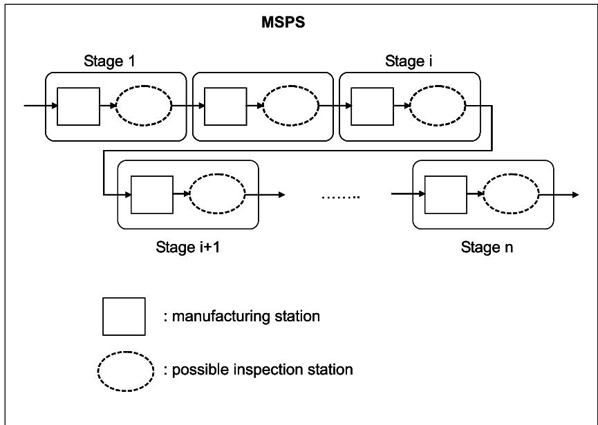
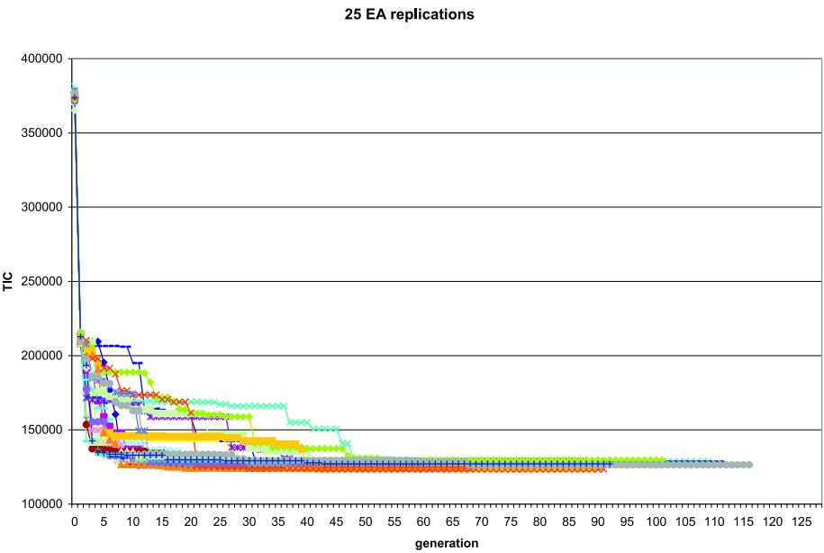

# An Evolutionary Algorithm and Discrete Event Simulation for Optimizing Inspection Strategies for Multi-Stage Processes

Sofie Van Volsem

Department of Environment, Technology and Technology Management

University of Antwerp, Belgium

sofie.vanvolsem@ua.ac.be

Wout Dullaert

Institute of Transport and Maritime Management Antwerp

University of Antwerp, Belgium

wout.dullaert@ua.ac.be

Rik Van Landeghem

Department of Industrial Management

Ghent University, Belgium

hendrik.vanlandeghem@ugent.be

## June 2004

## Abstract

The problem of determining the optimal inspection strategy for a given multi-stage production process, i.e. the inspection strategy that results in the lowest total inspection cost, while still assuring a required output quality, is modelled as a joint optimization of inspection location, type and inspection limits. A fusion between a discrete event simulation to model the multi-stage process subject to inspection and to calculate the resulting inspection costs, and an evolutionary algorithm (EA) to optimize the inspection strategies, is suggested.

## Keywords

Inspection Allocation, Quality Economics, Evolutionary Algorithm, Discrete Event Simulation

## Acknowledgement

The authors wish to thank K. S¨orensen for the constructive comments that helped to improve the presentation of the paper.

## 1 Introduction

The strategic importance of total quality management has become generally accepted. Improving the quality of products, processes and services is nowadays a key issue in many organizations to improve -or at least maintain- profitability, market share and competitiveness.

In a production environment, reducing variance is the major key to achieve quality. It is pursued along diferent paths in design and operation of a production process. The implementation of an eficient inspection strategy is one of those paths. Eficient economic inspection strategies ensure the required output quality while minimizing the total inspection cost. Generally speaking, more and tighter inspection will induce a higher product quality –in terms of meeting product specifications– but will also result in higher costs of inspection, scrap and rework. An economic inspection plan will balance these efects.

For a single stage production process, the extent of inspection refers to the number of inspections executed (sample size and sampling frequency) and to the rigor of the inspections (acceptance limits). Thus, the problem facing the inspection planner consists of finding the combination of these inspection parameters that minimizes the total expected inspection cost T IC.

For multi-stage production processes, an additional decision variable is added to the problem: the number and location of inspection stations in the production process. For an n-stage process, it is to be decided for each of the n stages whether or not inspection will be performed after that process stage, and if so, to what extent (i.e. which inspection parameters to be used).

Thus, in a multi-stage production system (MSPS) the inspection strategy addresses

1. the number and location of inspection stations;

2. the number of inspections executed (sample size - sampling frequency) for each inspection station;

3. the rigor of the inspections (acceptance limits) for each inspection station.

Determining the optimal inspection strategy in a MSPS involves these three types of inspection decision variables to be considered together, resulting in a complex joint optimization problem. While separate optimization of each type of decision variable has been studied extensively and is well established in literature (see e.g. the seminal papers of Lindsay and Bishop (1964); White (1969); Britney (1972); Eppen and Hurst (1974); Ballou and Pazer (1982) and the overview by Raz (1986)), the joint problem has not been subject to intense research. The literature review in the next Section illustrates that –to the best of the authors’ knowledge– no attempt has been made to simultaneously optimize the location of inspection stations and their inspection limits. By embedding a discrete event simulation (DES) to model the serial n-stage MSPS in an evolutionary algorithm (EA) to perform the numerical optimization, this paper attempts at ofering a joint inspection optimization method. For a serial n-stage MSPS with a single quality characteristic, this methodology will allow the simultaneous determination of the inspection decision (no inspection (N), sampling inspection (S), and full inspection (F)), and the inspection limits, for each of the n process stages, so that the expected total inspection cost (TIC) is minimal.

The paper is organized as follows. After reviewing the literature in Section 2, the serial n-stage MSPS environment and the cost model are described in Section 3. In Section 4 the solution approach is proposed. A numerical example is presented in Section 5, Section 6 concludes and ofers suggestions for further research.

## 2 Literature review

Villalobos et al. (1993) present a model for (automated) inspection strategies for production of printed circuit boards. The idea is to impose a dynamic inspection strategy based on information on the manufacturing and inspection process, and a global objective (e.g. minimal cost or minimal scrap). After each manufacturing stage and for each unit produced, a decision is taken on whether or not to remove the unit from production, and whether or not it should be inspected. In the Villalobos et al. (1993) model, the extent of inspection of the overall production process is limited by time: each possible inspection operation takes a fixed amount of time, and the fixed amount of total available inspection time is to be allocated among all inspection stations. This way, the problem becomes one of optimal control of a dynamic Markov process under time constraints. The Markov chain structure and transition matrix are subsequently derived.

In Barad and Braha (1996) and Emmons and Rabinowitz (2002) it is assumed that an inspection is made at each production stage, so there is no problem of allocating (a limited number of) inspection facilities to production stations. The former address the problem of finding the optimal (limits for the) input quantity in each stage, while the latter focus on the assignment and scheduling of inspection tasks. The model of Barad and Braha (1996) (also set in the microelectronics industry) is essentially an optimal lot sizing problem in a MSPS with binomial yield and deterministic demand. After each production stage, a 100% reliable inspection is performed, so that all defective units are discarded. The solution to the problem consists of deciding on the number of products to process in the next stage, in order to try and meet the demand for non-defective finished units, at the lowest cost. There are three alternatives: processing all available non-defective units, processing less than available nondefective units by disposal (at a per unit cost) of some, and processing more than available non-defective units by reworking some of the defective units or by purchasing the necessary semi-finished units (also at a per unit cost). A dynamic programming approach is suggested to define the optimal policy, both for single and multiple production runs.

Emmons and Rabinowitz (2002) address an inspection system for detecting malfunctioning processors in a MSPS: a processor (a stage in the MSPS) can either be up (designating proper function) or down (designating malfunction). When a stage is down, each unit processed at that stage acquires a defect, when a stage is up, no unit does. A finished product is conforming if and only if it has not acquired a single defect. Inspection is there to detect stages as down, leading to immediate restoration of the detected down stage to up. Perfect inspection is assumed, the impact of imperfect inspection is accounted for in Rabinowitz and Yahalom (2001). The inspection system comprises several subsystems of single inspection facilities (IFs) responsible for inspecting a subset of production stages. In this setting three decisions are to be made: total inspection capacity (the number of IFs required), assignment of the stages to the IFs and inspection schedules in each subsystem. These three decisions are hierarchically structured, and thus solved through a hierarchical process. First, the inspection capacity is determined by solving a relaxed version of the base problem. The partition of the stages among the IFs is then determined by considering the inspection capacity from step 1 as the capacity of a multi-knapsack (bin packing) problem. Finally the inspection schedule for each subsystem is derived.

The model by Bai and Yun (1996) allows inspection efort allocation in a serial multi-stage production system (MSPS) for a product consisting of identical components. In this model, only a limited number of (automatic) inspection machines are available, and the rate of production is constrained by the rate of inspection. The inspection level is defined as the proportion of components inspected. An inspection cost model is proposed and a method is constructed to determine optimal location of inspection machines and optimal inspection level. An exact search algorithm considering all possible allocations is proposed for problems in which the number of stages h and the number of inspection machines m is relatively small. For larger problems a heuristic algorithm using backward dynamic programming is suggested.

## 3 Model formulation

## 3.1 The serial multi-stage production system

Consider a serial MSPS in which products travel sequentially from stage 1 to stage n and inspection of products is performed by k $( k \leq n )$ inspection stations (see Figure 1). At each stage, a manufacturing operation is performed on the products, before moving on to an inspection station, or to the processing station of the next stage in case of no inspection.

After each of the processing stations, one of three inspection options can be chosen: no inspection (N), full inspection (F), or sampling inspection (S). The first option, no inspection (N), obviously does not necessitate any further inspection decision. If full inspection (F) is chosen, inspection limits subsequently have to be determined. Finally, the sampling inspection option (S), requires a decision on the inspection limits, and the (single) sampling scheme parameters: the sample size and acceptance number.

In any MSPS, three types of parameters can be distinguished: process parameters, inspection parameters and cost parameters. When using the model to optimize the overall inspection strategy, only the inspection parameters are considered endogenous (as they can be changed in the inspection strategy optimization process), while the cost and process parameters are exogenous because they cannot be changed for inspection strategy optimization purposes.

  
Fig. 1: a serial n-stage MSPS

Prior to further model development the following notations are adopted.

<div class="mineru-algorithm" style="white-space: pre-wrap; font-family:monospace;">
$K =$ batchsize  
$n =$ number of process stages  
$X_{i} =$ inspection option for stage $i$, i.e. $X_{i} \in \{F, N, S\}$ $p_{i}' =$ fault occurrence in stage $i$ $LIL_{i} =$ lower inspection limit in stage $i$ (variable)  
$UIL_{i} =$ upper inspection limit in stage $i$ (variable)  
$LS_{n} =$ lower specification limit after stage $n$ (fixed)  
$US_{n} =$ upper specification limit after stage $n$ (fixed)  
$s_{i} =$ sample size for stage $i$ $t_{i} =$ acceptance number for stage $i$ $l_{i} =$ number of bad items in sample of stage $i$ $d_{i} =$ number of bad items after stage $i$ $c_{T,i} =$ unit test cost in stage $i$ $c_{R,i} =$ unit rework cost in stage $i$ $c_{P} =$ unit penalty cost (after stage $n$)  
$TC_{i} =$ test cost in stage $i$ $RC_{i} =$ rework cost in stage $i$
</div>

```txt
TTC = total test cost  
TRC = total rework cost  
TPC = total penalty cost  
TIC = total inspection cost
```

Consider a constant production and inspection rate, perfect inspection and perfect rework. Three types of cost are defined: test costs $\left( c _ { T } \right)$ , rework costs $\left( c _ { R } \right)$ and the penalty cost $\left( c _ { P } \right)$ . Test cost is the cost of a single test or analysis. Rework or replacement costs are incurred if a defective product is discovered through testing, and reworked or replaced by a non-defective product. The penalty cost is incurred when a defective product is shipped to the customer. In the MSPS, product is defective whenever the value of its quality characteristic in stage i lies outside its inspection limits, i.e. outside the interval $\left[ L I L _ { i } , U I L _ { i } \right]$ MSPS output (after the last stage n) is defective if the value of the quality characteristic is not contained in the specification interval $[ L S _ { n } , U S _ { n } ]$

The fault occurrence $p _ { i } ^ { \prime }$ is the fraction of defective products in stage i. Because the inspection limits $\left( L I L _ { i } , U I L _ { i } \right)$ are independent variables of the inspection optimization problem under consideration, the fault occurrence $p _ { i } ^ { \prime }$ will be a dependent variable. For a single production stage, its value can be calculated using standard statistics, if the distribution of the quality characteristic value is known, and the $L I L$ and UIL for the stage are chosen. Also for the first stage of a MSPS, $p _ { 1 } ^ { \prime }$ can be calculated this way. For the following stages $i ( i = 2 , . . . , n )$ however, the fault occurrence $p _ { i } ^ { \prime }$ not only depends on the choice of inspection limits $\left( L I L _ { i } , U I L _ { i } \right)$ ), but also on the inspection strategy chosen in the previous stage(s).

Because it would be uneconomical to inspect a product if this were more expensive than reworking or replacing it, $c _ { T , i } < c _ { R , i } , \forall i$ . Moreover, we assume that $c _ { R , i } < c _ { R , j } , \forall i < j$ . This assumption avoids having to introduce separate intermediate penalty costs: the penalty cost of detecting a defect only in stage $j ,$ instead of earlier in stage i, is implicitly derived as $c _ { R , j } - c _ { R , i }$ . Furthermore it is assumed that if a batch is rejected after acceptance sampling inspection ${ \mathrm { S } } ,$ a full inspection F of the rejected batch is performed consecutively in the same stage.

## 3.2 Determination of the TIC

Determining the T IC is now straightforward:

$$
T I C \quad = T T C + T R C + T P C\tag{1}
$$

$$
T T C \quad = \quad \sum_ {i = 1} ^ {n} T C _ {i}\tag{2}
$$

$$
T R C \quad = \quad \sum_ {i = 1} ^ {n} R C _ {i}\tag{3}
$$

$$
T P C \quad = c _ {P}. d _ {n}\tag{4}
$$

$$
\mathrm{andwith}
$$

$$
T C _ {i} \qquad = \qquad \left\{ \begin{array}{l l} c _ {T, i}. s _ {i} & \forall i: (X _ {i} = S) \wedge (l _ {i} \leq t _ {i}) \\ 0 & \forall i: X _ {i} = N \end{array} \right.\tag{5}
$$

$$
R C _ {i} \qquad = \qquad \left\{ \begin{array}{l l} c _ {R, i}. p _ {i} ^ {\prime}. K & \forall i: (X _ {i} = F) \lor ((X _ {i} = S) \land (l _ {i} > t _ {i})) \\ 0 & \forall i: (X _ {i} = N) \lor ((X _ {i} = S) \land (l _ {i} \leq t _ {i})) \end{array} \right.\tag{6}
$$

Determining the optimal inspection strategy, i.e. the whole of inspection decisions that minimize the $T I C .$ , requires the determination of inspection options $X _ { i }$ and the corresponding inspection limits $\left( L I L _ { i } , U I L _ { i } \right)$ and sampling parameters $( s _ { i } , t _ { i } )$ , for all stages $i = 1 , . . . , n$ . Solving this optimization problem consists of finding the set of optimal values

$$
(X _ {1} ^ {*}, \dots , X _ {n} ^ {*}; L I L _ {1} ^ {*}, \dots , L I L _ {n} ^ {*}; U I L _ {1} ^ {*}, \dots , U I L _ {n} ^ {*}; s _ {1} ^ {*}, \dots , s _ {n} ^ {*}; t _ {1} ^ {*}, \dots , t _ {n} ^ {*})\tag{7}
$$

that minimize

$$
T I C (X _ {1},..., X _ {n}; L I L _ {1},..., L I L _ {n}; U I L _ {1},..., U I L _ {n}; s _ {1},..., s _ {n}; t _ {1},..., t _ {n})\tag{8}
$$

The evolutionary algorithm suggested in Section 4.2 will decide on the inspection option $X _ { i }$ and the inspection limits $\left( L I L _ { i } , \ U I L _ { i } \right)$ , for each process stage i, but does not yet include the setting of sampling parameters $\left( \boldsymbol { s } _ { i } , \ t _ { i } \right)$ ， these are considered fixed $( s _ { i } = 5 , t _ { i } = 1 , \forall i )$ . In concurrent work, the algorithm is extended to include variable sampling parameter setting. The current algorithm returns the set

$$
(X _ {1} ^ {*}, \dots , X _ {n} ^ {*}; L I L _ {1} ^ {*}, \dots , L I L _ {n} ^ {*}; U I L _ {1} ^ {*}, \dots , U I L _ {n} ^ {*})\tag{9}
$$

that minimize

$$
T I C (X _ {1}, \dots , X _ {n}; L I L _ {1}, \dots , L I L _ {n}; U I L _ {1}, \dots , U I L _ {n})\tag{10}
$$

## 4 Solution approach

## 4.1 Discrete event simulation to calculate TIC

Simulation is used to study processes that are too complex to permit analytical model formulation and/or evaluation. The complexity can be due to the size of the problem, the interactions between its subproblems, the inherent randomness of the problem, or a combination of these factors.

It is clear that T IC discussed in the previous Section refers to a single production batch. Of course, the inspection planner should not rely on just a single problem instance (i.e. one batch) to decide which strategy is the best. Diferent inspection strategy solutions should be evaluated over a number of problem instances to take into account the inherent stochastic properties of the production process. In this paper, each candidate solution is evaluated based on the average T IC from 50 simulated production batches.

## 4.2 An Evolutionary Algorithm to determine the optimal inspection strategy

## Introduction

To explore the use of metaheuristics for determining the optimal inspection strategy, a simple Evolutionary Algorithm (EA) is presented. Evolutionary (or Genetic) Algorithms are adaptive heuristic search methods based on population genetics. The basic concepts were developed by Holland (1975) and were forged into a problem solving methodology for complex optimization problems by De Jong (1975) and Goldberg (1989). The name evolutionary originates from the analogy of the heuristic with Darwin’s theory on natural selection. In selective breeding, ofspring are sought which have certain desirable characteristics, determined at the genetic level by combination of the parents’ chromosomes. In a similar way, in seeking better solutions, EA’s combine pieces of existing solutions. Thereto, in an EA, a solution to a problem is first encoded as a chromosome, and new generations of ofspring are generated through an iteration process until some convergence criteria are met. The best chromosome generated is then decoded, providing the corresponding solution.

There are four main parts in the EA paradigm, namely the problem representation and initiation, the objective function evaluation (fitness calculation), the parent selection, and the actual evolutionary reproduction of candidate solutions.

## Problem representation and initiation

Every proposed solution is represented by a vector of the independent variables (inspection decision variables), coded as a chromosome constituted by as many genes as the number of independent variables.

Every candidate solution to the inspection optimization problem considered thus is a set $( X _ { 1 } , . . . , X _ { n } ; L I L _ { 1 } , . . . , L I L _ { n } ; U I L _ { 1 } , . . . , U I L _ { n } )$ , which can be denoted as an array of n characters $X _ { i } ,$ each character associated with the two inspection limits $\boldsymbol { L I L _ { i } }$ and $U I L _ { ; }$ <sub>i</sub> for the corresponding stage. For example the vector

$$
\left[ \begin{array}{c c c c} F _ {9. 1} ^ {1 0. 9} & N _ {1 8. 2} ^ {2 1. 8} & S _ {2 7. 7} ^ {3 2. 3} & F _ {3 7. 3} ^ {4 2. 7} \end{array} \right]
$$

denotes a 4-stage MSPS with full inspection in the first and last stage, no inspection<sup>1</sup> in the second stage, and sampling inspection in the third stage.

From the corresponding numbers, we read that inspection is performed between the limits 9.1 and 10.9 for the first stage, and so on for the other stages.

The basic idea is to start of with a population of M possible solutions to the problem. In the proposed EA, we use a population size M of 50. From this pool of initial solutions, some are selected (parents) to construct new solutions (children). The generation of the initial population is performed as follows: a first initial solution is read in, consisting of all $\mathrm { N } \mathrm { s } ,$ , and initial inspection limits. We assume symmetrical inspection limits, i.e. the expected value in each stage i is the arithmetic average of $\left( L I L _ { i } , U I L _ { i } \right)$ . The construction algorithm for the initial population consists in randomizing the characters, and randomizing the limits by allowing (symmetrical) variation from the original limits by a certain user defined percentage (5% is applied in the calculated case example of Section 5).

## Objective function evaluation (fitness calculation)

For every candidate solution its fitness as a possible parent has to be evaluated, where fitness refers to measure of profit or goodness to be maximized while exploring the solution space. A naive choice is simply to use the value of the objective function for each candidate solution, but this is rarely a good idea, as it often leads to premature convergence to a poor local optimum (Reeves, 1993, pg. 168). This problem can be mitigated using some scaling procedure. Diferent procedures are proposed and investigated in literature. We use a scaling procedure which ensures that the fitness values are all in [0, 1], and their sum is 1. This property allows us to set the probability of selecting a solution as a parent directly equal to its fitness value, so no additional conversion from fitness value to parent selection probability is required.

The fitness value f for each solution $j$ in a population of M solutions is calculated as follows: in a first step, a provisional fitness value v is calculated.

$$
v _ {j} = \frac {\sum_ {j = 1} ^ {M} T I C _ {j}}{T I C _ {j}}\tag{11}
$$

This way, a smaller (better) T IC will result in a higher provisional fitness value. After all provisional fitness values for the entire population are calculated, the actual fitness value for each solution is calculated as:

$$
f _ {j} = \frac {v _ {j}}{\sum_ {j = 1} ^ {M} v _ {j}}\tag{12}
$$

## Parent selection

Parent selection for producing ofspring is done as in Holland’s original Genetic Algorithm, i.e. for each reproduction two parents are chosen: one parent is selected on a fitness basis, the other is chosen randomly. The idea behind this scheme is that in doing this, the parent chosen for its fitness ensures genetic quality, while the random parent ensures genetic diversity.

Obviously, a proper balance between genetic quality and diversity is required within the population in order to ensure eficient search. This is dealt with through careful selection of the population related factors at the outset of the EA: population size, selection of the initial population, fitness calculation, crossover and mutation operators.

## Reproduction

The reproduction process makes use of the genes of the selected parents to produce ofspring that will make up the next generation. The reproduction operators exchange segments of the parents to build one or two children. The most common way to perform this exchange is as follows: a single crossover point X is chosen randomly; the children are then constructed as the pre-X section from one parent followed by the post-X section of the other. After construction of the children, mutation can be used to randomly modify genes of a single individual to further explore the solution space and to preserve genetic diversity. The occurrence of mutation is usually associated with a low probability. The one or two children are added to the new generation. After filling the entire new population with children (new solutions), this generation of solutions can replace the previous one entirely or partially, a population size of M being maintained throughout the course of the algorithm.

In our algorithm, the new generation consists of M − 1 children, the $M ^ { t h }$ solution in the next generation population is the best solution from the previous generation. Generating ofspring is performed in two consecutive steps: first crossover (with the crossover operators described below) is applied, then the inspection limits are adapted. After these two steps, reproduction is completed and the children thus obtained can populate the new generation. This way, the simultaneous determination of inspection option and inspection limits can be achieved. The inspection limits’ adaptation is implemented analogous to the randomization of the limits used in the construction algorithm: we allow the children’s inspection limits to deviate from the parents’ limits by a certain user defined percentage (5% is applied). The maximum number of generations is set to 500, if no improvement is found after 50 generations, the EA is interrupted.

Our standard crossover operator randomly selects a crossover point, and constructs two new solutions by exchanging the tails (the whole of characters and limits) of both parents. An example for a six-stage MSPS and 2 as crossover point:

$$
\text {Parent 1:} \left[ \begin{array}{c c c c c c} F _ {9. 1} ^ {1 0. 9} & N _ {1 8. 2} ^ {2 1. 8} & S _ {2 7. 7} ^ {3 2. 3} & F _ {3 7. 3} ^ {4 2. 7} & S _ {4 6. 5} ^ {5 3. 5} & F _ {5 6. 0} ^ {6 4. 0} \end{array} \right]
$$

$$
\text {Parent 2:} \left[ N _ {9. 3} ^ {1 0. 7} F _ {1 8. 0} ^ {2 2. 0} F _ {2 7. 6} ^ {3 2. 4} S _ {3 7. 5} ^ {4 2. 5} N _ {4 6. 9} ^ {5 3. 1} S _ {5 6. 5} ^ {6 4. 5} \right]
$$

$$
\text {Child 1:} \left[ \begin{array}{c c c c c c} F _ {9. 1} ^ {1 0. 9} & N _ {1 8. 2} ^ {2 1. 8} & F _ {2 7. 6} ^ {3 2. 4} & S _ {3 7. 5} ^ {4 2. 5} & N _ {4 6. 9} ^ {5 3. 1} & S _ {5 6. 5} ^ {6 4. 5} \end{array} \right]
$$

$$
\text {Child 2:} \left[ N _ {9. 3} ^ {1 0. 7} \quad F _ {1 8. 0} ^ {2 2. 0} \quad S _ {2 7. 7} ^ {3 2. 3} \quad F _ {3 7. 3} ^ {4 2. 7} \quad S _ {4 6. 5} ^ {5 3. 5} \quad F _ {5 6. 0} ^ {6 4. 0} \right]
$$

Instead of mutation, inversion is used (see Reeves (1993, pg. 173)). It is applied through two reverse crossover operators, associated with a low probability (3% is applied).

\- reverse head crossover operator: This operator randomly chooses a crossover point (we will take 4 as example, and the same parents as above), and constructs two new solutions by exchanging the reversed heads (in reversing, only the characters, not the limits are reversed) of both parents.

$$
\text {Child 1:} \left[ \begin{array}{c c c c c c} S _ {9. 3} ^ {1 0. 7} & F _ {1 8. 0} ^ {2 2. 0} & F _ {2 7. 6} ^ {3 2. 4} & N _ {3 7. 5} ^ {4 2. 5} & S _ {4 6. 5} ^ {5 3. 5} & F _ {5 6. 0} ^ {6 4. 0} \end{array} \right]
$$

$$
\text {   Child   2:   } \left[ \begin{array}{c c c c c c} F _ {9. 1} ^ {1 0. 9} & S _ {1 8. 2} ^ {2 1. 8} & N _ {2 7. 7} ^ {3 2. 3} & F _ {3 7. 3} ^ {4 2. 7} & N _ {4 6. 9} ^ {5 3. 1} & S _ {5 6. 5} ^ {6 4. 5} \end{array} \right]
$$

\- reverse tail crossover operator: This operator randomly chooses a crossover point (4 as example, same parents as above), and constructs two new solutions by exchanging the reversed tails (in reversing, only the characters, not the limits are reversed) of both parents.

$$
\begin{array}{l} \text {Child 1:} \left[ \begin{array}{c c c c c c} F _ {9. 1} ^ {1 0. 9} & N _ {1 8. 2} ^ {2 1. 8} & S _ {2 7. 7} ^ {3 2. 3} & F _ {3 7. 3} ^ {4 2. 7} & S _ {4 6. 9} ^ {5 3. 1} & N _ {5 6. 5} ^ {6 4. 5} \end{array} \right] \\ \text {Child 2:} \left[ \begin{array}{c c c c c c} N _ {9. 3} ^ {1 0. 7} & F _ {1 8. 0} ^ {2 2. 0} & F _ {2 7. 6} ^ {3 2. 4} & S _ {3 7. 5} ^ {4 2. 5} & F _ {4 6. 5} ^ {5 3. 5} & S _ {5 6. 0} ^ {6 4. 0} \end{array} \right] \end{array}
$$

## 5 Computational testing

Since –to the best of the authors’ knowledge– no standard test cases exist in literature, a fictitious six stage serial MSPS was constructed, representing a stack-up assembly operation, with the product dimension the quality characteristic under attention. Mathematically speaking, this comes down to performing an addition in each stage (the component added in each stage adds to the overall dimension). In Table 1 the process characteristics are shown. We used a combination of normal and uniform distributions to describe the dimensional characteristic of the components added in each stage. For normal distributions the parameters 1 and 2 designate the distribution’s mean and standard deviation, for uniform distributions the parameters designate the lower and upper boundary of the interval.

Tab. 1: Process characteristics

<table><tr><td>stage</td><td>distribution</td><td>parm. 1</td><td>parm. 2</td><td>exp. value</td></tr><tr><td>1</td><td>normal</td><td>10</td><td>0.3</td><td>10</td></tr><tr><td>2</td><td>normal</td><td>10</td><td>0.5</td><td>20</td></tr><tr><td>3</td><td>uniform</td><td>8.5</td><td>11.5</td><td>30</td></tr><tr><td>4</td><td>normal</td><td>10</td><td>0.1</td><td>40</td></tr><tr><td>5</td><td>normal</td><td>10</td><td>0.5</td><td>50</td></tr><tr><td>6</td><td>uniform</td><td>9</td><td>11</td><td>60</td></tr></table>

The parameters used in the cost model are shown in Table 2. The penalty cost $c _ { P }$ is set at 3000; to conform, the final products’ dimension should be in the interval $[ L S _ { 6 } , U S _ { 6 } ] = [ 5 8 , 6 2 ]$ . A batchsize $K = 1 0 0 0$ is assumed. As discussed in Section 3.1, these sets of parameters (process parameters and cost parameters) are exogenous to the inspection optimization problem. They do, however, influence the T IC and thus the outcome of the optimization process (for more details, see Van Volsem (2002) and Van Volsem and Van Landeghem (2003)).

To test the EA for convergence, it was executed 25 times. This yielded minimal TIC’s ranging from 123492 to 128763, or a maximum 4% diference. The corresponding solution vectors are shown in Table 3, together with the number of generations and computing time necessary to find that solution (note that this number includes 50 generations of no improvement). The EA is coded in the C++ programming language, a PC with a 2.53 GHz processor was used for program calculation. As the code is not optimized for speed, the indicated computation times are only of secondary importance.

Tab. 2: Cost parameters

<table><tr><td>stage</td><td>Test Cost</td><td>Rework Cost</td></tr><tr><td>1</td><td>1</td><td>50</td></tr><tr><td>2</td><td>1</td><td>100</td></tr><tr><td>3</td><td>2</td><td>200</td></tr><tr><td>4</td><td>1</td><td>400</td></tr><tr><td>5</td><td>1</td><td>800</td></tr><tr><td>6</td><td>2</td><td>1600</td></tr></table>

Figure 2 shows the apparent conversion from the $6 8 ^ { \mathrm { t h } }$ generation on. From the results Table 3 the EA’s convergence can be confirmed: it can be seen that all 25 solutions are of the same form $N N F X X F .$ with $X \in \{ S , N \}$ (the indiference between S and N in stages 4 and 5 is discussed below). Moreover, the inspection limits $L I L _ { 3 } , U I L _ { 3 }$ and $L I L _ { 6 } , U I L _ { 6 }$ , corresponding with the stages where full inspection F is applied, are in the same range in each case.

  
Fig. 2: TIC as a function of generation number, for 25 replications of the EA

In the first two stages, no inspection N is opted for. This means the cost avoidance of detecting defective products already in stages 1 or 2 does not outweigh the costs of performing full inspection in these stages. This can be explained considering the relatively low rework costs compared to the test costs in these stages.

In stages 3 and 6, full inspection F is selected. For stage 6 this entails avoidance of penalty costs. Indeed, the inspection limits $L I L _ { 6 } , U I L _ { 6 }$ selected by the EA, almost coincide with the specification limits $L S _ { 6 } , U S _ { 6 }$ (maximum diference = ± 0.051 or less than 0.1%). The choice for full inspection in stage 3 implies that the cost avoidance through detecting defective products outweighs the incurred test costs. The choice of inspection limits $L I L _ { 3 } , U I L _ { 3 }$ will balance both cost aspects.

Tab. 3: Solutions

<table><tr><td colspan="7">solution vector</td><td>TIC</td><td>gen.</td><td>time</td></tr><tr><td>1</td><td colspan="6"> $\begin{bmatrix} N & N & F_{28.907}^{31.093} & S_{38.745}^{41.255} & N & F_{58.015}^{61.985} \end{bmatrix}$ </td><td>126851</td><td>65</td><td>1h20&#x27;</td></tr><tr><td>2</td><td colspan="6"> $\begin{bmatrix} N & N & F_{28.771}^{31.229} & S_{38.157}^{41.843} & S_{48.581}^{51.419} & F_{58.018}^{61.982} \end{bmatrix}$ </td><td>126882</td><td>91</td><td>2h42&#x27;</td></tr><tr><td>3</td><td colspan="6"> $\begin{bmatrix} N & N & F_{28.771}^{31.229} & N & N & F_{58.002}^{61.998} \end{bmatrix}$ </td><td>126894</td><td>102</td><td>2h56&#x27;</td></tr><tr><td>4</td><td colspan="6"> $\begin{bmatrix} N & N & F_{28.869}^{31.131} & N & S_{43.127}^{56.873} & F_{57.968}^{62.032} \end{bmatrix}$ </td><td>128687</td><td>110</td><td>3h01&#x27;</td></tr><tr><td>5</td><td colspan="6"> $\begin{bmatrix} N & N & F_{28.875}^{31.125} & N & N & F_{58.016}^{61.984} \end{bmatrix}$ </td><td>128763</td><td>88</td><td>2h20&#x27;</td></tr><tr><td>6</td><td colspan="6"> $\begin{bmatrix} N & N & F_{28.820}^{31.180} & N & S_{44.359}^{55.641} & F_{57.993}^{62.007} \end{bmatrix}$ </td><td>124325</td><td>75</td><td>1h59&#x27;</td></tr><tr><td>7</td><td colspan="6"> $\begin{bmatrix} N & N & F_{28.798}^{31.202} & N & N & F_{57.975}^{62.025} \end{bmatrix}$ </td><td>127170</td><td>63</td><td>1h27&#x27;</td></tr><tr><td>8</td><td colspan="6"> $\begin{bmatrix} N & N & F_{28.645}^{31.355} & S_{38.448}^{41.552} & N & F_{57.991}^{62.009} \end{bmatrix}$ </td><td>128611</td><td>82</td><td>2h16&#x27;</td></tr><tr><td>9</td><td colspan="6"> $\begin{bmatrix} N & N & F_{28.840}^{31.160} & N & N & F_{57.990}^{62.010} \end{bmatrix}$ </td><td>126352</td><td>58</td><td>1h18&#x27;</td></tr><tr><td>10</td><td colspan="6"> $\begin{bmatrix} N & N & F_{28.843}^{31.157} & N & S_{47.230}^{52.770} & F_{58.002}^{61.998} \end{bmatrix}$ </td><td>123549</td><td>83</td><td>2h11&#x27;</td></tr><tr><td>11</td><td colspan="6"> $\begin{bmatrix} N & N & F_{28.920}^{31.080} & N & N & F_{58.012}^{61.988} \end{bmatrix}$ </td><td>127310</td><td>92</td><td>2h40&#x27;</td></tr><tr><td>12</td><td colspan="6"> $\begin{bmatrix} N & N & F_{28.910}^{31.090} & N & N & F_{58.009}^{61.991} \end{bmatrix}$ </td><td>126522</td><td>83</td><td>2h36&#x27;</td></tr><tr><td>13</td><td colspan="6"> $\begin{bmatrix} N & N & F_{28.810}^{31.190} & N & N & F_{58.004}^{61.996} \end{bmatrix}$ </td><td>123820</td><td>73</td><td>1h51&#x27;</td></tr><tr><td>14</td><td colspan="6"> $\begin{bmatrix} N & N & F_{28.765}^{31.235} & S_{37.277}^{42.723} & S_{46.060}^{53.940} & F_{57.989}^{62.011} \end{bmatrix}$ </td><td>125839</td><td>68</td><td>1h36&#x27;</td></tr><tr><td>15</td><td colspan="6"> $\begin{bmatrix} N & N & F_{28.830}^{31.170} & N & S_{48.287}^{51.713} & F_{58.015}^{61.985} \end{bmatrix}$ </td><td>126069</td><td>60</td><td>1h31&#x27;</td></tr><tr><td>16</td><td colspan="6"> $\begin{bmatrix} N & N & F_{28.763}^{31.237} & S_{38.779}^{41.221} & N & F_{57.994}^{62.006} \end{bmatrix}$ </td><td>123883</td><td>64</td><td>1h31&#x27;</td></tr><tr><td>17</td><td colspan="6"> $\begin{bmatrix} N & N & F_{28.870}^{31.130} & N & N & F_{58.000}^{62.000} \end{bmatrix}$ </td><td>123894</td><td>68</td><td>1h39&#x27;</td></tr><tr><td>18</td><td colspan="6"> $\begin{bmatrix} N & N & F_{28.793}^{31.207} & S_{38.032}^{41.968} & N & F_{57.988}^{62.012} \end{bmatrix}$ </td><td>124670</td><td>86</td><td>2h00&#x27;</td></tr><tr><td>19</td><td colspan="6"> $\begin{bmatrix} N & N & F_{28.904}^{31.096} & N & S_{40.620}^{59.380} & F_{58.051}^{61.949} \end{bmatrix}$ </td><td>124093</td><td>89</td><td>2h23&#x27;</td></tr><tr><td>20</td><td colspan="6"> $\begin{bmatrix} N & N & F_{28.738}^{31.262} & N & S_{47.324}^{52.676} & F_{57.993}^{62.007} \end{bmatrix}$ </td><td>124410</td><td>68</td><td>1h38&#x27;</td></tr><tr><td>21</td><td colspan="6"> $\begin{bmatrix} N & N & F_{28.792}^{31.208} & N & N & F_{57.999}^{62.001} \end{bmatrix}$ </td><td>123492</td><td>91</td><td>2h06&#x27;</td></tr><tr><td>22</td><td colspan="6"> $\begin{bmatrix} N & N & F_{29.020}^{30.980} & N & S_{46.566}^{53.434} & F_{58.012}^{61.988} \end{bmatrix}$ </td><td>127899</td><td>62</td><td>1h27&#x27;</td></tr><tr><td>23</td><td colspan="6"> $\begin{bmatrix} N & N & F_{28.740}^{31.260} & N & N & F_{58.021}^{61.979} \end{bmatrix}$ </td><td>126442</td><td>117</td><td>3h12&#x27;</td></tr><tr><td>24</td><td colspan="6"> $\begin{bmatrix} N & N & F_{28.821}^{31.179} & S_{36.385}^{43.615} & S_{46.677}^{53.323} & F_{57.977}^{62.023} \end{bmatrix}$ </td><td>127066</td><td>92</td><td>2h33&#x27;</td></tr><tr><td>25</td><td colspan="6"> $\begin{bmatrix} N & N & F_{28.918}^{31.082} & N & S_{46.460}^{53.540} & F_{58.009}^{61.991} \end{bmatrix}$ </td><td>125902</td><td>60</td><td>1h33&#x27;</td></tr></table>

The fact that there is no clear discrimination between N and S inspection in stages 4 and 5, can be attributed to the full inspection F in stage 3. Seeing this provides stage 4 with an input of 0% defectives, and considering the low added variance of the production operation in stage 4, it can be argued that the fault occurrence in stage 5 will still be close to 0%. This means that in stages 4 and 5 there will be very few defectives, reducing the need for (sampling) inspection. Performing sampling inspection S will thus not be advantageous compared to performing no inspection N. On the other hand, it will not be disadvantageous either, because given the relatively small sample size $( s _ { i } = 5 , \forall i )$ , the diferential cost of performing sampling inspection in stages 4 or 5 compared to performing no inspection will not be substantial. This explains the apparent indiference in selecting S or N in stages 4 and 5.

## 6 Conclusions and suggestions for further research

Eficient production quality control is a major issue to manufacturers. Most production processes consist of a sequence of production stages. Each stage (but the last) produces input for the next production stage. As the production processes at each stage are generally stochastic in nature, deviations from product specifications occur, which, without intervention, will accumulate in the course of the production process. Quality inspection only at the last stage would therefore result in a large number of faulty products and high rework and scrap costs.

An optimal inspection strategy for a so-called serial multi-stage production system (MSPS) has to decide on (i) the number and location of inspection stations, (ii) the size of the production fraction subject to inspection (sample size) and (iii) the rigor of the inspections (acceptance limits) at each inspection station that minimize total expected inspection costs.

To our best of knowledge, this paper contains the first attempt at jointly optimizing the number and location of inspection stations, their inspection type and inspection limits (concurrent work includes the sampling parameters). Discrete event simulation is used to model the multi-stage production system subject to inspection and to calculate the resulting inspection costs, an evolutionary algorithm is suggested to optimize the inspection strategies. Computational testing illustrates potential of metaheuristics for optimizing quality inspection.

## References

Bai, D. S. and Yun, H. J. (1996). “Optimal Allocation of Inspection Efort in a Serial Multi-Stage Production System”. Computers and Industrial Engineering, 30(3), pp. 387–396.

Ballou, D. P. and Pazer, H. L. (1982). “The Impact of Inspector Fallibility on the Inspection Policy in Serial Production Systems”. Management Science, 28(4), pp. 387–399.

Barad, M. and Braha, D. (1996). “Control Limits for Multi-Stage Manufacturing Processes with Binomial Yield (Single and Multiple Production Runs)”. Journal of the Operational Research Society, 47, pp. 98–112.

Britney, R. R. (1972). “Optimal Screening Plans for Nonserial Production Systems”. Management Science, 18(9), pp. 550–559.

De Jong, K. A. (1975). An Analysis of the Behaviour of a Class of Genetic Adaptive Systems. Ph.D. thesis, University of Michigan Press.

Emmons, H. E. and Rabinowitz, G. (2002). “Inspection Allocation for Multistage Deteriorating Production Systems”. IIE Transactions, 34, pp. 1031– 1041.

Eppen, G. D. and Hurst, Jr., E. G. (1974). “Optimal Location of Inspection Stations in a Multistage Production Process”. Management Science, 20(8), pp. 1194–1200.

Goldberg, D. (1989). Genetic Algorithms in Search, Optimization, and Machine Learning. Addison Wesley, NY.

Holland, J. H. (1975). Adaptation in Natural and Artificial Systems. University of Michigan Press.

Lindsay, G. F. and Bishop, A. B. (1964). “Allocation of Screening Inspection Efort - a Dynamic Programming Approach”. Management Science, 10(2), pp. 342–352.

Rabinowitz, G. and Yahalom, O. (2001). “Imperfect Inspection of a Multi-Attribute Deteriorating Production System - a Continuous Time Model”. Quality and Reliability Engineering International, 17, pp. 407–418.

Raz, T. (1986). “A Survey of Models for Allocating Inspection Efort in Multistage Production Systems”. Journal of quality technology, 18(4), pp. 239–247.

Reeves, C. R. (1993). Modern Heuristic Techniques for Combinatorial Problems. Blackwell Scientific Publications.

Van Volsem, S. (2002). “Optimizing Inspection Strategies for Multi-Stage Process Chains: A Case Study”. 16th triennial IFORS conference, International Federation of Operational Research Societies.

Van Volsem, S. and Van Landeghem, R. (2003). “Optimizing Inspection Strategies for Multi-Stage Processes: An Exploratory Modelling Framework and Simulation”. 5th international QUALITA conference, Institut de Sˆuret´e Industrielle.

Villalobos, J. R., Foster, J. W., and Disney, R. L. (1993). “Flexible Insepction Systems for Serial Multi-Stage Production Systems”. IIE Transactions, 25(3), pp. 16–26.

White, L. S. (1969). “Shortest Route Models for the Allocation of Inspection Efort on a Production Line”. Manegement Science, 15(5), pp. 249–259.