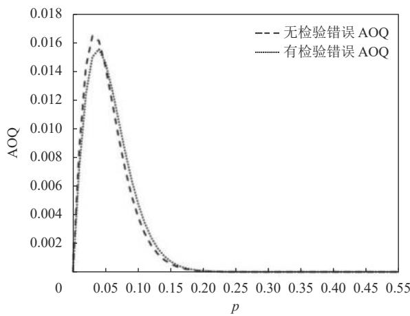
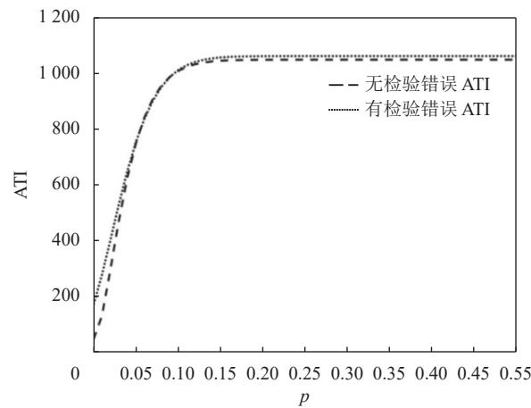

doi: 10.3969/j.issn.1007-7375.2023.04.006

# 基于不完美检验的验收抽样方案经济设计张斌，杨风萍，周筱雯

(南京信息工程大学数学与统计学院，江苏南京 210044)

摘要为降低抽样方案造成的风险及损失，利用误检概率和批产品不合格品率的先验分布，计算了生产方和使用方风险的后验概率。在综合考虑抽检成本、复检成本、误判损失的基础上，构建了一个基于不完美检验的整数非线性规划经济模型，提出了最佳抽样方案，并与无检验错误的抽样方案进行了比较。最后，讨论了模型参数对抽样方案和两类风险的影响。结果表明，在不合格品率较小时，有检验错误的平均检验量相对较大；两者的平均检出质量非常接近，但平均检出质量上限相较无检验错误时略低。

关键词:不完美检验；抽样方案；经济模型；不合格品率中图分类号: O213.1

文献标志码:A

文章编号: 1007-7375(2023)04-0044-08

# Economic Designing of Acceptance Sampling Plans Based on Imperfect Inspection

ZHANG Bin, YANG Fengping, ZHOU Xiaowen

(College of Mathematics and Statistics, Nanjing University of Information Science & Technology, Nanjing 210044, China)

Abstract: In  actual  production  and  sampling  inspection,  due  to  a  variety  of factors,  the  percentage  of nonconforming products is often unknown and random, and inspection errors are also difficult to avoid. In order to reduce the risk and loss caused by sampling plans, the posterior risk probability of manufacturer and users is calculated by using the probability of inspection errors and the prior distribution of nonconforming product ratios in a batch. An integer nonlinear programming economic  model  based  on  imperfect  inspection  is  established  with  a  comprehensive  consideration  of  sampling  cost, reinspection  cost  and  misjudgment  loss.  The  optimal  sampling  plan  is  obtained  and  compared  with  the  sampling  plan without  inspection  errors.  Finally,  the  effects  of model  parameters  on  the  sampling  plan  and  the  two  types  of risks  are discussed.  Results  show  that  the  average  total  inspection  with  inspection  errors  is  relatively  large  when  defective  rate  of products  is  small;  the  average  inspection  quality  of the  two  methods  is  very  close,  but  the  upper  bound  of the  average outgoing quality with inspection errors is slightly lower than that without inspection errors.

Key words: imperfect inspection;  sampling plan;  economic model;  defective rate

验收抽样检验需要根据批产品抽检的质量情况，做出全部接收或拒收该批次产品的决定。由于条件限制和抽样的随机性，很可能会做出误判，从而给生产方和使用方造成经济损失。因此，制定一个经济合理的抽样方案对生产方和使用方利益的保护具有非常重要意义。Banihashemi等[1]基于田口损失函数和平均样本量，提出一种基于过程收益指数的重新提交和多相依状态的抽样方案经济设计方法。Rezaei等[2]将缺陷率划分为3个区间，分别采用不同的检验方案，以降低使用方风险和损失。Yasa等[3]基于TL-G分布，采用时间截断方案，考虑单一和重复两种验收抽样方案。在满足风险约束条件下，得到两种方案的最优参数和最小平均样本数。

当批产品缺陷信息未知时，利用连续生产批的先验信息寻找最佳抽样检验策略可以将预期成本降到最低。Wu等[4]针对不合格品率较低，且抽样不能充分反映批次质量状况的情况，设计一种基于有目标值的过程能力指数的抽样方案。Fernández等[5]用一个广义beta先验模型描述不良品率的随机波动性，并基于生产者和消费者风险，提出一种最优抽样方案的设计方法。Nezhad等[6]通过贝叶斯推断确定批次中不良品数量的概率分布，并对正确决策的概率进行评估。Fernández[7]针对每个抽样项目的不合格数量遵循泊松分布，采用一类广义截断伽马模型来描述过程平均的随机波动，通过求解相应约束最小化问题来确定最佳的单位缺陷验收计划。L等[8]在接收概率函数的参数未知时，利用先验信息，提出一种加速验收抽样计划的贝叶斯设计方法。

在抽样方案优化设计的研究中，一般都是假定检验能够准确获悉产品质量信息，没有考虑检验错误的情况。实际生产环境下，由于受检验条件限制、检验员培训不到位等因素的影响，可能会引起检验误判，即将合格产品被判为不合格品或不合格产品被判为合格品。Khalilpourazari等[9]针对供应批次到货检查时存在两种类型的检查错误，提出一种多产品经济订货数量的经济模型，并对不同求解方法的性能进行评估。Bose等[10]针对质量不完美和检查错误较大的产品制造过程，建立一个在线抽样检验模型。Duffuaa等[11]研究检测错误对多目标优化模型中最佳参数和目标函数值的影响，通过在检测系统中引入测量误差和惩罚措施，以减轻误差的影响。Chun等[12]针对存在不完美检验过程，考虑一种连续多次筛选的问题，提出各种停止规则，并确定最佳筛选次数。Al-Salamah[13]针对生产和检验过程都不完美的情况，建立一个经济生产数量模型，为最佳批量的确定提供决策依据。Guha等[14]在考虑检验误判的情况下，研究破坏性和非破坏性验收抽样的问题。

本文针对不合格品率是随机变量，且存在检验错误的批产品验收过程，利用截断正态分布作为不合格品率的先验分布，根据检验误差构建生产方和使用方的风险函数；考虑被拒绝批次将通过成本更高的非破坏性复查筛选过程，提出带有风险约束条件的抽样方案经济模型，与无检验错误的抽样方案进行对比分析，验证所提抽样方案的有效性。

## 1 计数型一次抽样方案假设某一生产制造过程，批产品的不合格品率为 $p$ n，从批中随机抽取件产品，则其中的不合格品数 $X _ { n }$ N是随机变量，在批量较大，且 $n / N$ 较小时，$X _ { n }$ n近似服从参数为和 $p$ 的二项分布，其分布规律为

$$
P (X _ {n} = d) = C _ {n} ^ {d} p ^ {d} (1 - p) ^ {n - d}, d = 0, 1, 2, \dots , n 。\tag{1}
$$

如果要制定一个计件标准型一次抽样检验方α案，事先需商定生产方风险 、使用方风险 $_ { ; \beta }$ ，及双方都可接受的合格质量水平 $p _ { 0 }$ 和极限质量水平 $p _ { 1 } \circ$ 当不合格品率 $p { \leqslant } p _ { 0 }$ 时，是满意的质量水平；当不合格品率 $p \geqslant p _ { 1 }$ 时，是不满意的质量水平。抽样检验的基本目的就是正确区分满意产品批和不满意产品批。在批产品交接中，生产方通常对原假设 $H _ { 0 } : p \leqslant$ $p _ { 0 }$ 比较感兴趣，而使用方则更加关注备择假设 $H _ { 1 }$ :$p \geqslant p _ { 1 }$

假设接收数为 $\dot { r }$ ，则生产方希望在不合格品率$p { \leqslant } p _ { 0 }$ 时，批产品被接收的概率 $L ( p )$ 满足 $L ( p ) = P ( X _ { n } { \leqslant }$ $r | p ) { \geqslant } 1 - \alpha$ ；使用方希望在不合格频率 $p \geqslant p _ { 1 }$ 时，批产品被接收的概率 $L ( p )$ )满足 $L ( p ) = P ( X _ { n } > r | p ) { \leqslant } \beta$ 。由$L ( p _ { 0 } ) = 1 - \alpha$ 及 $L ( p _ { 1 } ) = \beta$ ，可以解出抽样方案 $( n , r )$

这种抽样检验方案的确定方法是基于批产品的不合格品率 $p$ 为固定常数的基础上，没有考虑不合格品率 $p$ 的随机性。事实上，不合格品率 $p$ 的信息往往并不清楚，有时只能根据以往数据或经验来判定。但即使是连续的生产过程，由于受原材料质量变化、设备状态波动、操作人员变动等因素的影响，不同批的产品不合格品率也不一定相同。实际生产过程中批产品的不合格品率 $p$ 可以看作是一个绝对连续的随机变量，且对不合格品率采用先验概率模型非常有利[15]。

对于抽样方案 $( n , r )$ ，不合格品率 $p$ 的信息是通过X样本中的不合格品数来推断的。当 $X _ { n }$ ≤r时，认为批产品的质量水平满意；当 $X _ { n } > r$ 时，认为批产品的质量水平不满意。由于抽样的随机性，有时即使$X _ { n } > r$ ，也不代表批产品质量水平一定很差。如果$X _ { n } > r$ ，而实际不合格品率 $p { \leqslant } p _ { 0 }$ ，此时合格批的产品被拒收，将导致生产方遭受损失。所以，生产方风险可表示为

$$
\begin{array}{c} \alpha = P (p \leqslant p _ {0} | X _ {n} > r) = \frac {P (X _ {n} > r , p \leqslant p _ {0})}{P (X _ {n} > r)} = \\ \frac {\int_ {0} ^ {p _ {0}} [ 1 - L _ {X} (p ; n , r) ] h (p) \mathrm{d} p}{\int_ {0} ^ {1} [ 1 - L _ {X} (p ; n , r) ] h (p) \mathrm{d} p} 。 \end{array}\tag{2}
$$

其中， $L _ { x } ( p ; n , r ) = \sum _ { d = 0 } ^ { r } C _ { n } ^ { d } p ^ { d } ( 1 - p ) ^ { n - a }$ p是在已知条件下，批产品被接收的概率； $h ( p )$ 是 $p$ 的先验概率密度。本文假定 $p { \mathrm { . } }$ 近似服从截断的正态分布，即$p \sim T N ( \mu , \sigma ^ { 2 } ; a , b )$ ，其中 $( a , b ) \subset ( 0 , 1 )$ 。根据以往抽检数据信息，可以对 $p$ 的先验分布的参数进行推断。

在 $X _ { n }$ ≤r的条件下，如果实际不合格品率 $p \geqslant p _ { 1 }$ 则不合格的批产品被接收，使用方将遭受损失。所以，使用方风险可表示为

$$
\begin{array}{c} \beta = P (p \geqslant p _ {1} \mid X _ {n} \leqslant r) = \frac {P (X _ {n} \leqslant r , p \geqslant p _ {1})}{P (X _ {n} \leqslant r)} = \\ \frac {\int_ {p _ {1}} ^ {1} L _ {X} (p ; n , r) h (p) \mathrm{d} p}{\int_ {0} ^ {1} L _ {X} (p ; n , r) h (p) \mathrm{d} p}. \end{array}\tag{3}
$$

为了保护生产方和使用方的利益，双方可以商定 $\alpha { \leqslant } \alpha _ { 0 } , \ \beta { \leqslant } \beta _ { 0 }$ ，其中， $\alpha _ { 0 }$ 和 $\beta _ { 0 }$ 分别是允许的最大生产方风险和使用方风险，据此可以推导出适当的抽样方案 $( n , r )$

## 2 存在检验误判的接收概率在实际抽样检验中，由于受检验人员技能、检验仪器、检验环境等诸多因素的影响，合格产品可能会被误判为不合格产品；同样，不合格产品也可能会被误判为合格产品。在存在检验误判的情况下，从样本中检验出的不合格品数与实际不合格品数可能不相等，原先的抽样方案将不能为生产方和使用方的利益提供充分的保护。因此，需要设计一个新的抽样方案。

假设在实际不合格品率为 $p { \big \vert }$ 时，检验的不合格品率为 $| q ( p )$ n，则容量为的样本中，检验的不合格品数 $Y _ { n }$ 是随机变量，在批量较大而样本量较小时近似服从二项分布 $B ( n , q ( p ) )$ 。事件 $\left\{ Y _ { n } = d _ { n } \right\}$ 发生的概率$P ( Y _ { n } = d _ { n } ) = C _ { n } ^ { d _ { n } } q ( p ) ^ { d _ { n } } [ 1 - q ( p ) ] ^ { n - d _ { n } }$ 与实际不合格品率 $p$ 和误判的概率都有关。

对于抽样方案 $( n , r )$ ，其检验规则如下。从批产品中随机抽取容量为的样本，检验并统计观测到的不合格品数 $Y _ { n }$ 。当 $Y _ { n }$ 的观测值小于等于时，接收该批；否则，拒收该批。在实际不合格品率为 $p$ 的条件下，记 $L _ { Y } ( p ; n , r )$ 为通过检验判定批产品质量满意，从而接收该批产品的概率，则抽样方案 $( n , r )$ 的随机特征可以用函数 $L _ { Y } ( p ; n , r )$ 表示。

$$
L _ {Y} (p; n, r) = P \left(Y _ {n} \leqslant r \mid p\right) = \sum_ {d _ {n} = 0} ^ {r} C _ {n} ^ {d _ {n}} q (p) ^ {d _ {n}} [ 1 - q (p) ] ^ {n - d _ {n}} 。\tag{4}
$$

将样本中第 $i ( i = 1 , 2 , \cdots , n )$ 件产品的质量用 $X _ { i }$ 表X示，不合格记为1，合格记为0，则服从参数为 $p$ 的(0-1) 分布。在存在检验错误时，第 $i ( i = 1 , 2 , \cdots , n )$ 件产品质量检验结果 $Y _ { i }$ X不仅与有关，还与误判的概率有关。

假设在实际产品质量是合格品的条件下，检验结果判定是不合格品的概率为 $[ \alpha _ { 1 }$ ；实际产品质量是不合格品的条件下，检验结果判定是合格品的概率为 $\displaystyle { | \alpha _ { 2 } }$ ，即

$$
\begin{array}{l} \alpha_ {1} = P (Y _ {i} = 1 | X _ {i} = 0); \\ \alpha_ {2} = P (Y _ {i} = 0 | X _ {i} = 1) 。 \end{array}
$$

误判的概率可以根据实验数据进行估计。则当实际不合格品率为 $| p |$ 时，第 $i ( i = 1 , 2 , \cdots , n )$ 件产品被判定为不合格品的概率为

P(Y=1)=P(Y =1|X =1)P(X =1)+P(Y =1|X =0)× P(Xi = 0) = (1 − α2)p + α1(1 − p) = α1 + (1 − α1 − α2)p。(5) 从而 $q ( p ) = \alpha _ { 1 } + ( 1 - \alpha _ { 1 } - \alpha _ { 2 } ) p \ d$ 。

当实际不合格品率为 $p$ ，且存在检验错误时，(n,r)抽样方案对应的接收概率为

$$
\begin{array}{c} L _ {Y} (p; n, r) = \sum_ {d _ {n} = 0} ^ {r} C _ {n} ^ {d _ {n}} [ \alpha_ {1} + (1 - \alpha_ {1} - \alpha_ {2}) p ] ^ {d _ {n}} [ 1 - \alpha_ {1} - \\ (1 - \alpha_ {1} - \alpha_ {2}) p ] ^ {n - d _ {n}} 。 \end{array}\tag{6}
$$

显然， $\alpha _ { 1 }$ 越趋于0， $\operatorname * { l i m } _ { p  0 } L _ { Y } ( p ; n , r ) { = } \sum _ { d _ { n } = 0 } ^ { r } C _ { n } ^ { d _ { n } } \alpha _ { 1 } ^ { d _ { n } } ( 1 -$ $\alpha _ { 1 } ) ^ { n - d _ { n } }$ n 就越接近于1。同时， $\alpha _ { 2 }$ 越趋于0， $\operatorname* { l i m } _ { p \to 1 } L _ { Y } ( p ; n , r ) =$ $\sum _ { d _ { n } = 0 } ^ { r } C _ { n } ^ { d _ { n } } ( 1 - \alpha _ { 2 } ) ^ { d _ { n } } \alpha _ { 2 } ^ { n - d _ { n } }$ 就越接近于 $0 .$ 。

## 3 生产方和使用方风险一般地，批验收抽样方案必须照顾到生产方和使用方的风险，能够同时为双方利益提供保护。为(n,r)了设计出最优的抽样方案 ，需要对生产方和使n用方风险进行度量。在容量为的样本中，由于实际不合格品数并不清楚，所以只能根据检验结果对批产品质量水平进行推断。当 $Y _ { n } > r$ 时，则认为批产品质量水平不满意，不合格品率过高。但实际的不合格品率可能较小，比如 ${ \boldsymbol { p } } { \leqslant } p _ { 0 }$ ，从而给生产方造成损失。因此，生产方风险为

$$
\alpha = P (p \leqslant p _ {0} | Y _ {n} > r) = \frac {\int_ {0} ^ {p _ {0}} [ 1 - L _ {Y} (p ; n , r) ] h (p) \mathrm{d} p}{\int_ {0} ^ {1} [ 1 - L _ {Y} (p ; n , r) ] h (p) \mathrm{d} p} 。\tag{7}
$$

同理，使用方风险为

$$
\beta = P (p \geqslant p _ {1} \mid Y _ {n} \leqslant r) = \frac {\int_ {p _ {1}} ^ {1} L _ {Y} (p ; n , r) h (p) \mathrm{d} p}{\int_ {0} ^ {1} L _ {Y} (p ; n , r) h (p) \mathrm{d} p} 。\tag{8}
$$

由于 $\int _ { 0 } ^ { 1 } L _ { Y } ( p ; n , r ) h ( p ) \mathrm { d } p \leqslant \sum _ { \mathcal { A } _ { \sim } \mathbb { 0 } } ^ { r } \frac { M C _ { n } ^ { d _ { n } } } { 1 - \alpha _ { 1 } - \alpha _ { 2 } } \int _ { \alpha _ { 1 } } ^ { 1 - \alpha _ { 2 } } t ^ { d _ { n } } ( 1 -$ $t ) ^ { n - d _ { n } } \mathrm { d } t \leqslant \sum _ { \mathcal { M } = 0 } ^ { r } \frac { M C _ { n } ^ { d _ { n } } } { 1 - \alpha _ { 1 } - \alpha _ { 2 } } \int _ { 0 } ^ { 1 } t ^ { d _ { n } } ( 1 - t ) ^ { n - d _ { n } } \mathrm { d } t$ ，其中， $M =$ dn=$\operatorname* { m a x } \left\{ h ( p ) : p \in ( 0 , 1 ) \right\}$ }，根据魏尔斯特拉斯M判别法，Beta函数 $\int _ { 0 } ^ { 1 } t ^ { P - 1 } ( 1 - t ) ^ { Q - 1 } \mathrm { d } t$ 在定义域 $P { > } 0 , \ Q { > } 0$ 内连续，且对任意的 $P _ { 0 } { > } 0 , \ Q _ { 0 } { > } 0$ ，积分 $\int _ { 0 } ^ { 1 } t ^ { P _ { 0 } - 1 } ( 1 - t ) ^ { Q _ { 0 } - 1 } \mathrm { d } t$ 收敛。由此得出 $\int _ { 0 } ^ { 1 } t ^ { d _ { n } } ( 1 - t ) ^ { n - d _ { n } } \mathrm { d } t$ 收敛。从而，对给定的抽样方案 $( n , r )$ α β，生产方风险和使用方风险均收敛。

## 4 抽样方案集在验收抽样检验过程中，生产方希望批产品被拒收时，批产品不合格品率 $p { \leqslant } p _ { 0 }$ 的概率不超过 $\alpha _ { 0 }$ ；同样，使用方希望批产品被接收时，批产品不合格品率 ${ \boldsymbol { p } } { \geqslant } p _ { 1 }$ 的概率不超过 $\mathcal { \beta } _ { 0 }$ 。即一个适当的抽样方案 $( n , r )$ 应同时满足 $P ( p \leqslant p _ { 0 } | Y _ { n } > r ) \leqslant \alpha _ { 0 } , P ( p \geqslant p _ { 1 } \big | Y _ { n } \leqslant r ) \leqslant \beta _ { 0 } \circ$

因此，满足生产方和使用方风险需求的抽样方案可能有很多，所有可行抽样方案构成的集合可定义为

$$
\Omega = \{(n, r) \in N ^ {+} | P (p \leqslant p _ {0} | Y _ {n} > r) \leqslant \alpha_ {0}, P (p \geqslant p _ {1} | Y _ {n} \leqslant r) \leqslant \beta_ {0} \} 。 \tag {1}\tag{9}
$$

N其中， +表示非负整数。

n (n,r)对于固定的 ，当增大时，抽样方案加$\overrightarrow { j } ^ { \mathrm { I E } }$ n，作为样本容量的函数，使用方风险 $\beta =$ $P ( p \geq p _ { 1 } \left| Y _ { n } \right. \leqslant r )$ 将减小。所以，存在一个最小的正整数 $\lvert n _ { 1 }$ ，使得当 $n { \geqslant } n _ { 1 }$ 时，使用方风险 $P ( p \geq p _ { 1 } \left| Y _ { n } \lessgtr r \right. ) \leqslant$ $\beta _ { 0 } \colon$ ，即 $n _ { 1 } = \operatorname* { m i n } \{ n \in N ^ { + } | P ( p \geqslant p _ { 1 } | Y _ { n } \leqslant r ) \leqslant \beta _ { 0 }  \}$ 。

n另外，当增大时， $P ( Y _ { n } > r )$ 增大，生产方风险$\alpha = P ( p { \leqslant } p _ { 0 } | Y _ { n } { > } r )$ 将增大。因此，存在一个最大的正整数 $. n _ { 2 }$ ，使得当 $n { \leqslant } n _ { 2 }$ 时，生产方风险 $P ( p { \leqslant } p _ { 0 } | Y _ { n } >$ $r ) { \leqslant } \alpha _ { 0 } .$ ，即 $n _ { 2 } = \operatorname* { m a x } \left\{ n \in N ^ { + } \left| P ( p \leqslant p _ { 0 } | Y _ { n } > r ) \leqslant \alpha _ { 0 } \right. \right\}$ 。

故满足生产方和使用方风险要求的抽样方案集合可以表示为

$$
\Omega = \left\{(n, r) \in N ^ {+} \mid n _ {1} \leqslant n \leqslant n _ {2} \right\} 。
$$

n对于某一确定的样本容量 ，当增大时，抽样方案 $( n , r )$ 放宽。此时，生产方风险 $\alpha = P ( p { \leqslant } p _ { 0 } | Y _ { n } >$ r)随的增大单调不增，使用方风险 $\cdot \beta = P ( p \geqslant p _ { 1 } \left| Y _ { n } \leqslant r \right. )$ 随的增大单调不减。令 $r _ { 0 } = \mathrm { m i n } \big \{ r \in N ^ { + } \big | n _ { 1 } \leqslant n _ { 2 } \big \}$ ，对应的 $n _ { 1 } = n _ { 1 0 } , ~ n _ { 2 } = n _ { 2 0 }$ 。则当 $r > r _ { 0 }$ 时，与对应的 $n _ { 1 }$ 将满足 $n _ { 1 } \geqslant { n _ { 1 0 } } , \quad n _ { 2 }$ 将满足 $n _ { 2 } \geqslant n _ { 2 0 }$ 。因此，作为的函r数，当增大时，区间 $( n _ { 1 } , n _ { 2 } )$ 在数轴上的整体趋势将Ω向右移动。故可行的抽样方案集合非空。

## 5 经济函数模型实际生产中，为了确定最优的抽样方案，仅考虑生产方和使用方风险往往并不够，还需要考虑抽样方案的经济性，对抽样成本及抽样方案误判造成的双方损失进行评估，使抽样方案涉及的总损失达到最小。

n抽检成本与样本量有关，可以根据以往数据估算，相对比较容易确定。但抽样方案涉及的生产方和使用方损失的信息有时很难被准确获取，很多文献对批产品被接收和拒收的损失进行了讨论，但很少考虑批量大小对双方损失的影响。事实上，一(n,r)个抽样方案涉及生产方和使用方的损失不仅与p N不合格品率有关，还与批量有关。因为，对于相同的不合格品率 $p$ N，批量不同，则一批产品中平均不合格品的绝对数也不同。

k假设单位产品的检验成本为 ，且检验是非破坏性的。用 $A ( p )$ 表示在实际不合格品率 ${ \bf \nabla } \cdot { \boldsymbol { p } } { \leqslant } p _ { 0 }$ 时，批产品被拒收给生产方造成的损失；用 $B ( p )$ 表示在实际不合格品率 $p { \geqslant } p _ { 1 }$ 时，批产品被接收给使用方造成的损失。则与抽样方案 $( n , r )$ 相关的总损失可表示为

$$
C (p; n, r) = k n + A (p) P \left(Y _ {n} > r | p\right) + B (p) P \left(Y _ {n} \leqslant r | p\right) 。\tag{10}
$$

总损失的期望为

$$
\begin{array}{c} C (n, r) = E [ C (p; n, r) ] = k n + \int_ {0} ^ {1} A (p) [ 1 - L _ {Y} (p; n, r) ] \times \\ h (p) \mathrm{d} p + \int_ {0} ^ {1} B (p) L _ {Y} (p; n, r) h (p) \mathrm{d} p 。 \end{array} \tag {11}
$$

当合格批被拒收时，生产方将对每件产品采取更加严格的检查，逐一排查不合格品，并对其中的不合格产品进行返工。由于此时的检验是以排查返工为目的，生产方将采用精度更高的仪器或更细致的方式进行检验，以识别出不合格产品，故假设不存在检验误判。设单位产品的复检排查成本为 $\Im C _ { c } ( C _ { c } >$ k)，将生产方损失定义为

$$
A (p) = \left\{ \begin{array}{l l} N C _ {c}, & p \leqslant p _ {0}, \\ 0, & \text {其他。} \end{array} \right.
$$

因此，合格批产品被拒收给生产方造成的平均损失为

$$
\begin{array}{c} \int_ {0} ^ {1} A (p) [ 1 - L _ {\gamma} (p; n, r) ] h (p) \mathrm{d} p = N C _ {c} \int_ {0} ^ {p _ {0}} [ 1 - \\ \sum_ {d _ {n} = 0} ^ {r} C _ {n} ^ {d _ {n}} q (p) ^ {d _ {n}} (1 - q (p)) ^ {n - d _ {n}} ] h (p) \mathrm{d} p 。 \end{array}\tag{12}
$$

对生产方而言，平均检验量为

$$
\mathrm{ATI} = n + N \left[ 1 - L _ {Y} (p; n, r) \right] 。\tag{13}
$$

当不合格批被接收时，批中可能含有较多的不合格品。给使用方造成的损失 $B ( p )$ 与漏检的不合格产品数有关，且是实际不合格品率 $p$ 的非减函数。对于抽样方案 $( n , r )$ N，批量越大，对相同的不合格品率 $\cdot p$ ，批中所含不合格品的绝对数越大，接收不合格批给使用方造成的损失就越大。

p n假设实际不合格品率为时，容量的样本中被检验判定为不合格的产品数为 $\textstyle | d _ { n }$ 。由于存在检验误判，实际不合格品数不大于 $d _ { n }$ 。对于接收的批次，$d _ { n }$ 往往不会太大 $( d _ { n } { \leqslant } r )$ ，且不合格产品可以退换，故这部分损失可以忽略。在检验为合格的 $\ln - d _ { n }$ 个 $\vec { \cal J } ^ { \pm }$ 品中，可能含有不合格品被漏检。

产品通过检验被判定为不合格品，而实际产品也是不合格品的概率为

$$
\begin{array}{c} P (X _ {i} = 1 \mid Y _ {i} = 1) = \frac {P (Y _ {i} = 1 , X _ {i} = 1)}{P (Y _ {i} = 1)} = \\ \frac {P (Y _ {i} = 1 \mid X _ {i} = 1) P (X _ {i} = 1)}{\sum_ {j = 0} ^ {1} P (Y _ {i} = 1 \mid X _ {i} = j) P (X _ {i} = j)} = \frac {(1 - \alpha_ {2}) p}{\alpha_ {1} (1 - p) + (1 - \alpha_ {2}) p}. \end{array}\tag{14}
$$

另外，产品通过检验被判定为合格品，而实际产品是不合格品的概率为

$$
\begin{array}{c} P (X _ {i} = 1 \mid Y _ {i} = 0) = \frac {P (Y _ {i} = 0 , X _ {i} = 1)}{P (Y _ {i} = 0)} = \\ \frac {P (Y _ {i} = 0 \mid X _ {i} = 1) P (X _ {i} = 1)}{\sum_ {j = 0} ^ {1} P (Y _ {i} = 0 \mid X _ {i} = j) P (X _ {i} = j)} = \frac {\alpha_ {2} p}{(1 - \alpha_ {1}) (1 - p) + \alpha_ {2} p}. \end{array}\tag{15}
$$

因此，在 $n - d _ { n }$ 个通过检验判定为合格的 $\vec { \bf \Phi } ^ { \pm }$ 品中，漏检的不合格品数平均为 $\alpha _ { 2 } p ( n - d _ { n } ) / [ ( 1 - \alpha _ { 1 } ) \times$ $( 1 - p ) + \alpha _ { 2 } p ]$ 个。此外，在 $N - n$ 个未检的产品中，平均有 $( N - n ) p ^ { \prime }$ 个不合格品。故，在接收的一批产品中，平均有 $( N - n ) p + \frac { \alpha _ { 2 } p ( n - d _ { n } ) } { ( 1 - \alpha _ { 1 } ) ( 1 - p ) + \alpha _ { 2 } p }$ 个不合格品被漏检。

对使用方而言，与抽样方案对应的平均检出质量为

$$
\begin{array}{c} \mathrm{AOQ} = \left\{(1 - n / N) p + \frac {\alpha_ {2} p (n - d _ {n})}{N [ (1 - \alpha_ {1}) (1 - p) + \alpha_ {2} p ]} \right\} \times \\ L _ {Y} (p; n, r) 。 \end{array} \tag {1}\tag{16}
$$

假设每件不合格品给使用方造成的损失为 $R$ ，p则在实际不合格品率为时，使用方的损失可定义为

$$
B (p) = \left\{ \begin{array}{l l} R \left[ (N - n) p + \frac {\alpha_ {2} p (n - d _ {n})}{(1 - \alpha_ {1}) (1 - p) + \alpha_ {2} p} \right], & p \geqslant p _ {1}; \\ 0, & \text {其他。} \end{array} \right.\tag{17}
$$

因此，不合格批被接收给使用方造成的平均损失为

$$
\begin{array}{c} \int_ {0} ^ {1} B (p) L _ {Y} (p; n, r) h (p) \mathrm{d} p = R \sum_ {d _ {n} = 0} ^ {r} C _ {n} ^ {d _ {n}} \int_ {p _ {1}} ^ {1} q (p) ^ {d _ {n}} [ 1 - \\ q (p) ] ^ {n - d _ {n}} [ (N - n) p + \frac {\alpha_ {2} p (n - d _ {n})}{(1 - \alpha_ {1}) (1 - p) + \alpha_ {2} p} ] h (p) \mathrm{d} p 。 \end{array}\tag{18}
$$

综上所述，在存在检验错误的情况下，与抽样方案 $( n , r )$ 相关的总成本为

$$
\begin{array}{c} C (n, r) = k n + N C _ {c} \int_ {0} ^ {p _ {0}} \left[ 1 - \sum_ {d _ {n} = 0} ^ {r} C _ {n} ^ {d _ {n}} q (p) ^ {d _ {n}} (1 - q (p)) ^ {n - d _ {n}} \right] \times \\ h (p) \mathrm{d} p + R \sum_ {d _ {n} = 0} ^ {r} C _ {n} ^ {d _ {n}} \int_ {p _ {1}} ^ {1} q (p) ^ {d _ {n}} [ 1 - q (p) ] ^ {n - d _ {n}} \left[ (N - n) p + \right. \\ \frac {\alpha_ {2} p (n - d _ {n})}{(1 - \alpha_ {1}) (1 - p) + \alpha_ {2} p} \Bigg ] h (p) \mathrm{d} p 。 \end{array} \tag {19}
$$

故最优抽样方案 $( n ^ { * } , r ^ { * } )$ )满足

$$
C (n ^ {*}, r ^ {*}) = \min \{C (n, r) \} 。\tag{20}
$$

同时，约束条件为

$$
\int_ {0} ^ {p _ {0}} \left[ 1 - L _ {Y} (p; n ^ {*}, r ^ {*}) \right] h (p) \mathrm{d} p \leqslant \alpha_ {0} \int_ {0} ^ {1} \left[ 1 - L _ {Y} (p; n ^ {*}, r ^ {*}) \right] \times h (p) \mathrm{d} p;
$$

$$
\int_ {p _ {1}} ^ {1} L _ {Y} (p; n ^ {*}, r ^ {*}) h (p) \mathrm{d} p \leqslant \beta_ {0} \int_ {0} ^ {1} L _ {Y} (p; n ^ {*}, r ^ {*}) h (p) \mathrm{d} p 。
$$

## 6 数值分析某产品的生产制造以批为单位，产品的不合格品率为随机变量。在批产品转交前，需要经过验收抽样检验阶段，以评估批产品的质量水平。检验是非破坏性的，且存在检验错误。通过检验的批产品被送往使用方，被拒绝的批次将进入一个更昂贵的筛选阶段，将产品分离为合格品和不合格品。以抽检和误判造成的总成本最小为目标，通过式 (20) 计算最优的抽样方案。模型参数如表1所示，数值计算得出最优抽样方案 $( n ^ { * } , r ^ { * } ) = ( 6 1 , 3 )$ ，平均总成本$C ( n ^ { * } , r ^ { * } ) = 1 2 6 . 4 1 6 2$ ，生产方和使用方风险分别为 $\alpha =$

表 1 模型参数及其取值图 1 平均检验量 (ATI) 曲线  
Table 1 Model parameters and their values  
Figure 1 Curves of the average total inspection (ATI)  

0.042 1， $\beta = 0 . 0 2 8 3 \ : .$ 。如果没有检验错误，则最优抽样方案 $( n ^ { * } , r ^ { * } ) = ( 4 8 , 1 )$ ，平均总成本 $C ( n ^ { * } , r ^ { * } ) = 9 7 . 8 0 9 8$ 生产方和使用方风险分别为 $\vert \alpha = 0 . 0 3 1 9$ $\beta = 0 . 0 2 0 6$ 平均检验量ATI和平均检出质量AOQ曲线分别如图和图2所示。由图1知, 在不合格品率较小时，有检验错误的ATI大于无检验错误的ATI。但随着不合格品率的增大，两者的ATI变化趋势相同，且取值非常接近。由图2知，有检验错误的AOQ曲线和无检验错误的曲线非常接近，但AOQL相较无检验错误时略低。为了进一步分析模型参数对最优抽样方案决策的影响，进行灵敏性分析如表2\~7所示。

图 2 平均检出质量 (AOQ) 曲线  
  
Figure 2 Curves of the average outgoing quality (AOQ)

<table><tr><td>参数</td><td>N</td><td> $\alpha_1$ </td><td> $\alpha_2$ </td><td>k</td><td> $C_c$ </td><td>R</td><td> $\alpha_0$ </td><td> $\beta_0$ </td><td>p0</td><td>p1</td><td>μ</td><td>σ</td></tr><tr><td>取值</td><td>1 000</td><td>0.03</td><td>0.05</td><td>1</td><td>1.2</td><td>60</td><td>0.05</td><td>0.05</td><td>0.04</td><td>0.1</td><td>0.05</td><td>0.25</td></tr></table>

由表2可知，当 $| \alpha _ { 1 }$ 增大时，抽样方案放宽， $C ( n ^ { * }$ $r ^ { * } )$ α、 、 $\beta \mathrm { \cdot }$ 均增大；当 $| \alpha _ { 2 }$ 增大时，抽样方案有加严趋势， $C ( n ^ { * } , r ^ { * } ) .$ 增大； $\alpha \cdot$ 和 $| \beta \rrangle$ 有增大趋势，但变化较小。

由表3可知，当 $\mu .$ 增大时，在有检验错误情况下，抽样方案有加严趋势， $C ( n ^ { * } , r ^ { * } )$ α减小、 略有波动， $\beta \mathrm { : }$ 增大。在无检验错误情况下，抽样方案、$C ( n ^ { * } , r ^ { * } ) , \ \alpha , \ \beta$ 的变化规律与有检验错误的情况基本相同。无检验错误情况下对应的抽样方案相对较$\vec { j } ^ { \tt L E }$ $C ( n ^ { * } , r ^ { * } )$ α、 和 $\beta )$ 相对较小。

N由表4可知，当批量增大时，在有检验错误的情况下，抽样方案有加严趋势， $C ( n ^ { * } , r ^ { * } ) $ 增大，在N α N α小于1000时略有波动，在大于1000时减小，$\beta \mathrm { \hbar }$ 始终呈现减小趋势；在没有检验错误的情况下，抽样方案、 $C ( n ^ { * } , r ^ { * } ) , \ \alpha , \ \beta$ 的变化规律与有检验错误的情况基本相同。同时，无检验错误情况下对应的抽样方案相对较严， $C ( n ^ { * } , r ^ { * } )$ 、 $\alpha \cdot$ 和 $| \beta ^ { \cdot }$ 相对较小。

表检验误判概率对抽样方案及两类风险的影响  
Table 2 Effects of the probability of inspection errors on the sampling schemes and the two types of risks

<table><tr><td> $\alpha_1$ </td><td> $\alpha_2$ </td><td> $(n^*, r^*)$ </td><td> $C(n^*, r^*)$ </td><td> $\alpha$ </td><td> $\beta$ </td></tr><tr><td rowspan="3">0.01</td><td>0.01</td><td>(57, 2)</td><td>107.134 4</td><td>0.031 1</td><td>0.021 8</td></tr><tr><td>0.03</td><td>(58, 2)</td><td>108.608 4</td><td>0.031 3</td><td>0.022 1</td></tr><tr><td>0.05</td><td>(59, 2)</td><td>110.133 7</td><td>0.031 5</td><td>0.022 6</td></tr><tr><td rowspan="3">0.03</td><td>0.01</td><td>(59, 3)</td><td>122.688 5</td><td>0.040 9</td><td>0.027 4</td></tr><tr><td>0.03</td><td>(60, 3)</td><td>124.523 1</td><td>0.041 5</td><td>0.027 8</td></tr><tr><td>0.05</td><td>(61, 3)</td><td>126.416 2</td><td>0.042 1</td><td>0.028 3</td></tr><tr><td rowspan="3">0.05</td><td>0.01</td><td>(60, 4)</td><td>135.116 4</td><td>0.048 2</td><td>0.033 9</td></tr><tr><td>0.03</td><td>(61, 4)</td><td>137.152 8</td><td>0.049 2</td><td>0.034 2</td></tr><tr><td>0.05</td><td>(61, 4)</td><td>139.449 0</td><td>0.048 7</td><td>0.037 5</td></tr></table>

表 3 µ对抽样方案及两类风险的影响  
Table 3 Effects of ${ \bf \dot { \mu } } _ { \mu }$ on the sampling schemes and the two types of risk

<table><tr><td rowspan="2">μ</td><td colspan="4">有检验错误 (α1=0.03, α2=0.05)</td><td colspan="4">无检验错误 (α1=0, α2=0)</td></tr><tr><td>(n*, r*)</td><td>C(n*, r*)</td><td>α</td><td>β</td><td>(n*, r*)</td><td>C(n*, r*)</td><td>α</td><td>β</td></tr><tr><td>0.01</td><td>(71, 4)</td><td>132.531 1</td><td>0.038 4</td><td>0.024 5</td><td>(61, 2)</td><td>101.883 0</td><td>0.022 8</td><td>0.017 9</td></tr><tr><td>0.03</td><td>(71, 4)</td><td>129.699 6</td><td>0.035 9</td><td>0.025 1</td><td>(61, 2)</td><td>100.118 7</td><td>0.021 4</td><td>0.018 4</td></tr><tr><td>0.05</td><td>(61, 3)</td><td>126.416 2</td><td>0.042 1</td><td>0.028 3</td><td>(48, 1)</td><td>97.809 8</td><td>0.031 9</td><td>0.020 6</td></tr><tr><td>0.08</td><td>(61, 3)</td><td>121.316 5</td><td>0.037 9</td><td>0.029 5</td><td>(48, 1)</td><td>93.992 2</td><td>0.028 7</td><td>0.021 5</td></tr><tr><td>0.10</td><td>(61, 3)</td><td>117.958 7</td><td>0.035 2</td><td>0.030 3</td><td>(48, 1)</td><td>91.472 2</td><td>0.026 7</td><td>0.022 1</td></tr><tr><td>0.15</td><td>(51, 2)</td><td>108.176 7</td><td>0.036 7</td><td>0.035 9</td><td>(47, 1)</td><td>85.292 0</td><td>0.021 4</td><td>0.026 0</td></tr></table>

表 4 N对抽样方案及两类风险的影响

Table 4 Effects of N on the sampling schemes and the two types of risks

<table><tr><td rowspan="2">N</td><td colspan="4">有检验错误 ( $\alpha_{1} = 0.03, \alpha_{2} = 0.05$ )</td><td colspan="4">无检验错误 ( $\alpha_{1} = 0, \alpha_{2} = 0$ )</td></tr><tr><td> $(n^{*}, r^{*})$ </td><td> $C(n^{*}, r^{*})$ </td><td> $\alpha$ </td><td> $\beta$ </td><td> $(n^{*}, r^{*})$ </td><td> $C(n^{*}, r^{*})$ </td><td> $\alpha$ </td><td> $\beta$ </td></tr><tr><td>400</td><td>(46, 2)</td><td>79.375 6</td><td>0.046 9</td><td>0.047 2</td><td>(29, 0)</td><td>61.130 6</td><td>0.049 6</td><td>0.040 5</td></tr><tr><td>600</td><td>(48, 2)</td><td>96.264 1</td><td>0.049 6</td><td>0.040 0</td><td>(45, 1)</td><td>76.792 6</td><td>0.029 7</td><td>0.026 9</td></tr><tr><td>800</td><td>(48, 2)</td><td>112.789 2</td><td>0.049 6</td><td>0.040 0</td><td>(47, 1)</td><td>87.511 0</td><td>0.031 2</td><td>0.022 5</td></tr><tr><td>1 000</td><td>(61, 3)</td><td>126.416 2</td><td>0.042 1</td><td>0.028 3</td><td>(48, 1)</td><td>97.809 8</td><td>0.031 9</td><td>0.020 6</td></tr><tr><td>1 200</td><td>(72, 4)</td><td>138.309 3</td><td>0.034 5</td><td>0.024 0</td><td>(62, 2)</td><td>105.857 0</td><td>0.020 5</td><td>0.017 4</td></tr><tr><td>1 500</td><td>(83, 5)</td><td>153.758 1</td><td>0.028 7</td><td>0.020 6</td><td>(64, 2)</td><td>116.772 3</td><td>0.021 6</td><td>0.014 8</td></tr><tr><td>2000</td><td>(105, 7)</td><td>175.286 4</td><td>0.020 6</td><td>0.015 6</td><td>(79, 3)</td><td>131.592 2</td><td>0.015 1</td><td>0.011 8</td></tr><tr><td>3 000</td><td>(127, 9)</td><td>207.884 6</td><td>0.015 3</td><td>0.012 1</td><td>(95, 4)</td><td>154.565 3</td><td>0.011 3</td><td>0.008 8</td></tr><tr><td>4 000</td><td>(139, 10)</td><td>233.159 9</td><td>0.013 7</td><td>0.010 1</td><td>(111, 5)</td><td>172.103 8</td><td>0.008 7</td><td>0.006 7</td></tr><tr><td>5 000</td><td>(161, 12)</td><td>253.685 4</td><td>0.010 6</td><td>0.008 0</td><td>(126, 6)</td><td>186.588 8</td><td>0.006 6</td><td>0.005 5</td></tr></table>

由表可知，当单位抽检成本增大时，在有检验错误的情况下，抽样方案有放宽的趋势， $C ( n ^ { * } , r ^ { * } )$ 增大， $\alpha .$ 增大， $\beta \mathrm { : }$ 增大；在没有检验错误的情况下，抽样方案、 $C ( n ^ { * } , r ^ { * } )$ 的变化规律与有检验错误的情况α相同。 略有波动，但整体趋势增大， $\beta \bar { . }$ 增大。无检验错误对应的抽样方案相对较严， $C ( n ^ { * } , r ^ { * } )$ 、 $\alpha \cdot$ 和 $| \beta \rrangle$ 相对较小。

由表6可知，当单位抽检成本 $C _ { c }$ 增大时，在有检验错误的情况下，抽样方案放宽， $C ( n ^ { * } , r ^ { * } )$ 增大，减小， $\beta \cdot$ 在 $C _ { c }$ 较小时略有波动，但总体呈增大趋势；在没有检验错误的情况下，抽样方案放宽， $C ( n ^ { * } , r ^ { * } )$ α增大， 减小， $\beta |$ 略有波动，但变化不大。无检验错误对应的抽样方案相对较严， $C ( n ^ { * } , r ^ { * } )$ α、 和 $| \beta ^ { \cdot }$ 相对较小。由表7可知，当不合格品给使用方造成损失R增大时，在有检验错误的情况下，抽样方案将加严，$C ( n ^ { * } , r ^ { * } )$ 增大， $\alpha \mathrm { . }$ 增大， $\beta \cdot$ 减小；在没有检验错误的情况下，抽样方案、 $C ( n ^ { * } , r ^ { * } )$ α、 、 $\beta$ 的变化规律与有检验错误的情况相同。无检验错误对应的抽样方案相对较严， $C ( n ^ { * } , r ^ { * } )$ 、 $\alpha \mathrm { . }$ 和 $\lvert \beta \rvert$ 相对较小。

表 5 k对抽样方案及两类风险的影响  
Table 5 Effects of k on the sampling schemes and the two types of risk

<table><tr><td rowspan="2">k</td><td colspan="4">有检验错误 ( $\alpha_1 = 0.03, \alpha_2 = 0.05$ )</td><td colspan="4">无检验错误 ( $\alpha_1 = 0, \alpha_2 = 0$ )</td></tr><tr><td> $(n^*, r^*)$ </td><td> $C(n^*, r^*)$ </td><td> $\alpha$ </td><td> $\beta$ </td><td> $(n^*, r^*)$ </td><td> $C(n^*, r^*)$ </td><td> $\alpha$ </td><td> $\beta$ </td></tr><tr><td>0.2</td><td>(128, 9)</td><td>51.3546</td><td>0.0157</td><td>0.0113</td><td>(97, 4)</td><td>38.2067</td><td>0.0119</td><td>0.0076</td></tr><tr><td>0.4</td><td>(115, 8)</td><td>76.2447</td><td>0.0171</td><td>0.0146</td><td>(94, 4)</td><td>57.2554</td><td>0.0110</td><td>0.0094</td></tr><tr><td>0.6</td><td>(93, 6)</td><td>96.3246</td><td>0.0235</td><td>0.0191</td><td>(78, 3)</td><td>73.1778</td><td>0.0147</td><td>0.0127</td></tr><tr><td>0.8</td><td>(72, 4)</td><td>112.6343</td><td>0.0345</td><td>0.0240</td><td>(63, 2)</td><td>85.9729</td><td>0.0211</td><td>0.0160</td></tr><tr><td>1.0</td><td>(61, 3)</td><td>126.4162</td><td>0.0421</td><td>0.0283</td><td>(48, 1)</td><td>97.8098</td><td>0.0319</td><td>0.0206</td></tr></table>

表 6 $C _ { c }$ 对抽样方案及两类风险的影响  
Table 6 Effects of $C _ { c }$ on the sampling schemes and the two types of risk

<table><tr><td rowspan="2"> $C_c$ </td><td colspan="4">有检验错误 ( $\alpha_1=0.03, \alpha_2=0.05$ )</td><td colspan="4">无检验错误 ( $\alpha_1=0, \alpha_2=0$ )</td></tr><tr><td> $(n^*, r^*)$ </td><td> $C(n^*, r^*)$ </td><td> $\alpha$ </td><td> $\beta$ </td><td> $(n^*, r^*)$ </td><td> $C(n^*, r^*)$ </td><td> $\alpha$ </td><td> $\beta$ </td></tr><tr><td>1.2</td><td>(61, 3)</td><td>126.416 2</td><td>0.042 1</td><td>0.028 3</td><td>(48, 1)</td><td>97.809 8</td><td>0.031 9</td><td>0.020 6</td></tr><tr><td>1.5</td><td>(70, 4)</td><td>135.517 9</td><td>0.032 6</td><td>0.027 9</td><td>(60, 2)</td><td>103.521 3</td><td>0.019 4</td><td>0.020 4</td></tr><tr><td>2.0</td><td>(78, 5)</td><td>146.988 5</td><td>0.024 6</td><td>0.029 4</td><td>(59, 2)</td><td>111.838 0</td><td>0.018 9</td><td>0.022 1</td></tr><tr><td>3.0</td><td>(95, 7)</td><td>162.542 5</td><td>0.014 7</td><td>0.030 1</td><td>(70, 3)</td><td>122.410 1</td><td>0.011 6</td><td>0.022 9</td></tr><tr><td>5.0</td><td>(111, 9)</td><td>181.888 1</td><td>0.008 6</td><td>0.032 2</td><td>(80, 4)</td><td>136.047 6</td><td>0.007 0</td><td>0.024 8</td></tr><tr><td>7.0</td><td>(119, 10)</td><td>194.370 6</td><td>0.006 6</td><td>0.033 1</td><td>(91, 5)</td><td>144.587 9</td><td>0.004 5</td><td>0.024 6</td></tr><tr><td>10.0</td><td>(126, 11)</td><td>207.644 1</td><td>0.004 9</td><td>0.035 8</td><td>(102, 6)</td><td>153.897 1</td><td>0.002 9</td><td>0.024 3</td></tr></table>

表 7 对抽样方案及两类风险的影响

Table 7 Effects of R on the sampling schemes and the two types of risks

<table><tr><td rowspan="2">R</td><td colspan="4">有检验错误 ( $\alpha_1 = 0.03, \alpha_2 = 0.05$ )</td><td colspan="4">无检验错误 ( $\alpha_1 = 0, \alpha_2 = 0$ )</td></tr><tr><td> $(n^*, r^*)$ </td><td> $C(n^*, r^*)$ </td><td> $\alpha$ </td><td> $\beta$ </td><td> $(n^*, r^*)$ </td><td> $C(n^*, r^*)$ </td><td> $\alpha$ </td><td> $\beta$ </td></tr><tr><td>30</td><td>(54, 3)</td><td>111.7063</td><td>0.0341</td><td>0.0487</td><td>(42, 1)</td><td>86.5271</td><td>0.0274</td><td>0.0351</td></tr><tr><td>50</td><td>(59, 3)</td><td>122.5344</td><td>0.0398</td><td>0.0331</td><td>(46, 1)</td><td>94.8317</td><td>0.0305</td><td>0.0246</td></tr><tr><td>60</td><td>(61, 3)</td><td>126.4162</td><td>0.0421</td><td>0.0283</td><td>(48, 1)</td><td>97.8098</td><td>0.0319</td><td>0.0206</td></tr><tr><td>80</td><td>(63, 3)</td><td>132.4646</td><td>0.0444</td><td>0.0241</td><td>(50, 1)</td><td>102.4919</td><td>0.0334</td><td>0.0172</td></tr><tr><td>120</td><td>(67, 3)</td><td>140.9172</td><td>0.0488</td><td>0.0174</td><td>(54, 1)</td><td>109.0732</td><td>0.0362</td><td>0.0120</td></tr><tr><td>200</td><td>(82, 4)</td><td>151.9447</td><td>0.0443</td><td>0.0110</td><td>(58, 1)</td><td>117.3285</td><td>0.0390</td><td>0.0083</td></tr></table>

## 7 总结本文研究在有检验错误背景下计数型抽样检验方案的决策问题。考虑不合格品率的先验分布、检验成本和误判损失，在生产方和使用方风险有限的前提下，计算出使平均总成本最小化的计数型验收抽样方案。分析模型参数对抽样方案、总成本和两类风险的影响，并与无检验错误抽样检验进行比较。研究表明，两类检验错误的概率对抽样方案的影响有较大差异；不合格品率的均值增大时，抽样方案有加严趋势；批量增大时，抽样方案有加严趋势；抽检成本和复查检验成本增大，抽样方案将放宽；不合格品给使用方造成损失增大时，抽样方案将加严。另外，在有检验错误的情况下，模型参数对平均总成本和两类风险影响规律与无检验错误的情况基本相同。

## 参考文献：

BANIHASHEMI A,  NEZHAD  M  S  F,  AMIRI  A.  A  new   ap-[1] proach  in  the  economic  design  of  acceptance  sampling  plans based on process yield index and Taguchi loss function[J]. Com puters & Industrial Engineering, 2021, 159(9): 1-19.

REZAEI  J.  Economic  order  quantity  and  sampling  inspection[2] plans  for  imperfect  items[J]. Computers &  Industrial   Engineer ing, 2016, 96(6): 1-7.

YASAR  M,  SHANE  F,  HINA  K,  et  al.  Acceptance  sampling[3] plans based on Topp-Leone Gompertz distribution[J]. Computer & Industrial Engineering, 2021, 159(7): 1-8.

WU C, PEARN W L. A variables sampling plan based on[4] $C _ { \mathrm { p m k } }$ for product acceptance determination[J]. European Journal of Operational Research, 2008, 184(2): 549-560.

FERNÁNDEZ A J, PÉREZ-GONZÁLEZ C J. Generalized beta[5] prior  models  on  fraction  defective  in  reliability  test  planning[J]. Journal  of  Computational  and  Applied  Mathematics,  2012, 236(13): 3147-3159.

NEZHAD  M  S  F,  NASAB  H  H.  A  new  Bayesian  acceptance[6] sampling  plan  considering  inspection  errors[J]. Scientia  Iranica, 2012, 19(6): 1865-1869.

FERNÁNDEZ A  J.  Optimal  defects-per-unit  acceptance   sam-[7] pling  plans  using  truncated prior distributions[J]. IEEE  Transactions on Reliability, 2014, 63(2): 634-645

(下转第61页)