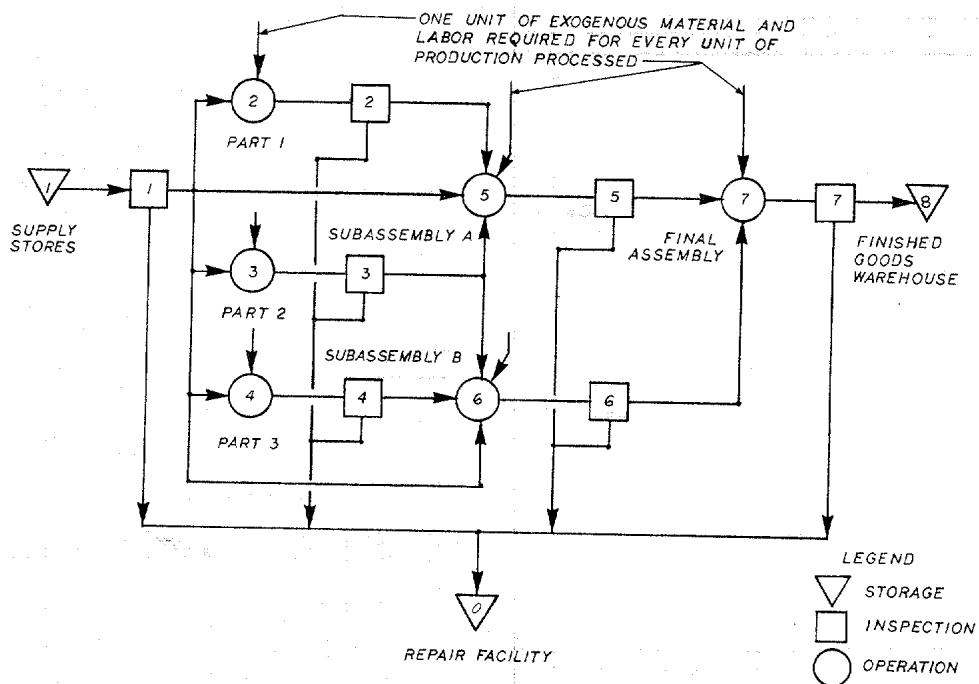
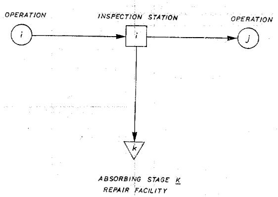

This article was downloaded by: [137.189.171.235] On: 17 October 2016, At: 13:48 Publisher: Institute for Operations Research and the Management Sciences (INFORMS) INFORMS is located in Maryland, USA

## Management Science

## MANAGEMENT SCIENCE

Publication details, including instructions for authors and subscription information: http://pubsonline.informs.org

## Optimal Screening Plans for Nonserial Production Systems

Robert R. Britney,

To cite this article:

Robert R. Britney, (1972) Optimal Screening Plans for Nonserial Production Systems. Management Science 18(9):550-559. http://dx.doi.org/10.1287/mnsc.18.9.550

## Full terms and conditions of use: http://pubsonline.informs.org/page/terms-and-conditions

This article may be used only for the purposes of research, teaching, and/or private study. Commercial use or systematic downloading (by robots or other automatic processes) is prohibited without explicit Publisher approval, unless otherwise noted. For more information, contact permissions@informs.org.

The Publisher does not warrant or guarantee the article’s accuracy, completeness, merchantability, fitness for a particular purpose, or non-infringement. Descriptions of, or references to, products or publications, or inclusion of an advertisement in this article, neither constitutes nor implies a guarantee, endorsement, or support of claims made of that product, publication, or service.

© 1972 INFORMS

Please scroll down for article—it is on subsequent pages

## informs

INFORMS is the largest professional society in the world for professionals in the fields of operations research, management science, and analytics.

For more information on INFORMS, its publications, membership, or meetings visit http://www.informs.org

# OPTIMAL SCREENING PLANS FOR NONSERIAL PRODUCTION SYSTEMS\*†

ROBERT R. BRITNEY

The University of Western Ontario

Ouality control screening programs are defined and evaluated for the general n-stage nonserial production process. A total expected cost criterion, developed as a function of the screening applied at each inspection station, embraces the various costs of inspection. defect repair and defects passing through the process undetected. Absorbing Markoy chains aid in the identification of probabilistic flows of defective materials through the production network. materials through the proo

Minimum cost screening programs are developed, giving the optimal level of screening at every potential inspection station. For a quasi-concave cost structure, it is shown that the optimal screening program will employ either zero or 100 percent effective screening throughout. A standard branch and bound"backtrack" strategy readily identifies optimal screening programs for the unconstrained (0, 1) nonlinear integer programming problem. An illustrative problem is presented.

## 1. Introduction

Business today, regardless of the nature of the product, is placing a greater emphasis on product quality. Competitive pressures have caused many firms to undertake product differentiation on quality alone. Increased costs of product maintenance and renair, together with increased reliability requirements, have generated both internal and external pressures upon firms to intensify their concern for product quality. and external

Many production processes—because of existing production techniques, equipment and raw materials are technologically incapable of generating finished products of the desired quality. (Lindsay and Bishop [9] cite the manufacture of glass containers as an example.) Through the strategic location and use of inspection activities, screening programs can be developed to upgrade product quality and yield substantial economies of production. omies of production. and [12]

There have been several recent contributions, [1], [3], [8], [9], [10], [11], and [12], developing optimal screening programs for serial (single-channel) production systems. Each identifies minimum-cost screening programs, balancing assumed linear inspection costs against per upit product repair or replacement costs and the costs of permitting dafective product to reach the customer. Present day production processes are characterized more by nonserial networks in which input materials may take one of several paths through a production system. This paper investigates optimal screening proprams for nonserial production processes operating under a nonlinear quasi-concave inspection cost structure. inspection cost struc

The total cost of processing defective product includes such costs as the appraisal and detection of defects, internal and external failure costs. In the absence of screening at the various stages of production, all defects eventually reach the customer.

External failure costs result from the repair and replacement of this defective product according to contractual agreements, guarantees and goodwill policies, Through screening many defects can be detected and repaired prior to shipment to the customer Internal failure costs, together with the costs of appraisal and detection of the screen. ing program employed, are incurred. Optimal screening programs are those minimizing the cost of expected internal failures, expected external failures and the costs of appraisal and detection, hereafter called the total expected cost of quality

In the following sections then (1) a model is formulated for the total expected cost of quality for a given screening program; and (2) a solution procedure is developed for the determination of optimal screening programs for nonserial production processes

## 2. Outline of Problem and Solution

## General Assumptions

Consider any nonserial production system in which raw materials enter the process through stage one and by subsequent production operations are transformed into N units of finished goods per unit time. Let stages ${ \bf 1 } , \cdots , n - { \bf 1 }$ represent the processing stages, with a finished goods warehouse n and one repair facility stage o. A unit of production is simply the resultant aggregate of materials and labor at the completion of any individual production stage. (For example, in the typical eight-stage svstom of Figure 1, both part 2 and subassembly A represent units of production. )

At every stage, materials and labor may be added to the incoming units of production. Let us call these exogenous materials and labor. Some of these may be defective Hence, all defects are introduced into the system as: (1) defective raw material and labor through stage one and (2) defective exogenous material and labor through subsequent stages 2 through n — 1.

Given a defective unit of exogenous material and labor added at stage ¿. the unit of production acquires a type i defect. A total of $n - 1$ defect types exist, where a type 1 defect denotes defective raw material. Clearly, a unit of production may contain several defect types. defect types.

  
FiGURE 1. Typical eight-stage production process

Given that all defects may be removed and the unit of production repaired either in the field or in the repair facility, consider the following assumptions:

1. Associated with each production stage i is a potential inspection station where $0 \ \leqq _ { i } \ \leqq \ 1$ represents the decision variable screening effort or filtering effectiveness, and defines the probability of any defect being detected at that station. False detections are not considered. tions are not

2. All flows are assumed to be constant and under equilibrium conditions. Detected defects are retained in the repair facility as scrap. The repaired units of production are inserted back into the production process immediately following the inspection station at which the defects were discovered. station at which

3. No inspection is undertaken at the repair facility o. Undetected defects entering the repair facility will remain undetected. They may, however, be discovered at subsequent inspection stations or in the field. sequent inspection

4 No inspection is undertaken at the finished goods warehouse. Once a defect 4 reaches the warehouse, it is assumed to be shipped to the customer

Clearly the flow of defects mav be described by transition probabilities. Eventually, all defects will be processed with their respective units of production and absorbed into the finished goods warehouse or the repair facility. The path to absorption depends upon several factors: several facto

1. The design of the production process defining the expected flow rates between all stages of production; all stages of produc and

2 The design of a quality control screening program outlining inspection rules and resulting levels of filtering effectiveness for every inspection station. Let this screening plan be given by the vector $F = ( f _ { 1 } , \cdots , f _ { n - 1 } )$

## Expected Defect Flow Rates

Let column vector $X = ( x _ { 1 } , \cdots , x _ { n } )$ be the expected product flow vector in units of production with x, the output from stage i required to support N units of finished goods per unit time. Let $Y = [ y _ { i j } ] _ { i , j = 1 } ^ { n }$ govern the distribution of flow within the process where $0 \not \equiv y _ { i j } \not \equiv 1$ represents the fraction of the output from stage i directed to stage j. The flow is assumed to be circuitless; thus Y is a triangular matrix with $y _ { i j } = 0$ for $i \ \geq \ j$ ; and since all units leaving stage i must transit to a stage of number $> i ,$ $\sum _ { j = i + 1 } ^ { n } y _ { i j } = 1$ . Y is likewise assumed to be deterministic.

2 If screening is desired at warehouse n, a second hypothetical warehouse n + 1 in series with stage n can be inserted for which assumption four obtains. tage n can be inserted for which assumption four where where

3 (a) The vector X may be readily obtained from the relationship $X ~ = ~ ( I - ( G ) ^ { - 1 } { \tilde { N } }$ I = an identity matrix;

$G \stackrel { \cdot } { = } \left[ g _ { i j } \right]$ a connectivity matrix of 0 and 1 for $i , j = 1 , \cdots , n ;$

$g _ { i j } = 0$ if a direct connection does not exist;

## = 1 if a direct connection does exist

from i to j. $\tilde { N } = ( 0 , \tilde { 0 } , \cdots , N )$ . N being the number of finished goods processed per unit time. ), N being the number of finished 11

Similarly, the matrix Y may be obtained directly from G and X as follows: $y _ { i j } = ( x _ { j } / x _ { i } ) g _ { i j }$ Figure 3 gives an illustration of G Figure 3 gives y be written as a triangular matrix

(b) Since the flow is assumed circuitless, then $( I - G )$ may be written as a triangular matrix $\mid \bar { I { \mathbf { - } } } \bar { G } \mid = 1  0$ , and hence $( \vec { I } - \vec { G } ) ^ { - 1 }$ with unit elements along the diagonal. It can be shown that exists.

OPTIMAL SCREENING PLANS FOR NONSERIAL PRODUCTION SYSTEMS 553

  
FIGURE 2. Elemental portion of a production system

Recall that defects may be introduced at any stage. Let $a = ( a _ { 1 } , \cdots , a _ { n - 1 } )$ where $\pmb { a } _ { i }$ is the probability that a defect will be introduced into the process at stage i. In addition, let $A = [ a _ { i , j } ] _ { i , j = 1 } ^ { n - 1 }$ , where $a _ { i j } = a _ { i } \operatorname { i f } i = j$ and $a _ { i j } = 0$ otherwise.

In those production processes where $0 \leq y _ { i j } \leqq 1 _ { : }$ , the movements of defects through the system can be described by simple absorbing Markov chains. Let stage $i = 1 , \cdots$ $\mathscr { n } - 1$ be transient states of the Markov process and stages $k = n ,$ o be absorbing states. Consider first the elemental production system of Figure 2 and the evaluation of the transition probability matrix $P = \{ p _ { i j } \} _ { i , j = 1 } ^ { n , o }$ of the Markov process.

The transition probability between any two nonabsorbing states i and i is simply $j$ $p _ { i j } = ( 1 - f _ { i } ) y _ { i j } , i , j = 1 , \cdots , n - 1$ . Similarly, the probabilities between any nonabsorbing state i and the absorbing states are $p _ { i j k } = f _ { i }$ for $k = o$ the repair facility and by definition $p _ { i k } = ( 1 - f _ { i } ) y _ { i k }$ for $k = n$ the warehouse. By the definition of circuitless flow, $p _ { i i } = 0$ for $i = 1$ $\cdots , n - 1$

Let $B = [ b _ { i k } ] _ { i = 1 } ^ { n - 1 } , k = n , o ,$ where b represents the probability of a defect leaving $b _ { i k }$ stage i and eventually progressing through the process to the input of stage $k = n ,$ 0. The following recursive relationship holds $\begin{array} { r } { \boldsymbol { b } _ { i k } = p _ { i k } + \sum _ { j = 1 } ^ { n - 1 } p _ { i j } \boldsymbol { \dot { b } } _ { j k } } \end{array}$ for $1 \leq i \leq n - 1 .$ It follows then that the absorbing probability matrix B is given by $B = ( I - Q ) ^ { - 1 } R$ where I is the identity matrix and $\bar { Q } = [ p _ { i j } ] _ { i , i = 1 } ^ { n - 1 }$ and $R = [ p _ { i j } ] _ { i = 1 } ^ { n - 1 } , j = n , \dot { o } ,$ are submatrices of the transition probability matrix P shown in canonical form below:

$$
P = \left[ \begin{array}{c c} I & 0 \\ \hline R & Q \end{array} \right].
$$

Let $P ^ { \prime } = [ p ^ { \prime } _ { i j } ] _ { i , j = 1 } ^ { n - 1 }$ where $\boldsymbol { p ^ { \prime } } _ { i j }$ j represents the probability of a defect leaving stage i and eventually passing undetected to the input of stage j. The elements of P' must $\bar { \boldsymbol { P } } ^ { \prime }$ follow the recursive relationship $\begin{array} { r } { \begin{array} { r c l } { \boldsymbol { p } _ { i j } ^ { \prime } } & { = : \ \boldsymbol { p } _ { i j } } & { + } & { \sum _ { h = 1 } ^ { n - 1 } p _ { i h } \boldsymbol { p } _ { \ h j } ^ { \prime } } \end{array} } \end{array}$ , or equivalently $P ^ { \prime } = ( I - Q ) ^ { - 1 } Q$

As a result, the expected number of type i defects absorbed into stage k per unit time is given by the expression $E = B ^ { r } A X$ where $\begin{array} { r } { \begin{array} { r } { E = [ e _ { k i } ] _ { i = 1 } ^ { n - 1 } , k = n , o , i = 1 , \cdots , n - 1 , } \end{array} } \end{array}$ X is the appropriate $n \mathrm { ~ - ~ } 1$ components of the expected flow vector, and T denotes $\pmb { T }$ transposition.

## Expected Cost of Quality Control

Assume that the total expected cost is of the form $T = C _ { D } + C _ { E } + C _ { I }$ where $C _ { D }$ is the expected cost of appraisal and detection (cost of maintaining the screening

4Given $P = \left[ { \frac { \cal I } { R } } | { \frac { 0 } { Q } } \right]$ , since Q" → 0 as n → ∞, it can be shown that $( I - Q ) ^ { - 1 }$ exists [6, p. 284].

program $F ) , C _ { E }$ is the expected external failure cost (costs of defects shipped to customers) and C, is the expected internal failure cost (costs of internal repair of $C _ { I }$ detected defects) of processing N units. Assume that these costs are given by:

$$
C _ {D} = \sum_ {i = 1} ^ {n - 1} d _ {i}
$$

where $d _ { i } \equiv \mathscr { d } _ { i } ( f _ { i } )$ is the cost of maintaining a screening program of fi at station i with $f _ { i }$ $( 0 , 1 ) ,$ 5 $d _ { i } ( 0 ) = 0 . \ d _ { i }$ is quasi-concave in the closed interval

$$
C _ {E} = \sum_ {i = 1} ^ {n - 1} a _ {i} x _ {i} c _ {i} ^ {w} b _ {i n}
$$

where c." is the per unit cost incurred as a defect introduced into stage i eventually $c _ { i } ^ { \phantom { \dagger } \left. { \ w } \right. }$ passes undetected through to the finished goods warehouse facility n.

$$
C _ {I} = \sum_ {i = 1} ^ {n - 1} a _ {i} x _ {i} (c _ {i i} ^ {r} f _ {i} + \sum_ {j = 1} ^ {n - 1} c _ {i j} ^ {r} p _ {i j} ^ {\prime} f _ {j})
$$

where cii is the per unit cost incurred when a defect introduced at stage i is detected $\boldsymbol { c } _ { i j } ^ { r }$ at inspection station j and sent to the repair facility.

Since $\begin{array} { r } { c _ { i } { } ^ { r } b _ { i o } = c _ { i i } ^ { r } f _ { i } + \sum _ { j = 1 } ^ { n - 1 } c _ { i j } ^ { r } p ^ { \prime } { } _ { i j } f _ { j } } \end{array}$ , the internal failure cost can be re-written as follows:

$$
C _ {1} = \sum_ {i = 1} ^ {n - 1} a _ {i} x _ {i} c _ {i} ^ {r} b _ {i o}
$$

where ci' is an averaged per unit cost of an internal defect introduced into stage i and ${ c _ { i } } ^ { \stackrel { r } { } }$ repaired internally, absorbed into stage repaired interna $o .$

Letting $C ^ { v } \ = \ ( c _ { 1 } ^ { w } , \ \cdot \cdot \cdot , \ c _ { n - 1 } ^ { w } ) , \ C ^ { r } \ = \ ( c _ { 1 } ^ { r } , \ \cdot \cdot \cdot , \ c _ { n - 1 } ^ { r } )$ and $D \ = \ ( d _ { 1 } , \cdot \cdot \cdot , d _ { n - 1 } )$ 1 define the failure cost matrix

$$
C = \left[ \begin{array}{c} C ^ {w} \\ C ^ {r} \end{array} \right].
$$

The total expected cost of quality T for given screening plan F becomes simply:

$$
\begin{array}{r l} T & = \sum_ {i = 1} ^ {n - 1} [ d _ {i} + a _ {i} x _ {i} (c _ {i} ^ {w} b _ {i n} + c _ {i} ^ {r} b _ {i o}) ] \\ & = S (D + (B C) ^ {*} A X) \\ & = S (D + ((I - Q) ^ {- 1} R C) ^ {*} A (I - G) ^ {- 1} \bar {N}) \end{array}
$$

where $S$ is an $( n , - 1 )$ ) component sum vector and $U ^ { * }$ is the matrix resulting from setting all off-diagonal elements equal to zero, in any matrix U.

## Results

THEOREM I. $C _ { E }$ and $C _ { I }$ are multi-linear forms $i n f _ { 1 } , \cdots , f _ { n - 1 }$

ProoF. Let M $( f _ { i } , \ \cdots , \ f _ { j } )$ designate any multi-linear form in the variables $f _ { i } , \cdots , f _ { j }$ , It is first shown that $b _ { i o } = \mathcal { M } ( f _ { i } , \cdots , f _ { n - 1 } )$ when $1 \leq i \leq n - 1$ . Note that $\begin{array} { r } { b _ { i o } = p _ { i o } + \sum _ { j = 1 } ^ { n - 1 } p _ { i j } b _ { j o } . \mathrm { ~ } \hat { A } } \end{array}$ Assume that bio is of the indicated form for $b _ { j o }$ $j = i + 1$ $\cdots , n - 1$ (this inductive hypothesis has been established for $j = n - 1 )$ . Then, $\begin{array} { r l } & { \quad _ { b _ { i } = } = f _ { i } + \sum _ { j = i + 1 } ^ { n + 1 } \left( 1 - f _ { i } \right) y _ { i j } M \left( f _ { j } , \ \cdots , f _ { n - 1 } \right) = M \left( f _ { i } , \ \cdots , \ f _ { n - 1 } \right) \mathrm { f o r ~ a l l ~ } 1 \leq i \leq n - 1 } \\ & { \quad b _ { i o } = f _ { i } + \sum _ { j = i + 1 } ^ { n - 1 } \left( 1 - f _ { i } \right) y _ { i j } M \left( f _ { j } , \ \cdots , f _ { n - 1 } \right) = M \left( f _ { i } , \ \cdots , \ f _ { n - 1 } \right) \mathrm { f o r ~ a l l ~ } 1 \leq i \leq n - 1 } \end{array}$ Thus, b has the prescribed form. For $b _ { i o }$ $\begin{array} { r } { k = \bar { n } , \bar { b } _ { i n } = \bar { p } _ { i n } + \sum _ { j = 1 } ^ { n - 1 } p _ { i j } b _ { j n } = ( 1 - f _ { i } ) y _ { i n } + } \end{array}$ $\sum _ { j = i + 1 } ^ { n - 1 } ( 1 - f _ { i } ) y _ { i j } b _ { j n }$ Similarly, it can be shown that $b _ { i n }$ has the prescribed form. • does. This does. This

By its definition, C and C, will have the form claimed if $C _ { E }$ $C _ { I }$ $\displaystyle b _ { i , k } , k = n , o ,$ was just shown and the theorem is established. was just shown and the theorem is

$T = C _ { D } + C _ { E } + C _ { I }$ is also Clearly, since $C _ { D }$ is by definition quasi-concave, then quasi-concave.

THEOREM II. Let σ be the unit hyper-cube in ${ \vec { E } } ^ { n - 1 }$ and h. If for each $i = 1 , \cdots , n - 1 ,$ $h \left( f _ { 1 } , \ \cdots , \ f _ { n - 1 } \right)$ is concave with respect to $f _ { i }$ , given fi fixed for all $j = 1 , \cdots , n - 1$ $( j \ne i ) , t h e n \ h$ will take on every relative minimum value at an extreme point of the hyper-cube σ.

ProoF. For any $F = ( f _ { 1 } , \cdots , f _ { n - 1 } ) , \mathrm { l e t } \ : h _ { k } ^ { \ast } ( z / F ) = h \left( f _ { 1 } , \cdots , f _ { k - 1 } , z , f _ { k + 1 } , \cdots , f _ { n - 1 } \right)$ By hypothesis, ${ \hbar } _ { k } \left( z / F \right)$ is concave in z for a fixed F and so it assumes its minimum over the closed interval (0, 1) at either $z = \dot { 0 } \ o r \ z = 1$ , that is

$$
h _ {k} (z / F) = \min \left[ h _ {k} (0 / F), h _ {k} (1 / F) \right].
$$

Let $F ^ { 0 } = ( f _ { 1 } ^ { ~ 0 } , \cdots , f _ { n - 1 } ^ { 0 } )$ be any point in σ and let $ { \boldsymbol { h } } (  { \boldsymbol { F } } ^ { 0 } )$ be the value of h at $F ^ { 0 } .$ Define $F ^ { k } = ( f _ { 1 } ^ { k } , \cdots , f _ { n - 1 } ^ { k } )$ recursively for $\boldsymbol { k } = \mathbf { 1 } , \dots , \boldsymbol { n } - \mathbf { 1 }$ by:

$$
\begin{array}{l l} f _ {i} ^ {k} = f _ {i} ^ {k - 1} \quad \text { for   all } \quad i \neq k, \\ = 0 \quad \text { for } \quad i = k \quad \text { and } \quad h _ {k} (0 / F ^ {k - 1}) \leq h _ {k} (1 / F ^ {k - 1}), \\ = 1 \quad \text { for } \quad i = k \quad \text { and } \quad h _ {k} (0 / F ^ {k - 1}) > h _ {k} (1 / F ^ {k - 1}). \end{array}
$$

Then $h \left( \boldsymbol { F } ^ { k } \right) \ \leq \ h \left( \boldsymbol { F } ^ { k - 1 } \right)$ for $k = 1 , \cdots , n - 1$ and so ${ h ( F ^ { n - 1 } ) } \leqq h ( F ^ { 0 } )$ for any $F ^ { 0 }$ (including a minimizing point). Since $F ^ { n - 1 }$ is an extreme point solution, the theorem is established.

## Solution Procedure

The problem reduces to one of minimizing T over all vectors $F = ( f _ { 1 } , \cdots , f _ { n - 1 } )$ with $0 ,$ 1 components, and is an unconstrained integer $( 0 , 1 )$ programming problem with a nonlinear quasi-concave objective function. Partial enumeration using standard branch and bound methods and a "backtrack" strategy provide an efficient solution procedure given simple and sharp bounds.6

Let $\boldsymbol { T } ^ { * } =$ min $T ( F )$ and note that any feasible solution F provides an upper bound, $T \left( F \right)$ , on $\smash { \boldsymbol { T } ^ { * } }$ . An obvious and simple solution is $F ^ { 0 } = ( 0 , \cdots , 0 )$ , the origin solution corresponding to no screening at all with an associated cost of $\begin{array} { r } { T ( \vec { F } ^ { 0 } ) = \sum _ { i = 1 } ^ { n - 1 } a _ { i } x _ { i } c _ { i } ^ { \ : w } , } \end{array}$ Then, $\overline { { \boldsymbol { T } \boldsymbol { ( F ^ { 0 } ) } } }$ provides an initial upper bound on $\overleftarrow { \boldsymbol { T } } ^ { * }$

Consider any "partial solution" $F _ { m } = ( f _ { 1 } , \cdot \cdot \cdot , f _ { m } )$ with $1 \ \leq \ m \ < \ n - \ 1$ . Let

$$
U \left(F _ {m}\right) = \sum_ {i = 1} ^ {m} \left[ d _ {i} \left(f _ {i}\right) + a _ {i} x _ {i} \left(c _ {i i} ^ {r} f _ {i} + \sum_ {k = i + 1} ^ {m} c _ {i k} ^ {r} p _ {i k} ^ {\prime} f _ {k}\right) \right],
$$

the detection cost for stages 1 through m plus the internal failure costs incurred as type i defects are introduced and detected within stages $i , \cdots , m . \mathrm { { A } }$ lower bound on the failure costs of type j defects and the remaining undetected type i defects at stages j for $m < j \leqq n - 1$ is given by $L _ { m } ( j ) = L _ { m } ( j ) ^ { \prime } + L _ { m } ( j ) ^ { \prime \prime }$

$$
L _ {m} (j) ^ {\prime} = \min \left[ \left\{d _ {j} (1) + a _ {j} x _ {j} c _ {j j} ^ {r} \right\}, \left\{\min _ {j <   k \leq n - 1; p ^ {\prime} i k \neq 0} \left(a _ {j} x _ {j} p _ {j k} ^ {\prime} c _ {j k} ^ {r}\right) \right\}, \left\{a _ {j} x _ {j} c _ {j} ^ {w} \right\} \right],
$$

the failure costs of type j defects detected internally at stage j, at some subsequent $j$ $j ,$ stage $k ,$ or passed on to the customer; and

$$
\begin{array}{r l} L _ {m} (j) ^ {\prime \prime} = & \min \left[ \left\{\sum_ {i = 1; p ^ {\prime} i j \neq 0} ^ {m} (a _ {i} x _ {i} p ^ {\prime} _ {i j} c _ {i j} ^ {r}) \right\}, \left\{\sum_ {i = 1; p ^ {\prime} i k \neq 0} ^ {m} \min _ {j <   k \leq n - 1} (a _ {i} x _ {i} p ^ {\prime} _ {i k} c _ {i k} ^ {r}) \right\}, \right. \\ & \left. \left\{\sum_ {i = 1; p ^ {\prime} i j \neq 0} ^ {m} a _ {i} x _ {i} p ^ {\prime} _ {i j} c _ {i} ^ {w} \right\} \right] \end{array}
$$

representing similar failure costs for all undetected type i defects at stage j. Thus $j .$ $\begin{array} { r } { \bar { U _ { . } } ( F _ { m } ) + \sum _ { j = m + 1 } ^ { n - 1 } L _ { m } \left( j \right) } \end{array}$ provides a readily calculated lower bound on all solutions $\begin{array} { r l } { \boldsymbol { F } ^ { \prime } = } & { { } ( \boldsymbol { f } ^ { \prime } , \cdots , \boldsymbol { f } _ { n - 1 } ^ { \prime } ) } \end{array}$ corresponding to the partial solution ${ \boldsymbol { F } } _ { m }$ (where $f _ { 1 } = f _ { 1 } ^ { \prime } , \cdots$ $f _ { m } = f _ { m } ^ { \prime } )$ , These bounds may be improved through the inclusion of appraisal and detection costs $d _ { k } ( 1 ) , j < k \le n - 1 ;$ ; however, measures must be taken to avoid possible double counting in the calculation of $\sum _ { j = m + 1 } ^ { n - 1 } L _ { m } ( j )$

## 3. An Illustrative Problem

For the simple eight-stage process of Figure 1, let the total number of units of production to be completed be 100 units per unit time. Assume further that the costs of appraisal and detection at each stage are independent, linear and of the form $d _ { i } = m _ { i } f _ { i }$ $\mathrm { f o r } \ i = 1 , \cdots , 7 .$

Failure costs occur as repairs are initiated and completed. Assume that all direct costs may be classified as either "material" or "labor" costs. For the purpose of choosing between alternative screening programs, fixed costs common to all alternatives are assumed irrelevant. External failure costs are incurred as defects reach the warehouse and are subsequently shipped to the customer. Assume that all defects will be discovered by the customer and when found are repaired in the field. Let the direct cost of materials to repair a type i defect be α i , the necessary labor required to effect $\propto i$ the repair be some percent z¿s of the value of the completed unit, and the per unit $z _ { i 8 }$ cost of ill will associated with a type i defect found by the customer be w¿ . The direct $w _ { i }$ per unit external failure cost of a type i defect is:

$$
c _ {i} ^ {w} = \propto_ {i} + z _ {i 8} V _ {8} + w _ {i} \quad \text { for } \quad i = 1, \dots , 7,
$$

where $V _ { 8 } =$ the value of a completed unit of production.

Internal failure costs are those associated with the repair of defects detected at the various stages of production. Define the direct cost of materials to repair a type i defect $\mathsf { a s } \propto _ { : \imath }$ regardless of when repair is undertaken. Let the labor required be a percent zi, of the value of the unit when the repair is undertaken. If Vj represents $z _ { i j }$ $\dot { V _ { j } }$ the value of a unit of production at stage j, the direct per unit internal failure cost of $j ,$ a type i defect detected at a specific stage j is:

$$
c _ {i j} ^ {r} = \infty_ {i} + z _ {i j} V _ {j} \quad \text { for } \quad i = 1, \dots , 7 \quad \text { and } \quad j = 1, \dots , 7.
$$

Finally for illustrative purposes, assume that a fixed cost of maintaining the internal repair facility as well as the external repair facility exists and is C, and Cw respectively. $C _ { r }$ $C _ { w }$ These are accommodated in the analysis as follows. If $a _ { i } x _ { i } b _ { i 8 } > 0$ for any i, include $C _ { w }$ if $a _ { i } x _ { i } b _ { i 0 } > 0$ for any i include C, . Let the cost parameters defined above be given as $\widehat { C } _ { r }$ follows:

TABLE I  
Production Stage/Type of Defect

<table><tr><td></td><td>1</td><td>2</td><td>3</td><td>4</td><td>5</td><td>6</td><td>7</td><td>8</td><td>Dimension</td></tr><tr><td> $a_i$ </td><td>0.20</td><td>0.10</td><td>0.10</td><td>0.10</td><td>0.10</td><td>0.10</td><td>0.05</td><td>—</td><td></td></tr><tr><td> $m_i$ </td><td>1,350</td><td>450</td><td>750</td><td>600</td><td>525</td><td>600</td><td>1,350</td><td>—</td><td>$/per unit time</td></tr><tr><td> $\infty_i$ </td><td>0.20</td><td>0.80</td><td>0.70</td><td>0.50</td><td>0.60</td><td>0.70</td><td>0.80</td><td>—</td><td>$/unit</td></tr><tr><td> $w_i$ </td><td>9.00</td><td>9.00</td><td>9.00</td><td>9.00</td><td>9.00</td><td>9.00</td><td>9.00</td><td>—</td><td>$/unit</td></tr><tr><td> $z_{ij}$ </td><td>2.00</td><td>2.00</td><td>2.00</td><td>2.00</td><td>2.00</td><td>2.00</td><td>2.00</td><td>2.00</td><td>% of  $V_j^*$  for all  $j$ </td></tr><tr><td> $v_j$ </td><td>10</td><td>25</td><td>28</td><td>43</td><td>83</td><td>116</td><td>249</td><td>249</td><td>$/unit</td></tr></table>

Directly from the flow diagram of Figure 1, the connectivity matrix G is developed and shown in Figure 3. For any solution F, the elements of matrices $F ,$ $P , P ^ { \prime }$ and B are readily obtained using the equations developed for expected defect flow rates. Table II summarizes the branch and bound backtrack procedure employed to vield the optimal screening program $\mathit { F } ^ { * } = ( 0 , 0 , 0 , 0 , 1 , 1 , 0 )$ of \$1,901.1.

TABLE II Summary of Solution Procedure

<table><tr><td rowspan="2">Solution  $F_m$  or  $F$ </td><td colspan="2">Lower Bound</td><td rowspan="2">Upper Bound</td></tr><tr><td colspan="2"> $[U(F_m) + \Sigma_{j=m+1}^{n-1} L_m(j)]$  or  $T(F)$ </td></tr><tr><td>(0, 0, 0, 0, 0, 0, 0)</td><td></td><td>$2,734.3</td><td>$2,734.3</td></tr><tr><td>(0, 0, 0, 0, 0, 0, 1)</td><td></td><td>2,539.3</td><td>2,539.3</td></tr><tr><td>(0, 0, 0, 0, 0, 1)</td><td>$1,494.1</td><td></td><td>2,539.3</td></tr><tr><td>(0, 0, 0, 0, 0, 1, 0)</td><td></td><td>2,484.9</td><td>2,484.9</td></tr><tr><td>(0, 0, 0, 0, 0, 1, 1)</td><td></td><td>2,899.9</td><td>2,484.9</td></tr><tr><td>(0, 0, 0, 0, 1)</td><td>1,595.7</td><td></td><td>2,484.9</td></tr><tr><td>(0, 0, 0, 0, 1, 0, 0)</td><td></td><td>2,350.5</td><td>2,350.5</td></tr><tr><td>(0, 0, 0, 0, 1, 0, 1)</td><td></td><td>2,765.5</td><td>2,350.5</td></tr><tr><td>(0, 0, 0, 0, 1, 1)</td><td>1,645.9</td><td></td><td>2,350.5</td></tr><tr><td>(0, 0, 0, 0, 1, 1, 0)</td><td></td><td>1,901.1</td><td>1,901.1</td></tr><tr><td>(0, 0, 0, 0, 1, 1, 1)</td><td></td><td>3,126.1</td><td>1,901.1</td></tr><tr><td>(0, 0, 0, 1)</td><td>2,001.5</td><td></td><td>1,901.1</td></tr><tr><td>(0, 0, 1)</td><td>1,913.5</td><td></td><td>1,901.1</td></tr><tr><td>(0, 1)</td><td>1,710.5</td><td></td><td>1,901.1</td></tr><tr><td>(0, 1, 0, 0, 0, 0, 0)</td><td></td><td>2,979.9</td><td>1,901.1</td></tr><tr><td>(0, 1, 0, 0, 0, 0, 1)</td><td></td><td>2,854.9</td><td>1,901.1</td></tr><tr><td>(0, 1, 0, 0, 0, 1)</td><td>1,809.7</td><td></td><td>1,901.1</td></tr><tr><td>(0, 1, 0, 0, 0, 1, 0)</td><td></td><td>2,530.5</td><td>1,901.1</td></tr><tr><td>(0, 1, 0, 0, 0, 1, 1)</td><td></td><td>3,215.5</td><td>1,901.1</td></tr><tr><td>(0, 1, 0, 0, 1)</td><td>2,048.1</td><td></td><td>1,901.1</td></tr><tr><td>(0, 1, 0, 1)</td><td>2,255.3</td><td></td><td>1,901.1</td></tr><tr><td>(0, 1, 1)</td><td>2,167.3</td><td></td><td>1,901.1</td></tr><tr><td>(1)</td><td>1,860.9</td><td></td><td>1,901.1</td></tr><tr><td>(1, 0, 0, 0, 0, 0, 0)</td><td></td><td>2,630.7</td><td>1,901.1</td></tr><tr><td>(1, 0, 0, 0, 0, 0, 1)</td><td></td><td>3,315.7</td><td>1,901.1</td></tr><tr><td>(1, 0, 0, 0, 0, 1)</td><td>2,530.9</td><td></td><td>1,901.1</td></tr><tr><td>(1, 0, 0, 0, 1)</td><td>2,494.5</td><td></td><td>1,901.1</td></tr><tr><td>(1, 0, 0, 1)</td><td>2,647.9</td><td></td><td>1,901.1</td></tr><tr><td>(1, 0, 1)</td><td>2,670.3</td><td></td><td>1,901.1</td></tr><tr><td>(1, 1)</td><td>2,299.3</td><td></td><td>1,901.1</td></tr></table>

Given $n = 8 ,$ a total of 128 extreme point solutions exist with associated total expected costs T (F) ranging from \$1,901.1 to \$6,012. The frequently emploved program of 100 percent final inspection yields an expected cost of \$2,539; the decision to undertake no screening at all (the origin solution screening plan) results in a total expected cost of \$2,734. For this example, the cost is responsive to the screening program selected since the poorest program, $F = ( 1 , 1 , 1 , 1 , \dot { 1 } , \dot { 1 } , 1 , 1 , 1 )$ ), generates a cost approximately 3.2 times that of the optimal program

A sensitivity analysis indicates that the optimal screening program is quite stable Varying parameters $w _ { i } , m _ { i } ,$ zij and α i plus and minus fifty percent leaves the optimal program $\mathit { \hat { F } } ^ { * } = \ ( 0 , 0 , 0 , 0 , 1 , 1 , 0 )$ unchanged. Although a decrement of fifty percent

$$
\begin{array}{c c} & \text {TO PRODUCTION STAGE} \\ & 1 \quad 2 \quad 3 \quad 4 \quad 5 \quad 6 \quad 7 \quad 8 \\ \text {FROM} & 1 \quad 0 \quad 1 \quad 1 \quad 1 \quad 1 \quad 1 \quad 0 \quad 0 \\ \text {PRODUCTION} & 2 \quad 0 \quad 0 \quad 0 \quad 0 \quad 1 \quad 0 \quad 0 \quad 0 \\ \text {STAGE} & 3 \quad 0 \quad 0 \quad 0 \quad 0 \quad 1 \quad 1 \quad 0 \quad 0 \\ & 4 \quad 0 \quad 0 \quad 0 \quad 0 \quad 0 \quad 1 \quad 0 \quad 0 \\ & 5 \quad 0 \quad 0 \quad 0 \quad 0 \quad 0 \quad 0 \quad 1 \quad 0 \\ & 6 \quad 0 \quad 0 \quad 0 \quad 0 \quad 0 \quad 0 \quad 1 \quad 0 \\ & 7 \quad 0 \quad 0 \quad 0 \quad 0 \quad 0 \quad 0 \quad 0 \quad 1 \\ & 8 \quad 0 \quad 0 \quad 0 \quad 0 \quad 0 \quad 0 \quad 0 \end{array}
$$

FiGuRE 3. The connectivity matrix G for the system of Figure 1.

in a, causes the optimal program to shift to the origin solution $F = ( 0 , 0 , 0 , 0 , 0 , 0 , 0 , 0 )$ an increase of fifty percent in ai leaves the optimal program unchanged. $a _ { i }$

## 4. Conclusions

The primary contribution of this and earlier models lies in the form of recommendations of courses of action for quality control screening. For nonserial production processes operating under quasi-concave cost structures, optimal screening programs remain extreme point solutions. Serial production systems may be viewed as a special case of this model, in which the connectivity matrix G is of the form $g _ { i j } = 1 \operatorname { i f } j = \mathrm { i } + 1$ and $g _ { i j } = 0$ otherwise. Hence, for serial production systems under linear inspection cost structures, the extreme point solutions parallel and support the earlier fndings of [9] and [11]. This has now been extended to nonserial production systems and a special class of nonlinear cost structures.

Optimal screening plans appear to be quite stable, and are influenced most by the proportions of defective materials added at each production stage. Consequently, a great deal of effort should be devoted to the definition and estimation of these parameters of input quality.

The model is first limited to those settings in which all defects are repairable and where the repaired units of production can be reinserted into the production process. Secondly, it is assumed that all defect types have an equal probability of being found at any given inspection station. By defining a decision variable fi as the probability $f _ { i j }$ of detecting a type i defect at station j, this latter constraint may be eliminated. The $j ,$ result is a set of matrices $P , P ^ { \prime }$ and $B ,$ , one for each type of defect i. The methodology remains essentially the same.

The model does. however, accommodate per unit failure costs based upon the types and quantities of defects contained in each unit of production. This is often the case in practice: for example, the electrical industry is characterized by expensive and complex electronic assemblies which are primarily repaired through the replacement of individual defects. individual defects.

The proposed matrix formulations provide an orderly and effective method of evaluating alternative screening plans. Technological process considerations (G), target production outputs (N) and input quality characteristics (A) combine directly with relevant cost data (C and D) to yield the total expected cost of quality for any screening plan (F).

For many production processes, screening efforts strategically placed may present one of the most effective means of achieving desired quality levels at minimum total production costs. In failing to view screening as an acceptable means of quality control. producers are deciding (by default) in favor of the origin solution screening plan. As shown in the illustrative problem, nonobvious optimal screening programs may exist. and provide substantial economies of production over both the origin solution plan and the prevalent 100 percent final inspection plan.

## References

1. BEIGHTLER, C. C. AND MITTEN, L. G., "Design of an Optimal Sequence of Interrelated Sampling Plans," Journal of the American Statistical Association, Vol. 59, No, 305 (March 1964), pp. 96–104.

2. BELLMAN, R. AND DREYFUs, S. E., Applied Dynamic Programming, Princeton University Press, Princeton, New Jersey, 1962.

3. BrowN, E. D., "Some Mathematical Models of Inspection Along a Production Line." Technical Report No. 36, Operations Research Center, Massachusetts Institute of Technology 1968.

4. FEIGENBAUM, A. V., Total Quality Control Engineering and Management, The McGraw-Hil Company, Inc., New York, 1961.

5. HaDLEY, G., Nonlinear and Dynamic Programming, Addison-Wesley Publishing Company Inc., Reading, Massachusetts, 1964

6. KEMENY, J. G., SNELL, J. L. AND THompsoN, G. L., Introduction to Finite Mathematics Pren. tice-Hall, Inc., Englewood Cliffs, New Jersey, 1966.

7. LANG, S., Linear Algebra, Addison-Wesley Publishing Co., Reading, Massachusetts, 1966.

8. LINpsAY, G. F., "A Dynamic Programming Procedure for Locating Inspection Stations." Proceedings of the 18th Annual Institute Conference and Convention of the American Institute of Industrial Engineers (1967).

9.  AND BisHop, A. B., "Allocation of Sereening Inspection Effort—A Dynamic Programming Approach," Management Science, Vol. 10, No. 2 (January 1964), pp. 342–352. lary 1964), pp. 342–352.

10. PRuzAN, P. M. AND JAcksoN, J. T. R., "A Dynamic Programming Application in Production Line Inspection," Technometrics, Vol. 9, No. 1 (February 1967), pp, 73-81 9, No, 1 (February 1967), pp. 73–81.

11. WHITE, L. S., "The Analysis of a Simple Class of Multistage Inspection Plans," Management Science, Vol. 12, No. 9 (May 1966), pp. 685–693. ), pp. 685-693

12. ,"Shortest Route Models for the Allocation of Inspection Effort on a Production Line." Management Science, Vol. 15, No. 5 (January 1969), pp. 249–259.

Copyright 1972, by INFORMS, all rights reserved. Copyright of Management Science is the property of INFORMS: Institute for Operations Research and its content may not be copied or emailed to multiple sites or posted to a listserv without the copyright holder's express written permission. However, users may print, download, or email articles for individual use.