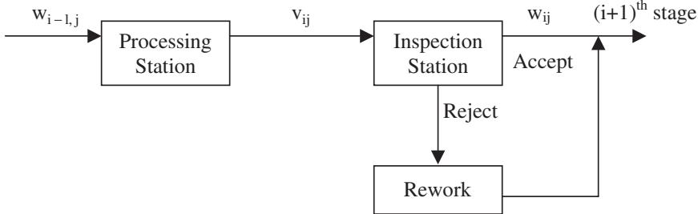

# International Journal of Production Research

Publication details, including instructions for authors and subscription information: http://www.tandfonline.com/loi/tprs20

# An optimization model for selective inspection in serial manufacturing systems

Vivek Kakade <sup>a</sup> , Jorge F. Valenzuela <sup>b</sup> & Jeffrey S. Smith <sup>c</sup>

Department of Industrial and Systems Engineering , Auburn University , 301 Dunstan Hall, AL 36849-5346 USA

<sup>b</sup> Department of Industrial and Systems Engineering , Auburn University , 211 Dunstan Hall, AL 36849-5346 USA

<sup>c</sup> Department of Industrial and Systems Engineering , Auburn University , 207 Dunstan Hall, AL 36849-5346 USA

<sup>d</sup> Department of Industrial and Systems Engineering , Auburn University , 211 Dunstan Hall, AL 36849-5346 USA E-mail: Published online: 21 Feb 2007.

To cite this article: Vivek Kakade , Jorge F. Valenzuela & Jeffrey S. Smith (2004) An optimization model for selective inspection in serial manufacturing systems, International Journal of Production Research, 42:18, 3891-3909, DOI: 10.1080/00207540410001704014

To link to this article: http://dx.doi.org/10.1080/00207540410001704014

## PLEASE SCROLL DOWN FOR ARTICLE

Taylor & Francis makes every effort to ensure the accuracy of all the information (the “Content”) contained in the publications on our platform. However, Taylor & Francis, our agents, and our licensors make no representations or warranties whatsoever as to the accuracy, completeness, or suitability for any purpose of the Content. Any opinions and views expressed in this publication are the opinions and views of the authors, and are not the views of or endorsed by Taylor & Francis. The accuracy of the Content should not be relied upon and should be independently verified with primary sources of information. Taylor and Francis shall not be liable for any losses, actions, claims, proceedings, demands, costs, expenses, damages, and other liabilities whatsoever or howsoever caused arising directly or indirectly in connection with, in relation to or arising out of the use of the Content.

This article may be used for research, teaching, and private study purposes. Any substantial or systematic reproduction, redistribution, reselling, loan, sub-licensing, systematic supply, or distribution in any form to anyone is expressly forbidden. Terms & Conditions of access and use can be found at http://www.tandfonline.com/ page/terms-and-conditions

# An optimization model for selective inspection in serial manufacturing systems

VIVEK KAKADEy, JORGE F. VALENZUELAz\* and JEFFREY S. SMITH}

This paper describes an optimization model for allocating inspection eforts at each stage in a serial multi-stage assembly line. The model explicitly considers the economic tradeof between product yield and inspection accuracy. The paper also shows that the use of a heuristic solution method, simulated annealing, is efective and eficient for solving the inspection allocation model. Problem instances have been developed using real production and visual inspection data provided by a local high-volume electronics manufacturer. In addition, randomly generated problems are used to evaluate the performance of the proposed heuristic.

## 1. Introduction

Inspection of a product is performed at various stages of its manufacture to assure the quality of the product before it is used in final applications. In assembly lines that produce printed circuit boards (PCBs) using surface mount technology (SMT) to install electronic components, keeping a tight control on solder pad area, volume, and its deviation from nominal x and y-axis coordinates, is of great importance. The solder joints provide the mechanical as well as the electrical contact between the component and the substrate. To check for defects, boards are generally inspected at various stages of their assembly process. It is well known that the earlier a defect is detected the less expensive the rework will be. Rework costs increase significantly after each successive production step. A defect detected after the components have been placed and reflowed may force the board to be discarded or manually reworked.

In high volume production, inspections are generally performed by automated visual inspection (AVI) systems. Unlike human inspectors, these systems are highly reliable, consistent and accurate. Obviously, 100% inspection of each board would be advantageous from a quality point of view. However, as the numbers of components on the boards grow, the volume of data to be collected also grows. Moreover, the required post-processing and analysis of the raw data can adversely afect the throughput rates of the assembly line and can render 100% inspection prohibitively expensive. Determining the amount of inspection time to be allocated depends on factors such as product price, product costs, penalties (customer expectations), rework cost, and proportion of defective units. In this paper, we consider the problem of designing inspection plans along a serial multi-stage manufacturing system. Although references are made throughout the paper to the PCB assembly lines, the model and the solution approach developed are applicable to any serial assembly line where inspection of individual constituent components is carried out.

The general category of inspection efort allocation problems in manufacturing systems contains two sub-problem categories. The first category deals with optimal allocation of inspection stations within a manufacturing system; that is deciding which manufacturing stations will get an immediately succeeding inspection station from a pool of a limited number of available inspection stations. The second category deals with finding optimal inspection levels (percentage of total number of components to be inspected) at various stages in the system. The literature review presented in this paper deals mainly with work from the second category. A few papers that report work on both categories are also referred to.

Many researchers have studied the inspection efort allocation problem assuming certain conditions about the topology of the assembly line and the characteristics of the product being assembled. Raz (1986) provides an exhaustive review of the work done in this area. He mentions that the most common solution approaches consist of dynamic programming, zero–one integer programming, non-linear programming and simulation. Lindsay and Bishop (1964) were the first to develop a model to address the optimal inspection efort allocation problem in a multi-stage manufacturing system. They developed two models to minimize the sum of unit inspection cost and the cost of lost production due to improper processing (scrapping cost). The production system considered in their work is a serial line with a single inspection operation possible after every processing stage. They assume that the inspection is 100% eficient and that a defective item can be discovered only at the immediate inspection station. The costs for inspection and scrapping are assumed to be linear and the fraction of defective units for each manufacturing operation is considered fixed and unchanging over time. The solution, obtained with dynamic programming, yields the inspection operations to be performed at various stages. The important contribution of this research is the following result: if the inspection decision afects each unit individually rather than the entire lot (complete inspection of production run rather than sampling), then the inspection level at each stage will be either 0% or 100% in the optimal solution. White (1966) supported this result. Bai and Yun (1996) have discussed the problem in which a product consists of many identica components. The problem considers the case where a limited number of AVI machines is available and the rate of production is constrained by the rate of inspection. In their model, they assume that an inspection operation is performed to detect non-conformities originated at the immediately preceding or at some of the earlier processing stations. An inspection operation is susceptible to both Type I and Type II errors (Ballou and Pazer 1982). Type I error refers to misclassification of a conforming component as non-conforming, and Type II error refers to misclassification of a non-conforming component as conforming. The work focuses on balancing the rate of production and non-conforming unit detection ability. Since the authors assume that all the components of a unit are identical, the total number of components decided for inspection is actually selected completely randomly from the whole unit. If any component of a unit is perceived to be non-conforming then the unit is removed from the system. All N components of the unit are then re-inspected without error. The non-conforming components are reworked and the unit is transferred to the next stage. Chengalur et al. (1992) incorporate uncertainty in the quality of incoming raw material. They describe a sampling plan, which serves as the basis for making dynamic adjustments to the production-inspection system. Villalobos et al. (1993) have discussed the optimal inspection efort allocation problem as applied to a flexible inspection system wherein the inspection plan is not fixed and is determined just prior to performing the inspection operation. The paper discusses one such dynamic system referred to as a Flexible Inspection System (FIS) in which the inspection strategy for a unit under production is not fixed but is determined as the unit advances through the production line. Viswanadham et al. (1996) have used two stochastic heuristic algorithms, simulated annealing and genetic algorithm (Pham and Karaboga 2000) to solve an inspection station allocation problem. Woo and Metcalfe (1981) have developed a sampling model to calculate the sample size and acceptance number, for each stage, that minimizes the total expected value of inspection related costs per conforming unit produced.

In allocating inspection eforts, one can consider two alternatives: (a) inspecting a portion of the components in all units or (b) inspecting all components in a sampled unit. Bai and Yun (1996) have used the former alternative after it was proven to be able to detect more non-conforming units than the latter. Their numerical studies over a wide range of model parameters indicate that the expected total cost for alternative (b) is larger than or equal to alternative (a) when the percentage of sampled units is equal to the percentage of the number of components sampled in a unit. They have solved the problem of optimal inspection efort allocation by minimizing the total expected cost per unit, which is the sum of expected rework, penalty and inspection costs per unit. The rework cost is incurred by repairing a unit rejected at each inspection station and consists of fixed and variable parts. The penalty cost is incurred when an undetected non-conforming unit is sent to the customer and the unit is found defective at a later date after it goes into service. The inspection cost is the opportunity cost incurred by the reduction of the production rate due to the fact that inspection operation is now the bottleneck in the assembly line. This cost is calculated as the number of units lost in production multiplied by the opportunity cost incurred by not producing a unit. The objective function is non-linear and the methodology for finding an optimal solution is related with finding the properties of this non-linear function. This methodology is useful only when the number of stages and the number of inspection stations to be allocated is small. For larger problems, the paper suggests a heuristic, which uses a backward dynamic programming formulation. In our paper, we have extended this model to account for the dissimilar quality characteristics carried by each component after each processing station and the diferent inspection time required to inspect each component at each stage.

## 2. Problem formulation

Three types of costs are considered while formulating the model. The first type is the cost of inspection, expressed in \$/board, which is incurred due to the fact that the process of carrying out inspection may slow down the production rate of the line. As a result, there is a loss of production when the cycle time with inspection is greater than the manufacturing cycle time. The second type is total repair cost. This cost can be divided into fixed and variable repair costs. The fixed repair cost, expressed in \$/board, is incurred when a PCB fails inspection. It is assumed independent of the number of components failed. The variable repair cost for a failed PCB depends on the number of components that have failed in that PCB. Each failed component has to be reworked or replaced. Individual component repair costs are specified in \$/component. Penalty cost is the third cost component, expressed in \$/board, and it is incurred when a faulty PCB is passed on for use in the application for which it is designed; and it is detected as defective while in use. The field complaints caused by the defective boards have to be serviced on priority, many times free of charge to the customer. Also, this causes loss of goodwill for the supplier and intangible costs associated with it. Generally, the magnitude of this cost is significantly greater than the other two costs mentioned before due to the far-reaching implications of faulty products being passed on to the customers. The objective function of the model seeks minimization of the sum of expected values of these three types of costs per board.

Generally, a PCB has many diferent components, some of which are present in multiple numbers. For each component, the quality characteristics are potentially diferent. Also, the probability characteristics of these components, as defined by the defect induction probabilities at diferent manufacturing stages, difer from each other. The time required to inspect the individual components at the inspection stations of various stages is also diferent for each component. Thus, the components cannot be assumed to be identical. The solution to this problem requires not only the proportion of components to be inspected, but also a listing of the individua components to be inspected at each manufacturing stage.

Generally in a production line that uses SMT, the time allocated for inspection is constrained by the production rate Bau and Yun (1996). In our model, we incorporate the throughput rate (production rate) into the objective function instead of modelling it as a constraint. This allows the optimal inspection decision to dictate the new cycle time of the line, which takes into consideration all the costs. This new cycle time ultimately determines the production rate. The resulting model is an unconstrained optimization problem whose goal is to achieve a globally optimal solution without being artificially restricted by constraints on either production rate or average outgoing quality level (AOQL).

## 2.1. Model assumptions

The cost of inspection is modelled as the opportunity cost incurred when the rate of production is constrained by the rate of inspection. This results in production loss when the inspection cycle time is greater than the manufacturing cycle time. The inspection stations are assumed to be perfect, i.e. there is no possibility of Type I or II errors. For the system at hand, this assumption is reasonable since inspection is usually performed by automated machines. In the case that this assumption is violated the model will tend to underestimate the total cost. An inspection station is assumed to be present after every processing station. That is, each manufacturing stage has one inspection station. Also, it is assumed that the characteristics of the manufacturing system do not change appreciably over time. For example, the probability with which each manufacturing station in the assembly line induces defects into a component of the PCB being manufactured is assumed to be independent of time. Also, the quality of the incoming raw material such as the constituent components is assumed to be perfect, that is all the incoming components are non-defective.

The model consists of a sequence of processing and inspection stations. The basic building block of this system is a manufacturing stage, which consists of a processing station followed by an inspection station as shown in figure 1. The figure also shows the probability notation associated with the components of the PCB that enter the two stations.

  
Figure 1. A manufacturing stage.

## 2.2. Model notation

The notation used in our model development is as follows:

h Total number of stages.

$N$ Number of components in a PCB.

i Index indicating stage sequence number.

j Index indicating component sequence number.

$b _ { i j }$ Decision variables – binary term, which indicates whether or not a component is inspected at station i.

$b _ { i j } = 1$ , if component j is inspected at stage i.

$b _ { i j } = 0$ , if component j is not inspected at stage i.

$\nu _ { i j }$ Probability that in stage i, component j is non-conforming just after the processing station.

$w _ { i j }$ Probability that in stage i, component j is non-conforming just after the inspection station.

$q _ { i j }$ Probability that jth component becomes non-conforming at the processing station of the ith stage.

$f _ { i }$ Probability that a PCB is non-conforming after the inspection at the ith stage.

$t _ { i j }$ Time required to inspect component j at stage i.

$\dot { T }$ Cycle time of the line in the presence of inspection, at each stage, of some or all of the components of a PCB. This is the actual cycle time. Expressed in time units, e.g. seconds.

$T _ { 0 }$ Cycle time of the line in the absence of inspection of any of the components at any of the stages. Expressed in time units, e.g. seconds.

$c _ { i } ^ { F }$ Fixed rework cost per PCB at stage i. Expressed in \$ per PCB.

$c _ { i j } ^ { V }$ Variable rework cost per non-conforming component j at stage i. Expressed in \$ per component.

$c _ { P }$ Penalty cost per PCB. Expressed in \$ per PCB.

$c _ { O }$ Opportunity cost incurred by not producing a unit. Expressed in \$ per PCB.

There are two probabilities associated with each component on the board at every stage in the manufacturing line—the probability that the component will be defective after the processing station in a particular stage $( \nu _ { i j } )$ , and the probability that the component will be defective after the inspection station in that stage $( w _ { i j } )$ The defect probability of a component j after a processing station $i , \nu _ { i j }$ depends on the probability that the same component arrived defective from the previous stage $\displaystyle \left( \mathrm { i } . \mathrm { e } . \ w _ { i - 1 , j } \right)$ and the new defect induction probability for that component at the current stage $( \mathrm { i } . \mathrm { e } . \ q _ { i j } )$ . So, we have

$$
v _ {i j} = 1 - (1 - w _ {i - 1, j}) (1 - q _ {i j}) \quad \forall i \in (1, h) \text {   and   } \forall j \in (1, N).
$$

Since we assume perfect inspection stations for all stages, $w _ { i j }$ will be either 0 for a particular component at a particular stage, if it is inspected at that stage, or it wil be equal to $\nu _ { i j } ,$ if it is not inspected at that stage. So, we have

$$
w _ {i j} = (1 - b _ {i j}) v _ {i j} \quad \forall i \in (1, h) \text {   and   } \forall j \in (1, N).
$$

A complete board consisting of N components will be conforming after a particular stage i only if all the constituent components are conforming after that stage. Thus, we have

$$
f _ {i} = 1 - \prod_ {j = 1} ^ {N} (1 - w _ {i j}) \quad \forall i \in (1, h).
$$

## 2.3. Total expected repair cost

Repair costs have both fixed and variable components at each stage. The total repair cost is the sum of the individual repair costs incurred at each stage in the line. Thus,

Total expected fixed repair cost at stage $\begin{array} { r l } { i = f _ { i } c _ { i } ^ { F } } & { { } ( \mathbb { S } / \mathrm { P C B } ) } \end{array}$

Total expected variable repair cost at stage $\begin{array} { r l } { i = \sum _ { j = 1 } ^ { N } b _ { i j } \nu _ { i j } c _ { i j } ^ { V } } & { { } ( \mathbb { S } / \mathrm { P C B } ) . } \end{array}$

Total expected repair cost at stage $i ,$

ER<sub>i</sub> ¼ Total expected fixed repair cost at stage i þ Total expected variable repair cost at stage i.

So,

$$
E R _ {i} = f _ {i} c _ {i} ^ {F} + \sum_ {j = 1} ^ {N} b _ {i j} v _ {i j} c _ {i j} ^ {V} \quad (\mathbb {S} / \mathrm{PCB}).
$$

Total expected repair cost at all stages,

$$
E R = \sum_ {i = 1} ^ {h} E R _ {i} \quad (\mathbb {S} / \text { PCB }).
$$

## 2.4. Total expected penalty cost

The penalty cost is incurred for an expected number of undetected defective boards that pass the inspection station of the last stage h. Thus,

$$
E P = \left[ \left(1 - \prod_ {j = 1} ^ {N} (1 - w _ {h j})\right) \right] c _ {P} \quad (\mathbb {S} / \text {PCB}).
$$

## 2.5. Total inspection cost

The cost of inspection is incurred when some inspection stations reduce the throughput rate of the line. The new cycle time of the line in the presence of inspection needs to be calculated for obtaining an expression for total inspection cost.

The new cycle time,

$$
T = \max \left[ T _ {0}, \sum_ {j = 1} ^ {N} t _ {i j} b _ {i j} \quad \forall i \in (1, h) \right] \quad (\text { Time   unit }).
$$

Total inspection cost,

$$
I C = \left(\frac {T - T _ {0}}{T _ {0}}\right) c _ {O} \quad (\mathbb {S} / \mathrm{PCB}).
$$

## 2.6. Objective function

The objective function for this optimization problem can be expressed as the minimization of total expected inspection related cost (ETC). This cost is expressed as the summation of three types of costs—expected repair cost (ER), expected penalty cost (EP) and inspection cost (IC). Thus,

$$
E T C = E R + E P + I C. \quad (/ \text {PCB}).
$$

Thus, the optimization problem can be expressed as:

$$
\mathrm{minimizeETC}
$$

$$
\mathrm{s.t.} b _ {i j} \in \{0, 1 \}.
$$

The objective function is non-linear where the non-linearity is introduced in the objective function by the dependency of the defect probabilities of two consecutive stages. Furthermore, a PCB is conforming only when all its components are conforming. This situation is equivalent to a serial system whose reliability depends on the reliability of every component in the system. To obtain the probability of the PCB being conforming at a particular stage, we need to multiply all individual component conforming probabilities at that stage. The non-linear nature of the objective function and the integrality requirements for the decision variables make the problem very complex for the derivation of an optimal solution methodology. The size of the solution space grows exponentially with the problem size. For example, in case of an assembly line with two stages and five components per PCB, the number of variables in this inspection efort allocation problem is 10. The total number of solutions possible in this case, i.e. the size of the solution space, is $2 ^ { 1 0 }$ (i.e. 1024). If the same line has 15 components per PCB, the number of decision variables will be 30. In this case, the size of solution space will be $2 ^ { 3 0 }$ (i.e. 1,073,741,824). As a result, a randomized search method, simulated annealing (SA) (Van Laarhoven and Aarts 1987), is explored as a solution approach for this problem. Also, use of the branch and bound technique (Clausen 1999) to further improve the solution obtained from SA is explored as a possible solution methodology. These two solutions methods are discussed in Section 3.

## 3. Solution approach

Besides the genetic algorithm and tabu search (Pham and Karaboga 2000) nature inspired heuristics, the simulated annealing approach, proposed by Kirkpatrick et al. (1983), has been extensively and successfully used for solving combinatorial optimization problems. The algorithm was derived from statistical mechanics and it is based on an analogy between annealing treatments of solids and solving combinatorial optimization problems. The basic steps of a SA algorithm

are as follows:

Step 0: Create an initial solution. This is the first current solution. Decide the initial temperature, number of repetitions at each temperature step, temperature reduction rule and total number of iterations to be performed.

Step 1: Generate a new set of solution/s from the current solution.

Step 2: Evaluate the solution in terms of the objective function. Keep track of the best solution found so far.

Step 3: If the newly created solution is better, then update the current solution to the newly found better solution. If not, decide whether the new solution can still become the current solution, depending on Metropolis’s criterion (Metropolis et al. 1953). If it passes the criterion, then the newly found solution becomes the current solution; otherwise the current solution stays the same.

Step 4: Iterate through steps 1, 2 and 3 for a defined number of times as decided by the number of repetitions at each temperature step. After those many repetitions go to Step 5.

Step 5: Decrease the temperature using the decided reduction criterion. Iterate through steps 1, 2, 3 and 4 for the decided number of times. After ending the last iteration, stop. Use the best solution found so far.

## 3.1. Parameter tuning

After some experimentation using small problems, the parameters of the cooling schedule were set. The initial temperature was fixed at a value of 300 and the temperature reduction rule was set as: new temperature ¼ old temperature - 0.01. The number of configurations to be generated (the number of repetitions) at each temperature step depends on the problem size (the total number of decision variables, which is the product of the total number of stages in the assembly line and the total number of components present on the board). An empirical rule to calculate the number of repetitions was derived. The total number of steps through which the temperature will be decreased (number of iterations) is fixed at 20. This serves as the stopping criterion for the search. In addition to the aforementioned rules, we also implement a simple rule that helps move away from local minima. The rule is as follows:

```hcl
check every 4 iterations
{
    if (current best solution is equal to the best solution 2 iterations before)
    {
    T = starting temperature // restore starting temp
    New number of repetitions = 1.1* old number of repetitions
    }
}
```

## 3.2. Solution generating procedure

We use mutation as the neighbourhood solution generating mechanism. In this approach, a random component from a randomly determined stage is removed from the list of components to be inspected if it is present in that list or it is added to that list if it is not there already. The initial solution, which is where the search starts, is created using a simple empirical rule. The purpose of this change is to help start the search from a ‘promising’ neighbourhood where the value of the objective function might be close to true optimal as compared to a randomly selected neighbourhood.

Initial solution generation rule

Step 1: Calculate defect probability threshold

$$
\begin{array}{r l} & \text { Defect   probability   threshold } \\ & = (\max \text { defect   probability } - \min \text { defect   probability }) / 2 \\ & + \min \text { defect   probability }; \end{array}
$$

Step 2: Calculate inspection time threshold

$$
\begin{array}{r l} \text { Inspection   time   threshold } & = (\text { max   inspection   time } - \text { min   inspection   time }) / 2 \\ & + \text { min   inspection   time }; \end{array}
$$

$$
\begin{array}{l} \text {Step 3: Decide which components to inspect} \\ \quad \text {repeat for all components} \\ \quad \text {if (defect probability of component > defect probability threshold)} \\ \quad \text {and if (inspection time for a component <   inspection time threshold) then} \\ \quad \text {Inspect that component} \\ \quad \text {else} \\ \quad \text {Do not inspect that component} \\ \quad \text {end repeat} \end{array}
$$

The values ‘max defect probability’ and ‘min defect probability’ correspond to the maximum and minimum defect probabilities over all components on the board. The variables ‘max inspection time’ and ‘min inspection time’ are similarly defined.

The SA heuristic has been implemented in the C programming language. For small problems, the solution obtained from SA is used as the initial incumbent solution for the branch and bound methodology implemented to find a globally optimal solution. In the branch and bound algorithm, each node in the tree is a binary decision variable for a particular component at a particular stage. So, the tree starts from nodes for the first component of the first stage and evaluates towards leaf nodes for decision variables for the last component of the last stage. The only constraint on the objective function is that of binary decision variables, which is taken care of when branching a particular node into its children by generating only two children for that node. As mentioned before, the form of the objective function modelled for allocation of inspection efort along a serial assembly line is quite complicated. This is due to the dependence of defect probabilities of components at later stages in the assembly line on the defect probability values for the same components at earlier stages, and also due to the multiplicative nature of these probabilities for diferent components at a particular stage to give a defect probability for the whole board. This complexity of the objective function imposes limits on the strength of the bounding function since no useful relaxation can be made to its binary decision variables constraint, which can be solved to optimality in polynomial time. In this case, the bounding function at a particular node is restricted to use the information available from the earlier nodes, i.e. from earlier decision variables. So more and more information is available to include into the bounding function as we move away from the root node towards the leaf nodes.

This invariably results in a weaker bounding function at the start of the tree. As a result, most of the fathoming that takes place occurs near the leaf nodes. In addition, this is aggravated by the fact that the penalty function, which is a major cost associated with the assembly line, can be included in the bounding function only for the nodes corresponding to the last stage of the assembly line, as per the definition of the penalty cost. The bounding function for an intermediate node of a tree, corresponding to stage $i _ { - }$ current and component $j _ { - }$ current can be expressed as:

If i\_current is less than h, then the lower bound is equal to

$$
\sum_ {i = 1} ^ {i \_ c u r r e n t - 1} E R _ {i} + f _ {i \_ c u r r e n t} * c _ {i \_ c u r r e n t} ^ {F} + \sum_ {j = 1} ^ {j \_ c u r r e n t} b _ {i \_ c u r r e n t, j} * v _ {i \_ c u r r e n t, j} * c _ {i \_ c u r r e n t, j} ^ {V} + \left(\frac {T - T _ {0}}{T _ {0}}\right) c _ {o}
$$

where

$$
T = \max \left[ T _ {0}, \sum_ {j = 1} ^ {N} t _ {i j} b _ {i j} \quad \forall i \in (1, i \_ c u r r e n t - 1), \sum_ {j = 1} ^ {j \_ c u r r e n t} t _ {i \_ c u r r e n t, j} * b _ {i \_ c u r r e n t, j} \right]
$$

If i\_current is equal to h then, the lower bound is equal to

$$
\sum_ {i = 1} ^ {h - 1} E R _ {i} + f _ {h} * c _ {h} ^ {F} + \sum_ {j = 1} ^ {j \text {   current }} b _ {h, j} * v _ {h, j} * c _ {h, j} ^ {V} + \left(\frac {T - T _ {0}}{T _ {0}}\right) c _ {o} + \left(1 - \prod_ {j = 1} ^ {j \text {   current }} (1 - w _ {h, j \text {   current }})\right) c _ {P}
$$

where

$$
T = \max \left[ T _ {0}, \sum_ {j = 1} ^ {N} t _ {i j} b _ {i j} \quad \forall i \in (1, h - 1), \quad \sum_ {j = 1} ^ {j \text {-current}} t _ {h, j} * b _ {h, j} \right]
$$

Despite the fact that this bounding function is weak near the start of the dynamically generated tree, it becomes strong as more and more components at later stages are added to the tree. A strong bounding function is quite hard to obtain especially when the problem is non-linear and binary as it is in this case.

## 4. Computational results

To test the performance of the proposed algorithm, three test suites were generated as discussed below. An instance of an inspection efort allocation problem along a particular serial PCB assembly line is characterized by the following parameters:

a) Penalty cost per PCB, $c _ { P }$

b) Opportunity cost of inspection per PCB, $c _ { O }$

c) Manufacturing cycle time of the line, $T _ { 0 }$

d) Defect induction probability at each manufacturing stage for each component present on the PCB under consideration, $q _ { i j }$

e) Time taken for inspection of each component at each manufacturing stage, $t _ { i j }$

f) Variable repair cost associated with each component at each manufacturing stage, $c _ { i j } ^ { V }$

g) Fixed repair cost associated with the PCB at each manufacturing stage, $c _ { i } ^ { F }$

The test problem suites were randomly generated and difer from each other by the probability distributions used to sample the aforementioned parameters. The test problem suites include problems of various sizes, ranging from 20 to 1000 decision variables. For problems in Test Suite 1, the values of cost and time parameters are close to actual values for a serial PCB assembly line using SMT. This semblance is derived from the data obtained from an existing high-volume PCB assembly line operating in a local manufacturing facility. Penalty costs are set to be much larger than the other cost components, which is a reflection of the fact that any defective board passed on to the customer will cause customer grievance and might result in higher costs of free repair or replacement, service and customer dissatisfaction. Per board opportunity cost of inspection will generally be equal to the net profit associated with a good board, since production loss of a board due to inspection activity results in failure of the line to generate the profit from that board. The distribution for individual component defect induction probabilities is parametrized so that the overall actual probability of a board being defective after any manufacturing station is approximately 10%. This percentage defective will obviously be diferent for every assembly line. The next test suite assumes a diferent value for this percentage term. For each problem group, three problem instances are generated to test the proposed solution method. Tables 1–3, for each Test Suite, describe the distributions used to sample each of the parameters required as input to the optimization model.

The structure of Test Suite 2 is similar to that of Test Suite 1. Test Suite 2 does not necessarily reflect the real serial assembly line parameters. Its purpose is to stress test the three solution algorithms described in the previous section on problems with non-real parameter values. For these problems, the penalty cost per board is not as high as the other costs as for the problems in the Test Suite 1. It is comparable in value to the opportunity cost per board. The defect induction probability distribution parameters for the individual components are assigned to adjust actual percentage of good boards at 60% (compared to 90% in the case of Test Suite 1).

Test Suite 3 is a smaller test suite whose purpose is to demonstrate the sensitivity of rate of convergence of the branch and bound to the parameter values of various types of costs. There are two problem groups in this suite. For each problem group, one problem instance is generated which involves 40 decision variables. In the first problem group, the penalty cost is kept lower compared to the opportunity cost of inspection. This cost configuration corresponds to a situation where there is no guarantee or warranty period associated with individual board, so the penalty cost can be considered to be less. In the second problem group, the fixed repair cost is kept quite high compared to all other costs. This cost configuration corresponds to a hypothetical situation where any kind of repair operation is quite costly independent of the number of components failed and probably the board will be scrapped without any salvage value. The probability distributions from which the parameter values for these two problems are drawn are given in table 3.

Hereafter, the term ‘solution’ refers to the value of the objective function of total inspection related costs for that particular solution. Tables 4–6 summarize the numerical results obtained in terms of total inspection related costs per board from the application of the simulated annealing heuristic to the problems from Test Suites 1, 2 and 3 respectively.

The optimal solutions to the problems with up to 30 decision variables were obtained using explicit enumeration and also by using branch and bound. This double calculation served as a validation test for the two methodologies. For problems with the number of decision variables ranging from 30 to 40, only the branch and bound methodology could be used, since the explicit enumeration would require

<table><tr><td rowspan="2">Problem group no.</td><td rowspan="2">Number of stages in the line</td><td rowspan="2">Number of components per PCB</td><td> $c_P$  ($/PCB)</td><td> $c_O$  ($/PCB)</td><td> $T_0$  (s/PCB)</td><td> $q_{ij}$ </td><td> $t_{ij}$  (s/component)</td><td> $c_{ij}^V$  ($/component)</td><td> $c_i^F$  ($/PCB)</td></tr><tr><td colspan="3">N ( $\mu, \sigma$ )</td><td colspan="4">U (l,h)</td></tr><tr><td>1</td><td>2</td><td>10</td><td>32, 4</td><td>3.75, 0.35</td><td>4.3, 0.35</td><td>0, 0.005</td><td>0.3, 0.7</td><td>0.5, 1</td><td>0.9, 1.35</td></tr><tr><td>2</td><td>2</td><td>12</td><td>40, 5</td><td>4, 0.3</td><td>5, 0.5</td><td>0, 0.006</td><td>0.3, 0.7</td><td>0.5, 1</td><td>1, 1.5</td></tr><tr><td>3</td><td>2</td><td>15</td><td>50, 7</td><td>5, 0.4</td><td>6, 0.5</td><td>0, 0.008</td><td>0.3, 0.9</td><td>0.5, 1.5</td><td>1, 2</td></tr><tr><td>4</td><td>2</td><td>18</td><td>65, 8</td><td>6.5, 0.5</td><td>7.1, 0.5</td><td>0, 0.005</td><td>0.3, 0.9</td><td>0.5, 1.5</td><td>1, 2</td></tr><tr><td>5</td><td>2</td><td>20</td><td>65, 8</td><td>7, 0.5</td><td>7.5, 0.5</td><td>0, 0.0045</td><td>0.3, 0.9</td><td>0.5, 1.5</td><td>1, 2</td></tr><tr><td>6</td><td>2</td><td>25</td><td>73, 8</td><td>10, 1</td><td>9, 0.5</td><td>0, 0.004</td><td>0.3, 0.9</td><td>0.5, 1.5</td><td>1, 2</td></tr><tr><td>7</td><td>2</td><td>100</td><td>150, 20</td><td>20, 3</td><td>8, 0.5</td><td>0, 0.002</td><td>0.05, 0.2</td><td>0.5, 1</td><td>1, 2</td></tr><tr><td>8</td><td>2</td><td>200</td><td>225, 23</td><td>25, 3</td><td>11, 0.6</td><td>0, 0.001</td><td>0.06, 0.12</td><td>0.5, 1</td><td>1, 2</td></tr><tr><td>9</td><td>2</td><td>300</td><td>325, 30</td><td>35, 5</td><td>14, 1</td><td>0, 0.0007</td><td>0.05, 0.11</td><td>0.5, 1</td><td>1, 2</td></tr><tr><td>10</td><td>2</td><td>400</td><td>420, 40</td><td>42, 6</td><td>17, 1.25</td><td>0, 0.0006</td><td>0.04, 0.1</td><td>0.5, 1.2</td><td>1, 2</td></tr><tr><td>11</td><td>2</td><td>500</td><td>500, 50</td><td>55, 7</td><td>20, 1.5</td><td>0, 0.0004</td><td>0.04, 0.1</td><td>0.5, 1.2</td><td>1, 2</td></tr></table>

N ( <sub>,</sub> -) : Normal (mean<sub>,</sub> standard deviation) ; U (l<sub>,</sub> h) : Uniform (lower value <sub>,</sub> upper value) .

T<sub>a</sub>bl<sub>e</sub> 1 P<sub>arame</sub>t<sub>er</sub> di<sub>s</sub>t<sub>r</sub>ib<sub>u</sub>ti<sub>ons</sub> f<sub>or</sub> T<sub>es</sub>t S<sub>u</sub>it<sub>e</sub> 1

V. Kakade et al.

<table><tr><td rowspan="2">Problem group no.</td><td rowspan="2">Number of stages in the line</td><td rowspan="2">Number of components per PCB</td><td> $c_P$  ($/PCB)</td><td> $c_O$  ($/PCB)</td><td> $T_0$  (s/PCB)</td><td> $q_{ij}$ </td><td> $t_{ij}$  (s/component)</td><td> $c_{ij}^V$  ($/component)</td><td> $c_i^F$  ($/PCB)</td></tr><tr><td colspan="3">N ( $\mu, \sigma$ )</td><td colspan="4">U (l,h)</td></tr><tr><td>1</td><td>2</td><td>10</td><td>4, 0.35</td><td>3.75, 0.35</td><td>4.3, 0.35</td><td>0, 0.05</td><td>0.5, 0.8</td><td>1, 1.5</td><td>1.5, 2</td></tr><tr><td>2</td><td>2</td><td>12</td><td>6, 0.4</td><td>4, 0.3</td><td>5, 0.5</td><td>0, 0.05</td><td>0.5, 0.9</td><td>1, 1.5</td><td>1.5, 2.2</td></tr><tr><td>3</td><td>2</td><td>15</td><td>7, 0.8</td><td>5, 0.4</td><td>6, 0.5</td><td>0, 0.04</td><td>0.5, 1</td><td>1, 1.5</td><td>1.7, 2.4</td></tr><tr><td>4</td><td>2</td><td>18</td><td>9, 1</td><td>6.5, 0.5</td><td>7.1, 0.5</td><td>0, 0.04</td><td>0.6, 1</td><td>1, 1.5</td><td>2, 3</td></tr><tr><td>5</td><td>2</td><td>20</td><td>9, 1</td><td>7, 0.5</td><td>7.1, 0.5</td><td>0, 0.04</td><td>0.6, 1.1</td><td>1, 1.5</td><td>2, 3.2</td></tr><tr><td>6</td><td>2</td><td>25</td><td>14, 2</td><td>10, 1</td><td>9, 0.5</td><td>0, 0.04</td><td>0.6, 1.3</td><td>1, 1.5</td><td>2, 3.2</td></tr><tr><td>7</td><td>2</td><td>100</td><td>26, 3</td><td>20, 3</td><td>8, 0.5</td><td>0, 0.01</td><td>0.08, 0.25</td><td>1, 1.5</td><td>4, 6</td></tr><tr><td>8</td><td>2</td><td>200</td><td>30, 3</td><td>25, 3</td><td>11, 0.6</td><td>0, 0.005</td><td>0.08, 0.18</td><td>1, 1.5</td><td>6, 8</td></tr><tr><td>9</td><td>2</td><td>300</td><td>45, 4</td><td>35, 4</td><td>14, 1</td><td>0, 0.003</td><td>0.08, 0.18</td><td>1, 1.5</td><td>7, 10</td></tr><tr><td>10</td><td>2</td><td>400</td><td>50, 5</td><td>42, 5</td><td>17, 1.25</td><td>0, 0.0025</td><td>0.08, 0.2</td><td>1, 1.5</td><td>8, 12</td></tr><tr><td>11</td><td>2</td><td>500</td><td>65, 6</td><td>55, 6</td><td>20, 1.5</td><td>0, 0.002</td><td>0.04, 0.1</td><td>1, 1.5</td><td>11, 14</td></tr></table>

N ( <sub>,</sub> -) : Normal (mean<sub>,</sub> standard deviation) ; U(l<sub>,</sub> h) : Uniform (lower value <sub>,</sub> upper value) .

T<sub>a</sub>bl<sub>e</sub> 2 P<sub>arame</sub>t<sub>er</sub> di<sub>s</sub>t<sub>r</sub>ib<sub>u</sub>ti<sub>ons</sub> f<sub>or</sub> T<sub>es</sub>t S<sub>u</sub>it<sub>e</sub> 2

<table><tr><td rowspan="2">Problem group no.</td><td rowspan="2">Number of stages in the line</td><td rowspan="2">Number of components per PCB</td><td> $c_P$  ($/PCB)</td><td> $c_O$  ($/PCB)</td><td> $T_0$  (s/PCB)</td><td> $q_{ij}$ </td><td> $t_{ij}$  (s/component)</td><td> $c_{ij}^V$  ($/component)</td><td> $c_i^F$  ($/PCB)</td></tr><tr><td colspan="3">N ( $\mu$ ,  $\sigma$ )</td><td colspan="4">U (l, h)</td></tr><tr><td>1</td><td>2</td><td>10</td><td>10, 2</td><td>60, 5</td><td>9, 0.5</td><td>0, 0.005</td><td>0.3, 0.9</td><td>5, 10</td><td>20, 25</td></tr><tr><td>2</td><td>2</td><td>12</td><td>10, 2</td><td>60, 5</td><td>9, 0.5</td><td>0, 0.005</td><td>0.3, 0.9</td><td>5, 10</td><td>55, 65</td></tr></table>

T<sub>a</sub>bl<sub>e</sub> 3 P<sub>arame</sub>t<sub>er</sub> di<sub>s</sub>t<sub>r</sub>ib<sub>u</sub>ti<sub>ons</sub> f<sub>or</sub> T<sub>es</sub>t S<sub>u</sub>it<sub>e</sub> 3  
N ( <sub>,</sub> -) : Normal (mean<sub>,</sub> standard deviation) ; U (l<sub>,</sub> h) : Uniform (lower value <sub>,</sub> upper value) .

<table><tr><td>Problem group no.</td><td>No. of decision variables</td><td>Average % difference between the optimal solution and the solution obtained by SA (1)</td><td>Average % improvement obtained by SA in the objective value over the starting solution (2)</td><td>Average time taken by SA (s) (3)</td><td>Average time taken by (SA + branch and bound) for optimal solution (s) (4)</td><td>Average % improvement in time obtained by (SA + branch and bound) over explicit enumeration (5)</td></tr><tr><td>1</td><td>20</td><td>1.22</td><td>2876.21</td><td>3.63</td><td>3.762</td><td>78</td></tr><tr><td>2</td><td>24</td><td>0.99</td><td>1228.19</td><td>4.51</td><td>5.164</td><td>2280</td></tr><tr><td>3</td><td>30</td><td>1.19</td><td>1159.66</td><td>40.55</td><td>57.35</td><td>17581</td></tr><tr><td>4</td><td>36</td><td>5.98</td><td>830.31</td><td>48.19</td><td>1760.76</td><td>85640</td></tr><tr><td>5</td><td>40</td><td>14.85</td><td>402.83</td><td>51.63</td><td>29671.96</td><td>69076</td></tr><tr><td>6</td><td>50</td><td>-</td><td>611.57</td><td>65.87</td><td>-</td><td>-</td></tr><tr><td>7</td><td>200</td><td>-</td><td>330.52</td><td>294.09</td><td>-</td><td>-</td></tr><tr><td>8</td><td>400</td><td>-</td><td>402.69</td><td>675.34</td><td>-</td><td>-</td></tr><tr><td>9</td><td>600</td><td>-</td><td>369.61</td><td>1623.35</td><td>-</td><td>-</td></tr><tr><td>10</td><td>800</td><td>-</td><td>445.58</td><td>1926.37</td><td>-</td><td>-</td></tr><tr><td>11</td><td>1000</td><td>-</td><td>379.94</td><td>2638.65</td><td>-</td><td>-</td></tr><tr><td>1</td><td>20</td><td>4.62</td><td>163.87</td><td>3.55</td><td>3.95</td><td>69</td></tr><tr><td>2</td><td>24</td><td>2.55</td><td>119.62</td><td>4.47</td><td>9.8</td><td>1192</td></tr><tr><td>3</td><td>30</td><td>3.68</td><td>180.03</td><td>40.11</td><td>106.13</td><td>9791</td></tr><tr><td>4</td><td>36</td><td>9.33</td><td>152.4</td><td>46.81</td><td>3992.19</td><td>16664</td></tr><tr><td>5</td><td>40</td><td>7.69</td><td>91.61</td><td>51.03</td><td>47017.17</td><td>22516</td></tr><tr><td>6</td><td>50</td><td>-</td><td>75.26</td><td>62.15</td><td>-</td><td>-</td></tr><tr><td>7</td><td>200</td><td>-</td><td>125.04</td><td>272.05</td><td>-</td><td>-</td></tr><tr><td>8</td><td>400</td><td>-</td><td>86.59</td><td>771.13</td><td>-</td><td>-</td></tr><tr><td>9</td><td>600</td><td>-</td><td>67.2</td><td>1213.71</td><td>-</td><td>-</td></tr><tr><td>10</td><td>800</td><td>-</td><td>49.01</td><td>1943.22</td><td>-</td><td>-</td></tr><tr><td>11</td><td>1000</td><td>-</td><td>201.26</td><td>2676.62</td><td>-</td><td>-</td></tr></table>

T<sub>a</sub>bl<sub>e</sub> 4 R<sub>esu</sub>lt<sub>s</sub> f<sub>or pro</sub>bl<sub>ems</sub> i<sub>n</sub> T<sub>es</sub>t S<sub>u</sub>it<sub>e</sub> 1

T<sub>a</sub>bl<sub>e</sub> 5 . R<sub>esu</sub>lt<sub>s</sub> f<sub>or pro</sub>bl<sub>ems</sub> i<sub>n</sub> T<sub>es</sub>t S<sub>u</sub>it<sub>e</sub> 2 .

<sup>\*</sup> E<sub>xpec</sub>t<sub>e</sub>d V<sub>a</sub>l<sub>ue</sub> .

<table><tr><td>Problem group no.</td><td>No. of decision variables</td><td>Average % difference between the optimal solution and the solution obtained by SA (1)</td><td>Average % improvement obtained by SA in the objective value over the starting solution (2)</td><td>Average time taken by SA (s) (3)</td><td>Average time taken by (SA + branch and bound) for optimal solution (s) (4)</td><td>Average % improvement in time obtained by (SA + branch and bound) over explicit enumeration (5)</td></tr><tr><td>1</td><td>40</td><td>6.53</td><td>172.01</td><td>54.391</td><td>15 294.044</td><td>63 397*</td></tr><tr><td>2</td><td>40</td><td>13.33</td><td>329.56</td><td>54.552</td><td>343.350</td><td>2 818 249*</td></tr></table>

T<sub>a</sub>bl<sub>e</sub> 6 . R<sub>esu</sub>lt<sub>s</sub> f<sub>or pro</sub>bl<sub>ems</sub> i<sub>n</sub> T<sub>es</sub>t S<sub>u</sub>it<sub>e</sub> 3 .

an impractical amount of computational time. Optimal solutions for problems with more than 40 decision variables are not known since even the branch and bound method did not converge to optimality within practical computational time. In tables 4, 5 and 6, column (1) for a particular problem indicates how far the optimal solution for that problem is from the solution obtained by SA. Obviously, this percentage diference between the optimal and the obtained solution is calculated only for the problems with up to 40 decision variables. For most of these problems, this percentage diference is less than 10%. Column (2) for a particular problem indicates how far the final solution is from the initial solution used to start the SA algorithm. The initial solution used to start the SA algorithm is calculated using empirical rules as explained before. Although a bigger value for this ratio for a particular problem does not necessarily indicate that the obtained solution value is near the optimal solution, it indicates that the SA algorithm has performed well. In a fair number of problems solved, this percentage diference is more than 100%, as indicated in tables 4, 5 and 6. In general, it has been observed in connection with SA that a large part of the improvement in the objective function value for a particular problem comes from the first few iterations, with a relatively smaller gain from the later iterations. The time taken for termination of the SA and the additional time that branch and bound takes after SA is run are recorded in columns (3) and (4) respectively. Column (5) gives the average percentage improvement in time obtained by using the new strategy of SA and branch and bound over explicit enumeration. All the time values recorded are obtained when these algorithms were run on a PC with a 900 MHz Pentium III CPU with 256 MB RAM.

As seen in tables 4, 5 and 6, the combination of SA and branch and bound is quite efective for small problems to reduce the execution time required to find the optimal solution. But, for larger problems for whom the size of the solution space increases exponentially, this methodology is still quite ineficient, due to the lack of a better lower bound function for use in the branch and bound. As shown by the results, the change in the parameter values for the distribution of fixed repair cost per board per stage produces a significant change in the time taken by the branch and bound to terminate. The branch and bound for the problems from group 1 of Test Suite 3 took around 4.25 h to converge, while it took only around 5 min for the same size problems from group 2. Thus, the execution time of branch and bound is heavily sensitive to a particular problem instance, i.e. to its parameter values.

## 5. Conclusions

The experimental results clearly demonstrate that the proposed model significantly improves the inspection allocation as compared to the solution obtained by a reasonable rule of thumb described in Section 3.2. Essentially, this rule inspects every component that exceeds a combination of threshold values of inspection time and probability of defect. In all the problem sets, the solution improvement was significant (column 2 of tables 4, 5, and 6).

For small problems, the SA generates close to optimal solutions. The total expected cost per board obtained from SA, for a particular problem instance, is quite close (less than 12% in most cases) to the optimal solution. For larger problems, the optimal solution is unknown, and there is no way of knowing how close the SA solutions are from optimum. However, the solutions are significantly better than the initial solutions. This is supported by the large diference (in most cases, greater than 75%) between the starting solution value and the SA solution. The branch and bound algorithm was found to be of limited help due to the lack of a good bounding function, which would help eliminate the need for explicit consideration of a number of solutions.

While the research and experimentation described in this paper provide interesting and useful results, they reveal additional research questions. In particular, the distance of a SA solution to the optimum is of significant interest. This quantity would provide information about the relative benefit of the model as compared to the SA approach. Clearly, this is a topic for future research that would involve comparing alternative solution techniques to the SA.

## Acknowledgement

This work was funded by the NSF Center for Advanced Vehicle Electronics (CAVE), NSF Grant Number EEC-9907749.

## References

BAI, D. S. and YUN, H. J., 1996, Optimal allocation of inspection efort in a serial multi-stage production system. Computers and Industrial Engineering, 30(3), 387–396.

BALLOU, D. P. and PAZER, H. L., 1982, The impact of inspector fallibility on the inspection policy in serial production systems. Management Science, 28, 387–399.

CHENGALUR, I. N., BALLOU, D. P. and PAZER, H. L., 1992, Dynamically determined optimal inspection strategies for serial production processes. International Journal of Production Research, 30(1), 169–187.

CLAUSEN, J., 1999, Branch and Bound Algorithms – Principles and Examples, Class Notes from Department of Computer Science, University of Copenhagen, Denmar, URL: http://www.imm.dtu.dk/jha/TSPtext.pdf.

KIRKPATRICK, S., GELATT, C. D. JR. and VECCHI, M. P., 1983, Optimization by simulated annealing. Science, 220, 671–680.

LINDSAY, G. F. and BISHOP, A. B., 1964, Allocation of screening inspection efort – a dynamic programming approach. Management Science, 10(2), 342–352.

METROPOLIS, N., ROSENBLUTH, A., ROSENBLUTH, M., TELLER, A. and TELLER, E., 1953, Equation of state calculations by fast computing machines. Journal of Chemical Physics, 21, 1087–1092.

PHAM, D. and KARABOGA, D., 2000, Intelligent Optimization Techniques – Genetic Algorithms, Tabu Search, Simulated Annealing and Neural Networks (New York: Springer).

RAZ, T., 1986, A survey of models for allocating inspection efort in multistage production systems. Journal of Quality Technology, 18(4), 239–247.

VAN LAARHOVEN, P. J. M. and AARTS, E. H. L., 1987, Simulated Annealing: Theory and Applications (Dordrecht: D. Reidel).

VILLALOBOS, J. R., FOSTER, J. W. and DISNEY, R. L., 1993, Flexible inspection systems for serial multi-stage production systems. IIE Transactions, 25(3), 16–26.

VISWANADHAM, N., SHARMA, S. M. and TANEJA, M., 1996, Inspection allocation in manufacturing systems using stochastic search techniques. IIE Transactions On Systems, Man and Cybernetics – Part A: Systems and Humans, 26(2), 222–230.

WHITE, L. S., 1966, The analysis of a single class of multistage inspection plans. Management Science, 21, 685–693.

WOO, W. K. and METCALFE, J. E., 1981, Optimal allocation of inspection efort in multistage manufacturing processes. Western Electric Engineer, 16, 8–1.