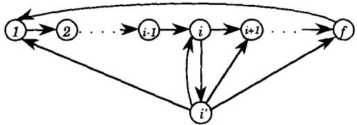
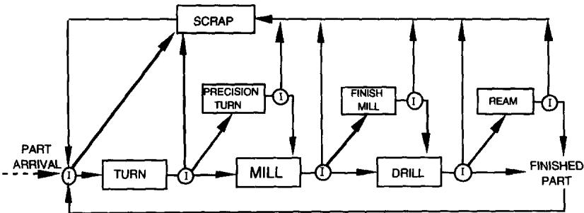
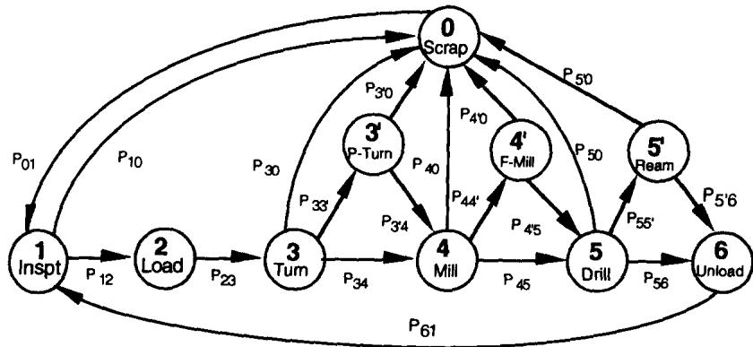
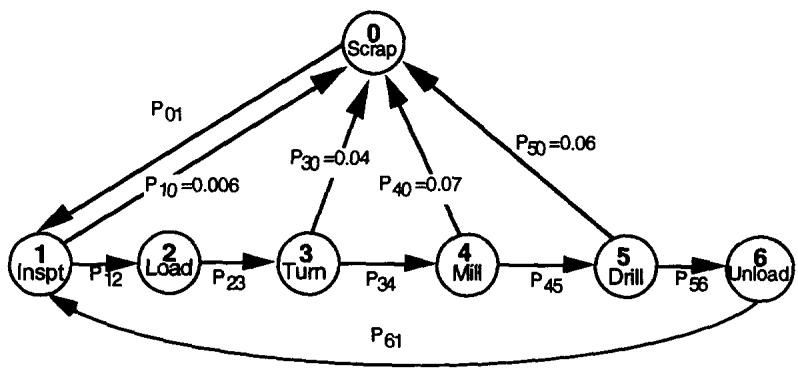
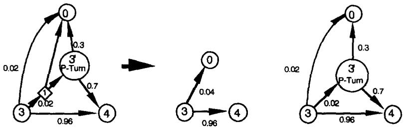
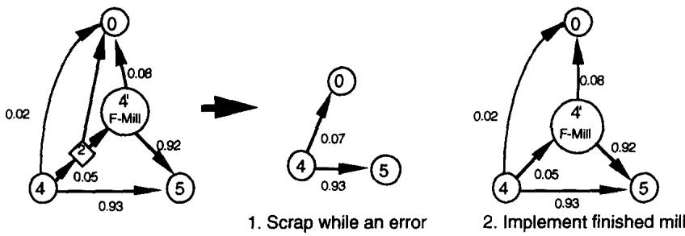
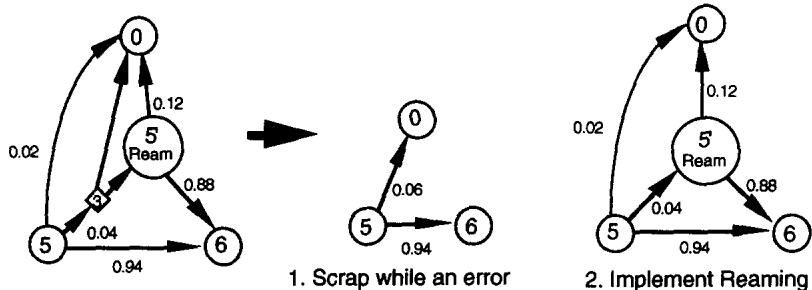

# Optimal recovery strategies for manufacturing systems

Jih-Forg Kao

Department of Industrial Engineering, University of Wisconsin-Madison, Madison, WI 53706, USA

## Abstract

This paper presents a framework to generate optimal error recovery strategies in automated single-server assembly processes. The proposed methodology uses a semi-Markovian model to capture the stochastic nature of the production process when dealing with error recovery. The manufacturing objective in this paper is throughput or profit maximization. A machining process in which only a fraction of errors can be recovered is illustrated. Using the proposed framework, we determine the optimal policy for system operations and obtain the corresponding net earning rate or part throughput.

## 1. Introduction

Production quality has been the focus of modern production systems as many production processes are incapable of generating perfect products. Operational faults often cause imperfect quality during the production process. Production techniques, inaccurate equipment, inappropriate calibrations, defective parts, and variations in raw materials are some sources that contributes to such faults. We refer to detectable faults during the production process as errors. Once errors are identified, corrective action can then be taken. Thus, how do we predict the system throughput and other performance measures such as net profit per unit of time while accounting for the effects of operational errors? Moreover, while considering multiple actions for correcting an error, how can we select the most promising one for productivity improvement? To answer these questions, this paper will provide a methodology for analyzing error recovery strategies.

Consolidating operations to a single machine can be effective for reducing production lead time. In general, this results from a reduction in the number of moves, time for machine setups, and time for loading and unloading. Flexible manufacturing cells and assembly systems capable of performing multiple operations sequentially are being developed and increasing introduced into manufacturing shop-floors. There are many of these flexible manufacturing cells consisting of single-serve systems (e.g. Seidmann, 1985, 1987, 1989; Kao, 1992; Yih, 1991) which are treated as building blocks for large modern manufacturing systems. The current study focuses on a single-server system which is defined as an automated system performing operations on only one workpiece at a time. Due to the growing use of such systems, it is crucial to develop mathematical models for analysis and justification of their utilization.

Seidmann and Nof (1985, 1989) and Wilhelm et al. (1986) introduced the concept of a unitary robotic assembly system and studied the characteristics of the system with reworks. However, they only considered rework after the completion of an assembly. Error recovery procedures should not only be actuated after the completion of an entire assembly, but also immediately after every error operation. Productivity may significantly increase as corrections are undertaken whenever there is an improper assembly operation rather than waiting until the end of the assembly. If a missing or defective part is detected, corrective action can be taken immediately rather than allowing extra operations on already defective assemblies. We present a generalized model which allows for error recovery policies that take immediate corrective action.

The methodology we use to evaluate and select error recovery strategies in this paper is semi-Markov decision process (SMDP). A thorough discussion of the theoretic basis for SMDP was introduced by Howard (1960, 1971), and the application of this methodology is increasing in many areas. White (1985, 1988) performed two general surveys of applications which use Markov and semi-Markov decision processes. An overview of theoretical and computational results for Markov decision processes can be found in White and White (1989).

Seidmann and Schweitzer (1984) modeled a flexible manufacturing cell using SMDP. The cell produces K types of parts for K emanating lines with finite input buffers of the downstream workstations. The optimal policy determines the next part type to be processed in the cell in order to minimize the shortage penalty per hour incurred by the production lines when they run out of input parts. Seidmann (1987) introduced a new model of the previously discussed manufacturing cell with sequence-dependent processing times, also using SMDP. Moreover, the control strategy proposed by Seidmann permits temporary suspension of the processing activities of the cell under certain conditions, even though the input buffers are not full. These approaches attempted to maintain productivity at the downstream workstations. Our study focuses on maximizing the productivity of the flexible manufacturing cell by examining in-process error recovery using SMDP.

This paper is organized as follows: Section 2 describes the fundamental basis of semi-Markov decision processes and provides an algorithm for evaluating the policies for error recovery. In Section 3, we introduce a machining example in which only a fraction of errors can be recovered. Section 4 discusses an illustrative example. Section 5 gives concluding remarks.

## 2. Defining an assembly process as a semi-Markov decision process

## 2.1. States, transition probabilities, holding times, and rewards

An assembly process can be defined as a sequence of operations by an assembly system or by human operators. The assembly tasks are specified as a sequence of operations starting from some initial state and leading to a goal state (Chang, 1989). When an unexpected event occurs, the assembly system must take an alternative action, i.e., either recover from the deviated condition or call for service from human operators. Thus, an error is a significant departure from the expected response after an operation by the system. Each individual operation causes a state transition to other states – either to the next target state or to the associated error state.

Whenever the process deviates from expectation, an error occurs. A typical state transition diagram is shown in Fig. 1. The assembly process begins from an initial state 1 and proceeds through states 2, 3, 4, and so on, to the goal state f resulting in a good product. After reaching the goal state, the process then returns to the initial state for the first operation of the next workpiece. When it proceeds from state i to $i + 1$ , it may reach the associated error state $i'$ . In order to achieve the goal state, a corrective action must be exploited at state $i'$ for restoring the process to its normal operations. Some common error recovery actions utilised in automated assembly systems are the following: first, corrective action can be taken by a human operator or by the system itself to reach the normal states, thus the resulting transition can be from $i'$ to $i+1$ after a corrective operation. Second, the recovery sequence can be from $i'$ to i, which restores the process back to the previous operation. Third, an action can be from the error state to the initial state, the part with an error being discarded. Fourth, an action may cause a transition from $i'$ to f directly if a human operator corrects the error and completes the remaining tasks. Other recovery actions, such as disassembling operations and taking multiple recovery alternatives with their associated selection probabilities, are also possible. For instance, we may choose the transitions from state $i'$ to state 1 and to state $i+1$ with probability $\alpha$ and $1-\alpha$ , respectively.

  
Fig. 1. State diagram of an assembly sequence.

Given a production process, we can define the state space by $S =$ finite set of states $\{i\}$ where $i$ is an operation. $|S| = N =$ the cardinality of $S$ , $A(i) =$ finite set of error recovery actions in state $i$ , $p_{ij}^{k}$ , $\overline{\tau}_{ij}^{k}$ , and $\overline{R}_{ij}^{k}$ are respectively the one-step transition probability, the mean holding time, and the expected one step transition reward to state $j$ if action $k$ is chosen while the process is in state $i$ where $k \in A(i)$ and $i$ , $j \in S$ . Let $a(i)$ denote the current action taken in state $i$ where $a(i) \in A(i)$ , and a policy, denoted by $\Omega$ , is a vector of $a(i)$ . A policy $\Omega = \{(a(1), a(2), \ldots, a(N)) | a(i) \in A(i), i \in S\}$ consists of an assigned action for every state $i$ . An optimal policy $\Omega^{*}$ is the most rewarding policy that is found according to some criteria (or under a specific reward structure). In the context of our discussion, the criterion we use is either throughput or profit optimization.

The transition probabilities $p_{ij}^{k}$ can be estimated from the production processes by the frequency counts to state j divided by the total trials in state i under action alternative k. The conditional mean holding time $\bar{\tau}_{ij}^{k}$ from state i to state j can be also collected by measuring the actual operation time. The mean holding time in state i is given by $\bar{\tau}_{i}^{k} = \sum_{j \in S} p_{ij}^{k} \bar{\tau}_{ij}^{k}$ which is the average time of the stay in state i under action k. The mean reward of each transition is defined by $\widetilde{R}_{i}^{k} = \sum_{j \in S} p_{ij}^{k} \overline{R}_{ij}^{k}$ at state i under action k.

For modeling the production processes, we make the following assumptions:

Assumption of no part-shortage: Parts are assumed to be always available for every operation.

Assumption of uni-chain (Schweitzer, 1985): The transition matrix $P(\Omega) = [p_{ij}^k]_{i,j \in S, k \in A(i)}$ has a single closed irreducible chain where $|S|$ is finite. Hence, the equilibrium distribution of the embedded Markov chain (stationary, infinite horizon) $\pi(\Omega) = \pi(\Omega)P(\Omega)$ and $\sum_{i \in S} \pi(\Omega)_i = 1$ is unique for each policy $\Omega$ .

These two assumptions are reasonable. Since the number of operations for producing a product is finite, $|S|$ is finite. Even for a sophisticated robot program directing robot movement, the number of instructions is seldom over a few thousand. Consider the worst case where each production operation requires a robot program instruction. The state space is still limited and manageable. Therefore, using a personal computer for solving a SMDP problem is sufficient as a tool for analysis.

In addition to the finiteness of the state space, it is clear that the Markov chain is irreducible from the state definition and the way we construct the Markov model. Production interruptions such as failures and part shortages may occur and the process needs to be restored to continue its normal operations. Parts are produced repetitively one after another until a large batch size is satisfied. Thus, a single irreducible chain (without absorbing states) fits this manufacturing setup and best captures the repetitiveness of the manufacturing processes.

## 2.2. Reward structures

For maximizing the objective function (profit or throughput), we must define rewards $\overline{R}_{ij}^{k}$ , for action alternative k from state i to state j, in a way that can lead to a search of the optimal solution. We will define two reward structures to reflect two different manufacturing objectives – throughput optimization and profit optimization.

Reward structure for throughput optimization: If our manufacturing objective is to maximize the throughput rate, we assign $\overline{R}_{ij}^{k}=1$ if a visit to state j results in a good product; otherwise $\overline{R}_{ij}^{k}=0$ . The gain from a SMDP will be the throughput (production rate). This reward structure allows us to search for the policy that optimizes the gain.

Reward structure for profit optimization: If the decision criterion for selecting an error recovery policy for system operations is net profit, a new structure needs to be defined. The profit must account for the cost of operating the equipment, raw materials, tooling, and required input parts. For some error recovery alternative, the system needs to acquire some technology such as vision system, inspection gauges, and other tooling instruments. The acquisition cost varies according to various technologies. Some error recovery policies require more raw materials or input parts and may also produce more scrap. For a given length of operation time t (hours), the system operating cost can be determined by ct if the operating cost is given by c dollars/hour. In order to account for these factors, we define the reward $\overline{R}_{ij}^{k}$ for profit optimization as follows:

$\overline{R}_{ij}^{k} = \text{Cost or profit of a transition from state } i \text{ to state } j + (\text{operating cost associated with machine operation}) = \overline{C}_{ij}^{k} + c_{ij} \overline{\tau}_{ij}^{k}, \text{ where } c_{ij} \text{ is the operating cost per unit of time;}$

1) $\overline{C}_{ij}^{k}$ represents a positive number of profit (in dollars) if a transition results in a reward such as a good product or a scrap (some scrap has a value, e.g. steel scrap) from state $i$ to $j$ under action alternative $k$ ;

2) $\overline{C}_{ij}^{k}$ represents the mean of a loss (a negative number of dollars) if a transition requires the acquisition of a component part, raw material, inspection gauges, or sensing technologies, from state i to j under action alternative k;

3) $c_{ij} \bar{\tau}_{ij}^k$ represents a loss incurred by receiving service from the machine. This loss is proportional to the length of the holding time.

The gain, or reward rate (in dollars per unit of time), of a production process under this reward structure is the net earning rate for operating the production of the current system. This gain can be determined from a SMDP. We will use an example to illustrate the use of the reward structure in Section 4.

Although the reward structure of throughput optimization is a special case of profit optimization, the throughput optimization has a reward structure that is easy to implement without cost parameters. Especially, when the assembly cell is the bottleneck of the production, it is preferable to optimize its throughput to reflect our manufacturing needs.

## 2.3. Optimization

The policy iteration algorithm (Howard, 1971) will be used to evaluate the policies for optimizing the throughput rate. The algorithm is given as follows:

Initialization:

Select an arbitrary policy $\Omega$ from all of the feasible policies.

Policy evaluation:

Solve Eq. (1) for the gain $(g)$ and relative values $v_{i}$ under the policy $\Omega$ be setting $v_{r} = 0$ where $r\in S$ is arbitrary. (e.g. we assign $v_{1} = 0$ ).

$$
v _ {i} + g \bar {\tau} _ {i} = \overline {{{R}}} _ {i} + \sum_ {j = 1} ^ {N} p _ {i j} v _ {j}, \quad i = 1, 2, 3, \dots , N \text { and } v _ {r} = 0.\tag{1}
$$

Policy improvement:

Use the obtained relative values $v_{i}$ to find the action k in each state i that maximizes the test quantity $\Gamma_{i}^{k}$ . Then, we determine an improved policy $\Omega^{new}$ .

$$
\Gamma_ {i} ^ {k} = \frac {\overline {{R}} _ {i} ^ {k}}{\overline {{\tau}} _ {i} ^ {k}} + \frac {1}{\overline {{\tau}} _ {i} ^ {k}} \left[ \sum_ {j = 1} ^ {N} p _ {i j} ^ {k} (v _ {j} - v _ {i}) \right].\tag{2}
$$

Termination test:

Repeat policy evaluation step to solve g and $v_{i}$ for the new policy until there is no action that can improve the testing quantity.

The SMDP approach is to make the best selection every time the system enters a decision state and terminates with an optimal policy through the sequential selection processes for all decision states. In Eq. (1), a set of $N+1$ linear equations is solved for the gain g and relative values $v_{i}$ . The uni-chain assumption assures that these $N+1$ equations, including $v_{r}=0$ , uniquely determine the $N+1$ unknowns $(g,v_{1},v_{2},\ldots,v_{N})$ (Schweitzer, 1985). The gain under the throughput optimization reward structure is the throughput rate. The gain is the net profit rate under profit optimization reward structure. Here, the relative values are the indexes of relative preference (units of production or dollars). For example, given that the embedded Markov chain is non-periodic, $v_{j}-v_{i}$ is the difference in the total production units caused by starting the process in state j rather than in state i. The use of relative values allows us to search for an improved policy as done in Eq. (2). In Eq. (2), only the second term in the right-hand side affects the searching process for an improved action at state i. The second term reflects the mean difference reward rate in which all possible transitions from state i to state j under action k are compared.

## 3. Applications in manufacturing systems

While the proposed model deals with automatic assembly systems, it can also be applied to many other manufacturing systems. Consider a machining center which can perform different operations by changing appropriate tools and driving mechanisms. The machining center is designed to produce a shaft-like part by undertaking three sequential operations – turning, milling, and drilling of a metal bar. The operational flow is shown in Fig. 2. Note that a rectangle denotes a machining operation, not a workstation. An arc connects an operation to its successor. A circle represents an inspection operation. The first inspection is to reject the unsatisfactory incoming bar before it is loaded on the fixture. If an incoming bar passes the inspection, it is processed by a turning operation. Otherwise, the rejected bar is scrapped and the process moves to inspect the next bar. After each operation, an inspection follows to assure the dimensions are within the specified tolerance limits.

Let X be the actual dimension after some operation and let $X_{1}$ and $X_{u}$ be the lower and upper acceptable limit (e.g. $1 \pm 0.001$ ). If $X_{1} \leq X \leq X_{u}$ , the system will perform the next operation on the workpiece. If $X < X_{i}$ , the defective workpiece must be scrapped. If $X > X_{u}$ , the workpiece is defective but reworkable because there is extra material which can be cut. But this does not necessarily mean that a rework will be applied when $X > X_{u}$ . We need to justify the rework in terms of better performance.

  
Fig. 2. Manufacturing process with error recovery.

Davis and Kennedy (1987) studied a serial system consisting of a number of workstations with rework for producing a shaft by three successive operations – turning, milling, and drilling. Each operation uses a dedicated machine. The machines in their model are turning, milling, drilling, precision turning, and precision milling. Precision machines are used only for rework operations. They considered rework whenever an error occurred. However, not all of the machined workpieces with errors are reworkable. For instance, the dimension of the workpiece after turning may be below the specified lower tolerance limit. In our model, we will consider the feasibility of reworking parts and also consider whether to rework defective but recoverable workpieces within a flexible manufacturing cell.

Fig. 3 shows the Markov chain whose states are defined in accordance with the operations. Since we assume there is no error associated with the inspections, we combined them into their associated operations. Note that not all inspections are shown explicitly in Fig. 3 because their presence is implicit in the state transition diagram. However, the times for inspections are included in the operations. For instance, state 3 includes both the turning process and the inspection that follows. After the inspection is made for turning, the process makes a transition according to the appropriate transition probability.

Table 1 provides sample data associated with each individual operation of the machining process. We use these data values in all examples that follow. Note that precision operations often require much longer machining time compared with the regular operations.

  
Fig. 3. Sequence of operations for the illustrative example.

1. Scrap while an error  
Table 1  
Operation times and transition probabilities

<table><tr><td>From state</td><td>To state</td><td>Probability</td><td>Operation + Inspect time</td><td>From state</td><td>To state</td><td>Probability</td><td>Operation/Inspect time</td></tr><tr><td>0</td><td>1</td><td>1</td><td>0.6</td><td>5</td><td>6</td><td>0.94</td><td>3.2</td></tr><tr><td>1</td><td>2</td><td>0.994</td><td>1.0</td><td>5</td><td> $5'$ </td><td>0.04</td><td>3.2</td></tr><tr><td>1</td><td>0</td><td>0.006</td><td>1.0</td><td>5</td><td>0</td><td>0.02</td><td>3.2</td></tr><tr><td>2</td><td>3</td><td>1</td><td>1.3</td><td>6</td><td>1</td><td>1</td><td>0.6</td></tr><tr><td>3</td><td>4</td><td>0.96</td><td>4.2</td><td> $3'$ </td><td>4</td><td>0.7</td><td>5.2</td></tr><tr><td>3</td><td> $3'$ </td><td>0.02</td><td>4.2</td><td> $3'$ </td><td>0</td><td>0.3</td><td>5.2</td></tr><tr><td>3</td><td>0</td><td>0.02</td><td>4.2</td><td> $4'$ </td><td>5</td><td>0.92</td><td>4.9</td></tr><tr><td>4</td><td>5</td><td>0.93</td><td>3.5</td><td> $4'$ </td><td>0</td><td>0.08</td><td>4.9</td></tr><tr><td>4</td><td> $4'$ </td><td>0.05</td><td>3.5</td><td> $5'$ </td><td>6</td><td>0.88</td><td>4.7</td></tr><tr><td>4</td><td>0</td><td>0.02</td><td>3.5</td><td> $5'$ </td><td>0</td><td>0.12</td><td>4.7</td></tr></table>

  
Fig. 4. A policy without any precision mode for the illustrative example.

The set of selected actions for all error states forms a policy. One policy for operating this system is to reject the defective part whenever an error occurs. Fig. 4 shows the transitions of the process under this policy in which there is no precision mode for error recovery. The unfinished part will be scrapped if the specifications are not met. In contrast, Fig. 3 shows another policy in which the defective part is reworked whenever it is recoverable. Including these two policies, the total number of feasible policies is eight, since there are three error states and each associates with two possible actions. Figs. 5, 6, and 7 show the possible actions at each error state with the corresponding transition probabilities. For instance, we can scrap the unfinished part when an error occurs after a turning operation. We call this case action 1 of state 3 as shown in Fig. 5. In contrast, action 2 is to use precision turning to correct the error.

  
Fig. 5. Two alternative actions for a rework after Turning.

Table 2  
  
Fig. 6. Two alternative actions for a rework after Milling.

  
Fig. 7. Two alternative actions for a rework after Drilling.

## 4. Evaluation of a semi-Markov decision process

## 4.1. Throughput optimization

We use the data in Table 1 to construct $P(\Omega)$ and $\bar{\tau}(\Omega), \forall \Omega$ , where $\overline{R}_{ij}^{k} = 1$ if $j = 6$ and $\overline{R}_{ij}^{k} = 0$ otherwise. We can evaluate each individual policy by solving Eq. (1) for the gain (the throughput). Specifically, Eq. (1) is useful to obtain the throughput when there are no multiple actions to select from. Table 2 shows the throughputs of each policy obtained by repeating the evaluation of Eq. (1) for each policy. The optimal policy, which leads to the highest throughput, is policy 5 which has a throughput of

Throughputs for the eight policies

<table><tr><td>Policy number</td><td>Policy description</td><td>Throughput</td></tr><tr><td> $\Omega_1$ </td><td>P-Turn, F-Mill, Ream</td><td>3.94943</td></tr><tr><td> $\Omega_2$ </td><td>P-Turn, F-Mill</td><td>3.85600</td></tr><tr><td> $\Omega_3$ </td><td>P-Turn, Ream</td><td>3.87109</td></tr><tr><td> $\Omega_4$ </td><td>P-Turn</td><td>3.77836</td></tr><tr><td> $\Omega_5$ </td><td>F-Mill, Ream</td><td>3.95002 *</td></tr><tr><td> $\Omega_6$ </td><td>F-Mill</td><td>3.85638</td></tr><tr><td> $\Omega_7$ </td><td>Ream</td><td>3.87118</td></tr><tr><td> $\Omega_8$ </td><td>None</td><td>3.77845</td></tr></table>

\* Optimal policy.

3.95002 parts/hour. This policy consists of the action decisions which reject the defective part after the turning operation and use finished-milling and reaming for a rework after the milling and drilling operation, respectively.

Using SMDP model, we select an initial policy named $\Omega_{1}$ which is to implement all precision operations whenever these is an error and perform the policy evaluation step. The transition matrix $P(\Omega_{1})$ and the mean holding time matrix $\bar{\tau}(\Omega_{1})$ are given by

$$
\begin{array}{l} \text {P} (\Omega_ {1}) = \\ \left[ \begin{array}{c c c c c c c c c c} 0 & 1 & 2 & 3 & 3 ^ {\prime} & 4 & 4 ^ {\prime} & 5 & 5 ^ {\prime} & 6 \\ 0 & 1 & 0 & 0 & 0 & 0 & 0 & 0 & 0 & 0 \\ 1 & 0. 0 0 6 & 0 & 0. 9 9 4 & 0 & 0 & 0 & 0 & 0 & 0 \\ 2 & 0 & 0 & 0 & 1 & 0 & 0 & 0 & 0 & 0 \\ 3 & 0. 0 2 & 0 & 0 & 0 & 0. 0 2 & 0. 9 6 & 0 & 0 & 0 \\ 3 ^ {\prime} & 0. 3 & 0 & 0 & 0 & 0 & 0. 7 & 0 & 0 & 0 \\ 4 & 0. 0 2 & 0 & 0 & 0 & 0 & 0 & 0. 0 5 & 0. 9 3 & 0 \\ 4 ^ {\prime} & 0. 0 8 & 0 & 0 & 0 & 0 & 0 & 0 & 0. 9 2 & 0 \\ 5 & 0. 0 2 & 0 & 0 & 0 & 0 & 0 & 0 & 0 & 0. 9 4 \\ 5 ^ {\prime} & 0. 1 2 & 0 & 0 & 0 & 0 & 0 & 0 & 0 & 0 \\ 6 & 0 & 1 & 0 & 0 & 0 & 0 & 0 & 0 & 0 \end{array} \right] \\ \bar {\tau} (\Omega_ {1}) = \\ \left[ \begin{array}{c c c c c c c c c c} \bar {\tau} (\Omega_ {1}) = \\ \bar {\tau} (\Omega_ {1}) = \end{array} \right] \end{array}
$$

Setting and solving Eq. (1) generates the relative values $v_{i}$ and the gain g where g is the throughput rate of the chosen policy.

$$
\begin{array}{l} \left[ v _ {i} \right] = [ 0, 0. 0 3 9 4 9 9 3, 0. 1 0 5 9 6 7, 0. 1 9 1 5 4 9, - 0. 0 0 1 0 3, 0. 4 8 7 5 6 7, 0. 3 6 9 4 1, 0. 7 5 2 1 6 1, 0. 5 7 0 5 8 9, 0 ], \\ i \in \{0, 1, 2, 3, 3 ^ {\prime}, 4, 4 ^ {\prime}, 5, 5 ^ {\prime}, 6 \}. \end{array}
$$

$$
g = 0. 0 6 5 8 3 2 2 (\text { parts   /   min. }) = 3. 9 4 9 9 3 (\text { parts   /   hour }).
$$

Table 3 shows the results of the first-pass and the second-pass calculations of the policy improvement step. For example, for action 1 at state 3, the test quantity of the first iteration is calculated by

$$
0 / 4. 2 + \left[ 0. 0 4 v _ {0} + 0. 9 6 v _ {4} - v _ {3} \right] / 4. 2 = 0. 0 6 5 8 3 7.
$$

Comparison of the test quantities leads to the favored selection of action 1 (replacing action 2) at state

Table 3  
Results of the first-pass after policy improvement

<table><tr><td>State i</td><td>Action k</td><td>Transition probability</td><td>Expected reward rate  $\overline{R}_{i}^{k}/\overline{\tau}_{i}^{k}$ </td><td>First iteration  $\Gamma_{i}^{k}$ </td><td>Second iteration  $\Gamma_{i}^{k}$ </td></tr><tr><td rowspan="2">3</td><td>1</td><td> $[P_{3j}] = [0.04, 0, 0, 0, 0, 0.96, 0, 0, 0, 0]$ </td><td>0/4.2</td><td>0.065837 *</td><td>0.065834 *</td></tr><tr><td>2</td><td> $[P_{3j}] = [0.02, 0, 0, 0, 0.02, 0.96, 0, 0, 0, 0]$ </td><td>0/4.2</td><td>0.065832</td><td>0.062645</td></tr><tr><td rowspan="2">4</td><td>1</td><td> $[P_{4j}] = [0.07, 0, 0, 0, 0, 0, 0, 0.93, 0, 0]$ </td><td>0/3.5</td><td>0.060555</td><td>0.060557</td></tr><tr><td>2</td><td> $[P_{4j}] = [0.02, 0, 0, 0, 0, 0, 0.05, 0.93, 0, 0]$ </td><td>0/3.5</td><td>0.065832 *</td><td>0.065834 *</td></tr><tr><td rowspan="2">5</td><td>1</td><td> $[P_{5j}] = [0.06, 0, 0, 0, 0, 0, 0, 0, 0, 0.94]$ </td><td>0.94/3.2</td><td>0.058700</td><td>0.058701</td></tr><tr><td>2</td><td> $[P_{5j}] = [0.02, 0, 0, 0, 0, 0, 0, 0, 0.04, 0.94]$ </td><td>0.94/3.2</td><td>0.065832 *</td><td>0.065834 *</td></tr></table>

\* Favored action.

3. This selected policy is then evaluated at the next iteration. The second iteration of the process generates the results as below:

$$
[ v _ {i} ] = [ 0, 0. 0 3 9 5, 0. 1 0 5 9 7, 0. 1 9 1 5 5, - 0. 0 0 1 0 5, 0. 4 8 7 5 5 7, 0. 3 6 9 3 9 8, 0. 7 5 2 1 5 6, 0. 5 7 0 5 8, 0 ].
$$

$$
g = 0. 0 6 5 8 3 3 6 (\text { parts   /   min. }) = 3. 9 5 0 0 2 (\text { parts   /   hour }).
$$

Table 3 also shows that there is no policy change at the second iteration. Thus, the optimal policy consists of the following actions: rejecting the defective part after the turning, but using finished milling and reaming after the milling and drilling operations, respectively. Due to the long operation time of a precision turning (5.2 seconds) and relatively low success probability (0.7), bringing the defective workpiece for a rework after a turning is not justifiable. Although rejecting an incomplete workpiece wastes operation time, it does outperform the result of a long precision turning rework.

The results of the example show that implementing all possible rework actions does not necessarily constitute an optimal error recovery policy in throughput. In the above example, we see that while precision turning is not justifiable, precision milling and drilling are. This also shows that recovery strategies need to be justified according to some manufacturing objective, throughput in this case.

## 4.2. Profit optimization

We use the same data of the above example and introduce the following cost settings:

Pv: Product value 14 dollars/piece.

Mb: Metal bar 2.1\$/per piece.

C: CNC Machine operating cost 36\$/hour. (This can be calculated from capital investment and annual operating cost for the universal machining center.)

Pt: Precision turning cost 0.6\$/per acquisition. (This can be determined on the average basis.)

Fm: Finished milling cost 0.45 \$/per acquisition.

Rm: Reaming cost 0.8 \$/per acquisition.

S: Scrap 0.4\$/per piece (scrapped metal bar).

Using the above settings, we define the rewards for policy $\Omega_1$ , which is to use all precision reworks after an operation error, as follows:

$$
\bar {R} _ {0} = - C \bar {\tau} _ {0} = - 0. 3 6, \quad \bar {R} _ {1} = S ^ {*} P _ {1 0} - M b - C \bar {\tau} _ {1} = - 2. 6 9 7 6,
$$

$$
\overline {{{R}}} _ {2} = - C \bar {\tau} _ {2} = - 0. 7 8, \quad \overline {{{R}}} _ {3} = S ^ {*} P _ {3 0} - C \bar {\tau} _ {3} = - 2. 5 1 2,
$$

$$
\overline {{{R}}} _ {3 1} = S ^ {*} P _ {3 ^ {\prime} 0} - P t - C \bar {\tau} _ {3 ^ {\prime}} = - 4. 6 8, \quad \overline {{{R}}} _ {4} = S ^ {*} P _ {4 0} - C \tau_ {4} = - 2. 0 9 2,
$$

Table 4  
Results of the first-pass after policy improvement

<table><tr><td>State i</td><td>Action k</td><td>Transition probability</td><td>Expected reward rate  $\overline{R}_i^k/\overline{\tau}_i^k$ </td><td>First iteration  $\Gamma_i^k$ </td></tr><tr><td rowspan="2">3</td><td>1</td><td> $[P_{3j}] = [0.04, 0, 0, 0, 0, 0.96, 0, 0, 0, 0]$ </td><td>-2.512/4.2</td><td>0.16632</td></tr><tr><td>2</td><td> $[P_{3j}] = [0.02, 0, 0, 0, 0.02, 0.96, 0, 0, 0, 0]$ </td><td>-2.504/4.2</td><td>0.16930 *</td></tr><tr><td rowspan="2">4</td><td>1</td><td> $[P_{4j}] = [0.07, 0, 0, 0, 0, 0, 0, 0.93, 0, 0]$ </td><td>-2.092/3.5</td><td>0.08993</td></tr><tr><td>2</td><td> $[P_{4j}] = [0.02, 0, 0, 0, 0, 0, 0.05, 0.93, 0, 0]$ </td><td>-2.072/3.5</td><td>0.16930 *</td></tr><tr><td rowspan="2">5</td><td>1</td><td> $[P_{5j}] = [0.06, 0, 0, 0, 0, 0, 0, 0, 0, 0.94]$ </td><td>11.264/3.2</td><td>0.07491</td></tr><tr><td>2</td><td> $[P_{5j}] = [0.02, 0, 0, 0, 0, 0, 0, 0, 0.04, 0.94]$ </td><td>11.248/3.2</td><td>0.16930 *</td></tr></table>

\* Favored action.

$$
\overline {{R}} _ {4 ^ {\prime}} = S ^ {*} P _ {4 ^ {\prime} 0} - F m - C \bar {\tau} _ {4 ^ {\prime}} = - 3. 3 5 8, \quad \overline {{R}} _ {5} = S ^ {*} P _ {5 0} + P v P _ {5 6} - C \bar {\tau} _ {5} = 1 1. 2 4 8,
$$

$$
\bar {R} _ {5} = S ^ {*} P _ {5 ^ {\prime} 0} + P v P _ {5 ^ {\prime} 5} - R m - C \bar {\tau} _ {5 ^ {\prime}} = 8. 7 4 8, \quad \bar {R} _ {6} = - C \bar {\tau} _ {6} = - 0. 3 6.
$$

Solving Eq. (1) for the initial policy $\Omega_{1}$ , we obtain

$[v_i] = (0, 0.4604, 3.3454, 4.343, -0.33559, 7.8797, 5.97055, 11.031, 7.9615, 0)$ .

$$
g = 0. 1 6 9 2 9 9 (\text {   dollars / min   }) = 1 0. 1 6 (\text {   dollars / hour   }).
$$

Using the parameter settings, we evaluate the SMDP for profit optimization. We show the results of the policy improvement in Table 4. The results reveal that the policy remains unchanged after the policy improvement step; i.e., the initial policy is determined to be the optimal policy. The determined optimal policy for error recovery is to implement precision turning, finished milling, and reaming. The net earning rate is 10.16 dollars/hour. This optimal operating policy reflects all favorable outcomes which are to generate more good product, minimize the required quantities of raw materials, and reduce the use of high cost operating alternatives in order to increase the profit.

The observations from the throughput and profit optimization examples suggest that the optimal system operating policy may change according to the manufacturing objectives. Since different manufacturing objectives for productivity improvement result in different optimal operating policies, an analysis, for example a SMDP approach, needs to be performed for ensuring optimality.

We also observe that the solution process using the policy evaluation algorithm is simple and efficient. It only required two solutions for the N simultaneous linear equations (with one known parameter $v_{r}=0$ ) in Eq. (1) to obtain the relative values and the gain for the previous example. In contrast, an enumerated approach solving Eq. (1) for each policy to obtain the throughput required eight solutions from the N equations. The enumeration approach is computationally inefficient, especially when the number of error states and/or the possible actions for error corrections are not small.

## 5. Conclusions and remarks

This paper demonstrated the feasibility of applying the semi-Markov decision processes to generate an optimal error recovery policy for system operations. Error recovery in an assembly cell was formulated as a Markov decision problem in which each error state is a decision epoch and the assembly sequence is the state variable. Through the proposed analysis, the optimal error-recovery policy can be chosen from among the alternative actions, and optimal system operating policy can be determined in light of manufacturing objectives such as throughput or profit optimization. The approach is an efficient tool that can be effectively applied to sophisticated flexible manufacturing cells with multiple alternative actions for dealing with error recovery.

As we are concerned with the interactions among part input processes with infinite buffer spaces, a preliminary study can be found in Kao and Sanders (1993a) which attempts to relax the assumption of no part-shortage. Our ongoing research focusing on an assembly cell with multiple finite buffers is to explore an approach (for example characterizing the effects of part shortage) without explicitly enumerating the states of each input buffer.

## Acknowledgments

The author is deeply indebted to two referees for their constructive comments on the presentation of these results. The author is grateful to Dr. Jerry L. Sanders for many helpful suggestion and to Felicia Roberts for a careful reading of the manuscript.

## References

Chang, K.H., and Edhala, M. (1989), “Error recovery: a condition-oriented replanning approach”, IEEE Transactions on Systems, Man, and Cybernetics 19/1, 130–134.

Davis, R.P., and Kennedy, W.J. (1987), “Markovian modeling of manufacturing systems”, International Journal of Production Research 25/3, 337–351.

Howard, R.A. (1960), Dynamic Programming and Markov Processes, MIT Press, Cambridge, MA.

Howard, R.A. (1971), Dynamic Probabilistic Systems: Semi-Markov and Decision Processes, Vol. II, Wiley, New York.

Kao, J.-F., and Sanders, J.L. (1992), "Impact of error recovery on the productivity of a unitary assembly cell", IEEE Transactions on Robotics and Automation 8/6, 730–740.

Kao, J.-F., and Sanders, J.L. (1993a), “Queues in assembly cells”, Technical Report 93-3, Dept. of Industrial Engineering, University of Wisconsin-Madison, Madison, WI.

Kao, J.-F., and Sanders, J.L. (1993b), “Resource and operation policy selection for manufacturing systems”, International Journal of Production Research, to appear.

Schweitzer, P.J., and Seidmann, A. (1985), “Generalized polynomial approximations in Markovian decision processes”, Journal of Mathematical Analysis and Applications 110, 568–582.

Seidmann, A. (1987), “On-line scheduling of a robotic manufacturing cell with stochastic sequence-dependent processing rates”, International Journal of Production Research 25/6, 907–924.

Seidmann, A., and Nof, S.Y. (1985), “Unitary manufacturing cell design with random product feedback flow”, IIE Transactions 7/2, 188–193.

Seidmann, A., and Nof. S.Y. (1989), “Operational analysis of an autonomous assembly robotic station”, IEEE Transactions on Robotics and Automation 5/1, 4–15.

Seidmann, A., and Schweitzer, P.J. (1984), “Part selection policy for a flexible manufacturing cell feeding several production lines”, IIE Transactions 16, 355–362.

White, D.J. (1985), “Real applications of Markov decision processes”, Interfaces 15/6, 73–83.

White, D.J. (1988), “Further real applications of Markov decision processes”, Interfaces 18/5, 55–61.

White, III, C.C., and White, D.J. (1989), "Markov decision processes", European Journal of Operational Research 39, 1–16.

Wilhelm, R.G., Nof, S.Y., and Seidmann, A. (1989), “Analysis of recirculation in robotic systems using feedback models”, Materials Flow 3, 69–82.

Yih, Y., and Thesen, A. (1991), “Semi-Markov decision models for real-time scheduling”, International Journal of Production Research 29/11, 2331–2346.