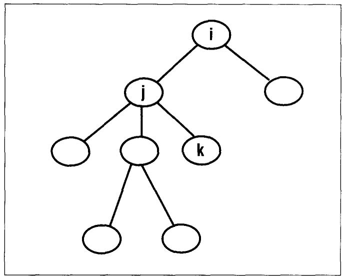
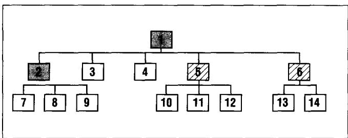
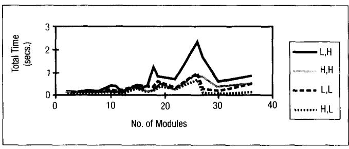
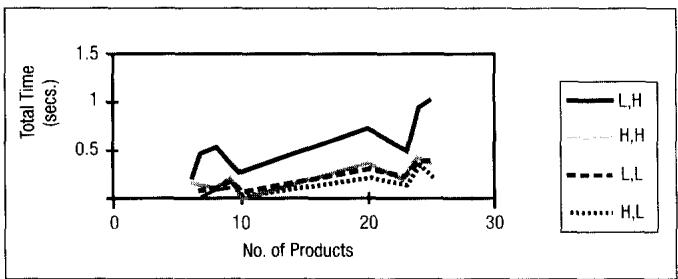

# Optimal Disassembly Configurations for Single and Multiple Products

Anu Meacham, Reha Uzsoy, and Uday Venkatadri, School of Industrial Engineering, Purdue University, West Lafayette, Indiana

## Abstract

This paper considers the problem of determining optimal disassembly configurations for single and multiple products, that is, which assemblies and subassemblies to disassemble and which to leave intact. The paper first examines the problem of determining revenue-maximizing disassembly configurations for a single product using the hierarchical product tree representation, and develops a linear time algorithm for its solution. This algorithm is then extended to the case where fixed costs may be associated with disassembly of some nodes in the product tree. Finally, the problem of meeting a specified demand for recovered components and subassemblies from an available inventory of recovered products, where disassembly capacity is limited and products may have common components, is formulated as an optimization problem. A column-generation algorithm for this problem is presented that is capable of solving reasonably sized problems in a few seconds of CPU time on average.

Keywords: Disassembly Planning, Column Generation, Environmentally Conscious Manufacturing

## Introduction

Increased public awareness of environmental issues has led to growing concern with the environmental implications of product designs and manufacturing processes. This concern is becoming more acute with pending legislation in a number of European countries, notably Germany and the Netherlands, placing primary responsibility for the environmentally safe disposal of a product at the end of its life on the primary producer. $^{1,2}$ The increasing shortage of landfill space and expanding regulation of waste disposal are all combining to drive up the costs of waste disposal significantly in the next few years. $^{3}$ While a number of industries, such as automobiles, chemicals, and paper, have been facing these issues for the last two decades due to the nature of their products and processes, the electronics industry has only recently begun to face major problems associated with solid waste disposal. However, the volume of electronic products finding its way into the waste stream is considerable and expected to increase significantly. $^{1}$ Although the product-takeback legislation will most directly affect European companies, it will also affect U.S. companies operating in the European market. Hence considerations resulting from European regulation and legislation may well have significant impacts on the U.S. electronics industry. A number of organizations in the U.S., such as the Microelectronics and Computer Technology Corp., $^{4}$ have been examining the problem of end-of-life recovery of electronic products, including their collection and recovery by third-party providers.

While there is a great deal of ongoing research on the design of products for ease of disassembly and recycling (design for environment, design for disassembly, design for recyclability), $^{5,6}$ there have been relatively few decision support models developed to date that are aimed at giving managers and engineers quick insights into the economic consequences of disassembly decisions. A major component of these decisions is to decide how far to disassemble a certain product, given estimates of the costs of disassembling each subassembly and the costs or revenues associated with recovering the components and subassemblies (for reuse or resale in secondary markets, for example) or disposing of them. On the one extreme, it is possible to disassemble the entire product down to the basic materials involved; however, it is often more profitable to sell major subassemblies in secondary markets, perhaps after refurbishing or remanufacturing. While clearly a significant portion of this cost is affected by the design of the product, it is also affected by the price of labor (which determines disassembly costs), as well as the prices commanded by the components, subassemblies, and recovered materials in the current marketplace. Another important factor affecting the economics of product disassembly is the volume of the products to be disassembled.

The models suggested in this paper address these issues by providing rapid estimates of revenues, as well as revenue-maximizing disassembly configurations. The models can be used to perform sensitivity analyses to determine which component prices or costs have significant effects on the economics of disassembling the product as well as individual sub-assemblies. At a tactical level, the models can be used to perform rapid estimates of profit to determine whether or not a product should be disassembled and, if so, how far. This use of the models requires estimates of the revenue and disassembly cost of each subassembly and component in the bill of materials. While disassembly costs are clearly not accurately known until a specific disassembly sequence has been determined, the models presented here can be used to provide sensitivity and break-even analyses to indicate critical subassemblies and components to engineers. In addition, they can be used to eliminate disassembly configurations that will not be economical, reducing the size of the disassembly sequencing problem to be addressed. When linked to a database containing disassembly and life cycle estimates of environmental impacts, they can be used to give designers a quick estimate of the impact of specific design choices on the economics and environmental impact of the overall product.

## Previous Related Work

Companies have responded to increasing environmental pressures in several different ways. The life cycle approach to sustainable product development is being studied and applied in a wide range of companies. $^{7}$ These activities aim at developing product designs that reduce the end-of-life disposal costs of the product through material reduction, recycling, and reuse of raw materials and components, and remanufacturing, such as through design for disassembly. $^{6,8}$ Most of these efforts aim at developing more environmentally benign materials and processes to use in products, or the means to quantify the environmental costs of design decisions at early stages of the design process. $^{9,10}$ Extensive studies of the recyclability of different electronic products have been undertaken in the appliance and home electronics industries, $^{1}$ the computer industry, $^{4}$ and other areas of the electronics industry. $^{11}$ Zhang, Lu, and Huang $^{12}$ provide an extensive review of the literature in this area.

A number of efforts aimed at designing products that are easy to disassemble are currently in progress. $^{6,8}$ The issue of determining disassembly configurations that achieve an optimal trade-off between disassembly costs and the gains from reusing or recycling the items thus obtained has also been studied. Navin-Chandra $^{13}$ points out that it is not always the best strategy to totally disassemble a product because there is a trade-off between the cost of disassembling a product to a certain point and the gain (revenue or environmental benefits) obtainable from selling, reusing, or recycling the items obtained by this disassembly. He formulates the problem as a variant of the Traveling Salesman Problem and suggests an enumerative solution procedure as well as a heuristic search procedure. Johnson and Wang $^{14,15}$ address the problem of determining disassembly sequences that maximize economic benefit. They adopt a cost framework similar to that used in this paper and propose a number of rules for deciding whether to disassemble or dispose of each component. However, their approach appears to consider costs and revenues for each component individually. In reality, the optimal decision regarding a given component or subassembly will be affected by the optimal decisions for its own components. This paper explicitly considers this interaction in the algorithms. Johnson and Wang also suggest an approach to the disassembly sequencing problem based on a disassembly tree representation similar to that used in this paper. Li et al. $^{16}$ develop a mathematical programming model of the disassembly sequencing problem and solve it using simulated annealing. Beasley and Martin $^{17}$ present algorithms to determine disassembly sequences for objects made up of unit cubes. Zussmann, Kriwet, and Seliger $^{18}$ suggest an approach for determining the optimal path through the AND/OR tree of disassembly sequences. Penev and de Ron $^{19}$ present an algorithm for determining the optimal disassembly strategy for a single product which is similar to that presented in the following section, although it uses a somewhat different product representation. In particular, rather than represent the disassembly sequence as an AND/OR tree, in the present paper the disassembly options of each individual node are represented in the product structure, where components or subassemblies represented by child nodes are obtained from the total or partial disassembly of the parent node. This representation assumes that a partial order of disassembly tasks is defined by the product structure, such that a lower level node cannot be disassembled unless its parent node has been disassembled. The results from the algorithm can later be fed into an algorithm to determine optimal disassembly sequence. This work on disassembly sequencing is also related to previous work on developing assembly sequences, such as that of Homem de Mello and Sanderson $^{20}$ and De Fazio and Whitney. $^{21}$

The work most closely related to this paper is that of Gupta and his coworkers, $^{22,23}$ who address the problem of developing effective disassembly configurations for single and multiple products using a product representation similar to that suggested in this paper. They extend the well-known Material Requirements Planning (MRP) algorithm $^{24}$ to this problem. However, their procedures do not guarantee exact solutions and do not consider limited disassembly capacity, although they do consider common components among products and limited inventory of products available for disassembly.

This paper first presents an alternative algorithm for determining maximum revenue disassembly configurations for a single product and analyzes its time complexity. It then extends the procedure to the case where fixed costs are incurred to disassemble certain nodes, as may be the case when specialized tooling is required. The problem of obtaining a specified set of components from an available inventory of recovered products at minimum cost, explicitly considering limited disassembly capacity as well as common components among products, is then formulated as an optimization problem, and an efficient column-generation procedure for solving it is presented. Extensive computational experiments show that the procedure is capable of solving reasonably sized problems in very modest CPU times.

## Modeling and Analysis

The common representation of a product as a bill of materials tree, where each node corresponds to a subassembly, component, or raw material, will be used. For ease of use, these three categories of nodes will be referred to collectively as modules. When a module corresponding to a node is disassembled, the modules corresponding to the nodes one level below it are obtained. The goal is to determine a disassembly configuration, that is, to specify which modules to disassemble and which to leave intact. Thus each node in the product tree must be considered to decide whether it is to be disassembled or not. Two types of nodes are considered. In the first type, which will be referred to as an AND node, all descendants of that node are obtained simultaneously when the node is disassembled. An example of this type of node is a subassembly where all components of the subassembly are obtained by breaking a joint. In OR nodes, on the other hand, it is not necessary to obtain all descendants. An example of this occurs in printed circuit boards, where depending on the resale price of the components it may or may not be worthwhile to remove them. If a higher-level node is not disassembled, any node below it cannot be disassembled. On the other hand, a decision to disassemble a certain module does not necessarily imply that a higher-level module will be disassembled. It should be noted that the structure of the product tree implies a partial ordering among disassembly operations, in that a node cannot be disassembled unless its parent node has been disassembled.

Deterministic cost and revenue data are given for each node in the product tree. For each AND node i, the cost $c_{i}$ of disassembling the node and the revenue $r_{i}$ that can be obtained by selling the corresponding module as is without disassembling it, or the cost of disposing of the module as is, are specified. Clearly, a fully accurate estimate of these costs requires a detailed disassembly analysis, including detailed sequencing of the disassembly operations, for each module being disassembled; however, in practice, costs can often be estimated to a reasonable level without such detailed analysis, based on past experience with similar products or experimentation with a few reasonable sequences. For each OR node k, the revenue $r_{k}$ obtainable by disposing of the module or reselling it as is given. For each descendant j of node k, the cost $c_{j}$ of disassembling component j from module k is given. In addition, a cost $f_{j}$ is associated with each OR node j, corresponding to the cost or revenue obtained from disposal of the remainder of the module after the selected components are removed.

Several problems can be formulated based on this model. The simplest problem aims at determining the disassembly configuration that minimizes the variable cost of disassembling a unit of the product. A linear-time algorithm is given for this problem that runs in $O(n)$ time, where n is the number of nodes in the product tree. The more complex cases where there is a fixed cost, due to tooling or other equipment needs, associated with the decision to disassemble a given module, and where multiple interacting products are present are considered afterward.

## Determining Maximum Revenue Disassembly Configurations for a Single Product

In this problem, the goal is to find a disassembly configuration, that is, decide which nodes of the product tree to disassemble, and which not, that maximizes the variable revenue from disassembling one unit of the product. Costs and revenues are considered for only one unit, and there are no fixed costs.

With each node i in the product tree, a revenue $r_{i}$ , which may be either positive or negative, is associated. A positive $r_{i}$ corresponds to either the revenue obtained from selling module i in a secondary market, or the savings gained by reusing it. A negative $r_{i}$ corresponds to the cost of disposing of module i, perhaps by landfilling or incineration. A cost $c_{i}$ , representing the variable cost of disassembling that node, is associated with each node.

To begin developing an algorithm for this problem, consider a subtree consisting of some set of leaf nodes, $i + 1, \ldots, i + k$ , with a common root node i, where node i is an AND node. In this case, the nodes $i + 1$ through $i + k$ cannot be disassembled; the only disassembly decision to be made is at node i. The marginal benefit of disassembling node i is given by the following:

$$
\Delta_ {i} = \sum_ {j = i + 1} ^ {i + k} r _ {j} - c _ {i}
$$

Clearly, it is desirable to disassemble node i if $\Delta_{i} > r_{i}$ , and undesirable to do so if $\Delta_{i} < r_{i}$ . If node i is disassembled, its new net revenue will be $r'_{i} = \Delta_{i}$ , while if it is not disassembled it must be disposed of or resold/reused as is, with a revenue of $r_{i}$ .

Now consider the case of a subtree consisting of nodes $i+1, \ldots, i+k$ rooted at node i, where node i is an OR node. In this case, the marginal revenue from disassembling node $i+j, j=1, \ldots, k$ , from node i is given by $r_{i+j}-c_{i+j}$ . Clearly it is only worthwhile to disassemble node $i+j$ if $r_{i+j}-c_{i+j}>0$ . Using the notation above, the marginal revenue of disassembling module i is given by the following:

$$
\Delta_ {i} = \sum_ {j = i + 1} ^ {i + k} \max \left\{r _ {j} - c _ {j}, 0 \right\} - f _ {i}
$$

  
Figure 1  
Example of Level Coding of Nodes

Again, the decision is to disassemble node i if $\Delta_{i} > r_{i}$ and update the revenue of node i as $r_{i} = \max\{\Delta_{i}, r_{i}\}$ .

Based on these insights, a polynomial-time algorithm to solve this problem can be developed. Define the level of node i to be the maximum number of nodes on a path from node i to the root node of the product tree. Thus the root node will be of degree 1. In the example shown in Figure 1, level(i) = 1, level(j) = 2, and level(k) = 3.

To enhance the computational efficiency of the algorithm, at the time the tree representation of the product is created each node will be assigned a pointer that is the root of a subtree, where the pointers are sorted in descending order of the level of the node. This allows the algorithm to select the node at the head of the pointer list for evaluation. Having defined the pointers in this fashion, the algorithm can be stated as follows:

## Algorithm MAXREV

Step 1: Identify a subtree consisting of the leaf nodes with maximum level, that is, at the head of the sorted pointer list. If the highest level that can be identified is 1, stop. Otherwise, let i be the root node of this subtree, and nodes $i+1$ through $i+k$ be the leaf nodes. If node i is an AND node, go to Step 2. If node i is an OR node, go to Step 3.

Step 2: Compute

$$
\Delta_ {i} = \sum_ {j = i + 1} ^ {i + k} r _ {j} - c _ {i}
$$

If $\Delta_{i} < r_{i}$ , then go to Step 4. Otherwise, label node $i$ as disassembled, set $r_{i} = \Delta_{i}$ , and go to Step 4.

Step 3: If node i is an OR node, calculate

$$
\Delta_ {i} = \sum_ {j = i + 1} ^ {i + k} \max \left\{r _ {j} - c _ {j}, 0 \right\} - f _ {i}
$$

if $\Delta_{i} < r_{i}$ , go to Step 4. Otherwise, label node $i$ as disassembled, set $r_{i} = \Delta_{i}$ , and go to Step 4.

Step 4: Delete nodes $i+1$ through $i+k$ from the tree and go to Step 1.

This algorithm begins from the leaf nodes and examines the desirability of disassembling each node. The cost updating mechanism ensures that at any time the revenue of node i corresponds to the total revenue from the disassembly decisions made for the subtree rooted at node i. The following is the result:

Proposition 1: The updated net revenue for a node i calculated in Steps 2 and 3 of Algorithm MAXREV represents the net revenue from the optimal disassembly decisions for the subtree rooted at node i.

Proof: The result will be proved by induction on the level of the nodes. Let k be the maximum level in the tree. Select a subtree rooted at some node i of level $(k-1)$ containing some set S of leaf nodes of degree k. If node i is an AND node, the marginal revenue of disassembling node i is given by the following:

$$
\Delta_ {i} = \sum_ {j \in S} r _ {j} - C _ {i}
$$

This implies that if node i is disassembled, it will generate a revenue of $\Delta_{i}$ . If node i is not disassembled, the disassembly cost $c_{i}$ will not be incurred, but instead it will be disposed of or reused for a revenue of $r_{i}$ . Hence the updated cost of node i as calculated by Step 2 of the algorithm gives the net revenue for the optimal decisions in the subtree rooted at i. If node i is an OR node, note that if node i is disassembled, it is optimal to disassemble all nodes $j \in S$ that have $r_{j} - c_{j} > 0$ , because each of these nodes contributes a positive amount to the revenue $\Delta_{i}$ . Hence $\Delta_{i}$ gives the optimal revenue if node i is disassembled. Thus by a similar argument to that for the AND case, the correct revenue for node i is obtained.

Now suppose that the result is true for levels k, k-1, ..., k-t. To prove the result for level k-t-1, select a subtree S of leaf nodes of level k-t rooted at some node i of level (k-t-1). By the induction hypothesis, the $r_{j}$ value of each node $j \in S$ represents the revenue from the optimal disassembly decisions in the subtree rooted at node j. Hence it is desirable to disassemble node i if it is possible to generate enough revenue from its successor modules, that is, the modules represented by the subtrees rooted at each $j \in S$ , to offset the cost of disassembling node i. If node i is disassembled, the net revenue associated will be given by $\Delta_{i}$ , which represents the total revenue from all disassembly decisions in the subtree rooted at node i because $r_{j}, j \in S$ , represents the total net revenue for all decisions in the subtree rooted at node j. If node i is disassembled, then $r_{i}$ remains unchanged. Hence the updated $r_{i}$ will represent the optimal revenue from the subtree rooted at node i.

Q.E.D.

Thus the following corollary:

Corollary 1: Algorithm MAXREV produces the maximum variable revenue disassembly configuration.

Proof: Follows directly by applying Proposition 1 to the root node of the product tree.

Q.E.D.

The following result describes the computational complexity of Algorithm MAXREV. It is assumed that the tree has been stored in such a way that the level coding has been accomplished and that the appropriate subtrees can be identified.

Proposition 2: The worst-case computational complexity of Algorithm MAXREV is O(n), where n is the number of nodes in the product tree.

Proof: Throughout the operation of the algorithm, all leaf nodes are examined only once, when their costs are added up to evaluate their parent node. All other nodes are examined twice: once when their disassembly cost is compared to the total revenue from their immediate successors, and once when their net revenue is added up to evaluate their parent nodes. Each time a node is evaluated, a constant number of elementary operations are performed (in Steps 2 and 3 of the algorithm, depending on whether the node considered is an AND node or an OR node). Hence the computational complexity of MAXREV is O(n).

Q.E.D.

## Example 1

To illustrate the operation of this algorithm, consider a hypothetical product whose product tree is

Cost Data for Example Product

  
Figure 2
Product Structure for Example 1

shown in Figure 2 and cost information is given in Table 1. Nodes 1 and 2 are AND nodes, while nodes 5 and 6 are OR nodes. For nodes 5 and 6, the cost of disposing of the residue of the module is given by $f_{5} = f_{6} = 3$ , meaning that the residue can be sold after the desired modules have been removed.

Using this data, Algorithm MAXREV is used to determine an optimal disassembly configuration. The rooted subtree consisting of nodes 6, 13, and 14 is first selected. Since node 6 is an OR node, this yields $\Delta_{6}=2(r_{13}-c_{13})+(r_{14}-c_{14})-f_{6}=10+5+3=18$ . The first term is multiplied by two because there are two units of module 13 in each unit of the product. Since $\Delta_{6}>r_{6}=15$ , node 6 is disassembled and $r_{6}=\max\{\Delta_{6},r_{6}\}=18$ .

The rooted subtree consisting of nodes 5, 10, 11, and 12 is considered next. Since node 5 is also an OR node, this yields $\Delta_{5} = (r_{10} - c_{10}) + (r_{11} - c_{11}) + 4(r_{12} - c_{12}) - f_{5} = 45 + 45 + 80 + 3 = 173$ . Since $\Delta_{5} > r_{5} = 135$ , node 5 is disassembled and $r_{5} = \max \{\Delta_{5}, r_{5}\} = 173$ .

Considering the subtree consisting of nodes 2, 7, 8, and 9, note that since node 2 is an AND node, $\Delta_{2} = r_{7} + r_{8} + r_{9} - c_{2} = 20 + 4 + 8 - 7.5 = 24.5$ . Since $24.5 < r_{2} = 40$ , node 2 is left intact, leaving $r_{2}$ unchanged.

Finally, consider the subtree consisting of nodes 1, 2, 3, 4, 5, and 6. Since node 1 is an AND node, $\Delta_{1} = r_{2} + r_{3} + r_{4} + r_{5} + r_{6} - c_{1} = 40 + 50 + 150 + 173 + 18 - 7.5 = 423.5$ . Since $423 > r_{1} = 400$ , node 1 is marked as disassembled and $r_{1}$ is updated to max $\{r_{1}, \Delta_{1}\} = 423$ . The optimal disassembly configuration for this product is thus to disassemble the product, leaving node 2 intact while disassembling nodes 5 and 6. The updated $r_{1}$ value gives the net revenue of 423.5 from this disassembly configuration.

A considerable part of the usefulness of this model is that it can be used to rapidly analyze the effects of parameter changes on the optimal disassembly configuration. Table 2 lists a number of these effects for each individual assembly node as well as for the overall product. The notation “Keep/D/A” denotes the case where one is indifferent between disassembling or not.

Table 1

<table><tr><td>Node</td><td>Units per Product</td><td> $r_i$ </td><td> $c_i$ </td></tr><tr><td>1</td><td>1</td><td>400</td><td>7.5</td></tr><tr><td>2</td><td>1</td><td>140</td><td>7.5</td></tr><tr><td>3</td><td>1</td><td>150</td><td>—</td></tr><tr><td>4</td><td>1</td><td>150</td><td>—</td></tr><tr><td>5</td><td>1</td><td>135</td><td>—</td></tr><tr><td>6</td><td>1</td><td>15</td><td>—</td></tr><tr><td>7</td><td>1</td><td>20</td><td>—</td></tr><tr><td>8</td><td>1</td><td>4</td><td>—</td></tr><tr><td>9</td><td>1</td><td>8</td><td>—</td></tr><tr><td>10</td><td>1</td><td>50</td><td>5</td></tr><tr><td>11</td><td>1</td><td>50</td><td>5</td></tr><tr><td>12</td><td>4</td><td>25</td><td>5</td></tr><tr><td>13</td><td>2</td><td>10</td><td>5</td></tr><tr><td>14</td><td>1</td><td>10</td><td>5</td></tr></table>

## Maximum Revenue Disassembly Configuration with Fixed Costs

The problem examined in the previous section is now extended to the environment where in addition to the cost components above there is a fixed cost $F_{i}$ associated with the disassembly of a node i. This corresponds to the cost of tooling, fixtures, or other equipment needed for the disassembly of that particular module. A problem of obvious interest is determining the disassembly configuration as the volume of products to be disassembled changes, that is, whether the volume of products to be disassembled is sufficient for the revenue generated from disassembly to offset these fixed costs.

Consider the case where the amount Q of product to be disassembled is known. In this case, the problem with fixed costs can be reduced to the variable revenue problem discussed in the previous section by setting $r'_{i} = Qr_{i} - F_{i}$ and disassembly costs $c'_{i} = Qc_{i}$ . Then Algorithm MAXREV from the previous section can be applied directly.

The application of MAXREV to the problem with fixed costs is illustrated in the following example.

## Example 2

Consider the product described in Example 1, with the addition of fixed costs for nodes 1, 2, 5, and 6 of $F_{1} = 10,000$ , $F_{2} = 5000$ , $F_{5} = 1200$ , and $F_{6} =$

Table 2  
Effects of Parameter Changes on Disassembly Configurations

<table><tr><td>Node</td><td>Base</td><td> $r_{12}=15$ </td><td> $r_4=100$ </td><td> $c_{13}=7.5$ </td></tr><tr><td>1</td><td>D/A</td><td>Keep/D/A</td><td>Keep/D/A</td><td>D/A</td></tr><tr><td>2</td><td>Keep</td><td>Keep</td><td>Keep</td><td>Keep</td></tr><tr><td>5</td><td>D/A</td><td>Keep</td><td>D/A</td><td>D/A</td></tr><tr><td>6</td><td>D/A</td><td>D/A</td><td>D/A</td><td>Keep</td></tr></table>

2500. Applying Algorithm MAXREV, the following results for different production quantities Q shown in Table 3 are obtained. These results show that for $Q \leq 500$ it is not profitable to disassemble the product. For production quantities of 600 and above, it becomes profitable to disassemble the product, with node 5 also being disassembled. Increasing production beyond 800 units makes it economical to disassemble node 6 also. Viewed another way, the break-even value of Q for disassembling node 1 is 539 units. The break-even point for disassembling node 6 is 794 units. Thus, MAXREV can be adapted to examine this issue, which is often important in practice.

## The Multiple Products Problem

While the single product problem is of considerable theoretical and practical interest, in many industrial situations the need arises to consider multiple products that interact in different ways. In this scenario, the user faces known or projected demands for individual modules and has a certain number of units of each product available for potential disassembly. A given module may occur in several products at different locations in the product tree, making it easier to obtain a given module from one product than another. At the same time, different amounts of other modules may be obtained, not all of which there is necessarily demand for, in the process of obtaining a given module from a particular product. The products are also linked by the fact that they compete for common disassembly capacity. Hence, a disassembly configuration that requires a great deal of disassembly time that is optimal for the single product case may no longer be so when limited disassembly capacity is considered. In this case, the problem is to determine how many units of each product to disassemble, and to specify a disassembly configuration for each unit of each product disassembled. Note that in this situation several different disassembly configurations may be applied to a given product. For example, if there are 50 units of product A available for disassembly, one could decide to disassemble 25 according to disassembly configuration A, another 20 units according to configuration B, and the remainder not at all.

Table 3  
Results of Example 2

<table><tr><td>Q</td><td>Profit</td><td>Node 1</td><td>Node 2</td><td>Node 5</td><td>Node 6</td></tr><tr><td>500</td><td>200000</td><td>Keep</td><td>—</td><td>—</td><td>—</td></tr><tr><td>600</td><td>241280</td><td>D/A</td><td>Keep</td><td>D/A</td><td>Keep</td></tr><tr><td>700</td><td>283360</td><td>D/A</td><td>Keep</td><td>D/A</td><td>Keep</td></tr><tr><td>800</td><td>325460</td><td>D/A</td><td>Keep</td><td>D/A</td><td>D/A</td></tr></table>

It is difficult to develop a tractable formulation of this problem as an optimization problem because such a formulation must consider both the constraints linking the products and those derived from the product structure that determine the feasibility of disassembly configurations for the individual products. However, it is possible to develop an alternative formulation that can be solved using a column-generation algorithm based on Algorithm MAXREV developed for the single-product case.

Suppose there are K different modules under consideration, both components and subassemblies. Then a disassembly configuration j for product i can be represented by a column vector $a_{ij}$ where $a_{ij}^{s}$ , s = 1, ..., K, denotes the number of units of module j obtained by disassembling one unit of product i according to disassembly configuration j.

This representation of a disassembly configuration can be used to develop an approximate solution procedure for the problem of determining a mix of disassembly configurations for multiple products in the presence of product demands and disassembly capacity constraints. Let $c_{ij}$ be the net cost associated with disassembly configuration ij, and let $t_{ij}$ be its total disassembly time. Demands are represented by a column vector d, where $d_{s}$ denotes the number of units of module s required in the period. Let C denote the disassembly capacity (in labor hours, say) available during the planning horizon, $R_{i}$ be the number of units of product i available for disassembly, and $p_{s}$ be the new purchase cost of module s. If G denotes the set of all possible disassembly configurations of all products and P is the number of different products considered, the problem of determining the minimum cost combination of disassembly configurations can be formulated as follows:

$$
\min = \sum_ {i j \in G} c _ {i j} x _ {i j} + \sum_ {s = 1} ^ {K} p _ {s} n _ {s} + \sum_ {i = 1} ^ {P} M _ {i} m _ {i} + F f
$$

subject to

$$
\sum_ {i j \in G} a _ {i j} ^ {s} x _ {i j} + n _ {s} = d _ {s}, s = 1, \dots , K
$$

$$
\sum_ {i j \in G} t _ {i j} x _ {i j} + f = C
$$

$$
\sum_ {i j \in G} x _ {i j} + m _ {i} = R _ {i}, i = 1, \dots , P
$$

where all $x_{ij}$ and $n_{s}$ are positive integers. The $x_{ij}$ represent the number of units of product i disassembled according to disassembly configuration j, while the $n_{s}$ denote the number of units of module s purchased new. The slack variables f and $m_{i}, i = 1, ..., P$ , denote the amount of unused labor hours and the number of units of product i that are not disassembled and thus have to be disposed of by the end of the planning horizon. The parameters F and $M_{i}, i = 1, ..., P$ , denote the cost of unused labor hours and the disposal cost of product i, respectively. The first set of constraints ensures that demand for all modules is met, the second that disassembly capacity is not exceeded, and the third that only available recovered product units are disassembled.

While this formulation clearly has an excessive number of possible columns, it can be used to develop a column-generation scheme to obtain approximate solutions, $^{25}$ where each column corresponds to a feasible disassembly configuration for some product. Relaxing the integrality constraints on the decision variables, this suggests the following procedure:

## Algorithm DACG

Step 1: Obtain an initial feasible solution to the problem consisting of a subset of the columns $a_{ij}$ . (This is easy to do simply by buying all items new.)

Step 2: Perform simplex pivots until an optimal solution for this restricted problem is obtained. Calculate the values of the dual variables.

Step 3: For each product i, determine whether there exists a column $a_{ij}$ with negative reduced cost. If such a column exists, calculate $c_{ij}$ and $t_{ij}$ for this column. If there is no column with negative reduced cost for any product, stop—an optimal solution has been obtained.

Step 4: Insert this column $a_{ij}$ along with its $c_{ij}$ and $t_{ij}$ into the simplex tableau and go to Step 2.

The procedure can also be terminated if no improvement in the objective function is observed for a number of iterations. The approximate nature of the procedure is due to the relaxation of the integrality constraints on the decision variables and the possibility of terminating the procedure prematurely. A feasible solution to the original problem can be obtained by rounding the solution obtained from this procedure to suitable integer values. All steps of the procedure above are quite straightforward except the reduced cost calculation in Step 3, which is now discussed in detail.

At any iteration, Algorithm DACG first solves a restricted problem involving only a limited number of columns to optimality. Once the optimal solution to this restricted problem has been obtained, it is necessary to determine whether there are any further columns not yet considered in the restricted problem that, when included, might allow the objective function value to be reduced. Hence one seeks columns that have not yet been entered into the restricted problem that have negative reduced costs. Let $\alpha_{s}$ , s = 1, ..., K, denote the dual variables associated with the first set of constraints, $\beta$ denote the dual variable associated with the capacity constraint, and $\gamma_{i}$ , i = 1, ..., P, those associated with the inventory constraints. Then the reduced cost of a given column $a_{ij}$ can be calculated as follows:

$$
z _ {i j} = c _ {i j} - \sum_ {s = 1} ^ {K} \alpha_ {s} a _ {i j} ^ {s} - \beta t _ {i j} - \gamma_ {i}
$$

If $z_{ij} < 0$ , column ij will reduce the objective function value, and hence should be added to the restricted problem. One way to achieve this is simply to generate feasible disassembly configurations for each product until one with $z_{ij} < 0$ is obtained. However, this may take considerable computational effort, especially since as the procedure advances there may be relatively few such columns.

A more efficient algorithm results from the observation that if a column $a_{ij}$ such that $z_{ij}$ is minimized over all such columns for product i is obtained, and this column has $z_{ij} > 0$ , it is guaranteed that there are no further potentially improving columns for that product. Note that for a given product i and column (disassembly configuration) ij, the quantities $c_{ij}$ and $t_{ij}$ can be calculated directly from the $a_{ij}$ . However, the disassembly costs and revenues of the individual modules, denoted by $r_{is}$ and $c_{is}$ for module s, will be affected by the values of the dual variables at the current iteration, which reflect dual information from the current solution to the restricted problem obtained in Step 2. If the hourly cost of labor is $c_L$ , the modified problem parameters are obtained as $r'_{is} = r_{is} + \alpha_s$ and $c'_s = (c_L - \beta)t_s$ , where $t_s$ denotes the disassembly time associated with module $s$ . Intuitively, the $\alpha_s$ modify the revenue from module $s$ depending on dual information from the demand constraints, $\beta$ alters the unit cost of labor based on the available disassembly capacity, and $\gamma_i$ affects the revenue of product $i$ based on how much product $i$ is available to disassemble. Based on these insights, the following procedure can be used to determine whether there exists a column $ij$ for product $i$ with $z_{ij} < 0$ :

## Algorithm ZIJ

Step 1: Set $i = 1$ .

Step 2: If i > P, stop. Otherwise, calculate the modified revenues $r'_{si}$ and $c'_{si}$ for each module s in product i. Apply Algorithm MAXREV to the single product problem defined by the product tree of product i and the set of modified costs and revenues. Let $\Delta_{1i}$ be the value associated with the root node of product i. Note that since MAXREV finds maximum revenue disassembly configurations and a negative $z_{ij}$ is sought, the signs of the costs and revenues are reversed. Thus the costs examined at each AND node can be summarized as follows:

Cost of disassembling node s in product i: $\left[-\left(r_{is}+\alpha_{is}\right)q_{is}+\left(c_{L}-\beta\right)t_{is}\right]$

Cost of not disassembling node $s: -(r_{is} + \alpha_{is})q_{is}$

where $q_{is}$ denotes the number of units of module s obtained at this point in the product structure by disassembling the parent of s in product i. Costs for OR nodes can be obtained in an analogous manner.

Step 3: Set $z_{ij} = \Delta_{1i} - \gamma_i$ , where $\gamma_i$ is the dual variable associated with the availability constraint for product i. If $z_{ij} < 0$ , then enter the column associated with this disassembly configuration into the simplex tableau. Set $i = i + 1$ and go to Step 1.

This column-generation procedure is quite efficient due to the fact that Algorithm MAXREV can solve the subproblem in Step 2 of Procedure ZIJ in polynomial time. The following section describes computational experiments evaluating the performance of this procedure on a set of randomly generated test problems.

## Computational Experiments

The computational experiments focus on evaluating the performance of the column-generation procedure described in the previous section. The goal is to determine how certain problem characteristics, such as the number of products, the number of nodes in the product tree, and the relative costs of disassembly and new modules affect algorithm performance. Due to these considerations, as well as the difficulty of obtaining extensive industrial data, randomly generated test problems are used in the experiments.

Each product tree is assumed to consist of three levels: the product itself, subassemblies, and components. This is not atypical of many electronic products, where one is unlikely to disassemble further than the basic circuit boards and the chassis of the product. The following algorithm is used to generate the product tree:

## Algorithm PROBGEN

Step 1: Generate the number of products using a uniform distribution.

Step 2: Generate number of subassemblies based on a uniform distribution.

Step 3: Generate number of components using a uniform distribution.

Step 4: Generate the number of modules of each subassembly based on a uniform distribution.

Step 5: Randomly link components with subassemblies based on the number of result of step 5. The children are chosen from the available modules generated from Step 3. All children have equal probabilities of being chosen for each subassembly.

Step 6: Generate the number of subassemblies per product from a uniform distribution.

Step 7: Randomly pair subassemblies with products based on the number of children of each product. The children are chosen from the available subassemblies generated from Step 2. Stop.

This problem generation mechanism allows the experimenter to control the degree of commonality of modules between products, as well as the number of products and the number of components. Details of the distributions used are given in Meacham. $^{26}$

The different experimental factors examined include the number of products, number of components, and the degree of commonality of modules between different products. The response variables considered are the CPU time of the algorithm and the total number of columns generated. There is no need to examine solution quality as the procedure will give exact solutions. All three factors are considered at high and low levels. For each combination of each level of these factors, five different replications are generated, that is, five different product trees. The design of the experiment is summarized in Table 4.

The effect of different cost structures on algorithm performance is also examined by applying different cost structures to each of the randomly generated product trees. To examine the effects of revenues, the time to disassemble each module s is set to $t_{s} = a_{1}(r_{s}/c_{L})$ , where the parameter $a_{1}$ allows the experimenter to control the revenue from the module relative to its disassembly cost. A large $a_{1}$ value makes disassembly less desirable. To generate the amount of available labor, the demand is generated and the number of products needed to satisfy this demand if they were totally disassembled is computed. This quantity is then multiplied by a factor that controls how restrictive the amount of available labor is. In the experiments, values of 0.5 and 200 are considered for this factor, purposely examining cases where labor is either restrictive or abundant. A similar approach is followed to determine the amount of each product available for disassembly, although this factor is not varied in the experiments. The parameters of these various distributions are summarized in Table 4.

The experiments were run on a SUN Ultra-450 with two 250 MHz Ultrasparc-II CPUs with 512 MB of RAM. The computation times include the time the code takes to set up and solve the restricted problem at each iteration and the time for MAXREV to solve the subproblems and the time for the overall procedure (total time). The simplex iterations are performed using the CPLEX Callable Routine Library. $^{27}$ The difference between the sum of the first two times and the total time is the amount of overhead involved in setting up the data structures for the CPLEX solutions. As the simplex and MAXREV times are negligible in the experiment, only the total times are discussed.

Table 5 shows the average and standard error of the total CPU time in seconds and the number of columns over all 800 problem instances. These results indicate that the degree of commonality has no significant effect on the number of columns or the total time.

Table 4 Design of Experiment

<table><tr><td>Factor</td><td>Levels</td><td>No. of Levels</td></tr><tr><td colspan="3">Product Trees</td></tr><tr><td>Commonality</td><td></td><td>2</td></tr><tr><td>No. of products</td><td>U(20,25), U(6,10)</td><td>2</td></tr><tr><td>No. of modules</td><td>U(17,36), U(2,15)</td><td>2</td></tr><tr><td>Replications</td><td></td><td>5</td></tr><tr><td colspan="2">Total No. of Product Trees</td><td>40</td></tr><tr><td colspan="3">Cost Structures</td></tr><tr><td> $a_1$ </td><td>U(10,27), U(0.1, 0.9)</td><td>2</td></tr><tr><td>Labor</td><td>0.5, 200</td><td>2</td></tr><tr><td>Replications</td><td>5</td><td></td></tr><tr><td colspan="2">Total cost structures</td><td>20</td></tr><tr><td colspan="2">Total Problem Instances</td><td>800</td></tr></table>

However, the number of products has a significant effect on both, as might be expected, because the number of columns examined and the number of subproblems solved at each iteration of DACG are directly related to the number of different products considered. As one might also expect, high commonality of components leads to higher CPU times and more columns because there are more different ways to obtain a given module that is demanded. However, this difference is not statistically significant.

To examine the effect of number of modules in the product tree and number of products on the total time and number of columns generated, Figures 3 and 4 plot the total time as a function of these quantities. To capture additional information of the effect of labor availability and cost structure, each of the different combinations of cost and commonality is plotted separately, averaging over all problem instances having that particular combination of cost structure and labor availability. Thus (L,H) corresponds to the set of problems where revenue is greater than disassembly cost (that is, $a_{1}$ is low) and labor is abundant, while (H,H) denotes the case where disassembly is less desirable (that is, $a_{1}$ is high) and labor is abundant.

The figures indicate that the number of columns generated and the total time increase considerably when disassembly is desirable and labor is abundant, for all levels of number of components. This is intuitive because in this situation many different disassembly configurations are viable, and DACG may have to consider a larger number of them to determine the optimal set. However, when labor is limited, many possible disassembly configurations will be rejected because of high labor consumption, limiting the number of columns generated. The peaks and valleys in the plots are explained by the interactions between number of components and number of products in the experimental design.

Table 5
Effects of Commonality and Number of Products on Performance of DACG

<table><tr><td rowspan="4">No. of Products</td><td colspan="8">Commonality</td></tr><tr><td colspan="4">Low</td><td colspan="4">High</td></tr><tr><td>Total time (sec.)</td><td colspan="2">No. of columns</td><td colspan="3">Total time (sec.)</td><td colspan="2">No. of columns</td></tr><tr><td>Average</td><td>Std. error</td><td>Average</td><td>Std. error</td><td>Average</td><td>Std. error</td><td>Average</td><td>Std. error</td></tr><tr><td>Low</td><td>0.08</td><td>0.03</td><td>46</td><td>6</td><td>0.28</td><td>0.13</td><td>47</td><td>2</td></tr><tr><td>High</td><td>0.37</td><td>0.17</td><td>100</td><td>7</td><td>0.5</td><td>0.17</td><td>97</td><td>8</td></tr></table>

Summarizing these results, the proposed column-generation procedure is capable of obtaining solutions to fairly large problems in very modest CPU times. While the CPU times are affected by problem characteristics, most notably the number of different products considered, the average run time of the procedure is of the order of a few seconds.

## Conclusions and Future Directions

This paper has presented a fast algorithm for determining maximum revenue disassembly configurations for individual products. The algorithm is based on the tree representation of the product and can be used both for individual products as well as for the case where there are fixed costs, such as tooling costs, associated with the disassembly of specific subassemblies. Examples illustrate that the algorithm can be used for rapid, extensive sensitivity analyses on the effects of different cost and revenue parameters on the optimal disassembly configuration. As such, it provides insights into what range of disassembly configurations are likely to be economically viable, what costs need to be reduced to make them viable, or what revenues from reuse or resale must be for disassembly to be cost justified. This can be done to support relatively short-term decisions at a product recovery facility, where data on costs and revenues change frequently with market conditions. When linked to appropriate life cycle data, it can also be used to give designers a rapid, approximate idea of the impact of design decisions for specific sub-assemblies or parts.

  
Figure 3  
Effect of Number of Components on Total Time

The problem of determining the cost-minimizing mix of disassembly configurations to use for a set of multiple products with common components subject to demand for modules that are common to a number of products and limited disassembly capacity is also formulated. As far as is known, this is the first formulation of this problem to explicitly consider multiple products with disassembly capacity and inventory availability constraints. The algorithm developed for the single product case is used to develop an efficient column-generation procedure that yields approximate solutions in very modest CPU times. It should be noted that any method for determining a feasible disassembly configuration could be used to generate the columns, including a detailed disassembly sequencing algorithm; however, the time requirements of the algorithm will increase rapidly with those of the procedure used to generate the columns.

Future research directions include developing alternative algorithms for the multiple product problem and examining how the proposed algorithms may be used with alternative product representations.

  
Figure 4  
Number of Products vs. Total Time in Seconds

## Acknowledgments

This research was supported by the National Science Foundation under grants DMI-9520438 and DMI-9634914.

## References

1. A.J. Clegg and D.J. Williams, “The Strategic and Competitive Implications of Recycling and Design for Disassembly in the Electronics Industry,” Proc. of Int'l Symp. on Electronics and the Environment, San Francisco, CA (1994), pp6-12.

2. P.S. Dillon, "Salvageability by Design," IEEE Spectrum (Aug. 1994), pp18-21.

3. F. Cairncross, Costing the Earth (Cambridge, MA: Harvard Business School Press, 1993).

4. Environmental Consciousness: A Strategic Competitiveness Issue for the Electronics and Computer Industry (Austin, TX: Microelectronics and Computer Technology Corp., 1993).

5. W.J. Glantschnig, "Green Design: An Introduction to Issues and Challenges," IEEE Trans. on Components, Packaging and Mfg. Technology Part A (v17, 1994), pp508-513.

6. F. Jovane, L. Alting, A. Armillotta, W. Eversheim, K. Feldmann, G. Seliger, and N. Roth, "A Key Issue in Product Life Cycle: Disassembly," Annals of the CIRP (v42, 1993), pp651-658.

7. L. Alting, "The Life Cycle Concept as a Basis for Sustainable Industrial Production," Annals of the CIRP (v42, 1993), pp163-167.

8. G. Boothroyd and L. Alting, "Design for Assembly and Disassembly," Annals of the CIRP (v41, 1992), pp625-636.

9. T.E. Graedel and B.R. Allenby, Industrial Ecology (Englewood Cliffs, NJ: Prentice-Hall, 1995).

10. R.W. Chen, D. Navin-Chandra, and F.B. Prinz, "A Cost-Benefit Analysis Model of Product Design for Recyclability and its Application," IEEE Trans. on Components, Packaging and Mfg. Technology Part A (v17, 1994), pp502-507.

11. S.C. Sarson, The Recycling of Electronic Scrap (Hertfordshire, UK: Warren Spring Laboratories, 1992).

12. H.C. Zhang, T.C. Kuo, Huitian Lu, and S.H. Huang, “Environmentally Conscious Design and Manufacturing: A State-of-the-Art Survey,” Journal of Mfg. Systems (v16, n5, 1997), pp352-371.

13. D. Navin-Chandra, "The Recovery Problem in Product Design," Journal of Engg. Design (v5, 1994), pp65-86.

14. M. Johnson and M. Wang, "Product Disassembly Analysis: A Cost/Benefit Tradeoff Approach," Int'l Journal of Computer-Integrated Mfg. (v4, 1995), pp19-28.

15. M. Johnson and M. Wang, "Planning Product Disassembly for Material Recovery Opportunities," Int'l Journal of Production Research (v33, 1995), pp3119-3142.

16. W. Li, C. Zhang, H.P. Wang, and S.A. Awoniyi, "Optimum Disassembly Planning for Environmentally Conscious Manufacturing." Int'l Journal of Environmentally Conscious Mfg. (v5, 1996), pp49-61.

17. D. Beasley and R.R. Martin, "Disassembly Sequences for Objects Built from Unit Cubes," Computer-Aided Design (v25, 1993), pp751-761.

18. E. Zussmann, A. Kriwet, and G. Seliger, "Disassembly-Oriented Assessment Methodology to Support Design for Recycling," Annals of the CIRP (v43, 1994), pp9-14.

19. K.D. Penev and A.J. De Ron, "Determination of a Disassembly Strategy," Int'l Journal of Production Research (v34, 1996), pp495-506.

20. L.S. Homem De Mello and A.C. Sanderson, "And/Or Graph Representation of Assembly Plans," IEEE Trans. on Robotics and Automation (v6, 1990), pp188-199.

21. T.L. De Fazio and D.E. Whitney, "Simplified Generation of all Mechanical Assembly Sequences," IEEE Trans. on Robotics and Automation (v3, 1987), pp640-658.

22. M. Gupta and N. Taleb, "Scheduling Disassembly," Int'l Journal of Production Research (v32, 1994), pp1857-1866.

23. N. Taleb and M. Gupta, “Disassembly of Multiple Product Structures,” Computers and Industrial Engg. (v32, 1997), pp949-961.

24. S. Nahmias, Production and Operations Analysis (Homewood, IL: Irwin, 1993).

25. L. Lasdon, Optimization Theory for Large Systems (Toronto: Macmillan, 1972).

26. A.O. Meacham, "Determining Minimum Cost Product Disassembly Configurations," unpublished master's thesis (West Lafayette, IN: School of Industrial Engg., Purdue Univ., 1998).

27. Using the CPLEX Callable Library and CPLEX Mixed Integer Library (CPLEX Optimization Inc., 1995).

## Authors' Biographies

Anu Meacham holds a BS in mathematics from Smith College and an MS in industrial engineering from Purdue University. Her research interests are in applied optimization and environmentally conscious manufacturing.

Reha Uzsoy is a professor in the School of Industrial Engineering at Purdue University. He holds BS degrees in industrial engineering and mathematics and an MS in industrial engineering from Bogazici University (Istanbul, Turkey). He received his PhD in 1990 from the University of Florida and joined the faculty of Purdue University the same year. His teaching and research interests are in production planning and scheduling, facility design, and economic analysis, with particular application to semiconductor manufacturing. Before coming to the US, he worked as a production engineer with Arcelik AS, a major appliance manufacturer in Istanbul. He has also worked as a visiting researcher at Intel Corp. His research in production planning and scheduling for the semiconductor industry focuses on developing improved shop floor control and maintenance management mechanisms and has been supported by the National Science Foundation, Intel Corp., and Harris Corp. He is also active in the area of environmentally conscious manufacturing, developing models of supply chain dynamics for companies with product recovery and remanufacturing capability. In 1997, he was named Outstanding Young Industrial Engineer in Education by the Institute of Industrial Engineers.

Uday Venkatadri holds an MS in industrial engineering from Clemson University and his PhD in industrial engineering from Purdue University. He has taught extensively and worked as an operations research analyst in the food industry. His research interests are in applied optimization and production systems.