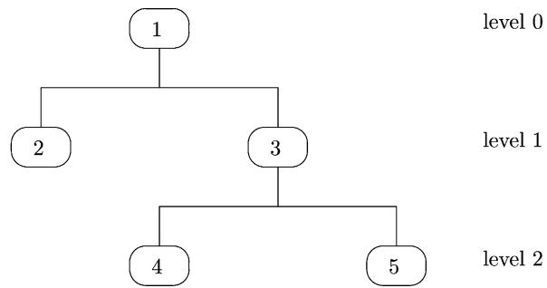

www.elsevier.com/locate/omega

# Determining optimal disassembly and recovery strategies

Ruud H. Teunter

Department of Management Science, Lancaster University Management School, Lancaster, LA1 4YX, UK

Available online 10 March 2005

## Abstract

We present a stochastic dynamic programming algorithm for determining the optimal disassembly and recovery strategy, given the disassembly tree, the process-dependent quality distributions of assemblies, and the quality-dependent recovery options and associated profits for assemblies. This algorithm generalizes the one proposed by Krikke et al. (International Journal of Production Research 1998; 36(1):111–39) in two ways. First, there can be multiple disassembly processes. Second, partial disassembly is allowed. Both generalizations are important for practise.  2005 Elsevier Ltd. All rights reserved.

Keywords: Disassembly; Recovery; Profit maximization; Dynamic programming

## 1. Introduction

Disassembly is a systematic method for separating a prod uct into its constituent modules, components, parts, etc. (all to be called assemblies from now on). Since assemblies usually have to be disassembled before they can be recovered, disassembly plays an important role in product recovery [1]. Driven by more rigid environmental legislation, societal pressure and economical incentives, many firms have started recovery and disassembly operations in recent years. For instance Air France, Lufthansa, BMW, Volkswagen, Daimler-Crysler, Nissan, Oce, Xerox, and Philips all operate largescale disassembly/recovery plants. We refer interested readers to Gungor and Gupta [2] for an extensive review of all issues involved with product recovery.

Planning disassembly and recovery operations can be divided into three steps:

1. Determine all possible disassembly sequences and processes.

2. Determine all possible recovery options and the associ ated profits for each assembly.

3. Determine the optimal disassembly and recovery strategy.

In step 1, the identification of all possible disassembly sequences and disassembly processes is based on technical and environmental restrictions. For an extensive overview of disassembly scheduling, we refer interested readers to Lambert [3]. A convenient way to present all disassembly options is in a disassembly tree/graph. This tree contains arcs from each assembly to all its subassemblies [4–14].

Step 2 is to identify all recovery options (e.g. remanufacturing, recycling, and disposal) and determine the corresponding profits (revenues minus disassembly costs) for each assembly. The feasibility of a recovery option may depend on the quality of an assembly and on commercial and ecological feasibility criteria [15].

In this paper, we will not consider these technical steps 1 and 2. It is assumed that a disassembly tree is given and that the recovery options are known for each assembly. We focus on step 3—determining the optimal disassembly and recovery strategy. Such a strategy specifies the disassembly sequence, the disassembly processes, and the recovery type for the disassembled assemblies.

A number of authors (Erdos et al. [16], Johnson and Wang [17,18], Krikke et al. [15], Navin-Chandra [19], Penev and de Ron [9], and Zussman et al. [14]) have dealt with the problem of finding the optimal disassembly and recovery strategy. The most general version of the problem is analyzed by Krikke et al. [15]. In fact, to the best of our knowledge, they are the only authors who consider variations in the quality of a returned product and its assemblies.

In our opinion, including quality considerations is essential for determining an optimal disassembly and recovery strategy. In most practical situations, the quality of an assembly determines its recovery options. We remark that quality can be driven by deterioration, as well as by obsolescence. For instance, since the life cycle of a PC spans about 6 months, PC components can typically only be remanufactured if a returned PC is less than 6 months old. Components of older cores have to be recycled or disposed of. In general, the quality distribution (over the different possible states) of an assembly depends on product characteristics such as age and usage as well as on the type of disassembly processes (e.g. destructive or non-destructive) that are used to retrieve it.

In this paper, we therefore take the stochastic dynamic programming (DP) algorithm for finding the optimal, quality-dependent disassembly and recovery strategy proposed by Krikke et al. [15] as a starting point. We generalize this algorithm in two ways. First, there can be multiple disassembly processes. Second, partial disassembly is allowed, i.e. it is not necessary to disassemble all possible subassemblies from an assembly. Both generalizations are important for practise. As mentioned before, there are often multiple processes for disassembly, e.g. non-destructive or destructive. Furthermore, partial disassembly of subassemblies with a high recovery value is often more profitable than complete disassembly.

The remainder of the paper is organized as follows: in Section 2 we present the DP algorithm for finding the optimal disassembly and recovery strategy, in Section 3 we illustrate the algorithm for a specific example, and we end with conclusions in Section 4.

## 2. A stochastic dynamic programming algorithm

In this section we present a stochastic DP algorithm for calculating the optimal recovery/disposal strategy. This algorithm is a modified version of the one presented by Krikke et al. [15]. It allows partial disassembly and multiple disassembly processes (see Section 1).

The following information is assumed to be given.

• Disassembly tree/graph: The first level, i.e. the root of the tree is a returned product (often referred to in practise as a $\mathrm { ? ^ { * } c o r e ^ { * } ) }$ , and the other levels represent its modules, components, parts, etc. Products as well as modules, components, parts, etc. are all called assemblies. An assembly is called atomic if it cannot be disassembled any further, and non-atomic otherwise. The tree contains arcs from each assembly to all its subassemblies. An example of a disassembly tree is presented in Fig. 1.

  
Fig. 1. Example of a disassembly tree with 3 levels and 5 assemblies.

• Process-dependent quality distribution: For each arc of the disassembly tree, the quality (distribution) for the subassembly conditional on the quality of the assembly is given for each type of disassembly process.

• Quality-dependent recovery options and profits: For each assembly, the quality-dependent recovery options (remanufacturing, material recycling, energy recycling, disposal) and the associated profits (recovery revenues minus disassembly costs) are given for the assembly as a whole as well as after disassembling any possible set of subassemblies.

We remark that it requires considerable effort to obtain all this data in practise. Building a disassembly tree based on technological, commercial, and environmental restrictions has been described in a number of the referred papers. The quality distribution for subassemblies initially has to be based on engineers’ estimates, but can be updated after disassembly of a number of items. In this respect, it is important to provide clear non-overlapping descriptions for all quality grades. Determination of the cost for a recovery option is straightforward, but the calculation of the revenue depends on the type of recovery. For material recycling, the revenue is determined by the types, weights, and prices of recovered materials. For energy recycling, the revenue is the cost price for the recovered amount of energy. For remanufacturing, the revenue is the cost price of a newly produced/procured assembly.

The notations that are used are listed in Table 1.

The DP algorithm starts in the lowest level L of the disassembly tree, which contains atomic assemblies only. For all those assemblies j (and the corresponding quality classes $q 1 \in Q ( j ) )$ , it finds the optimal recovery option and the associated profit $f ^ { L } ( j , q 1 )$ . It then moves up to level L − 1. Again, for all the atomic assemblies j of that level, it finds the optimal recovery option and the associated profit $f ^ { L - 1 } ( j , q \dot { 1 } )$ ). For all the non-atomic assemblies j of level $L - 1$ , it finds the optimal combination of a disassembly set (the set S of subassemblies that is disassembled) and a recovery option (after disassembly of the above-mentioned set). This combination maximizes the profit $f ^ { L - 1 } ( j , q 1 , S )$ which is the sum of the profits associated with all the disassembled subassemblies plus the profit associated with recovery minus the disassembly costs. The algorithm then moves up to level $L - 2$ . And so on, until the entire recovery/disposal strategy is determined.

<table><tr><td colspan="2">Notations</td></tr><tr><td> $l$ </td><td>Disassembly level  $l = 0,1,\dots,L,l=0$  is the root that contains only the product itself</td></tr><tr><td> $j$ </td><td>Assembly identification number  $j = 0,1,\dots,J,j=0$  is the product itself</td></tr><tr><td> $l(j)$ </td><td>Disassembly level of assembly  $j$ </td></tr><tr><td> $Q(j)$ </td><td>Set of quality classes of assembly  $j$ </td></tr><tr><td> $D(j)$ </td><td>Set of processes for disassembling assembly  $j$ </td></tr><tr><td> $S(j)$ </td><td>Set of retrievable subassemblies of assembly  $j$  Clearly,  $S(j)=\emptyset$  for atomic assemblies</td></tr><tr><td> $R(j,q1)$ </td><td>Set of recovery options for assembly  $j$  with quality  $q1\in Q(j)$ </td></tr><tr><td> $R(j,q1,S,d)$ </td><td>Set of recovery options for assembly  $j$  with quality  $q1\in Q(j)$  after disassembly of the non-empty set of subassemblies  $S\subseteq S(j)$  using disassembly process  $d$ </td></tr><tr><td> $c(j,q1,S,d)$ </td><td>Cost of disassembling from assembly  $j$  the non-empty set of subassemblies  $S\subseteq S(j)$  using disassembly process  $d$ </td></tr><tr><td> $p(j,q1,r)$ </td><td>Net profit obtained from recovering assembly  $j$  with quality  $q1\in Q(j)$  using recovery option  $r\in R(j,q1)$ </td></tr><tr><td> $p(j,q1,S,r)$ </td><td>Net profit obtained from recovering assembly  $j$  with quality  $q1\in Q(j)$  using recovery option  $r\in R(j,q1,S)$  after disassembling the non-empty set of subassemblies  $S\subseteq S(j)$ </td></tr><tr><td> $\Pr(s,q2|j,q1,d)$ </td><td>Probability that subassembly  $s\in S(j)$  of assembly  $j$  has quality  $q2$  if it is disassembled using process  $d$  from an assembly  $j$  with quality  $q1$ </td></tr></table>

In formulas, this means that the profit of an atomic assembly j with quality q1 in disassembly level l is

$$
f ^ {l} (j, q 1) = C (j, q 1),\tag{1}
$$

where

$$
C (j, q 1) = \max _ {r \in R (j, q 1)} p (j, q 1, r)\tag{2}
$$

and the maximizer for r is the optimal recovery option.

The profit of a non-atomic assembly j with quality q1 in disassembly level l is

$$
f ^ {l} (j, q 1) = \max \left\{C (j, q 1), \max _ {d \in D, S \subseteq S (j)} C (j, q 1 | d, S) \right\},\tag{3}
$$

where $C ( j , q 1 )$ is defined in (2) and

$$
\begin{array}{l} C (j, q 1 | d, S) = \sum_ {s \in S} \sum_ {q   1 \in Q (s)} \operatorname * {P r} (s, q 2 | j, q 1, d) f ^ {l + 1} (s, q 2) \\ \quad + \max _ {r \in R (j, q 1, S, d)} \{p (j, q 1, S, r) \} \\ \quad - c (j, q 1, S, d). \end{array}
$$

If (3) is maximized by $C ( j , q 1 )$ , then it is optimal to recover assembly j as a whole, and the maximizer for r is the optimal recovery option. Otherwise, the maximizers for d and S in (3) and for r in $C ( j , q 1 | d , S )$ are the optimal disassembly process, the optimal disassembly set and the optimal recovery option, respectively.

## 3. Example

We consider a product with 5 assemblies (including the product itself) and 3 levels. The disassembly tree is presented in Fig. 1.

Profits $p ( j , q 1 , r )$ (no disassembly) and $p ( j , q 1 , S , r )$ (after disassembly of the set S of subassemblies) for the numerical example

<table><tr><td rowspan="2">j</td><td rowspan="2">S</td><td colspan="3">q1=1</td><td colspan="3">q1=2</td></tr><tr><td>r=1</td><td>r=2</td><td>r=3</td><td>r=1</td><td>r=2</td><td>r=3</td></tr><tr><td>1</td><td></td><td>-4</td><td>—</td><td>—</td><td>-4</td><td>—</td><td>—</td></tr><tr><td>1</td><td>{2}</td><td>-3</td><td>—</td><td>—</td><td>-3</td><td>—</td><td>—</td></tr><tr><td>1</td><td>{3}</td><td>-3</td><td>—</td><td>—</td><td>-3</td><td>—</td><td>—</td></tr><tr><td>1</td><td>{2,3}</td><td>-2</td><td>—</td><td>—</td><td>-2</td><td>—</td><td>—</td></tr><tr><td>2</td><td></td><td>-1</td><td>2</td><td>—</td><td>-1</td><td>2</td><td>—</td></tr><tr><td>3</td><td></td><td>0</td><td>5</td><td>—</td><td>0</td><td>5</td><td>—</td></tr><tr><td>3</td><td>{4}</td><td>2</td><td>4</td><td>—</td><td>2</td><td>4</td><td>—</td></tr><tr><td>3</td><td>{5}</td><td>-3</td><td>3</td><td>—</td><td>-3</td><td>3</td><td>—</td></tr><tr><td>3</td><td>{4,5}</td><td>-2</td><td>1</td><td>—</td><td>-2</td><td>1</td><td>—</td></tr><tr><td>4</td><td></td><td>-1</td><td>1</td><td>5</td><td>-1</td><td>1</td><td>—</td></tr><tr><td>5</td><td></td><td>2</td><td>1</td><td>10</td><td>2</td><td>1</td><td>—</td></tr></table>

Probabilities Pr(s, q2|j, q1, d) for the numerical example

<table><tr><td rowspan="2">s</td><td rowspan="2">q2</td><td rowspan="2">j</td><td colspan="2">q1=1</td><td colspan="2">q1=2</td></tr><tr><td>d=1</td><td>d=2</td><td>d=1</td><td>d=2</td></tr><tr><td>2</td><td>1</td><td>1</td><td>0</td><td>0.7</td><td>0</td><td>0.5</td></tr><tr><td>2</td><td>2</td><td>1</td><td>1</td><td>0.3</td><td>0</td><td>0.5</td></tr><tr><td>3</td><td>1</td><td>1</td><td>0</td><td>0.9</td><td>0</td><td>0.6</td></tr><tr><td>3</td><td>2</td><td>1</td><td>1</td><td>0.1</td><td>0</td><td>0.4</td></tr><tr><td>4</td><td>1</td><td>3</td><td>0</td><td>0.9</td><td>0</td><td>0.5</td></tr><tr><td>4</td><td>2</td><td>3</td><td>1</td><td>0.1</td><td>0</td><td>0.5</td></tr><tr><td>5</td><td>1</td><td>3</td><td>0</td><td>0.8</td><td>0</td><td>0.4</td></tr><tr><td>5</td><td>2</td><td>3</td><td>1</td><td>0.2</td><td>0</td><td>0.6</td></tr></table>

Table 4  
Disassembly costs c(j, S, d) for the numerical example

<table><tr><td>j</td><td>S</td><td>d=1</td><td>d=2</td></tr><tr><td>1</td><td>{2}</td><td>1</td><td>2</td></tr><tr><td>1</td><td>{3}</td><td>2</td><td>4</td></tr><tr><td>1</td><td>{2,3}</td><td>3</td><td>5</td></tr><tr><td>3</td><td>{4}</td><td>1</td><td>3</td></tr><tr><td>3</td><td>{5}</td><td>1</td><td>4</td></tr><tr><td>3</td><td>{4,5}</td><td>2</td><td>6</td></tr></table>

There are three recovery options: disposal $( r = 1 )$ , recycling $( r = 2 )$ , and remanufacturing $( r = 3 )$ . However, the recycling and remanufacturing option are not available for all assemblies and remanufacturing is quality (1 = high, 2 = low) dependent. Table 2 gives the profits for all available recovery options.

There are two types of disassembly for both assembly 1 (the product itself) and for assembly 3: destructive $( d = 1 )$ and non-destructive $( d = 2 )$ . For both disassembly processes, the quality distribution (high/low) of subassemblies conditional on the quality of the assembly is given in Table 3. The disassemble costs are given in Table 4.

The results of applying the DP algorithm are given in Table 5(quality 1 = high, 2 = low; disassembly process 1 = destructive, 2 = non-destructive; disposal option 1 = disposal, 2 = recycling, 3 = remanufacturing).

Table 5  
Results of the DP algorithm for the numerical example

<table><tr><td>C(4,1)=</td><td></td><td></td><td>max{-1,1,5}</td><td>=5</td><td>=f2(4,1)</td></tr><tr><td>C(4,2)=</td><td></td><td></td><td>max{-1,1,}</td><td>=1</td><td>=f2(4,2)</td></tr><tr><td>C(5,1)=</td><td></td><td></td><td>max{2,1,10}</td><td>=10</td><td>=f2(5,1)</td></tr><tr><td>C(5,2)=</td><td></td><td></td><td>max{2,1,}</td><td>=2</td><td>=f2(5,2)</td></tr><tr><td>C(2,1)=</td><td></td><td></td><td>max{-1,2,}</td><td>=2</td><td>=f1(2,1)</td></tr><tr><td>C(2,2)=</td><td></td><td></td><td>max{-1,2,}</td><td>=2</td><td>=f1(2,2)</td></tr><tr><td>C(3,1)=</td><td></td><td></td><td>max{0,5,}</td><td>=5</td><td></td></tr><tr><td>C(3,1|1,{4})=</td><td>0.0×5+1.0×1</td><td>-1</td><td>+ max{2,4,}</td><td>=4</td><td></td></tr><tr><td>C(3,1|1,{5})=</td><td>0.0×10+1.0×2</td><td>-1</td><td>+ max{-3,3,}</td><td>=4</td><td></td></tr><tr><td>C(3,1|1,{4,5})=</td><td>0.0×5+1.0×1+0.0×10+1.0×2</td><td>-2</td><td>+ max{-2,1,}</td><td>=2</td><td></td></tr><tr><td>C(3,1|2,{4}=)</td><td>0.9×5+0.1×1</td><td>-3</td><td>+ max{2,4,}</td><td>=5.6</td><td></td></tr><tr><td>C(3,1|2,{5})=</td><td>0.8×10+0.2×2</td><td>-4</td><td>+ max{-3,3,}</td><td>=7.4</td><td></td></tr><tr><td>C(3,1|2,{4,5})=</td><td>0.9×5+0.1×1+0.8×10+0.2×2</td><td>-6</td><td>+ max{-2,1,}</td><td>=8</td><td>=f1(3,1)</td></tr><tr><td>C(3,2)=</td><td></td><td></td><td>max{0,5,}</td><td>=5</td><td>=f1(3,2)</td></tr><tr><td>C(3,2|1,{4})=</td><td>0.0×5+1.0×1</td><td>-1</td><td>+ max{2,4,}</td><td>=4</td><td></td></tr><tr><td>C(3,2|1,{5})=</td><td>0.0×10+1.0×2</td><td>-1</td><td>+ max{-3,3,}</td><td>=4</td><td></td></tr><tr><td>C(3,2|1,{4,5})=</td><td>0.0×5+1.0×1+0.0×10+1.0×2</td><td>-2</td><td>+ max{-2,1,}</td><td>=2</td><td></td></tr><tr><td>C(3,2|2,{4})=</td><td>0.5×5+0.5×1</td><td>-3</td><td>+ max{2,4,}</td><td>=4</td><td></td></tr><tr><td>C(3,2|2,{5})=</td><td>0.4×10+0.6×2</td><td>-4</td><td>+ max{-3,3,}</td><td>=4.2</td><td></td></tr><tr><td>C(3,2|2,{4,5})=</td><td>0.5×5+0.5×1+0.4×10+0.6×2</td><td>-6</td><td>+ max{-2,1,}</td><td>=3.2</td><td></td></tr><tr><td>C(1,1)=</td><td></td><td></td><td>max{-4,,}</td><td>=-4</td><td></td></tr><tr><td>C(1,1|1,{2})=</td><td>0.0×2+1.0×2</td><td>-1</td><td>+ max{-3,,}</td><td>=-2</td><td></td></tr><tr><td>C(1,1|1,{3})=</td><td>0.0×8+1.0×5</td><td>-2</td><td>+ max{-3,,}</td><td>=0</td><td></td></tr><tr><td>C(1,1|1,{2,3})=</td><td>0.0×2+1.0×2+0.0×8+1.0×5</td><td>-3</td><td>+ max{-2,,}</td><td>=2</td><td></td></tr><tr><td>C(1,1|2,{2}=)</td><td>0.7×2+0.3×2</td><td>-2</td><td>+ max{-3,,}</td><td>=-3</td><td></td></tr><tr><td>C(1,1|2,{3})=</td><td>0.9×8+0.1×5</td><td>-4</td><td>+max{-3,,}</td><td>=0.7</td><td></td></tr><tr><td>C(1,1|2,{2,3})=</td><td>0.7×2+0.3×2+0.9×8+0.1×5</td><td>-5</td><td>+ max{-2,,}</td><td>=2.7</td><td>=f0(1,1)</td></tr><tr><td>C(1,2)=</td><td></td><td></td><td>max{-4,,}</td><td>=-4</td><td></td></tr><tr><td>C(1,2|1,{2})=</td><td>0.0×2+1.0×2</td><td>-1</td><td>+ max{-3,,}</td><td>=-2</td><td></td></tr><tr><td>C(1,2|1,{3})=</td><td>0.0×8+1.0×5</td><td>-2</td><td>+ max{-3,,}</td><td>=0</td><td></td></tr><tr><td>C(1,2|1,{2,3})=</td><td>0.0×2+1.0×2+0.0×8+1.0×5</td><td>-3</td><td>+ max{-2,,}</td><td>=2</td><td>=f0(1,2)</td></tr><tr><td>C(1,2|2,{2}=)</td><td>0.5×2+0.5×2</td><td>-2</td><td>+ max{-3,,}</td><td>=-3</td><td></td></tr><tr><td>C(1,2|2,{3})=</td><td>0.6×8+0.4×5</td><td>-4</td><td>+ max{-3,,}</td><td>=-0.2</td><td></td></tr><tr><td>C(1,2|2,{2,3})=</td><td>0.5×2+0.5×2+0.6×8+0.4×5</td><td>-5</td><td>+ max{-2,,}</td><td>=1.8</td><td></td></tr></table>

So, the optimal policy is as follows:

• Always disassemble 2 and 3 from 1 (returned product) and dispose of what remains. Use non-destructive disassembly if 1 has high quality and destructive disassembly otherwise.

• Always recycle 2.

• If 3 has high quality, disassemble 4 and 5 and recycle the remainder. If 3 has low quality, recycle it as a whole.

• Remanufacture 4 if its quality is high and recycle it oth erwise.

• Remanufacture 5 if its quality is high and dispose of it otherwise.

## 4. Conclusion

We considered the problem of determining the optimal disassembly and recovery strategy, given the disassembly tree and information on quality, available disassembly pro cesses, recovery options, and recovery profits. A stochastic dynamic programming algorithm was presented that generalizes the one proposed by Krikke et al. [15] in two ways. First, there can be multiple disassembly processes. Second, partial disassembly is allowed. Both generalizations are im portant for practise.

When the algorithm is applied in practise, it is important that the input information is regularly updated. This holds especially for the recovery options and the associated profits. In the PC industry, for instance, remanufacturing profits decline rapidly with the age of a core, and remanufacturing is typically no longer a (profitable) option if a core is more than 6 months old. So, in this case, updates are required at least once a month.

## Acknowledgements

The research of Dr. Ruud H. Teunter has been made possible by a fellowship of the Royal Netherlands Academy of Arts and Sciences.

## References

[1] Jovane F, Alting L, Armillotta A, Eversheim W, Feldmann K, Seliger G. A key issue in product life cycle: disassembly. Annals of the CIRP 1993;42(2):640–72.

[2] Gungor A, Gupta SM. Issues in environmentally conscious manufacturing and product recovery. Computers and Industrial Engineering 1999;36(4):811–53.

[3] Lambert AJD. Disassembly sequencing: a survey. International Journal of Production Research 2003;41(16): 3721–59.

[4] Arai E, Uchiyama N, Igoshi M. Disassembly path generation to verify the assemblability of mechanical products. JSME International Journal Series C 1995;38(4):805–10.

[5] Chen SF, Oliver JH, Chou SY, Chen LL. Parallel disassembly by onion peeling. Journal of Mechanical Design 1997;119(2):267–74.

[6] Dutta D, Woo TC. Algorithm for multiple disassembly and parallel assemblies. Journal of Engineering for Industry 1995;117(1):102–9.

[7] Lambert AJD. Optimal disassembly of complex products. International Journal of Production Research 1997;35(9): 2509–23.

[8] Lambert AJD. Linear programming in disassembly/clustering sequence generation. Computer & Industrial Engineering 1999;36(4):723–38.

[9] Penev KD, de Ron AJ. Determination of a disassembly strategy. International Journal of Production Research 1996;34(2):495–506.

[10] Pnueli Y, Zussman E. Evaluating the end-of-life value of a product and improving it by redesign. International Journal of Production Research 1997;35(4):921–42.

[11] Spengler T, Pueckert H, Penkuhn T, Rentz O. Environmental integrated production and recycling management. European Journal of Operational Research 1997;97(2):308–26.

[12] Veerakamolmal P, Gupta SM. High-mix/low-volume batch of electronic equipment disassembly. Computer & Industrial Engineering 1998;35(1–2):65–8.

[13] Yan X, Gu P. A graph based heuristic approach to automated assembly planning. Flexible Assembly Systems 1994;73: 97–106.

[14] Zussman E, Kriwet A, Seliger G. Disassembly-oriented assessment methodology to support design for recycling. Annals of the CIRP 1994;43(1):9–14.

[15] Krikke HR, van Harten A, Schuur PC. On a medium term product recovery and disposal strategy for durable assembly products. International Journal of Production Research 1998;36(1):111–39.

[16] Erdos G, Kis T, Xirouchakis P. Modelling and evaluating product end-of-life options. International Journal of Production Research 2001;39(6):1203–20.

[17] Johnson MR, Wang MH. Planning product disassembly for material recovery opportunities. International Journal of Production Research 1995;33(11):3119–24.

[18] Johnson MR, Wang MH. Economic evaluation of disassembly operations for recycling. remanufacturing and reuse. International Journal of Production Research 1998;36(12):3227–52.

[19] Navin-Chandra D. The recovery problem in product design. Journal of Engineering Design 1994;5(1):65–86.