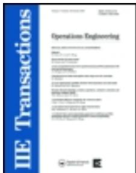
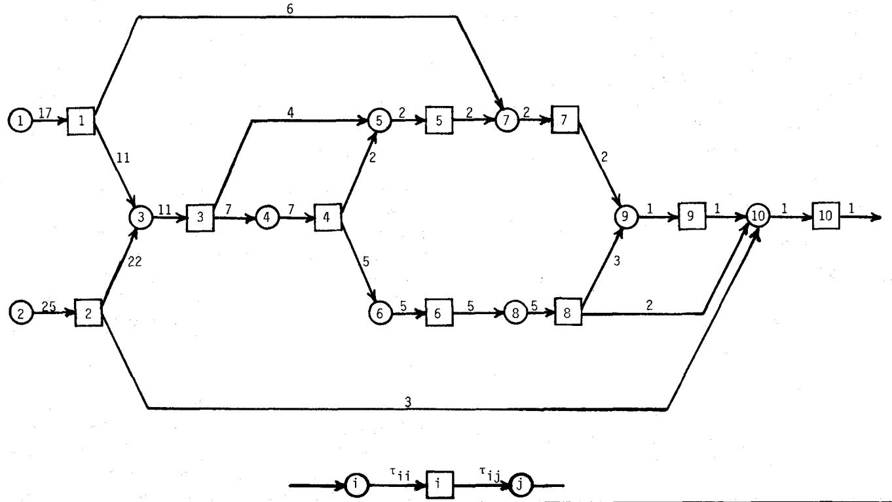
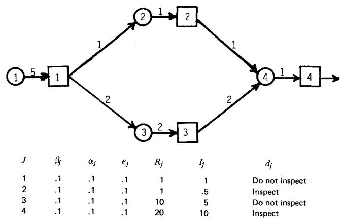
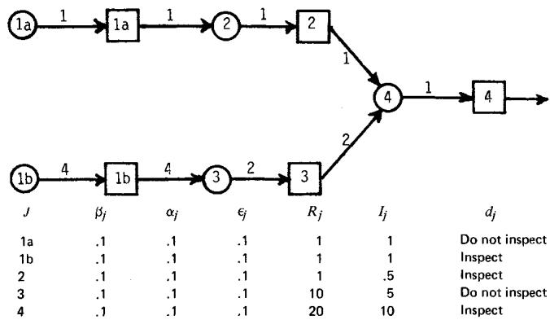
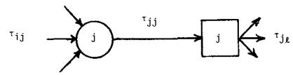
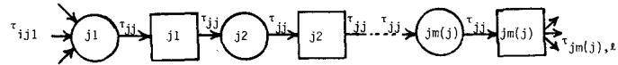

## A I I E Transactions

Publication details, including instructions for authors and subscription information: http://www.tandfonline.com/loi/uiie19

# The Optional Allocation of Inspection Effort in a Class of Nonserial Production Systems

Bong Jin Yum $^{a}$ & Edward D. McDowell $^{b}$

$^{a}$ Ohio State University, Columbus, Ohio, 43210

$^{b}$ Oregon State University, Corvallis, Oregon, 97330 Published online: 06 Jul 2007.

To cite this article: Bong Jin Yum & Edward D. McDowell (1981) The Optional Allocation of Inspection Effort in a Class of Nonserial Production Systems, A I I E Transactions, 13:4, 285-293

To link to this article: http://dx.doi.org/10.1080/05695558108974564

## PLEASE SCROLL DOWN FOR ARTICLE

Taylor & Francis makes every effort to ensure the accuracy of all the information (the "Content") contained in the publications on our platform. However, Taylor & Francis, our agents, and our licensors make no representations or warranties whatsoever as to the accuracy, completeness, or suitability for any purpose of the Content. Any opinions and views expressed in this publication are the opinions and views of the authors, and are not the views of or endorsed by Taylor & Francis. The accuracy of the Content should not be relied upon and should be independently verified with primary sources of information. Taylor and Francis shall not be liable for any losses, actions, claims, proceedings, demands, costs, expenses, damages, and other liabilities whatsoever or howsoever caused arising directly or indirectly in connection with, in relation to or arising out of the use of the Content.

This article may be used for research, teaching, and private study purposes. Any substantial or systematic reproduction, redistribution, reselling, loan, sub-licensing, systematic supply, or distribution in any form to anyone is expressly forbidden. Terms & Conditions of access and use can be found at http://www.tandfonline.com/page/terms-and-conditions

# The Optional Allocation of Inspection Effort in a Class of Nonserial Production Systems

BONG JIN YUM

ASSOCIATE MEMBER, AIIE

Ohio State University

Columbus, Ohio 43210

EDWARD D. McDOWELL

SENIOR MEMBER, AIIE

Oregon State University

Corvallis, Oregon 97330

Abstract: The allocation of quality control inspection effort (QCIE) within a class of nonserial production systems permitting inspection errors is considered. If the allocation of QCIE is unconstrained, and providing inspected and uninspected items from an operation are aggregated, then, for the cost structure considered, this problem is shown to be equivalent to a nonlinear zero-one integer programming problem. This implies the existence of an optimal inspection policy involving only integer multiples of 100% inspection at each potential location. However, if the allocation of QCIE is constrained or the segregation of inspected and uninspected items is permitted, then the existence of such an optimal policy is no longer assured.

\- A primary consideration in the design and management of production systems is the proper allocation of quality control (QC) inspection effort. Such systems as illustrated in Fig. 1 may be considered as a set of $n - m$ connected operations which commence with $m$ sources of raw material. If each of these sources is thought of as a pseudo-operation, then the system may be considered as a set of $n$ related operations, $n - m$ of which are supplied internally and $m$ of which serve as sources of material. Potential QC inspection station locations are assumed to exist subsequent to each operation with the locations subsequent to the pseudo-operations considered as potential incoming inspection stations. Although it may appear restrictive, such systems are usually assumed to terminate with a single final operation with the subsequent potential inspection station representing final inspection prior to shipment. Management's objective is then to allocate inspection effort such that total inspection, repair, replacement or scrap, and external failure costs are minimized. Specific cases of the general inspection-effort-allocation problem arise when various sets of assumptions regarding the cost structure, the connection mechanism, and the inspection station characteristics are made.

Lindsay and Bishop [6] formulated the serial production systems with perfect inspection accuracy case as a dynamic program in which the required quality level of the final product is considered. They showed that under fairly general conditions, either complete screening inspection or no inspection is optimal, a result which was further supported by White [10]. Both White [11] and Trippi [9] further showed that the allocation of QC inspection effort in serial production systems could be treated as a shortest route problem, and Lindsay [7] extended the methodology to include cases where each operation may generate multiple defects.

The assumption of perfect inspection accuracy simplified the problem of describing the probabilistic behavior of the product in the previous cases because the output of any inspection station is perfect regardless of the incoming quality level. Eppen and Hurst [2] showed that for serial systems with imperfect inspection accuracy the problem could still be formulated as a dynamic program. Serial production systems where both Type 1 and Type 2 inspection errors are possible and where an item may be repeatedly inspected at any location have been examined by Gleason [3]. Given certain assumptions regarding independence between operations, Gleason found that for unconstrained systems the optimal inspection policy consisted of integer multiples of $100\%$ inspection at each possible location. However, when constraints were added, he found that the optimal solution could include noninteger multiples.

The methodology has been further extended by Britney [1] to include a class of nonserial production systems under the assumption of perfect inspection accuracy and a quasi-concave cost structure. In Britney's model, the material flow rate between connected operations is unity. His results, which apply to one-to-one assembly operations where the movement of defects through the system can be described by Markov chains, indicate that the optimal screening program will employ either zero or 100% inspection throughout.

Since many inspection operations, particularly those involving human operators, are imperfect, it seems natural to further extend the methodology to account for imperfect inspection accuracy in nonserial systems, particularly those in which functional testing is performed and the material flow rates between connected operations need not be unity.

## Model Development

Consider a nonserial production system which consists of n connected operations with a potential QC inspection location existing subsequent to each operation. For convenience, assume the operations are numbered such that a higher numbered operation never serves as a source of supply for a lower numbered operation, implying there are no loops in the system; and let each potential inspection station be numbered the same as its associated operation. Then an inspection policy for the system may be expressed as a decision vector d, where $d_{j}$ (the jth component of d) represents the fraction of the items moving through the jth inspection station, which are randomly selected for inspection. First, each $d_{j}$ is constrained to the closed interval [0,1], thus prohibiting repeated inspection of an item at an inspection station; however, this restriction will be relaxed later.

Further, consider the following assumptions regarding the cost, inspection, and connection mechanisms:

\- The product of any operation is considered defective if it has at least one defective component or if it has acquired a defect as a result of processing.

Each potential inspection station may be characterized by the following four known constants:

$\alpha_{j}$ is the probability that a nondefective unit will be rejected at the jth station.

$\beta_{j}$ is the probability that a defective unit will be accepted at the jth station. It is assumed this probability is independent of the number of defects present in the unit.

$R_{j}$ is the cost of repairing or replacing a rejected unit and returning it to the production system at the jth station. It is assumed that this cost is incurred whether the unit rejected is defective or not, and that it is independent of the number and type of defects present in the rejected unit.

$I_{j}$ is the per unit cost of inspection at the $j$ th station.

\- All rejected units are either repaired or replaced with nondefective units and returned to the system. The number of units leaving an inspection station is thus independent of the level of inspection effort performed at that station. The material flow between operations may then be represented by:

$\tau_{ij}$ , the number of units that must be supplied to operation j from operation i in order to produce one unit of final product, $i \neq j$ ;

$\tau_{jj}$ , the number of units that must be supplied to inspection station j from operation j in order to produce one unit of final product;

$n_{ij} = \tau_{ij}/\tau_{jj}$ , the number of units that must be supplied from operation i to operation j in order to produce one unit from operation j, $\eta_{ij} = 0; 1, 2, \ldots, i < j$ , and $\eta_{ij} = 0, i \geqslant j$ .

\- The external failure costs may be approximated by a cost, $C$ , per defective unit leaving the system. This cost is considered independent of the number of defects contained in the unit.

\- If fractional inspection is performed, the inspected and uninspected units are aggregated; that is, the inspected and uninspected units cannot be identified and separated at a later operation.

In order to properly describe the frequency of defective units at various locations in the system we need to define the following variables for each j:

$\rho_{j}$ is the probability that a unit leaving the jth operation is defective.

$\lambda_{j}$ is the probability that a unit leaving the jth inspection station is defective.

$\epsilon_{j}$ is the probability that a supplied component is defective for $j \leqslant m$ , and the probability that a unit incurs a defect at the jth operation due to a processing for j > m.

The probability that a unit incurs a defect at the jth operation $(j > m)$ is assumed to be independent of the number of defective components in that unit. Then the probability that a unit leaving operation j is good is the product of the probability that it did not incur a defect during processing and the probability that it contains no defective components. Since the probability that a component supplied from the ith inspection station is good is $(1 - \lambda_{i})$ , the probability the jth subassembly is good is

$$
(1 - \epsilon_ {j}) \prod_ {i = 1} ^ {j - 1} (1 - \lambda_ {i}) ^ {\eta_ {i j}} \text { for } j > m,\tag{1}
$$

and the probability that a unit leaving the jth operation and

entering the jth potential station is defective is given by

$$
\rho_ {j} = \left\{ \begin{array}{l l} \epsilon_ {j} & \text { for } j \leqslant m \\ 1 - (1 - \epsilon_ {j}) \prod_ {i = 1} ^ {j - 1} (1 - \lambda_ {i}) ^ {\eta_ {i j}} & \text { for } j > m \end{array} \right.\tag{2}
$$

since the outgoing quality level is the probability that a supplied component is defective for the pseudo-operations.

The probability that a unit is defective subsequent to the jth inspection station, $\lambda_{j}$ , can be described as:

$\lambda_{j} = P$ (a unit is defective and passes the $j$ th inspection station without being inspected, or it is inspected and classified as nondefective), (3a)

since all rejected units are assumed to be repaired and returned or replaced by nondefective units. Since the two events before and after the “or” are disjoint,

$\lambda_{j}=P$ (a unit is defective and passes the jth inspection station without being inspected)

\+ P (a defective unit is classified as nondefective at the jth inspection station), (3b)

or

$$
\lambda_ {j} = \rho_ {j} (1 - d _ {j}) + \rho_ {j} \beta_ {j} d _ {j} \quad \forall j.\tag{4}
$$

Letting $\Gamma_{j} = 1 - \beta_{j}$ for each $j$ ,

$$
\lambda_ {j} = \rho_ {j} (1 - \Gamma_ {j} d _ {j})\tag{5}
$$

for the jth inspection station.

The total quality control costs can be expressed as the sum of the inspection costs, the internal repair or replacement costs, and the external failure costs for producing one unit of final product. With the inspection costs at the jth location being the per-unit inspection costs, $I_{j}$ , times the volume through the station, $\tau_{jj}$ , and using the decision variable $d_{j}$ , the total inspection costs are

$$
\sum_ {j = 1} ^ {n} \tau_ {j j} I _ {j} d _ {j}\tag{6}
$$

for the system.

The repair or replacement cost at the jth inspection station if inspection is performed is $\tau_{jj}R_{j}$ multiplied by the probability that a unit is rejected. That probability for the jth potential inspection station is:

$\{P(\text{rejection}|\text{defective})P(\text{defective})\}$

$$
\begin{array}{l} + P (\text { rejection } | \text { good }) P (\text { good }) \} \{P (\text { inspected }) \} \\ \text { or } \end{array}
$$

$$
\begin{array}{r l} P (\text { rejection }) & = \{(1 - \beta_ {j}) \rho_ {j} + \alpha_ {j} (1 - \rho_ {j}) \} d _ {j} \\ & = \{\alpha_ {j} + (1 - \alpha_ {j} - \beta_ {j}) \rho_ {j} \} d _ {j}. \end{array}\tag{7}
$$

This results in

$$
\text { Total   repair   costs } = \sum_ {j = 1} ^ {n} \tau_ {j j} R _ {j} d _ {j} \left\{\alpha_ {j} + (1 - \alpha_ {j} - \beta_ {j}) \rho_ {j} \right\}.\tag{8}
$$

Since the external failure costs are assumed to be a linear function of the average outgoing quality level $\lambda_{n}$ , the external failure costs are represented by a term in the objective function of the form $C\lambda_{n}$ .

The model for optimally allocated QC inspection effort may then be summarized as

$$
\underset {d} {\text { Min }} Z (d) = \sum_ {j = 1} ^ {n} \tau_ {j j} I _ {j} d _ {j} + \sum_ {j = 1} ^ {n} R _ {j} \tau_ {j j} \left\{\alpha_ {j} + (1 - \alpha_ {j} - \beta_ {j}) \rho_ {j} \right\} d _ {j} + C \lambda_ {n}\tag{9}
$$

such that $0 \leqslant d_{j} \leqslant 1$ $\forall j$ ,

(10a)

where

$$
\lambda_ {j} = \rho_ {j} (1 - \Gamma_ {j} d _ {j}) \quad \forall j
$$

and

(10b)

$$
\rho_ {j} = \left\{ \begin{array}{l l} \epsilon_ {j} & j \leqslant m \\ 1 - (1 - \epsilon_ {j}) \prod_ {i = 1} ^ {j - 1} (1 - \lambda_ {i}) ^ {\eta_ {i j}} & j > m. \end{array} \right.\tag{10c}
$$

Equation (10b) relates the incoming to the outgoing quality at each inspection station and Equation (10c) relates the incoming to the outgoing quality at each operation. Expressions (9) and (10) will collectively be referred to as Problem I.

Allowing

$$
\delta_ {j} = \left\{ \begin{array}{l l} \alpha_ {j} + (1 - \alpha_ {j} - \beta_ {j}) \epsilon_ {j} & j \leqslant m, \\ \Gamma_ {j} & j \geqslant m + 1, \end{array} \right.\tag{11}
$$

$$
\theta_ {j} = \tau_ {j j} (I _ {j} + R _ {j} \delta_ {j}) \quad \forall j,\tag{12}
$$

$$
\mu_ {j} = 1 - \epsilon_ {j} \quad \forall j,\tag{13}
$$

$$
\xi_ {j} = \tau_ {j j} R _ {j} (1 - \alpha_ {j} - \beta_ {j}) \mu_ {j} \quad j \geqslant m + 1,\tag{14}
$$

and substituting the set of Equations (10c) into (9) and (10b), permits the model to be simplified by the elimination of the $n \rho_{j}$ variables and the n constraints (10c). The simplified model also more clearly reveals the mathematical structure of the problem. Problem I is then reduced to the form:

$$
\operatorname{Min} Z (d) = \sum_ {j = 1} ^ {n} \theta_ {j} d _ {j} - \sum_ {j = m + 1} ^ {n} \xi_ {j} d _ {j} \prod_ {i = 1} ^ {j - 1} \left(1 - \lambda_ {i}\right) ^ {n _ {i j}} + C \lambda_ {n}\tag{15}
$$

$$
\text { such   that } 0 \leqslant d _ {j} \leqslant 1 \quad \forall j,\tag{16a}
$$

where

$$
\lambda_ {j} = \left\{ \begin{array}{l l} (1 - \Gamma_ {j} d _ {j}) e _ {j} & j \leqslant m \\ (1 - \Gamma_ {j} d _ {j}) \left\{1 - \mu_ {j} \prod_ {i = 1} ^ {j - 1} (1 - \lambda_ {i}) ^ {\eta_ {i j}} \right\} & j \geqslant m + 1 \end{array} . \right.\tag{16b}
$$

Expressions (15) and (16) will be referred to as problem IA. Note that the $\delta_j$ 's, $\theta_j$ 's, and $\mu_j$ 's are non-negative constants for all $j$ . Further, it is assumed that $1 - \alpha_j - \beta_j \geqslant 0$ for $j \geqslant m + 1$ , and hence $\xi_j \geqslant 0$ for $j \geqslant m + 1$ . This assumption seems reasonable because the situation where $\alpha_j + \beta_j > 1$ is hardly conceivable in reality.

## Conditions for Optimality

Problem I essentially involves minimizing a nonlinear cost function defined by Equations (9), (10b), and (10c) over a hypercube in $E^{n}$ specified by the constraints in (10a). As will be established below, Problem I is equivalent to a zero-one integer programming problem in which the constraints (10a) are replaced by

$$
d _ {j} = 0, 1 \quad \forall j,\tag{17}
$$

indicating that the optimal policy involves only zero or 100% inspection after each operation. This equivalent problem consisting of the cost function (9), Equations (10b) and (10c), and constraints (17) will be referred to as Problem II. The equivalence of Problems I and II indicates that the optimal allocation of inspection effort in nonserial systems such as defined above is equivalent to determining the location of screening inspection stations in such systems. This equivalence allows optimal solutions to be obtained by zero-one integer programming techniques.

The approach to establishing the equivalence of Problems I and II is to show that if all the decision variables except $d_{k}$ are fixed, then $Z(d)$ is a concave function of $d_{k}$ . If a decision vector $\boldsymbol{d}^{(k)} = (d_{1}, \ldots, d_{k}, \ldots, d_{n})$ is defined such that all components except the kth are fixed, then, by rearranging terms, Equation (9) may be rewritten as

$$
Z(d^{(k)}) = \left[ \sum_{\substack{j = 1\\ j\neq k}}^{n}\tau_{jj}I_{j}d_{j} + \sum_{j = 1}^{k - 1}\tau_{jj}R_{j}\left\{\alpha_{j} + (1 - \alpha_{j} - \beta_{j})\rho_{j}\right\} d_{j} \right.
$$

$$
\begin{array}{l} + \sum_ {j = k + 1} ^ {n} \tau_ {j j} R _ {j} \alpha_ {j} d _ {j} \Bigg ] + \left[ \tau_ {k k} \left\{I _ {k} + R _ {k} \alpha_ {k} \right. \right. \\ \left. + R _ {k} (1 - \alpha_ {k} - \beta_ {k}) \rho_ {k} \right\rbrace d _ {k} \Bigg ] \\ + \left[ \sum_ {j = k + 1} ^ {n} \left\{\tau_ {j j} R _ {j} (1 - \alpha_ {j} - \beta_ {j}) d _ {j} \right\} \rho_ {j} + C \lambda_ {n} \right], \end{array}\tag{18}
$$

where the first set of terms are constants because each $\rho_{j}$ is constant for $j \leqslant k$ , the next is a linear function of $d_{k}$ , and the last $n - k + 1$ are linear functions of $\rho_{j}$ and $\lambda_{n}$ .

If $k \leqslant m - 1$ , the last term in (18) can be rewritten as

$$
\sum_ {j = k + 1} ^ {m} \left\{\tau_ {j j} R _ {j} (1 - \alpha_ {j} - \beta_ {j}) d _ {j} \right\} \rho_ {j} + \sum_ {j = m + 1} ^ {n} \left\{\tau_ {j j} R _ {j} (1 - \alpha_ {j} - \beta_ {j}) d _ {j} \right\} \rho_ {j} + C \lambda_ {n}. \tag {19}
$$

Note that the first term in (19) is constant. Since it is assumed that $(1-\alpha_{j}-\beta_{j})\geqslant0$ for $j\geqslant m+1$ , showing that $Z(d^{(k)})$ is a concave function of $d_{k}$ is equivalent to showing that each $\rho_{j}$ for $j\geqslant k+1$ as well as $\lambda_{n}$ is a concave function of $d_{k}$ . This result depends upon the following lemma:

LEMMA 1. Each $\rho_{j}$ for $j = k + 1, \ldots, n$ can be represented as $\rho_{j} = 1 - IP_{j}^{k}(1 - \lambda_{k})$ , where $IP_{j}^{k}(1 - \lambda_{k})$ is a polynomial of $(1 - \lambda_{k})$ with non-negative coefficients. (All proofs are in Appendix A.)

Lemma 1 can now be used to establish the following corollaries.

COROLLARY 1. Each $\rho_{j}, j = k + 1, \ldots, n$ , is a concave non-increasing function of $d_{k}$ .

A second corollary now follows directly from Corollary 1 and Lemma 1.

COROLLARY 2. Each $\lambda_{j}, j = k, k + 1, \ldots, n$ , is a concave nonincreasing function of $d_{k}$ .

COROLLARY 3. The objective function $Z(d^{(k)})$ is a concave function of $d_k$ .

The final step in establishing the equivalence of Problems I and II is to show that a zero-one solution is optimal. This will be accomplished with the following theorem:

THEOREM 1. There exists an extreme point which constitutes an optimal solution to Problem I.

The equivalence of Problems I and II has now been established by Theorem 1, which is essentially the same as Britney's Theorem II [1]. The immediate implication is this equivalence is that either zero or $100\%$ inspection is optimal for each potential inspection station when inspection levels exceeding $100\%$ are not permitted. However, zero-one solutions are necessarily optimal only when minimizing over the unit hypercube. Simple counterexamples may be used to show that zero-one solutions may not be optimal if the problem is further constrained, but Theorem I does indicate that an interior point of the feasible solution space cannot be optimal regardless of the type or number of additional constraints.

## Solution Techniques

Problem II may now be solved using either branch-andbound or implicit enumeration schemes such as Lawler and Bell [5] or Glover's algorithm [4]. Computational experience indicates that both of the latter provide solutions with reasonable computational effort for modest problems, approximately 10 operations, but the computational effort increases rapidly with increasing problem size. To apply either of the two algorithms the objective function of Problem IA is transformed into

$$
Z (d) = Z _ {1} (d) - Z _ {2} (d),
$$

where both $Z_{1}(d)$ and $Z_{2}(d)$ are monotone, nondecreasing functions of each of the decision variables. By allowing

$$
Z _ {1} (\boldsymbol {d}) = \sum_ {j = 1} ^ {n} \Theta_ {j} d _ {j},
$$

$$
Z _ {2} (d) = \sum_ {j = m + 1} ^ {n} \xi_ {j} d _ {j} \prod_ {i = 1} ^ {j - 1} \left(1 - \lambda_ {i}\right) ^ {\eta_ {i j}} - C \lambda_ {n},
$$

and observing that the term

$$
\sum_ {i = 1} ^ {j - 1} \left(1 - \lambda_ {i}\right) ^ {\eta_ {i j}}
$$

is a monotone, nondecreasing function of $d_1 \ldots d_n$ from Corollary 2, Equation (15) may be put in this form.

Using the data provided in Table 1, an optimal policy for the network of Fig. 1. has been determined using Glover's scheme.

The optimal policy for this network, as shown in Table 1, is to inspect every operation except five, six, and nine. The average outgoing quality (AOQ) for this system is slightly above 0.3%, with a total cost of \$80.10 per unit produced.

<table><tr><td colspan="6">Table 1: Analysis of nonserial production-inspection systems by Glover&#x27;s scheme.</td></tr><tr><td colspan="6">Input Information (No. of ops = 10, No. of sources = 2, C = 500)</td></tr><tr><td>j</td><td> $a_j$ </td><td> $\beta_j$ </td><td> $\epsilon_j$ </td><td> $I_j$ </td><td> $R_j$ </td></tr><tr><td>1</td><td>.08</td><td>.08</td><td>.05</td><td>.08</td><td>2.48</td></tr><tr><td>2</td><td>.03</td><td>.07</td><td>.09</td><td>.14</td><td>1.48</td></tr><tr><td>3</td><td>.01</td><td>.04</td><td>.08</td><td>.21</td><td>6.48</td></tr><tr><td>4</td><td>.09</td><td>.05</td><td>.07</td><td>.26</td><td>8.00</td></tr><tr><td>5</td><td>.07</td><td>.05</td><td>.01</td><td>.29</td><td>23.80</td></tr><tr><td>6</td><td>.09</td><td>.08</td><td>.02</td><td>.31</td><td>11.72</td></tr><tr><td>7</td><td>.01</td><td>.04</td><td>.05</td><td>.39</td><td>33.80</td></tr><tr><td>8</td><td>.01</td><td>.05</td><td>.09</td><td>.43</td><td>15.04</td></tr><tr><td>9</td><td>.09</td><td>.07</td><td>.03</td><td>.52</td><td>115.92</td></tr><tr><td>10</td><td>.03</td><td>.02</td><td>.08</td><td>.55</td><td>153.16</td></tr><tr><td colspan="6">Optimal solution (Minimum Cost = 80.0993)</td></tr><tr><td></td><td>j</td><td></td><td> $d_j$ </td><td> $\lambda_j$ </td><td></td></tr><tr><td></td><td>1</td><td></td><td>Inspect</td><td>.004000</td><td></td></tr><tr><td></td><td>2</td><td></td><td>Inspect</td><td>.006300</td><td></td></tr><tr><td></td><td>3</td><td></td><td>Inspect</td><td>.003807</td><td></td></tr><tr><td></td><td>4</td><td></td><td>Inspect</td><td>.003677</td><td></td></tr><tr><td></td><td>5</td><td></td><td>No inspection</td><td>.021137</td><td></td></tr><tr><td></td><td>6</td><td></td><td>No inspection</td><td>.023603</td><td></td></tr><tr><td></td><td>7</td><td></td><td>Inspect</td><td>.003247</td><td></td></tr><tr><td></td><td>8</td><td></td><td>Inspect</td><td>.005573</td><td></td></tr><tr><td></td><td>9</td><td></td><td>No inspection</td><td>.049227</td><td></td></tr><tr><td></td><td>10</td><td></td><td>Inspect</td><td>.003025</td><td></td></tr></table>

  
Fig. 1. A nonserial production inspection system.

The analysis above clearly suggests either screening (100%) or no (0%) inspection is optimal. However, this result is based upon the assumption that inspected and uninspected parts are aggregated when partial inspection is performed. If the resulting inspected and uninspected parts are kept segregated then, under certain circumstances, a policy including some partial inspection might be optimal.

Consider the situation where r items (r > 1) from operation k are directly required for each item at some later operation only. It might be conjectured that if the resulting inspected and uninspected parts are segregated, some partial inspection policy may exist where p inspected parts are combined with r - p uninspected parts which yield a lower total cost than either zero or 100% inspection. For this policy, $d_{k}$ would equal p/r. Fortunately, this is never the case, as the following theorem suggests.

THEOREM 2. If r units of output from an operation are required for a unit at a subsequent operation, no cost reduction will result from partially inspecting the r units and segregating the output into inspected and uninspected units.

This theorem established that if all the output of an operation is utilized by a single subsequent operation, then a partial inspection policy with segregation will never be optimal for that location.

This is not the case, however, if the output is divided between two or more subsequent operations. For example, consider the network shown in Fig. 2, which has the optimal solution of inspecting at operations 2 and 4 with a per unit quality cost of 26.55. The equivalent system in Fig. 3 is constructed by representing operation 1 by two pseudo-operations, 1a feeding only operation 2 and 1b feeding only operation 3. Now, by employing a policy of inspecting only the operation 1 output directed to operation 3, as represented by a policy of not inspecting at operation 1a and inspecting at 1b, while still inspecting at 2 and 4, a per unit cost of \$25.61 is achieved. Thus, for this example an optimal policy would include inspection of 80% of operation 1 output with the inspected units supplying operation 3 and the uninspected going to operation 2.

  
Fig. 2. Inspected items—aggregated (per-unit cost is \$26.55).

  
Fig. 3. Inspected items—segregated (per-unit cost is \$25.61).

The model and solution methods developed above can be adapted to this situation by using pseudo-operation combinations as in the example. This unfortunately may rapidly expand the dimension of the problem.

Although, as suggested by the concavity of Z in d, reinspection of an item may frequently be attractive in systems where inspection error can occur, inspection levels have thus far been restricted to 100% or less. Unfortunately, repeated inspections may not be accounted for by simply allowing d to range outside the unit hypercube because some of the functional relationships included in the model are not valid for $d_{j}$ 's outside this region. Moreover, pragmatically the error rates and costs could differ for each subsequent reinspection, suggesting a more comprehensive approach.

Possible repeated inspections of an item, including different error rates and costs for each reinspection, may, however, be considered by expanding the dimensionality of the hypercube rather than attempting to relax the unit upper bound. Let

$m(j)$ be the maximum number of repeated inspections at the $j$ th potential inspection station, where $m(j) = 1, 2, \ldots,$ and $j = 1, 2, \ldots, n$ .

That is, an item leaving the jth operation may be repeatedly inspected up to $m(j)$ times. The jth stage of the process may then be decomposed into $m(j)$ serial stages as shown in Fig. 4. In the decomposed system the (j1)st operation inspection station represents the original combination, and therefore has the same parameters as the originals. The operations numbered j2, j3, . . . jm are dummy operations with

$$
\epsilon_ {j k} = 0 \quad k = 2, \dots , m (j).
$$

The $jk$ th potential inspection station represents the $(k - 1)$ st possible reinspection opportunity following the $j$ th operation. The parameters for these potential reinspection opportunities, $\alpha_{jk}$ , $\beta_{jk}$ , $R_{jk}$ , and $I_{jk}$ , are not necessarily identical to the original parameters, but must continue to satisfy the restrictions originally placed upon these parameters.

Fig. 4. Jth stage decomposition.

In the original problem, the decision vector was defined as

$$
\boldsymbol {d} = \left(d _ {1}, d _ {2}, \dots , d _ {n}\right).
$$

However, in the decomposed problem it must be redefined as

$$
d = [ d (1), d (2), \dots , d (n) ],
$$

where

$$
d (j) = (d _ {j 1}, d _ {j 2}, \dots , d _ {j m (j)}).
$$

This redefined decision vector together with the constraints

$$
0 \leqslant d _ {j 1} \leqslant 1 \quad j = 1, \dots , n
$$

and

$$
0 \leqslant d _ {j k} \leqslant 1 \text {   if   } d _ {j k - 1} = 1 \text {   for   } j = 1, \dots , n, \quad k = 2, \dots , m (j),
$$

$$
d _ {j k} = 0 \qquad \mathrm{if} d _ {j k - 1} = 0 \mathrm{for} j = 1, \ldots , n, \quad k = 2, \ldots , m (j),
$$

(which require all units to be inspected k - 1 times before any may be inspected k times), replace the original decision vector and the constraints specified by (16a) in Problem IA in the decomposed problem. By defining

$$
D _ {j k} = \{d (j) | d _ {j 1} = d _ {j 2} = \dots = d _ {j k - 1} = 1, 0 \leqslant d _ {j k} \leqslant 1,
$$

$$
d _ {j k + 1} = \dots = d _ {j m (j)} = 0 \}
$$

$$
\text { for   } j = 1, 2, \dots , n, \quad k = 1, 2, \dots , m (j),
$$

these constraints may be restated as

$$
d (j) = \bigcup_ {k = 1} ^ {m (j)} D _ {j k} \quad j = 1, \dots , n.
$$

The decomposed problem, which will be referred to as Problem III, may then be stated as

$$
\begin{array}{l} \text { Min } G (d) = G [ d (1), d (2), \dots , d (n) ] \\ \text { such   that } d (j) \in \bigcup_ {k = 1} ^ {m (j)} D _ {j k} \quad j = 1, \dots , n, \end{array}
$$

where $G(d)$ represents the objective function (15) as well as the constraints defined by (16b), appropriately modified to include the additional terms needed to include the expanded decision vector.

Problem III can now be decomposed into

$$
M = \prod_ {j = 1} ^ {n} m (j)
$$

subproblems and an optimal solution to III can be obtained by solving the M subproblems. Hence, showing that a zero-one solution constitutes an optimal solution to each subproblem is sufficient to establish the following theorem:

THEOREM 3. An inspection policy including only integer multiples of 100% inspection is optimal when the maximum amount of reinspection is limited to integer multiples of 100% at each potential inspection station.

This establishes that at least one optimal inspection policy would include only integer multiples of 100% inspection, even when the error rates and costs may differ from reinspection to reinspection. For each j the $m(j)$ may be made arbitrarily large, thus this constraint can essentially be removed.

It may frequently be necessary to add constraints, such as an upper bound on the AOQ or a constraint on the total QCIE to Problem I. Unfortunately, simple counterexamples may be used to show that the existence of an optimal zero-one solution is no longer assured when such constraints are appended to the problem. Theorem 1 does, however, ensure the existence of a boundary point solution which is optimal regardless of the number of additional constraints.

## Conclusions

A method for optimally allocating QC inspection effort has been developed for a class of nonserial production-inspection systems in which material flow rates between connected operations need not be unity and imperfect inspection is allowed. Given the assumed cost structure, it was shown that the optimal inspection policy encompasses integer multiples of 100% inspection at each potential location when inspected and uninspected product is aggregated, and the maximum amount of inspection of each potential location is restricted to integer multiples of 100%. This result holds even when error rates and costs change upon reinspection.

It was further shown that when one or more operations supply several subsequent operations and the segregation of inspected and uninspected units is permitted, then a fractional inspection policy may be optimal. Fractional inspection policies may also be optimal when constraints are added to the problem.

## Acknowledgments

The authors would like to thank the referees of this paper for their many helpful suggestions.

## References

[1] Britney, R. R., "Optimal Screening Plans for Nonserial Production Systems," Management Science 18, 550-559 (1972).

[2] Eppen, G. D., and Hurst, E. G., “Optimal Location of Inspection Stations in a Multistage Production Process,” Management Science 20, 1194-1200 (1974).

[3] Glean, J. F., "Optimal Allocation of Inspection Effort with Errors," unpublished Master's Thesis, Ohio State University, Columbus (1975).

[4] Glover, F., "A Multiphase-Dual Algorithm for the Zero-One Integer Programming Problem," Operations Research 13, 879-919 (1965).

[5] Lawler, E. L. and Bell, M. D., “A Method for Solving Discrete Optimization Problems,” Operations Research 14, 1098-1112 (1966).

[6] Lindsay, G. F. and Bishop, A. B., "Allocation of Screening Inspection Effort: A Dynamic Programming Approach," Management Science 10, 342-352 (1964).

[7] Lindsay, G. F., "A Dynamic Programming Procedure for Locating Inspection Stations," AIIE Proceedings, 244-248 (1967).

[8] Martos, B., Nonlinear Programming, Theory and Methods, North-Holland Pub. Co., pp. 58 (1975).

[9] Trippi, R. R., “The Warehouse Location Formulation as a Special Type of Inspection Problem,” Management Science 21, 986-988 (1975).

[10] White, L. S., “The Analysis of a Single Class of Multistage Inspection Plans,” Management Science 12, 685-693 (1966).

[11] White, L. S., “Shortest Route Models for the Allocation of Inspection Effort on a Production Line,” Management Science 15, 249-259 (1969).

## Appendix A. Proofs of Theorems

Proof of Lemma 1

If $k \leqslant m - 1$ , then $\rho_{k+1}, \ldots, \rho_m$ are constants which may be considered as polynomials of the desired form. Hence it may be assumed that $k \geqslant m$ without loss of generality.

For $j = k + 1$ ,

$$
\begin{array}{l} \rho_ {k + 1} = 1 - \mu_ {k + 1} \prod_ {i = 1} ^ {k} (1 - \lambda_ {i}) ^ {\eta_ {i, k + 1}} \\ = 1 - \mu_ {k + 1} \prod_ {i = 1} ^ {k - 1} (1 - \lambda_ {i}) ^ {\eta_ {i, k + 1}} (1 - \lambda_ {k}) ^ {\eta_ {k, k + 1}} \\ = 1 - \phi_ {k + 1} ^ {k} (1 - \lambda_ {k}) ^ {\eta_ {k, k + 1}}, \end{array}
$$

and since $\phi_{k + 1}^{k}\geqslant 0$ and constant,

$$
\rho_ {k + 1} = 1 - I P _ {k + 1} ^ {k} (1 - \lambda_ {k}),
$$

where

$$
I P _ {k + 1} ^ {k} (1 - \lambda_ {k}) = \phi_ {k + 1} ^ {k} (1 - \lambda_ {k}) ^ {\eta_ {k, k + 1}}
$$

is a polynomial in $(1 - \lambda_k)$ with non-negative coefficients. Continuing the proof by induction on the index $j$ , suppose the lemma holds for $j = k + 1, \ldots, \ell - 1$ . Then

$$
\begin{array}{l} \rho_ {\varrho} = 1 - \mu_ {\varrho} \prod_ {i = 1} ^ {\varrho - 1} (1 - \lambda_ {i}) ^ {\eta_ {i \varrho}} \\ \qquad = 1 - \mu_ {\varrho} \prod_ {i = 1} ^ {k - 1} (1 - \lambda_ {i}) ^ {\eta_ {i \varrho}} (1 - \lambda_ {k}) ^ {\eta_ {k, \varrho}} (1 - \lambda_ {k + 1}) ^ {\eta_ {k + 1, \varrho}} \\ \qquad \dots (1 - \lambda_ {\varrho - 1}) ^ {\eta_ {\varrho - 1, \varrho}} \\ \qquad = 1 - \phi_ {\varrho} ^ {k} (1 - \lambda_ {k}) ^ {\eta_ {k, \varrho}} (1 - \lambda_ {k + 1}) ^ {\eta_ {k + 1, \varrho}} \dots (1 - \lambda_ {\varrho - 1}) ^ {\eta_ {\varrho - 1, \varrho}}. \end{array}
$$

By the assumption stated above, that $\rho_{j} = 1 - IP_{j}^{k}(1 - \lambda_{k})$ for $k < j \leqslant \ell - 1$ , then $1 - \rho_{j} = IP_{j}^{k}(1 - \lambda_{k})$ , implying that $1 - \rho_{j}$ is a polynomial of $(1 - \lambda_{k})$ with nonnegative coefficients for $\ell > j \geqslant k + 1$ .

Since $\lambda_{j} = \rho_{j}(1 - \Gamma_{j}d_{j})$ , and $(1 - \Gamma_{j}d_{j})$ is a non-negative constant for $j \geqslant k + 1$ , if $(1 - \rho_{j})$ is a polynomial of $(1 - \lambda_{k})$ with non-negative coefficients, then so is $(1 - \lambda_{j})$ for $j \geqslant k + 1$ . Thus each of the terms $(1 - \lambda_{k})^{\eta_{k},\ell}$ , $(1 - \lambda_{k + 1})^{\eta_{k + 1},\ell}, \ldots, (1 - \lambda_{\ell - 1})^{\eta_{\ell - 1},\ell}$ , and therefore their product, is a polynomial of $(1 - \lambda_{k})$ with non-negative coefficients. Then, since $\phi_{\ell}^{k} \geqslant 0$ and the constant $\rho_{\ell} = 1 - IP_{\ell}^{k} \times (1 - \lambda_{k})$ , the proof is complete.

## Proof of Corollary 1

Each $\rho_{j}$ may be viewed as a composite function of $d_{k}$ . Since, from Equation (5), $(1 - \lambda_{k}) = 1 - \rho_{k}(1 - \Gamma_{k}d_{k})$ , where $\rho_{k}$ and $\Gamma_{k}$ are non-negative constants, $(1 - \lambda_{k})$ is a convex (linear) increasing function of $d_{k}$ . Furthermore, a polynomial with non-negative coefficients is convex and increasing on the interval $[0,\infty]$ . Hence, the composite function $IP_{j}^{k}(1 - \lambda_{k})$ is convex and increasing with respect to $d_{k}$ , which implies that $\rho_{j}$ is a concave nonincreasing function of $d_{k}$ . The convexity of $IP_{j}^{k}(1 - \lambda_{k})$ is due to the theorem by Martos [8] which states: Let $g: X \to G$ be a convex function defined on a convex set $X$ , and $f: Y \to F$ be an increasing convex function defined on $Y \in G_{c}$ , where $G_{c}$ is the convex hull of $G$ . Then, the composite function $fog: X \to F$ is convex on $X$ .

## Proof of Corollary 2

For $j > k$ , $\lambda_j = \rho_j (1 - \Gamma_j d_j)$ , and the corollary holds because $(1 - \Gamma_j d_j) \geqslant 0$ and $\rho_j$ is a concave nonincreasing function of $d_k$ . If $j = k$ , then $\rho_k$ is constant with respect to $d_k$ and $\lambda_j$ is a linear nonincreasing function of $d_{j}$ , and the corollary holds, completing the proof.

## Proof of Corollary 3

This follows directly from Corollary 1, Corollary 2, and Equation (18) above.

## Proof of Theorem 1

Let $d = (d_1, d_2, \ldots, d_n)$ be an arbitrary solution in which $d_i, d_j, \ldots, d_\ell$ have fractional values $\alpha, \beta, \ldots, \sigma$ , respectively.

Define $d_{\alpha, \beta, \ldots, \sigma}^{i, j, \ldots, \ell} = d$ . Then by Corollary 3,

$$
Z (d) \geqslant Z (d _ {a, \beta , \dots , \sigma} ^ {i, j, \dots , \ell}) \geqslant Z (d _ {a, b, \dots , \sigma} ^ {i, j, \dots , \ell}) \geqslant Z (d _ {a, b, \dots , s} ^ {i, j, \dots , \ell}),
$$

where $a, b, \ldots, s$ are either 0 or 1. That is, given an arbitrary solution we can always find an extreme point solution which is at least as good as the arbitrary solution. Hence the proof is complete.

## Proof of Theorem 2

Without loss of generality, we may assume that r units of product from operation k are required by operation $k+1$ . Furthermore, assume that some fraction of the output from operation k, $d_{k}=p/r$ , is inspected where p is an integer between zero and r.

Now consider two cases: Case 1 where the output is aggregated and Case 2 where the output is segregated into inspected and uninspected parts. Let $\lambda_k^1$ and $\lambda_k^0$ ( $\lambda_k^1 \leqslant \lambda_k^0$ ) represent, respectively, the probability that an inspected and uninspected part from operation $k$ is defective. Then, for Case 1, the probability that a part from the subsequent operation is defective ( $\rho^1$ ) may be written as

$$
\begin{array}{r l} \rho^ {1} = & 1 - \Psi \left[ 1 - (d _ {k} \lambda_ {k} ^ {1}) - (1 - d _ {k}) \lambda_ {k} ^ {0} \right] ^ {r} \\ = & 1 - \Psi \left[ 1 - (p / r) \lambda_ {k} ^ {1} - (1 - p / r) \lambda_ {k} ^ {0} \right] ^ {r}, \end{array}
$$

where $\Psi$ is a non-negative constant. For Case 2 the probability that a part from the subsequent operation is defective ( $\rho^{2}$ ) may be written as

$$
\rho^ {2} = 1 - \Psi (1 - \lambda_ {k} ^ {1}) ^ {p} (1 - \lambda_ {k} ^ {0}) ^ {r - p}.
$$

Since by the general geometric inequality

$$
(1 - \lambda_ {k} ^ {1}) ^ {p / r} (1 - \lambda_ {k} ^ {0}) ^ {1 - p / r} \leqslant (p / r) (1 - \lambda_ {k} ^ {1}) + (1 - p / r) (1 - \lambda_ {k} ^ {0}),
$$

then

$$
(1 - \lambda_ {k} ^ {1}) ^ {p} (1 - \lambda_ {k} ^ {0}) ^ {r - p} \leqslant [ (p / r) (1 - \lambda_ {k} ^ {1}) + (1 - p / r) (1 - \lambda_ {k} ^ {0}) ] ^ {r}
$$

and

$$
(1 - \lambda_ {k} ^ {1}) ^ {p} (1 - \lambda_ {k} ^ {0}) ^ {r - p} \leqslant [ 1 - (p / r) \lambda_ {k} ^ {1} - (1 - p / r) \lambda_ {k} ^ {0} ] ^ {r},
$$

implying $\rho^2\geqslant \rho^1$

Since the cost function is a nondecreasing function of $\rho$ for any subsequent operation, this implies that the cost when segregating the output is greater than when aggregating the output, completing the proof.

## Proof of Theorem 3

Consider a subproblem

Min $G(d) = G[d(1), d(2), \ldots, d(n)]$

such that $d(1) \in D_{1k(1)}$

$$
\begin{array}{c} d (2) \in D _ {2 k (2)} \\ \cdot \\ \cdot \\ \cdot \\ d (n) \in D _ {n k (n)}, \end{array}
$$

where

$$
1 \leqslant k (j) \leqslant m (j) \quad j = 1, \dots , n.
$$

In this subproblem, only $d_{jk(1)}$ is free to vary on [0,1] for each j, with all other variables fixed to either 0 or 1. Exactly the same argument as before, that is, $G(d)$ is a concave function of $d_{jk(j)}$ when the other variables are fixed, may now be used to establish the zero-one optimality of the subproblem and hence the theorem.